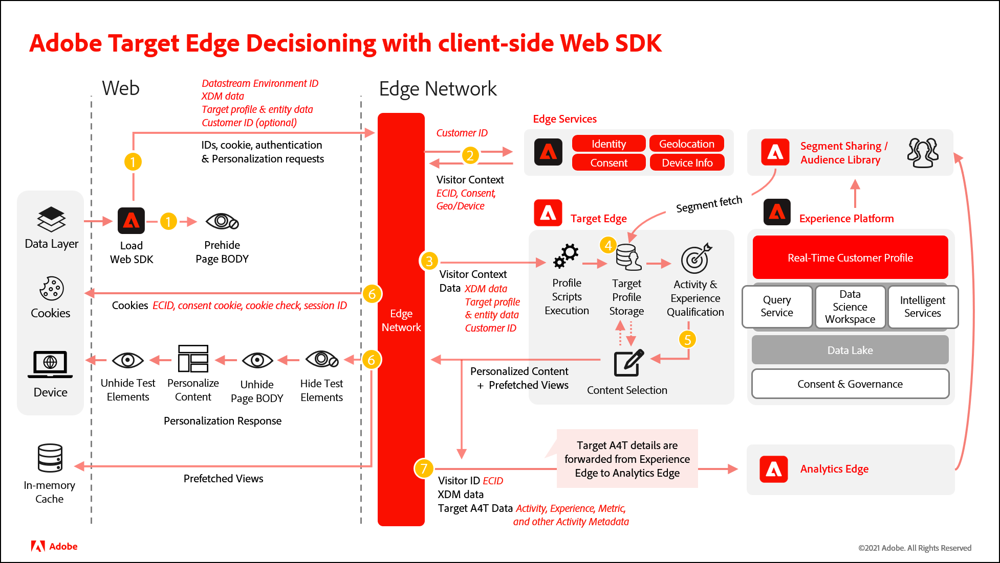

# Vergelijking van at.js met het Web SDK van het Platform

De standalone Adobe Target at.js bibliotheek verschilt aanzienlijk van het Web SDK van het Platform. De volgende tabellen zijn een referentie om u te helpen gebieden van uw implementatie te evalueren waarop u zich tijdens het migratieproces moet concentreren.

Na het herzien van de informatie hieronder en het beoordelen van uw huidige technische implementatie at.js, zou u het volgende moeten kunnen begrijpen:

- Welke eigenschappen van het Doel door het Web SDK van het Platform worden gesteund
- Welke functies at.js hebben de equivalenten van SDK van het Web van het Platform
- Hoe de montages van het Doel met het Web SDK van het Platform worden toegepast
- Hoe de gegevensstroom van at.js en het Web SDK van het Platform verschilt

Als u aan het Web SDK van het Platform nieuw bent, maak u geen zorgen - de punten hieronder zijn behandeld meer in detail door dit leerprogramma.

## Functievergelijking

|  | Doel op.js 2.x | Platform Web SDK |
|---|---|---|
| Doelprofiel bijwerken | Ondersteund | Ondersteund |
| Weergave activeren voor SPA | Ondersteund | Ondersteund |
| Doel Recommendations | Ondersteund | Ondersteund |
| Formuliergebaseerde aanbiedingen ophalen | Ondersteund | Ondersteund |
| Gebeurtenissen bijhouden | Ondersteund | Ondersteund |
| A4T: Toepassing met één pagina | Ondersteund | Ondersteund |
| A4T: Klikken bijhouden | Ondersteund | Ondersteund |
| A4T: Logboekregistratie op de client | Ondersteund | Ondersteund |
| A4T: Logboekregistratie op de server | Ondersteund | Ondersteund |
| Aanbiedingen toepassen | Ondersteund | Ondersteund |
| Weergave opnieuw renderen in SPA zonder meldingen | Ondersteund | Ondersteund |
| Hybride toepassingen | Ondersteund | Ondersteund |
| URL&#39;s kwaliteitscontrole | Ondersteund | Ondersteund |
| Id&#39;s van derden van box | Ondersteund | Ondersteund |
| Klantkenmerken | Ondersteund | Ondersteund |
| Externe aanbiedingen | Ondersteund | Ondersteund |
| Aanbiedingen omleiden | Ondersteund | Ondersteund. Nochtans, wordt een omleiding van een pagina met het Web SDK van het Platform aan een pagina met at.js (en in de tegenovergestelde richting) niet gesteund. |
| Apparaatbeslissingen | Ondersteund | Momenteel niet ondersteund |
| Prefetch Mboxes | Ondersteund voor aangepaste scènes en SPA VEC | Momenteel niet ondersteund voor standaard VEC |
| Aangepaste gebeurtenissen | Ondersteund | Niet ondersteund. Zie de [openbare routekaart](https://github.com/orgs/adobe/projects/18/views/1?pane=item&amp;itemId=17372355{target="_blank"}) voor de huidige status. |
| Reactietokens | Ondersteund | Ondersteund. Zie de [speciale reactietokens documentatie](https://experienceleague.adobe.com/docs/target/using/administer/response-tokens.html) voor codevoorbeelden en verschillen tussen at.js en het Web SDK van het Platform |
| Gegevensleveranciers | Ondersteund | Niet ondersteund. De code van de douane kan worden gebruikt om een SDK van het Web van het Platform teweeg te brengen `sendEvent` bevel nadat het gegeven van een andere leverancier wordt teruggewonnen. |

## Aanbiedingswaardige callouts

|  | Doel op.js 2.x | Platform Web SDK |
|---|---|---|
| Verzadiging flikkering | Het voorverborgen fragment voor asynchrone implementaties gebruikt een stijl-id van `at-body-style`. at.js zoekt naar deze element-id om de stijl te verwijderen zodra een reactie is ontvangen. | Het standaard voorverborgen fragment gebruikt een stijl-id van `alloy-prehiding`. SDK van het Web is niet compatibel met het bij.js prehide fragment zodat moet het als deel van het migratieproces worden veranderd. |
| Inhoud automatisch renderen bij laden van pagina | Gecontroleerd met een globale instelling voor het doel. Ingeschakeld als `pageLoadEnabled` is ingesteld op `true`. | Specified in the Platform Web SDK `sendEvent` gebruiken. Ingeschakeld door het instellen van de `renderDecisions` optie voor `true`. |
| Inhoud handmatig renderen | De `applyOffer()` en `applyOffers()` functies ondersteunen het instellen van alleen HTML | De `applyPropositions` opdracht ondersteunt het instellen, vervangen of toevoegen van HTML voor extra flexibiliteit |
| Aangepaste gebeurtenissen bijhouden | Ondersteund met `trackEvent()` en `sendNotifications()` functies. Deze functies zijn specifiek voor Target en hebben geen invloed op de metriek van Adobe Analytics. | Alle gegevens van het Web SDK van het Platform `sendEvent` de vraag door:sturen aan Doel. Aanvullende gegevens die specifiek voor Target nodig zijn, moeten worden opgenomen in de `sendEvent` gebruiken met een eventType van `decisioning.propositionDisplay` of `decisioning.propositionInteract` om ervoor te zorgen dat Adobe Analytics-metriek niet wordt beïnvloed. |
| DoelNAAM | Ondersteund. Dit is los van CNAME die voor Analytics en de Dienst van identiteitskaart van Experience Cloud wordt gebruikt. | Niet langer relevant. Één enkele CNAME kan voor alle vraag van SDK van het Web van het Platform worden gebruikt. |
| Foutopsporing | De `mboxDisable`, `mboxDebug`, en `mboxTrace` URL-parameters kunnen worden gebruikt voor foutopsporing met de ontwikkelaarsgereedschappen van uw browser.  De Adobe Experience Platform Debugger is ook een ondersteund foutopsporingsprogramma. | De `mboxDisable`, `mboxDebug`, en `mboxTrace` URL-parameters worden niet ondersteund.  U kunt het zuiveren van SDK van het Web door toevoegen aanzetten `alloy_debug=true` aan uw vraagkoord of het uitvoeren `alloy("setDebug", { "enabled": true });` in uw ontwikkelaarsconsole.  Met de browserextensie van Adobe Experience Platform Debugger kunt u een randtracering voor foutopsporing starten.  Zie de [foutopsporing in de SDK van het Web Platform](debugging.md) documentatie voor meer informatie. |
| Analyses voor doel (A4T) | Gebruikt waarden SDID om de vraag van het Doel en van de Analyse te bevestigen | Native ondersteund zonder dat stitching nodig is |

>[!NOTE]
>
>Het migreren van Doel naar het Web SDK van het Platform terwijl het behouden van een bestaande implementatie AppMeasurement Adobe Analytics voor een bepaalde pagina wordt niet gesteund.
>
> Het is mogelijk om uw implementatie at.js (en AppMeasurement.js) aan het Web SDK van het Platform één pagina tegelijk te migreren. Als u deze aanpak kiest, kunt u het beste de [`idMigrationEnabled`](https://experienceleague.adobe.com/docs/experience-platform/edge/fundamentals/configuring-the-sdk.html#id-migration-enabled) en [`targetMigrationEnabled`](https://experienceleague.adobe.com/docs/experience-platform/edge/fundamentals/configuring-the-sdk.html#targetMigrationEnabled) opties voor `true` met de `configure` gebruiken.

## at.js functies en Platform Web SDK equivalenten

Vele functies at.js hebben een gelijkwaardige benadering gebruikend het Web SDK van het Platform die in de lijst hieronder wordt geschetst. Voor meer informatie over de [at.js-functies](https://developer.adobe.com/target/implement/client-side/atjs/atjs-functions/atjs-functions/), raadpleegt u de Adobe Target Developer Guide.

| at.js 2.x, functie | Platform Web SDK equivalent |
| --- | --- | 
| `getOffer()` en `getOffers()` | Aanvragen en [automatisch renderen](https://experienceleague.adobe.com/docs/experience-platform/edge/personalization/rendering-personalization-content.html#automatically-rendering-content) De doel op VEC-Gebaseerde Ervaringen, gebruik `sendEvent` en stelt de `renderDecisions` true.  Formuliergebaseerde ervaringen opvragen of naar [handmatig renderen](https://experienceleague.adobe.com/docs/experience-platform/edge/personalization/rendering-personalization-content.html#manually-rendering-content) -inhoud, geeft u een array van `decisionScopes` (mboxes) met de `sendEvent` gebruiken. |
| `applyOffer()` en `applyOffers()` | Gebruik de [`applyPropositions`](https://experienceleague.adobe.com/docs/experience-platform/edge/personalization/rendering-personalization-content.html#applypropositions) gebruiken om inhoud toe te passen. U kunt ervoor kiezen om HTML in te stellen, te vervangen of toe te voegen aan een specifieke kiezer. |
| `triggerView()` | Platform Web SDK activeert automatisch een [weergave wijzigen](https://experienceleague.adobe.com/docs/experience-platform/edge/personalization/adobe-target/web-sdk-atjs-comparison.html#how-to-trigger-a-view-change-in-a-single-page-application) voor de toepassing van het SPA VEC indien `web.webPageDetails.viewName` eigenschap wordt ingesteld onder de `xdm` de `sendEvent` gebruiken. |
| `trackEvent()` en `sendNotifications()` | Gebruik de `sendEvent` gebruiken met een [specifiek `eventType`](https://experienceleague.adobe.com/docs/experience-platform/edge/personalization/adobe-target/web-sdk-atjs-comparison.html#how-to-track-events) set:  `decisioning.propositionDisplay` geeft aan dat een activiteit wordt gerenderd  `decisioning.propositionInteract` geeft een gebruikersinteractie met een activiteit aan, zoals een muisklik. |
| `targetGlobalSettings()` | Geen direct equivalent. Zie de [Vergelijking van doelinstellingen](detailed-comparison.md) voor meer informatie. |
| `targetPageParams()` en `targetPageParamsAll()` | Alle gegevens die worden doorgegeven in het dialoogvenster `xdm` de `sendEvent` wordt toegewezen aan parameters van Target. Aangezien mbox de parameters gebruikend in series vervaardigde puntaantekening worden genoemd, kan het migreren aan het Web SDK van het Platform u vereisen om bestaande publiek en activiteiten bij te werken om de nieuwe namen van de mbox parameternamen te gebruiken.   Gegevens doorgegeven als onderdeel van `data.__adobe.target` van de `sendEvent` opdracht is toegewezen aan [Doelprofiel en specifieke Recommendations-parameters](https://experienceleague.adobe.com/docs/experience-platform/edge/personalization/adobe-target/target-overview.html#single-profile-update). |
| at.js, aangepaste gebeurtenissen | Niet ondersteund. Zie de [openbare routekaart](https://github.com/orgs/adobe/projects/18/views/1?pane=item&amp;itemId=17372355{target="_blank"}) voor de huidige status. [Reactietokens](https://experienceleague.adobe.com/docs/experience-platform/edge/personalization/adobe-target/accessing-response-tokens.html) worden blootgesteld als onderdeel van de `propositions` in de reactie van de `sendEvent` vraag. |

## at.js montages en de equivalenten van SDK van het Web van het Platform

De bibliotheek at.js kan met diverse montages in het Doel UI worden gevormd en worden gedownload. Deze instellingen kunnen ook worden bijgewerkt met de [`targetGlobalSettings()`](https://developer.adobe.com/target/implement/client-side/atjs/atjs-functions/targetglobalsettings/) functie. In de onderstaande tabel worden deze instellingen vergeleken met de instellingen die beschikbaar zijn met Platform Web SDK.

| at.js-instelling | Platform Web SDK equivalent |
| --- | --- |
| `bodyHiddenStyle` | Stel de [`prehidingStyle`](https://experienceleague.adobe.com/docs/experience-platform/edge/fundamentals/configuring-the-sdk.html#prehidingStyle) met de `configure` command |
| `bodyHidingEnabled` | Indien een `prehidingStyle` wordt gedefinieerd met de `configure` en wordt deze functie ingeschakeld. Als een stijl niet wordt bepaald, dan probeert het Web SDK van het Platform om het even welke inhoud niet te verbergen. |
| `clientCode` | Automatisch geconfigureerd |
| `cookieDomain` | Niet van toepassing |
| `crossDomain` | Stel de `thirdPartyCookiesEnabled` optie voor `true` met de `configure` gebruiken om cookies van derden voor gebruik in andere domeinen in te schakelen |
| `cspScriptNonce` en `cspStyleNonce` | Raadpleeg de documentatie voor [configureren van een CSP](https://experienceleague.adobe.com/docs/experience-platform/edge/fundamentals/configuring-a-csp.html) |
| `dataProviders` | Niet ondersteund |
| `decisioningMethod` | All Platform Web SDK `sendEvent` gebruiken serverbeslissingen. Hybride en op-apparaat beslissingen worden niet ondersteund. |
| `defaultContentHiddenStyle` en `defaultContentVisibleStyle` | Alleen van toepassing met at.js 1.x. Net als bij at.js 2.x, kan elke flikkeronderdrukking voor op vorm-gebaseerde ervaringen worden verwezenlijkt gebruikend douanecode. |
| `deviceIdLifetime` | Niet ondersteund. Indien `targetMigrationEnabled` is ingesteld op `true` met de `configure` de `mbox` cookie wordt ingesteld met de levensduur van het apparaat ingesteld op 2 jaar. Deze waarde kan niet worden geconfigureerd. |
| `enabled` | Doelfunctionaliteit is in- of uitgeschakeld met de configuratie van de gegevensstroom |
| `globalMboxAutoCreate` | Stel de `renderDecisions` optie voor `true` met de `sendEvent` bevel om op VEC-Gebaseerde ervaringen automatisch te halen en terug te geven.  Verzoek om een `decisionScope` for `__view__` als u verkiest om op VEC-Gebaseerde ervaringen manueel terug te geven. |
| `imsOrgId` | Stel de `orgId` met de `configure` command |
| `optinEnabled` en `optoutEnabled` | Verwijs naar het Web SDK van het Platform [privacyopties](https://experienceleague.adobe.com/docs/experience-platform/edge/consent/supporting-consent.html). De `defaultConsent` Deze optie is van toepassing op alle Adobe-oplossingen die de SDK van het Web Platform ondersteunt. |
| `overrideMboxEdgeServer` en `overrideMboxEdgeServerTimeout` | Niet van toepassing. Alle verzoeken van SDK van het Web van het Platform gebruiken het netwerk van de Rand van Adobe Experience Platform. |
| `pageLoadEnabled` | Stel de `renderDecisions` optie voor `true` met de `sendEvent` command |
| `secureOnly` | Niet ondersteund. De SDK van het Web van het Platform plaatst alle koekjes met `secure` en `sameSite="none"` kenmerken. |
| `selectorsPollingTimeout` | Niet ondersteund. De SDK van het Web van het Platform gebruikt een waarde van 5 seconden. Aangepaste code kan worden gebruikt om inhoud handmatig te renderen. |
| `serverDomain` | Gebruik de `edgeDomain` instellen met de `configure` command |
| `telemetryEnabled` | Niet van toepassing |
| `timeout` | Niet ondersteund. Het wordt geadviseerd dat u ervoor zorgt om het even welke flikkerende matigingscode een aangewezen onderbreking omvat. |
| `viewsEnabled` | Niet ondersteund. Inhoud voor doelweergaven wordt altijd opgehaald voor de eerste `sendEvent()` oproepen als `renderDecisions` is ingesteld op `true` of de `__view__` DecisionScope is inbegrepen in het verzoek. |
| `visitorApiTimeout` | Niet van toepassing |

## Vergelijking systeemdiagram

De volgende diagrammen zouden u moeten helpen de verschillen van de gegevensstroom tussen een implementatie begrijpen van het Doel gebruikend at.js en een implementatie gebruikend het Web SDK van het Platform.

### at.js 2.x systeemdiagram

{zoomable=&quot;yes&quot;}

| Bellen | Details |
| --- | --- |
| 1 | De vraag keert identiteitskaart van Experience Cloud (ECID) terug. Als de gebruiker voor authentiek wordt verklaard, synchroniseert een andere vraag de klantenidentiteitskaart |
| 2 | De bibliotheek at.js wordt synchroon geladen en de hoofdtekst van het document verborgen (at.js kan ook asynchroon worden geladen met een optioneel vooraf verborgen fragment dat op de pagina is geïmplementeerd). |
| 3 | Het verzoek om het laden van de pagina wordt ingediend met inbegrip van alle gevormde parameters, ECID, SDID, en klant ID. |
| 4 | Profielscripts worden uitgevoerd en toegevoegd aan de profielopslag. De opslag vraagt gekwalificeerd publiek van de Bibliotheek van het Publiek (bijvoorbeeld, publiek dat van Analytics, Audience Manager wordt gedeeld, etc.). Klantkenmerken worden in een batchproces naar de profielwinkel verzonden. |
| 5 | Gebaseerd op URL, verzoekparameters, en profielgegevens, beslist Target welke Activiteiten en Ervaringen aan de bezoeker voor de huidige pagina en de toekomstige meningen terug te keren. |
| 6 | Gerichte inhoud die naar pagina wordt teruggestuurd, eventueel inclusief profielwaarden voor extra personalisatie.  Gerichte inhoud op de huidige pagina wordt zo snel mogelijk zichtbaar zonder flikkering van de standaardinhoud.  Gerichte inhoud voor toekomstige weergaven van een toepassing van één pagina wordt in het cachegeheugen opgeslagen in de browser, zodat deze direct kan worden toegepast zonder een extra serveraanroep wanneer de weergaven worden geactiveerd. (Zie het volgende diagram voor triggerView() gedrag). |
| 7 | Analysegegevens die van de pagina naar de Servers van de Inzameling van Gegevens worden verzonden. |
| 8 | De doelgegevens worden via de SDID aangepast aan de analysegegevens en worden verwerkt in de analytische rapportageopslag. De analysegegevens kunnen dan in zowel Analytics als Doel via A4T- rapporten worden bekeken. |

Raadpleeg de handleiding voor ontwikkelaars voor meer informatie over het [Implementeer Doel gebruikend at.js voor enig-paginatoepassingen](https://developer.adobe.com/target/implement/client-side/atjs/how-to-deployatjs/target-atjs-single-page-application/).

### Platform Web SDK systeemdiagram

| Bellen | Details |
| --- | --- |
| 1 | Het apparaat laadt de SDK van het Web Platform. De SDK van het Web van het Platform verzendt een verzoek naar het randnetwerk met XDM- gegevens, identiteitskaart van het Milieu van Gegevensstromen, overgegaan parameters, en identiteitskaart van de Klant (facultatief). De pagina (of containers) is vooraf verborgen. |
| 2 | Het Edge-netwerk verzendt de aanvraag naar de Edge-services om deze te verrijken met de informatie over de bezoeker-id, toestemming en andere bezoekerscontext, zoals geolocatie en apparaatvriendelijke namen. |
| 3 | Het randnetwerk verzendt het verrijkte verpersoonlijkingsverzoek naar de rand van het Doel met identiteitskaart van de Bezoeker en overgegaan parameters. |
| 4 | Profielscripts worden uitgevoerd en vervolgens opgenomen in de opslag van het doelprofiel. De opslag van het profiel haalt segmenten van de Bibliotheek van de Publiek (bijvoorbeeld, segmenten die van Adobe Analytics, Adobe Audience Manager, Adobe Experience Platform worden gedeeld). |
| 5 | Op basis van URL-aanvraagparameters en -profielgegevens bepaalt Target welke activiteiten en ervaringen moeten worden weergegeven voor de bezoeker voor de huidige paginaweergave en voor toekomstige vooraf ingestelde weergaven. Het doel verzendt dit dan terug naar het randnetwerk. |
| 6 | a. Het randnetwerk verzendt de verpersoonlijkingsreactie terug naar de pagina, naar keuze met inbegrip van profielwaarden voor extra verpersoonlijking. Gepersonaliseerde inhoud op de huidige pagina wordt zo snel mogelijk weergegeven zonder flikkering van de standaardinhoud.  b. De gepersonaliseerde inhoud voor meningen die als resultaat van gebruikersacties in Één enkele Toepassing van de Pagina (SPA) worden getoond wordt caching voor onmiddellijke teruggave zonder extra servervraag.  c. Het Edge-netwerk verzendt de bezoeker-id en andere waarden in cookies (bijvoorbeeld toestemming, sessie-id, identiteit, cookie-controle, personalisatie enzovoort). |
| 7 | Het randnetwerk forwards Analytics voor de details van het Doel (A4T) (activiteit, ervaring, en omzettingsmeta-gegevens) aan de rand van de Analyse. |

Raadpleeg de handleiding voor ontwikkelaars voor meer informatie over het [Implementeer Doel gebruikend SDK van het Web van het Platform voor Enige-paginatoepassingen](https://experienceleague.adobe.com/docs/experience-platform/edge/personalization/adobe-target/spa-implementation.html).

Nadat u een goed technisch inzicht in uw huidige implementatie van het Doel en de eigenschappen hebt u gebruikt, moet de volgende stap uitvoeren [eerste installatie](initial-setup.md).

>[!NOTE]
>
>Wij zijn geëngageerd om u met uw migratie van het Doel van at.js aan Web SDK te helpen succesvol zijn. Als u problemen ondervindt met uw migratie of als u denkt dat er essentiële informatie ontbreekt in deze handleiding, kunt u het ons laten weten door te posten in [deze communautaire discussie](https://experienceleaguecommunities.adobe.com/t5/adobe-experience-platform-data/tutorial-discussion-migrate-target-from-at-js-to-web-sdk/m-p/575587#M463).
