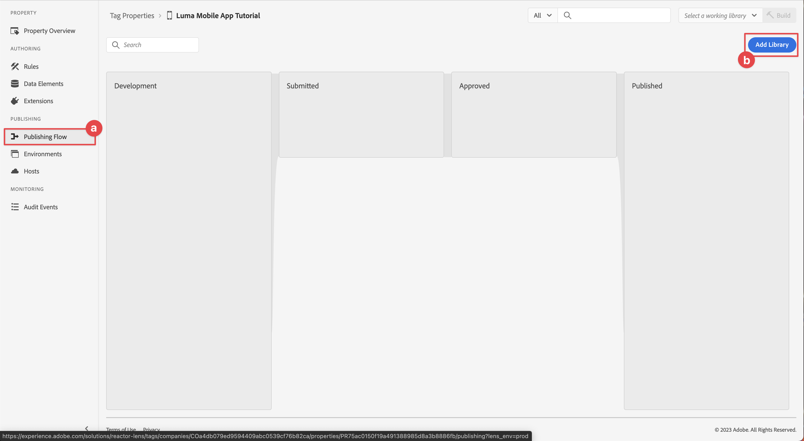

# Een eigenschap voor een tag configureren

Leer hoe u een eigenschap tag in het dialoogvenster [!UICONTROL Gegevensverzameling] interface.

Tags in Adobe Experience Platform zijn de volgende generatie mogelijkheden voor tagbeheer van Adobe. Met labels kunnen klanten eenvoudig analyses, marketing en advertentietags implementeren en beheren die nodig zijn om relevante klantervaringen te stimuleren. Meer informatie over [Tags](https://experienceleague.adobe.com/docs/experience-platform/tags/home.html?lang=nl) in de productdocumentatie.

## Vereisten

Om de les te voltooien, moet u toestemming hebben om een markeringsbezit tot stand te brengen. Het is ook nuttig om basislijninzicht in markeringen te hebben.

>[!NOTE]
>
> Platform launch (clientzijde) is nu [Tags](https://experienceleague.adobe.com/docs/experience-platform/tags/home.html?lang=en)

## Leerdoelstellingen

In deze les zult u:

* Installeer en configureer de extensies voor mobiele tags.
* Genereer de SDK-installatie-instructies.

## Eerste configuratie

1. Maak een nieuwe eigenschap voor mobiele tags in de interface voor gegevensverzameling:
   1. Selecteren **[!UICONTROL Tags]** in de linkernavigatie.
   1. Selecteren **[!UICONTROL Nieuwe eigenschap]**
      .
   1. Voor de **[!UICONTROL Naam]**, enter `Luma Mobile App Tutorial`.
   1. Voor de **[!UICONTROL Platform]**, selecteert u **[!UICONTROL Mobiel]**.
   1. Selecteren  **[!UICONTROL Opslaan]**.

      

      >[!NOTE]
      >
      > Standaardinstellingen voor toestemming voor de op randen gebaseerde mobiele SDK-implementaties, zoals de instellingen die u in deze zelfstudie uitvoert, zijn afkomstig uit de [!UICONTROL Toegestane extensie] en niet de [!UICONTROL Privacy] het plaatsen in de configuratie van het markeringsbezit. U voegt en vormt de uitbreiding van de Toestemming later in deze les toe. Zie voor meer informatie [de documentatie](https://developer.adobe.com/client-sdks/documentation/privacy-and-gdpr/).

1. Open de nieuwe eigenschap.
1. Een bibliotheek maken:

   1. Ga naar **[!UICONTROL Publishing Flow]** in de linkernavigatie.
   1. Selecteren **[!UICONTROL Bibliotheek toevoegen]**.

      

   1. Voor de **[!UICONTROL Naam]**, enter `Initial Build`.
   1. Voor de **[!UICONTROL Omgeving]**, selecteert u **[!UICONTROL Ontwikkeling (ontwikkeling)]**.
   1. Selecteren   **[!UICONTROL Alle gewijzigde bronnen toevoegen]**.
   1. Selecteren **[!UICONTROL Opslaan en samenstellen tot ontwikkeling]**.

      

   1. Tot slot selecteert u **[!UICONTROL Eerste build]** als uw werkbibliotheek vanuit de **[!UICONTROL Een werkbibliotheek selecteren]** -menu.
      
1. Extensies controleren:

   1. Zorg ervoor dat **[!UICONTROL Eerste build]** is geselecteerd als standaardbibliotheek.

   1. Selecteren **[!UICONTROL Extensies]** in het linkerspoor.

   1. Selecteer de **[!UICONTROL Geïnstalleerd]** tab.

      De [!UICONTROL Mobiele kern] en [!UICONTROL Profiel] extensies moeten vooraf worden geïnstalleerd.

      

## Extensieconfiguratie

1. Zorg ervoor dat u binnen bent **[!UICONTROL Extensies]** in uw eigenschap voor mobiele apps.

1. Selecteren **[!UICONTROL Catalogus]**.

   

1. Gebruik de  **[!UICONTROL Zoeken]** veld de zoekopdracht **Identiteit** extensie.

   1. Zoeken naar `Identity`.

   2. Selecteer de **[!UICONTROL Identiteit]** extensie.

   3. Selecteren **[!UICONTROL Installeren]**.

      

   Voor deze extensie is geen verdere configuratie vereist.

1. Gebruik de  **[!UICONTROL Zoeken]** te zoeken en te installeren **AEP-betrouwbaarheid** extensie.

   Voor deze extensie is geen verdere configuratie vereist.

1. Gebruik de  **[!UICONTROL Zoeken]** te zoeken en te installeren **Toestemming** extensie. In het configuratiescherm:

   1. Selecteren **[!UICONTROL In behandeling]**. In deze zelfstudie beheert u de toestemming verder in de toepassing. Meer informatie over de extensie Goedkeuring in [de documentatie](https://developer.adobe.com/client-sdks/documentation/consent-for-edge-network/).
   1. Selecteren **[!UICONTROL Opslaan in bibliotheek]**.

      

1. Gebruik de  **[!UICONTROL Zoeken]** te zoeken en te installeren **Adobe Experience Platform Edge Network** extensie.

   1. In **[!UICONTROL Gegevensstromen]** Selecteer de **[!UICONTROL DataStream]** die u hebt gemaakt in het dialoogvenster [vorige stap](create-datastream.md) voor elke omgeving, bijvoorbeeld **[!UICONTROL Luma Mobile-toepassing]**.

   1. Geef de **[!UICONTROL Edge Network-domein]** binnen **[!UICONTROL Domeinconfiguratie]**. Het Edge Network-domein is de naam van uw sandbox, gevolgd door `data.adobedc.net`bijvoorbeeld `techmarketingdemos.data.adobedc.net`.

   1. Van de **[!UICONTROL Opslaan in bibliotheek]** menu, selecteert u **[!UICONTROL Opslaan in bibliotheek en samenstellen]**.

      

Uw bibliotheek is gebouwd voor de nieuwe uitbreidingen en configuraties. Een geslaagde build wordt aangegeven met een ● in de **[!UICONTROL Eerste build]** knop.

## SDK-installatie-instructies genereren

1. Selecteren **[!UICONTROL Omgevingen]** van de linkerspoorstaaf.

1. Selecteer de **[!UICONTROL Ontwikkeling]** installatiepictogram  .

   

1. In de [!UICONTROL Instructies voor mobiele installatie] selecteert u de **[!UICONTROL iOS]** tab.

1. U kunt  de instructies voor het instellen van uw project met CocoaPods. CocoaPods worden gebruikt om SDK-versies en -downloads te beheren. Voor meer informatie raadpleegt u de [documentatie](https://cocoapods.org/).

   De installatieinstructies bieden u een goed beginpunt voor de implementatie. Meer informatie vindt u [hier](https://developer.adobe.com/client-sdks/documentation/getting-started/get-the-sdk/).

   >[!INFO]
   >
   >Voor de rest van deze zelfstudie gaat u **niet** gebruik de CocoaPods-instructies, maar gebruik in plaats daarvan een native Swift Package Manager (SPM)-gebaseerde setup.
   >

1. Selecteer de **[!UICONTROL Swift]** tab onder **[!UICONTROL Initialisatiecode toevoegen]**. Dit codeblok laat zien hoe u de vereiste SDK&#39;s kunt importeren en de extensies kunt registreren bij het starten. Dit zal in meer details worden behandeld in [SDK&#39;s installeren](install-sdks.md).

1. Kopiëren  de **[!UICONTROL Omgevingsbestand-id]** en bewaar het op een plaats zoals u het later nodig hebt. Deze unieke id verwijst naar uw ontwikkelomgeving. Elke omgeving (Productie, Staging, Ontwikkeling) heeft zijn eigen unieke id-waarde.

   

>[!NOTE]
>
>De installatie-instructies moeten worden beschouwd als een beginpunt en niet als definitieve documentatie. De meest recente SDK-versies en codevoorbeelden vindt u in de officiële [documentatie](https://developer.adobe.com/client-sdks/documentation/).

## Architectuur van mobiele tags

Als u bekend bent met de webversie van Tags, voorheen Starten, is het belangrijk dat u de verschillen op mobiele apparaten begrijpt.

* Op het web wordt een eigenschap tag gerenderd in JavaScript, die vervolgens (gewoonlijk) wordt gehost in de cloud. Er wordt rechtstreeks in de website naar dat JavaScript-bestand verwezen.

* In een eigenschap voor mobiele tags worden regels en configuraties gerenderd in JSON-bestanden die worden gehost in de cloud. De JSON-bestanden worden gedownload en gelezen door de Mobile Core-extensie in de mobiele app. Extensies zijn afzonderlijke SDK&#39;s die samenwerken. Als u een extensie toevoegt aan de eigenschap tag, moet u de app ook bijwerken. Als u een extensie-instelling wijzigt of een regel maakt, worden deze wijzigingen doorgevoerd in de app nadat u de bijgewerkte tagbibliotheek hebt gepubliceerd.

>[!SUCCESS]
>
>U kunt nu een eigenschap voor mobiele tags gebruiken in de rest van deze zelfstudie. Bedankt dat u tijd hebt geïnvesteerd in het leren van Adobe Experience Platform Mobile SDK. Als u vragen hebt, algemene feedback wilt delen of suggesties voor toekomstige inhoud wilt hebben, deelt u deze over deze [Experience League Communautaire discussiestuk](https://experienceleaguecommunities.adobe.com/t5/adobe-experience-platform-launch/tutorial-discussion-implement-adobe-experience-cloud-in-mobile/td-p/443796)

Volgende: **[SDK&#39;s installeren](install-sdks.md)**
