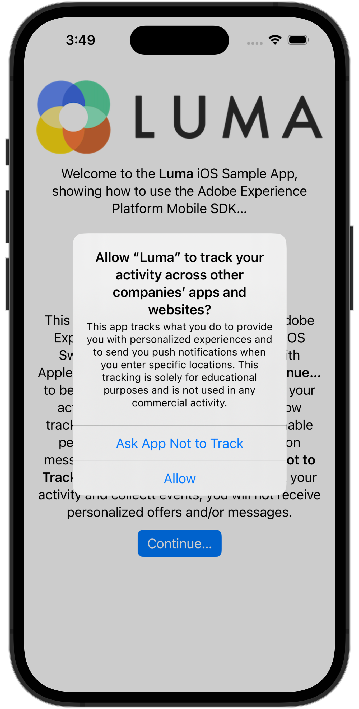

# Goedkeuring uitvoeren

Leer hoe u toestemming implementeert in een mobiele app.

Met de mobiele extensie Adobe Experience Platform Consent kunt u de verzameling met voorkeuren voor toestemming vanuit uw mobiele app inschakelen wanneer u de Adobe Experience Platform Mobile SDK en de Edge Network-extensie gebruikt. Meer informatie over de [Toegestane extensie](https://developer.adobe.com/client-sdks/documentation/consent-for-edge-network/)in de documentatie.

## Vereisten

* App met SDK&#39;s geïnstalleerd en geconfigureerd met succes gemaakt en uitgevoerd.

## Leerdoelstellingen

In deze les zult u:

* Vraag de gebruiker om toestemming.
* Werk de extensie bij op basis van de gebruikersreactie.
* Leer hoe u de huidige status van toestemming krijgt.

## Goedkeuring aanvragen

Als u de zelfstudie vanaf het begin hebt gevolgd, zult u zich wellicht herinneren dat u de standaardtoestemming in de extensie Goedkeuring hebt ingesteld op **[!UICONTROL In behandeling - de gebeurtenissen van de Rij die voorkomen alvorens de gebruiker toestemmingsvoorkeur verstrekt.]**

Om met het verzamelen van gegevens te beginnen, moet u toestemming van de gebruiker krijgen. In een echte app wilt u de beste praktijken voor uw regio raadplegen. In deze zelfstudie krijgt u toestemming van de gebruiker door er gewoon om te vragen met een waarschuwing:

1. U wilt de gebruiker slechts eenmaal om toestemming vragen. U wilt dus de toestemming van de Mobile SDK combineren met de vereiste machtigingen voor tracering met behulp van Apple [Transparantie-framework voor toepassingscontrole](https://developer.apple.com/documentation/apptrackingtransparency). In deze app gaat u ervan uit dat wanneer de gebruiker tracering toestaat, de gebruiker ook instemt met het verzamelen van gebeurtenissen.

1. Navigeren naar **[!DNL Luma]** > **[!DNL Luma]** > **[!DNL Utils]** > **[!UICONTROL MobileSDK]** in de Xcode-projectnavigator.

   Deze code toevoegen aan de `updateConsent` functie.

   ```swift
   // Update consent
   let collectConsent = ["collect": ["val": value]]
   let currentConsents = ["consents": collectConsent]
   Consent.update(with: currentConsents)
   MobileCore.updateConfigurationWith(configDict: currentConsents)
   ```

1. Navigeren naar **[!DNL Luma]** > **[!DNL Luma]** > **[!DNL Views]** > **[!DNL General]** > **[!UICONTROL DisclaimerView]** in de projectnavigator van Xcode, die de mening is die na het installeren van of het opnieuw installeren van de toepassing en het beginnen van app voor de eerste keer wordt getoond. De gebruiker wordt gevraagd het bijhouden van gegevens te autoriseren per Apple [Transparantie-framework voor toepassingscontrole](https://developer.apple.com/documentation/apptrackingtransparency). Als de gebruiker autoriseert, werkt u ook de toestemming bij.

   Voeg de volgende code toe aan de `ATTrackingManager.requestTrackingAuthorization { status in` sluiting.

   ```swift
   // Add consent based on authorization
   if status == .authorized {
      // Set consent to yes
      MobileSDK.shared.updateConsent(value: "y")
   }
   else {
      // Set consent to yes
      MobileSDK.shared.updateConsent(value: "n")
   }
   ```

## Huidige status van toestemming ophalen

De mobiele extensie voor toestemming onderdrukt automatisch het bijhouden van wijzigingen / breidt deze uit op basis van de huidige waarde voor toestemming. U kunt ook zelf toegang krijgen tot de huidige staat van toestemming:

1. Navigeren naar **[!DNL Luma]** > **[!DNL Luma]** > **[!DNL Utils]** > **[!UICONTROL MobileSDK]** in Xcode&#39;s Project navigator.

   Voeg de volgende code toe aan de `getConsents` functie:

   ```swift
   // Get consents
   Consent.getConsents { consents, error in
      guard error == nil, let consents = consents else { return }
      guard let jsonData = try? JSONSerialization.data(withJSONObject: consents, options: .prettyPrinted) else { return }
      guard let jsonStr = String(data: jsonData, encoding: .utf8) else { return }
      Logger.aepMobileSDK.info("Consent getConsents: \(jsonStr)")
   }
   ```

2. Navigeren naar **[!DNL Luma]** > **[!DNL Luma]** > **[!DNL Views]** > **[!DNL General]** > **[!UICONTROL HomeView]** in Xcode&#39;s Project navigator.

   Voeg de volgende code toe aan de `.task` modifier:

   ```swift
   // Ask status of consents
   MobileSDK.shared.getConsents()   
   ```

In het bovenstaande voorbeeld registreert u gewoon de toestemmingsstatus aan de console in Xcode. In een echt scenario, zou u het kunnen gebruiken om te wijzigen welke menu&#39;s of opties aan de gebruiker worden getoond.

## Valideren met betrouwbaarheid

1. Controleer de [installatie-instructies](assurance.md#connecting-to-a-session) om de simulator of het apparaat aan te sluiten op Betrouwbaarheid.
1. Als u de bovenstaande code correct hebt toegevoegd, wordt u gevraagd om toestemming te geven.

   Selecteren **[!UICONTROL Doorgaan...]** en selecteer vervolgens **[!UICONTROL Toestaan]**.

    
   

1. U dient een **[!UICONTROL Respons voor constanten ophalen]** gebeurtenis in de betrouwbaarheidsinterface.
   


## Goedkeuring opnieuw instellen

Als u de toestemming opnieuw wilt instellen:

1. Ga naar **[!UICONTROL Instellingen]** in de app.

1. Selecteren **[!UICONTROL Toepassingsinstellingen...]** Hiermee worden de instellingen voor Luma App geopend in de app iOS Settings.

1. Schakelen **[!UICONTROL Tekstspatiëring toestaan]** uit.


>[!SUCCESS]
>
>U hebt nu de toepassing ingeschakeld om de gebruiker bij de eerste start na de installatie (of herinstallatie) te vragen toestemming te geven met de SDK van Adobe Experience Platform Mobile.<br/>Bedankt dat u tijd hebt geïnvesteerd in het leren van Adobe Experience Platform Mobile SDK. Als u vragen hebt, algemene feedback wilt delen of suggesties voor toekomstige inhoud wilt hebben, deelt u deze over deze [Experience League Communautaire discussiestuk](https://experienceleaguecommunities.adobe.com/t5/adobe-experience-platform-launch/tutorial-discussion-implement-adobe-experience-cloud-in-mobile/td-p/443796)

Volgende: **[Levenscyclusgegevens verzamelen](lifecycle-data.md)**
