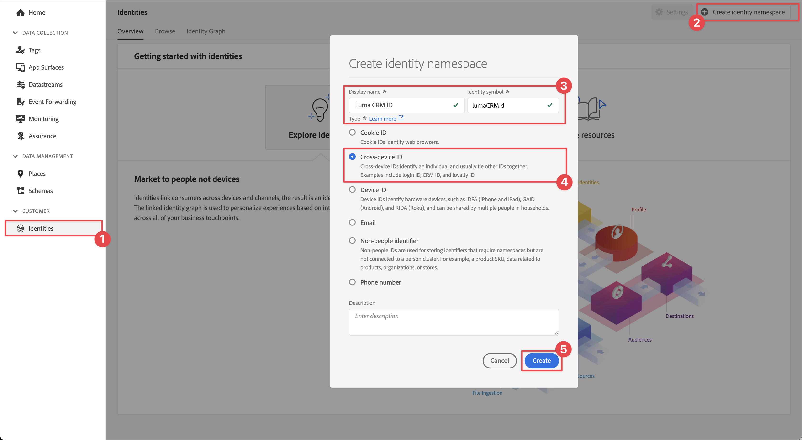
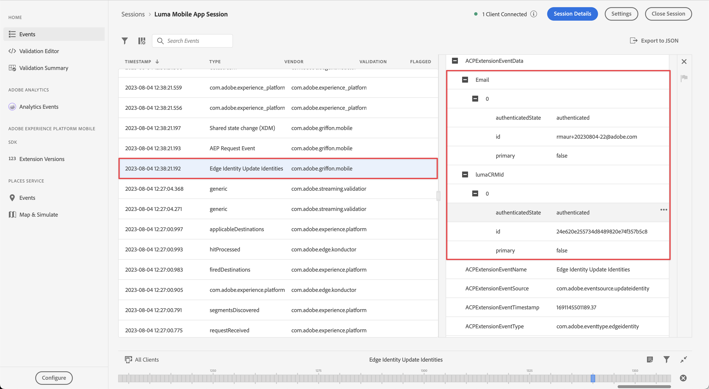

# Identiteitsgegevens verzamelen

Leer hoe u identiteitsgegevens kunt verzamelen in een mobiele app.

Met de Adobe Experience Platform Identity Service kunt u uw klanten en hun gedrag beter zien door identiteiten tussen apparaten en systemen te overbruggen, zodat u in real-time een indrukwekkende, persoonlijke digitale ervaring kunt bieden. Identiteitsvelden en naamruimten zijn de lijm die verschillende gegevensbronnen samenvoegt om het 360 graden klantenprofiel in real time te bouwen.

Meer informatie over de [Identiteitsextensie](https://developer.adobe.com/client-sdks/documentation/identity-for-edge-network/) en de [identiteitsservice](https://experienceleague.adobe.com/docs/experience-platform/identity/home.html?lang=nl) in de documentatie.

## Vereisten

* App met SDK&#39;s geïnstalleerd en geconfigureerd met succes gemaakt en uitgevoerd.

## Leerdoelstellingen

In deze les zult u:

* Stel een naamruimte voor een aangepaste identiteit in.
* Identiteiten bijwerken.
* Valideer de identiteitsgrafiek.
* ECID en andere identiteiten ophalen.


## Een aangepaste naamruimte voor identiteiten instellen

Identiteitsnaamruimten zijn onderdelen van [Identiteitsservice](https://experienceleague.adobe.com/docs/experience-platform/identity/home.html?lang=en) die dienen als indicatoren van de context waarop een identiteit betrekking heeft. Ze onderscheiden bijvoorbeeld een waarde van `name@email.com` als e-mailadres of `443522` als een numerieke CRM-id.

>[!NOTE]
>
>De mobiele SDK genereert een unieke identiteit in een eigen naamruimte, de zogenaamde Experience Cloud-id (ECID), wanneer de toepassing wordt geïnstalleerd. Deze ECID wordt opgeslagen in permanent geheugen op het mobiele apparaat en wordt bij elke hit verzonden. De ECID wordt verwijderd wanneer de gebruiker de app verwijdert of wanneer de gebruiker de algemene privacystatus van de Mobile SDK instelt op optedout. In de voorbeeldtoepassing Luma moet u de toepassing verwijderen en opnieuw installeren om een nieuw profiel met een eigen unieke ECID te maken.


Een nieuwe naamruimte maken:

1. Selecteer in de interface Gegevensverzameling de optie **[!UICONTROL Identiteiten]** van de linkse spoorwegnavigatie.
1. Selecteren **[!UICONTROL Naamruimte maken]**.
1. Geef een **[!UICONTROL Weergavenaam]** van `Luma CRM ID` en **[!UICONTROL Identiteitssymbool]** waarde van `lumaCRMId`.
1. Selecteren **[!UICONTROL Apparaatoverschrijdende id]**.
1. Selecteer **[!UICONTROL Maken]**.

   


## Identiteiten bijwerken

U wilt zowel de standaardidentiteit (e-mail) als de aangepaste identiteit (Luma CRM-id) bijwerken wanneer de gebruiker zich aanmeldt bij de app.

1. Navigeren naar **[!DNL Luma]** > **[!DNL Luma]** > **[!DNL Utils]** > **[!UICONTROL MobileSDK]** in de Xcode-projectnavigator en zoek de `func updateIdentities(emailAddress: String, crmId: String)` functie-implementatie. Voeg de volgende code toe aan de functie.

   ```swift
   // Set up identity map, add identities to map and update identities
   let identityMap: IdentityMap = IdentityMap()
   
   let emailIdentity = IdentityItem(id: emailAddress, authenticatedState: AuthenticatedState.authenticated)
   let crmIdentity = IdentityItem(id: crmId, authenticatedState: AuthenticatedState.authenticated)
   identityMap.add(item:emailIdentity, withNamespace: "Email")
   identityMap.add(item: crmIdentity, withNamespace: "lumaCRMId")
   
   Identity.updateIdentities(with: identityMap)
   ```

   Deze code:

   1. Hiermee maakt u een lege `IdentityMap` object.

      ```swift
      let identityMap: IdentityMap = IdentityMap()
      ```

   1. Instellen `IdentityItem` objecten voor e-mail- en CRM-id.

      ```swift
      let emailIdentity = IdentityItem(id: emailAddress, authenticatedState: AuthenticatedState.authenticated)
      let crmIdentity = IdentityItem(id: crmId, authenticatedState: AuthenticatedState.authenticated)
      ```

   1. Hiermee voegt u deze `IdentityItem` objecten naar de `IdentityMap` object.

      ```swift
      identityMap.add(item:emailIdentity, withNamespace: "Email")
      identityMap.add(item: crmIdentity, withNamespace: "lumaCRMId")
      ```

   1. Hiermee verzendt u de `IdentityItem` object als onderdeel van het `Identity.updateIdentities` API-aanroep naar het Edge-netwerk.

      ```swift
      Identity.updateIdentities(with: identityMap) 
      ```

1. Navigeren naar **[!DNL Luma]** **[!DNL Luma]** > **[!DNL Views]** > **[!DNL General]** > **[!UICONTROL Aanmeldingsblad]** in de Xcode-projectnavigator en zoek de uit te voeren code wanneer u de **[!UICONTROL Aanmelden]** knop. Voeg de volgende code toe:

   ```swift
   // Update identities
   MobileSDK.shared.updateIdentities(emailAddress: currentEmailId, crmId: currentCRMId)                             
   ```


>[!NOTE]
>
>U kunt meerdere identiteiten in één keer verzenden `updateIdentities` vraag. U kunt eerder verzonden identiteiten ook wijzigen.


## Een identiteit verwijderen

U kunt de [`Identity.removeIdentity`](https://developer.adobe.com/client-sdks/documentation/identity-for-edge-network/api-reference/#removeidentity) API om de identiteit uit de opgeslagen client-side identiteitskaart te verwijderen. De uitbreiding van de Identiteit houdt op verzendend het herkenningsteken naar het Netwerk van de Rand. Het gebruik van deze API verwijdert de id niet uit de identiteitsgrafiek aan de serverzijde. Zie [Identiteitsgrafieken weergeven](https://experienceleague.adobe.com/docs/platform-learn/tutorials/identities/view-identity-graphs.html?lang=en) voor meer informatie over identiteitsgrafieken.

1. Navigeren naar **[!DNL Luma]** > **[!DNL Luma]** > **[!DNL General]** > **[!UICONTROL MobileSDK]** in de Xcode-projectnavigator en voeg de volgende code toe aan `func removeIdentities(emailAddress: String, crmId: String)` functie:

   ```swift
   // Remove identities and reset email and CRM Id to their defaults
   Identity.removeIdentity(item: IdentityItem(id: emailAddress), withNamespace: "Email")
   Identity.removeIdentity(item: IdentityItem(id: crmId), withNamespace: "lumaCRMId")
   currentEmailId = "testUser@gmail.com"
   currentCRMId = "112ca06ed53d3db37e4cea49cc45b71e"
   ```

1. Navigeren naar **[!DNL Luma]** > **[!DNL Luma]** > **[!DNL Views]** > **[!DNL General]** > **[!UICONTROL Aanmeldingsblad]** in de Xcode-projectnavigator en zoek de uit te voeren code wanneer u de **[!UICONTROL Afmelden]** knop. Voeg de volgende code toe:

   ```swift
   // Remove identities
   MobileSDK.shared.removeIdentities(emailAddress: currentEmailId, crmId: currentCRMId)                  
   ```


## Valideren met betrouwbaarheid

1. Controleer de [installatie-instructies](assurance.md) en sluit de simulator of het apparaat aan op Betrouwbaarheid.
1. In de app Luma
   1. Selecteer de **[!UICONTROL Home]** tab.
   1. Selecteer het  van rechtsboven.

      

   1. Geef een e-mailadres en een CRM-id op, of
   1. Selecteer  om willekeurig een **[!UICONTROL E-mail]** en **[!UICONTROL CRM-id]**.
   1. Selecteren **[!UICONTROL Aanmelden]**.

      


1. Kijk in de Assurance-webinterface voor de **[!UICONTROL Identiteitsupdates rand]** gebeurtenis van de **[!UICONTROL com.adobe.griffon.mobile]** leverancier.
1. Selecteer de gebeurtenis en bekijk de gegevens in het dialoogvenster **[!UICONTROL ACPExtensionEventData]** object. U moet de identiteiten zien die u hebt bijgewerkt.
   

## Valideren met identiteitsgrafiek

Nadat u de stappen in het dialoogvenster [Experience Platform les](platform.md)kunt u de identiteitsopname bevestigen in de identiteitsgrafiek van platforms:

1. Selecteren **[!UICONTROL Identiteiten]** in de UI voor gegevensverzameling.
1. Selecteren **[!UICONTROL Naamgrafiek]** in de bovenste balk.
1. Enter `Luma CRM ID` als de **[!UICONTROL Naamruimte identiteit]** en uw CRM-id (bijvoorbeeld `24e620e255734d8489820e74f357b5c8`) als **[!UICONTROL Identiteitswaarde]**.
1. U ziet de **[!UICONTROL Identiteiten]** vermeld.

   


>[!SUCCESS]
>
>U hebt nu uw app ingesteld om de identiteiten in het Edge-netwerk bij te werken en (wanneer deze is ingesteld) met Adobe Experience Platform.<br/>Bedankt dat u tijd hebt geïnvesteerd in het leren van Adobe Experience Platform Mobile SDK. Als u vragen hebt, algemene feedback wilt delen of suggesties voor toekomstige inhoud wilt hebben, deelt u deze over deze [Experience League Communautaire discussiestuk](https://experienceleaguecommunities.adobe.com/t5/adobe-experience-platform-launch/tutorial-discussion-implement-adobe-experience-cloud-in-mobile/td-p/443796)

Volgende: **[Profiel](profile.md)**
