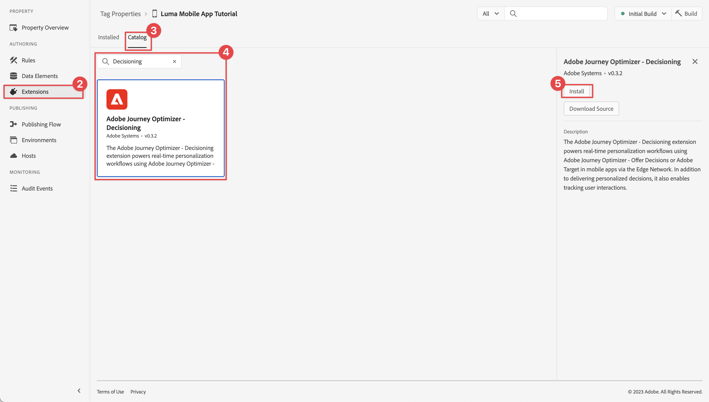

# Aanbiedingen maken en weergeven

Leer hoe u aanbiedingen van Journey Optimizer Decision Management in uw mobiele apps kunt weergeven met Experience Platform Mobile SDK.

Met Journey Optimizer-Beslissingsbeheer kunt u uw klanten op elk aanraakpunt op het juiste moment de beste aanbieding en ervaring bieden. Als u ze eenmaal hebt ontworpen, richt u zich op uw publiek met persoonlijke aanbiedingen.


Beslissingsbeheer maakt personalisatie gemakkelijk met een centrale bibliotheek van marketingaanbiedingen en een beslissingsmotor die regels en beperkingen toepast op rijke, real-time profielen die door Adobe Experience Platform worden gecreëerd. Dientengevolge, laat het u toe om uw klanten de juiste aanbieding op het juiste ogenblik te verzenden. Zie [Over Besluitbeheer](https://experienceleague.adobe.com/docs/journey-optimizer/using/offer-decisioning/get-started-decision/starting-offer-decisioning.html?lang=en) voor meer informatie .


>[!NOTE]
>
>Deze les is optioneel en is alleen van toepassing op Journey Optimizer-gebruikers die de functie Beslissingsbeheer willen gebruiken om aanbiedingen in een mobiele app weer te geven.


## Vereisten

* App met SDK&#39;s geïnstalleerd en geconfigureerd met succes gemaakt en uitgevoerd.
* Stel de app in voor Adobe Experience Platform.
* Toegang tot Journey Optimizer - Beslissingsbeheer met de juiste machtigingen om aanbiedingen en beslissingen te beheren zoals beschreven [hier](https://experienceleague.adobe.com/docs/journey-optimizer/using/access-control/privacy/high-low-permissions.html?lang=en#decisions-permissions).


## Leerdoelstellingen

In deze les zult u

* Werk uw Edge-configuratie bij voor beslissingsbeheer.
* Werk de eigenschap tag bij met de extensie Journey Optimizer - Decisioning.
* Werk uw schema bij om propositiegebeurtenissen vast te leggen.
* Valideer installatie in Betrouwbaarheid.
* Maak een biedbesluit op basis van aanbiedingen in Journey Optimizer - Beslissingsbeheer.
* Werk uw app bij om de extensie Optimizer te registreren.
* Voer aanbiedingen van Beslissingsbeheer in uw app uit.


## Instellen

>[!TIP]
>
>Als u uw omgeving al hebt ingesteld als onderdeel van de [A/B-tests instellen met Doel](target.md) les, zou u sommige stappen in deze opstellingssectie reeds kunnen reeds uitgevoerd hebben.

### Gegevensstroomconfiguratie bijwerken

Om ervoor te zorgen dat gegevens die u van uw mobiele app naar het Edge Network verzendt, naar Journey Optimizer - Beslissingsbeheer worden doorgestuurd, werkt u de configuratie van Experience Edge bij.

1. Selecteer in de gebruikersinterface voor gegevensverzameling de optie **[!UICONTROL Gegevensstromen]** en selecteert u bijvoorbeeld uw gegevensstroom **[!DNL Luma Mobile App]**.
1. Selecteren  for **[!UICONTROL Experience Platform]** en selecteert u  **[!UICONTROL Bewerken]** in het contextmenu.
1. In de **[!UICONTROL Gegevensstromen]** >  >  **[!UICONTROL Adobe Experience Platform]** scherm, controleren **[!UICONTROL Offer decisioning]**, **[!UICONTROL Randsegmentatie]**, en **[!UICONTROL Adobe Journey Optimizer]** zijn geselecteerd. Als u ook de les van het Doel volgt, zou u moeten selecteren **[!UICONTROL Aanpassingsdoelen]** ook. Zie [Adobe Experience Platform-instellingen](https://experienceleague.adobe.com/docs/experience-platform/datastreams/configure.html?lang=en#aep) voor meer informatie .
1. Als u de configuratie van de gegevensstroom wilt opslaan, selecteert u **[!UICONTROL Opslaan]** .

   


### Journey Optimizer installeren - extensie voor beslissingstags

1. Navigeren naar **[!UICONTROL Tags]** en zoekt u de eigenschap voor de mobiele tag en opent u deze.
1. Selecteren **[!UICONTROL Extensies]**.
1. Selecteren **[!UICONTROL Catalogus]**.
1. Zoeken naar **[!UICONTROL Adobe Journey Optimizer - Beslissing]** extensie.
1. De extensie installeren. Voor de extensie is geen aanvullende configuratie vereist.

   


### Uw schema bijwerken

1. Navigeer naar de interface voor gegevensverzameling en selecteer **[!UICONTROL Schemas]** van de linkerspoorstaaf.
1. Selecteren **[!UICONTROL Bladeren]** in de bovenste balk.
1. Selecteer het schema om het te openen.
1. Selecteer in de Schema-editor de optie  **[!UICONTROL Toevoegen]** naast Veldgroepen.
1. In de **[!UICONTROL Veldgroepen toevoegen]** dialoogvenster,  zoeken naar `proposition`, selecteert u **[!UICONTROL Experience Event - Propositie-interacties]** en selecteert u **[!UICONTROL Veldgroepen toevoegen]**. Deze veldgroep verzamelt de gegevens van de ervaringsgebeurtenis die relevant zijn voor aanbiedingen: wat aanbod wordt gepresenteerd, als onderdeel van welke verzameling, beslissing en andere parameters (zie later in deze les). Maar ook wat er gebeurt met het aanbod: wordt het weergegeven, wordt er met elkaar omgesprongen, wordt het afgewezen, enzovoort.
   
1. Selecteren **[!UICONTROL Opslaan]** om de wijzigingen in uw schema op te slaan.


## Setup valideren bij Betrouwbaarheid

Uw instellingen valideren in Betrouwbaarheid:

1. Ga naar de betrouwbaarheidsinterface.
1. Selecteren **[!UICONTROL Configureren]** in linkerspoor en selecteer  naast **[!UICONTROL Instellingen valideren]** ondergronds **[!UICONTROL ADOBE JOURNEY OPTIMIZER-BESLISSING]**.
1. Selecteren **[!UICONTROL Opslaan]**.
1. Selecteren **[!UICONTROL Instellingen valideren]** in het linkerspoor. Zowel de gegevensstroomopstelling als de opstelling van SDK in uw toepassing worden bevestigd.
   


## Aanbiedingen maken

1. Selecteer in de gebruikersinterface van Journey Optimizer   **[!UICONTROL Aanbiedingen]** van **[!UICONTROL BESLISSINGSBEHEER]** in het linkerspoor.
1. In de **[!UICONTROL Aanbiedingen]** scherm, selecteren **[!UICONTROL Bladeren]** om de lijst met aanbiedingen weer te geven.
1. Selecteren **[!UICONTROL Voorstel maken]**.
1. In de **[!UICONTROL Nieuwe aanbieding]** dialoogvenster, selecteren **[!UICONTROL Persoonlijk aanbod]** en klik op **[!UICONTROL Volgende]**.
1. In de **[!UICONTROL Details]** stap van **[!UICONTROL Nieuwe persoonlijke aanbieding maken]**:
   1. Voer een **[!UICONTROL Naam]** voor de aanbieding, bijvoorbeeld `Luma - Juno Jacket`en voert u een **[!UICONTROL Begindatum en -tijd]** en **[!UICONTROL Einddatum en -tijd]**. Buiten deze datums wordt de aanbieding niet geselecteerd door de beslissingsengine.
   1. Selecteren **[!UICONTROL Volgende]**.
      

1. In de **[!UICONTROL Afbeeldingen toevoegen]** stap van **[!UICONTROL Nieuwe persoonlijke aanbieding maken]**:
   1. Selecteren  **[!UICONTROL Mobiel]** van **[!UICONTROL Kanaal]** en selecteert u **[!UICONTROL Mobile JSON]** van de **[!UICONTROL Plaatsing]** lijst.
   1. Selecteren **[!UICONTROL Aangepast]** for **[!UICONTROL Inhoud]**.
   1. Selecteren **[!UICONTROL Inhoud toevoegen]**. In de **[!UICONTROL Aanpassing toevoegen]** dialoogvenster:
      1. Voer de volgende JSON in:

         ```json
         { 
             "title": "Juno Jacket",
             "text": "On colder-than-comfortable mornings, you'll love warming up in the Juno All-Ways Performanc Jacket, designed to compete with wind and chill. Built-in Cocona&trade; technology aids evaporation, while a special zip placket and stand-up collar keep your neck protected.", 
             "image": "https://luma.enablementadobe.com/content/dam/luma/en/products/women/tops/jackets/wj06-purple_main.jpg" 
         }  
         ```

      1. Selecteren **[!UICONTROL Opslaan]**.
         
   1. Selecteren **[!UICONTROL Volgende]**.
      

1. In de **[!UICONTROL Beperkingen toevoegen]** van de **[!UICONTROL Nieuwe persoonlijke aanbieding maken]**:
   1. Set **[!UICONTROL Prioriteit]** tot `10`.
   1. Schakelen **[!UICONTROL Inclusief uitlijnen]** uit.
   1. Selecteren **[!UICONTROL Volgende]**.
      

1. In de **[!UICONTROL Controleren]** stap van **[!UICONTROL Nieuwe gepersonaliseerde maken]** voorstel:
   1. Bekijk het voorstel en selecteer vervolgens **[!UICONTROL Voltooien]**.
   1. In de **[!UICONTROL Aanbieding opslaan]** dialoogvenster, selecteren **[!UICONTROL Opslaan en goedkeuren]**.

1. Herhaal stap 3 - 8 om nog vier aanbiedingen met verschillende namen en inhoud te maken. Alle andere configuratiewaarden, bijvoorbeeld Begindatum en -tijd of Prioriteit, zijn vergelijkbaar met de eerste aanbieding die u hebt gemaakt. U kunt snel dubbele aanbiedingen maken en deze bewerken.

   1. Selecteer in de gebruikersinterface van Journey Optimizer  **[!UICONTROL Aanbiedingen]** Selecteer vervolgens Aanbiedingen in de bovenste balk in het linkerspoor.
   1. Selecteer de rij van de aanbieding die u hebt gemaakt.
   1. Selecteer in het rechterdeelvenster de optie  **[!UICONTROL Meer handelingen]** en in het contextmenu selecteert u  **[!UICONTROL Dupliceren]**.

      In de onderstaande tabel kunt u de vier andere aanbiedingen definiëren.

      | Naam van aanbieding | Inhoud aanbieden in JSON |
      |---|---|
      | Luminantie - Fles in water met bevestigen | `{ "title": "Affirm Water Bottle", "text": "You'll stay hydrated with ease with the Affirm Water Bottle by your side or in hand. Measurements on the outside help you keep track of how much you're drinking, while the screw-top lid prevents spills. A metal carabiner clip allows you to attach it to the outside of a backpack or bag for easy access.", "image": "https://luma.enablementadobe.com/content/dam/luma/en/products/gear/fitness-equipment/ug06-lb-0.jpg" }` |
      | Luminantie - Desiree Fitness Tee | `{ "title": "Desiree Fitness Tee", "text": "When you're too far to turn back, thank yourself for choosing the Desiree Fitness Tee. Its ultra-lightweight, ultra-breathable fabric wicks sweat away from your body and helps keeps you cool for the distance.", "image": "https://luma.enablementadobe.com/content/dam/luma/en/products/women/tops/tees/ws05-yellow_main.jpg" }` |
      | Luma - Adrienne Trek Jacket | `{ "title": "Adrienne Trek Jacket", "text": "You're ready for a cross-country jog or a coffee on the patio in the Adrienne Trek Jacket. Its style is unique with stand collar and drawstrings, and it fits like a jacket should.", "image": "https://luma.enablementadobe.com/content/dam/luma/en/products/women/tops/jackets/wj08-gray_main.jpg" }` |
      | Luma - Aero Daily Fitness Tee | `{ "title": "Adrienne Trek Jacket", "text": "You're ready for a cross-country jog or a coffee on the patio in the Adrienne Trek Jacket. Its style is unique with stand collar and drawstrings, and it fits like a jacket should.", "image": "https://luma.enablementadobe.com/content/dam/luma/en/products/women/tops/jackets/wj08-gray_main.jpg" }` |

      {style="table-layout:fixed"}

1. Als laatste stap moet u een fallback-aanbieding maken. Dit is een aanbieding die naar klanten wordt gestuurd als ze niet in aanmerking komen voor andere aanbiedingen.
   1. Selecteren **[!UICONTROL Voorstel maken]**.
   1. In de **[!UICONTROL Details]** stap van **[!UICONTROL Nieuwe persoonlijke aanbieding maken]**:
   1. Voer een **[!UICONTROL Naam]** voor de aanbieding, bijvoorbeeld `Luma - Fallback Offer`en voert u een **[!UICONTROL Begindatum en -tijd]** en **[!UICONTROL Einddatum en -tijd]**.
   1. Selecteren **[!UICONTROL Volgende]**.

1. In de **[!UICONTROL Afbeeldingen toevoegen]** van de **[!UICONTROL Nieuwe persoonlijke aanbieding maken]** scherm:
   1. Selecteren  **[!UICONTROL Mobiel]** van **[!UICONTROL Kanaal]** en selecteert u **[!UICONTROL Mobile JSON]** van **[!UICONTROL Plaatsing]** lijst.
   1. Selecteren **[!UICONTROL Aangepast]** for **[!UICONTROL Inhoud]**.
   1. Selecteren **[!UICONTROL Inhoud toevoegen]**. In de **[!UICONTROL Aanpassing toevoegen]** dialoogvenster:
      1. Voer de volgende JSON in:

         ```json
         {  
             "title": "Luma",
             "text": "Your store for sports wear and equipment.", 
             "image": "https://luma.enablementadobe.com/content/dam/luma/en/logos/Luma_Logo.png" 
         }  
         ```

      1. Selecteren **[!UICONTROL Opslaan]**.
   1. Selecteren **[!UICONTROL Volgende]**.


1. In de **[!UICONTROL Controleren]** stap van **[!UICONTROL Nieuwe gepersonaliseerde maken]** voorstel:
   1. Bekijk het voorstel en selecteer vervolgens **[!UICONTROL Voltooien]**.
   1. In de **[!UICONTROL Aanbieding opslaan]** dialoogvenster, selecteren **[!UICONTROL Opslaan en goedkeuren]**.

Je moet nu de volgende lijst met voorstellen hebben.


## Een verzameling maken

Als u een voorstel aan uw mobiele-app-gebruiker wilt aanbieden, moet u een aanbiedingsverzameling definiëren die bestaat uit een of meer van de aanbiedingen die u hebt gemaakt.

1. Selecteer in de gebruikersinterface van Journey Optimizer **[!UICONTROL Aanbiedingen]** van de linkerspoorstaaf.
1. Selecteren **[!UICONTROL Verzamelingen]** in de bovenste balk.
1. Selecteren  **[!UICONTROL Verzameling maken]**.
1. In de **[!UICONTROL Nieuwe verzameling]** voert u een **[!UICONTROL Naam]** voor uw verzameling, bijvoorbeeld `Luma - Mobile App Collection`, selecteert u **[!UICONTROL Statische verzameling maken]** en klik op **[!UICONTROL Volgende]**.
1. In **[!DNL Luma - Mobile App Collection]** selecteert u de aanbiedingen die u in de verzameling wilt opnemen. Kies voor deze zelfstudie de vijf aanbiedingen die u hebt gemaakt. U kunt de lijst eenvoudig filteren met het zoekveld, bijvoorbeeld door te typen **[!DNL Luma]**.
1. Selecteren **[!UICONTROL Opslaan]**.

   


## Een beslissing nemen

De laatste stap bestaat uit het definiëren van een beslissing, die bestaat uit de combinatie van een of meer beslissingsbereiken en uw fallback-aanbod.

Een beslissingsbereik is een combinatie van een specifieke plaatsing (bijvoorbeeld HTML in een e-mail of JSON in een mobiele app) en een of meer evaluatiecriteria.

Een evaluatiecriterium is de combinatie van

* een aanbod-collectie;
* subsidiabiliteitsregels: is het aanbod bijvoorbeeld alleen beschikbaar voor een specifiek publiek;
* een rangschikkingsmethode: wanneer er meerdere aanbiedingen beschikbaar zijn waaruit u kunt kiezen, welke methode gebruikt u om deze te rangschikken (bijvoorbeeld op aanbiedingsprioriteit, met behulp van een formule of een AI-model).

Zie [Belangrijke stappen voor het maken en beheren van aanbiedingen](https://experienceleague.adobe.com/docs/journey-optimizer/using/offer-decisioning/get-started-decision/key-steps.html?lang=en) als u beter wilt begrijpen hoe plaatsen, regels, waarderingen, aanbiedingen, vertegenwoordiging, inzamelingen, besluiten, etc., op elkaar inwerken en betrekking hebben. Deze les richt zich uitsluitend op het gebruik van de output van een besluit in plaats van op de flexibiliteit bij het bepalen van beslissingen binnen Journey Optimizer - Decision Management.

1. Selecteer in de gebruikersinterface van Journey Optimizer **[!UICONTROL Aanbiedingen]** van de linkerspoorstaaf.
1. Selecteren **[!UICONTROL Besluiten]** in de bovenste balk.
1. Selecteren  **[!UICONTROL Beslissing maken]**.
1. In de **[!UICONTROL Details]** stap van **[!UICONTROL Een nieuw biedingsbesluit maken]**:
   1. Voer een **[!UICONTROL Naam]** bijvoorbeeld `Luma - Mobile App Decision`, enter **[!UICONTROL Begindatum en -tijd]** en **[!UICONTROL Einddatum en -tijd]**.
   1. Selecteren **[!UICONTROL Volgende]**.

1. In de **[!UICONTROL Beslissingsbereik toevoegen]** stap van **[!UICONTROL Een nieuw biedingsbesluit maken]**:
   1. Selecteren **[!UICONTROL Mobile JSON]** van **[!UICONTROL Plaatsing]** lijst.
   1. In de **[!UICONTROL Evaluatiecriteria]** tegel, selecteren  **[!UICONTROL Toevoegen]**.
      1. In de **[!UICONTROL Verzameling voorstel toevoegen]** selecteert u de verzameling voorstellen. Bijvoorbeeld, **[!DNL Luma - Mobile App Collection]**.
      1. Selecteren **[!UICONTROL Toevoegen]**.
         
   1. Zorg ervoor dat **[!UICONTROL Geen]** is geselecteerd voor **[!UICONTROL Subsidiabiliteit]**, en **[!UICONTROL Voorstelprioriteit]** is geselecteerd als de **[!UICONTROL Beoordelingsmethode]**.
   1. Selecteren **[!UICONTROL Volgende]**.
      .
1. In de **[!UICONTROL Fallback-aanbieding toevoegen]** stap van **[!UICONTROL Een nieuw biedingsbesluit maken]**:
   1. Selecteer uw terugvalaanbieding, bijvoorbeeld **[!DNL Luma - Fallback offer]**.
   1. Selecteren **[!UICONTROL Volgende]**.
1. In de **[!UICONTROL Samenvatting]** stap van **[!UICONTROL Een nieuw biedingsbesluit maken]**:
   1. Selecteren **[!UICONTROL Voltooien]**.
   1. In de **[!UICONTROL Beslissing voorstel opslaan]** dialoogvenster, selecteren **[!UICONTROL Opslaan en activeren]**.
   1. In de **[!UICONTROL Besluiten]** tabblad, ziet u uw beslissing met de status **[!UICONTROL Live]**.

Je biedingsbesluit, dat uit een reeks voorstellen bestaat, is nu klaar voor gebruik. Als u de beslissing in uw app wilt gebruiken, moet u in uw code naar het beslissingsbereik verwijzen.

1. Selecteer in de gebruikersinterface van Journey Optimizer **[!UICONTROL Aanbiedingen]**.
1. Selecteren **[!UICONTROL Besluiten]** in de bovenste balk.
1. Selecteer bijvoorbeeld uw beslissing **[!DNL Luma - Mobile App Decision]**.
1. In de **[!UICONTROL Beslissingsbereik]** tegel, selecteren  **[!UICONTROL Kopiëren]**.
1. Selecteer in het contextmenu de optie **[!UICONTROL Beslissingsbereik]**.
   
1. Gebruik om het even welke tekstredacteur om het beslissingswerkingsgebied voor later gebruik te kleven. Het beslissingsbereik heeft de volgende JSON-indeling.

   ```json
   {
       "xdm:activityId":"xcore:offer-activity:xxxxxxxxxxxxxxx",
       "xdm:placementId":"xcore:offer-placement:xxxxxxxxxxxxxxx"
   }
   ```

## Aanbiedingen in uw app implementeren

Zoals in vorige lessen is besproken, biedt het installeren van een extensie voor mobiele tags alleen de configuratie. Vervolgens moet u de Optimize SDK installeren en registreren. Als deze stappen niet duidelijk zijn, herzie [SDK&#39;s installeren](install-sdks.md) sectie.

>[!NOTE]
>
>Als u het [SDK&#39;s installeren](install-sdks.md) is de SDK al geïnstalleerd en kunt u deze stap overslaan.
>

1. Controleer in Xcode of [AEP optimaliseren](https://github.com/adobe/aepsdk-messaging-ios.git) wordt toegevoegd aan de lijst met pakketten in Pakketafhankelijke onderdelen. Zie [Swift Package Manager](install-sdks.md#swift-package-manager).
1. Navigeren naar **[!DNL Luma]** > **[!DNL Luma]** > **[!UICONTROL AppDelegate]** in de Xcode-projectnavigator.
1. Zorgen `AEPOptimize` maakt deel uit van uw lijst met importbewerkingen.

   `import AEPOptimize`

1. Zorgen `Optimize.self` maakt deel uit van de array met extensies die u registreert.

   ```swift
   let extensions = [
       AEPIdentity.Identity.self,
       Lifecycle.self,
       Signal.self,
       Edge.self,
       AEPEdgeIdentity.Identity.self,
       Consent.self,
       UserProfile.self,
       Places.self,
       Messaging.self,
       Optimize.self,
       Assurance.self
   ]
   ```

1. Navigeren naar **[!DNL Luma]** > **[!DNL Luma]** > **[!DNL Utils]** > **[!UICONTROL MobileSDK]** in de Xcode-projectnavigator. Zoek de `func updatePropositionOD(ecid: String, activityId: String, placementId: String, itemCount: Int) async` functie. Voeg de volgende code toe:

   ```swift
   // set up the XDM dictionary, define decision scope and call update proposition API
   Task {  
      let ecid = ["ECID" : ["id" : ecid, "primary" : true] as [String : Any]]
      let identityMap = ["identityMap" : ecid]
      let xdmData = ["xdm" : identityMap]
      let decisionScope = DecisionScope(activityId: activityId, placementId: placementId, itemCount: UInt(itemCount))
      Optimize.clearCachedPropositions()
      Optimize.updatePropositions(for: [decisionScope], withXdm: xdmData)
   }
   ```

   Deze functie:

   * Hiermee wordt een XDM-woordenboek ingesteld `xdmData`, met de ECID om het profiel te identificeren waarvoor u de aanbiedingen moet presenteren.
   * define `decisionScope`, een object dat is gebaseerd op de beslissing die u hebt gedefinieerd in de Journey Optimizer - Decision Management interface en dat is gedefinieerd met behulp van het gekopieerde beslissingsbereik van [Een beslissing maken](#create-a-decision).  De toepassing Luma gebruikt een configuratiebestand (`decisions.json`) die de bereikparameters ophaalt, op basis van de volgende JSON-indeling:

     ```swift
     "scopes": [
         {
             "name": "name of the scope",
             "activityId": "xcore:offer-activity:xxxxxxxxxxxxxxx",
             "placementId": "xcore:offer-placement:xxxxxxxxxxxxxxx",
             "itemCount": 2
         }
     ]
     ```

     U kunt echter elke gewenste implementatie gebruiken om ervoor te zorgen dat de Optimize API&#39;s de juiste parameters krijgen (`activityId`, `placementId` en `itemCount`), om een geldige waarde samen te stellen [`DecisionScope`](https://developer.adobe.com/client-sdks/documentation/adobe-journey-optimizer-decisioning/api-reference/#decisionscope) -object voor uw implementatie.
   * roept twee API&#39;s aan: [`Optimize.clearCachePropositions`](https://support.apple.com/en-ie/guide/mac-help/mchlp1015/mac)  en [`Optimize.updatePropositions`](https://developer.adobe.com/client-sdks/documentation/adobe-journey-optimizer-decisioning/api-reference/#updatepropositions).  Met deze functies worden alle in de cache opgeslagen voorstellingen gewist en worden de voorstellingen voor dit profiel bijgewerkt.

1. Navigeren naar **[!DNL Luma]** > **[!DNL Luma]** > **[!DNL Views]** > **[!UICONTROL Personalisatie]** > **[!UICONTROL EdgeOffersView]** in de Xcode-projectnavigator. Zoek de `func onPropositionsUpdateOD(activityId: String, placementId: String, itemCount: Int) async` en inspecteer de code van deze functie. Het belangrijkste onderdeel van deze functie is de [`Optimize.onPropositionsUpdate`](https://developer.adobe.com/client-sdks/documentation/adobe-journey-optimizer-decisioning/api-reference/#onpropositionsupdate) API-aanroep, welke

   * de voorstellen voor het huidige profiel ophaalt op basis van het beslissingsbereik (dat u hebt gedefinieerd in Journey Optimizer - Decision Management),
   * het aanbod uit het voorstel ophaalt;
   * de inhoud van de aanbieding opheft, zodat deze correct in de app kan worden weergegeven, en
   * activeert de `displayed()` actie op de aanbieding die een gebeurtenis terug naar het Edge Network zal sturen om het aanbod te informeren, wordt weergegeven.

1. Nog steeds in **[!DNL EdgeOffersView]** voegt u de volgende code toe aan de `.onFirstAppear` modifier. Deze code zorgt ervoor dat de callback voor het bijwerken van de aanbiedingen slechts eenmaal wordt geregistreerd.

   ```swift
   // Invoke callback for offer updates
   Task {
       await self.onPropositionsUpdateOD(activityId: decision.activityId, placementId: decision.placementId, itemCount: decision.itemCount)
   }
   ```

1. Nog steeds in **[!UICONTROL EdgeOffersView]** voegt u de volgende code toe aan de `.task` modifier. Met deze code worden de aanbiedingen bijgewerkt wanneer de weergave wordt vernieuwd.

   ```swift
   // Clear and update offers
   await self.updatePropositionsOD(ecid: currentEcid, activityId: decision.activityId, placementId: decision.placementId, itemCount: decision.itemCount)
   ```


## Valideren met de app

1. Open uw app op een apparaat of in de simulator.

1. Ga naar het tabblad **[!DNL Personalisation]**. 

1. Selecteer **[!DNL Edge Personalisation]**.

1. Naar de bovenkant schuiven en u ziet twee willekeurige aanbiedingen die worden weergegeven vanuit de verzameling die u in het dialoogvenster **[!DNL DECISION LUMA - MOBILE APP DECISION]** tegel.

   

   De aanbiedingen zijn willekeurig, aangezien u alle aanbiedingen dezelfde prioriteit heeft gegeven en de rangorde voor het besluit is gebaseerd op prioriteit.


## Implementatie valideren bij Betrouwbaarheid

U kunt als volgt de implementatie van de aanbiedingen in Betrouwbaarheid valideren:

1. Ga naar de betrouwbaarheidsinterface.
1. Selecteren **[!UICONTROL Configureren]** in linkerspoor en selecteer  naast **[!UICONTROL Reviseren en simuleren]** ondergronds **[!UICONTROL ADOBE JOURNEY OPTIMIZER-BESLISSING]**.
1. Selecteren **[!UICONTROL Opslaan]**.
1. Selecteren **[!UICONTROL Reviseren en simuleren]** in het linkerspoor. Zowel de gegevensstroomopstelling wordt bevestigd als de opstelling van SDK in uw toepassing.
1. Selecteren **[!UICONTROL Verzoeken]** op de bovenste balk. U ziet uw **[!UICONTROL Aanbiedingen]** verzoeken.
   

1. U kunt **[!UICONTROL Simuleren]** en **[!UICONTROL Gebeurtenislijst]** tabbladen voor meer functionaliteit, waarmee u de configuratie van Journey Optimizer Decision Management kunt controleren.

## Volgende stappen

Nu hebt u alle gereedschappen om meer functionaliteit toe te voegen aan uw Journey Optimizer - Beslissingsbeheerimplementatie. Bijvoorbeeld:

* verschillende parameters toepassen op uw aanbiedingen (bijvoorbeeld prioriteit, aftopping)
* profielkenmerken verzamelen in de app (zie [Profiel](profile.md)) en gebruik deze profielkenmerken om een publiek te maken. Gebruik deze soorten publiek vervolgens als onderdeel van de subsidiabiliteitsregels in uw besluit.
* meer dan één beslissingsbereik combineren.

>[!SUCCESS]
>
>U hebt de app ingeschakeld om aanbiedingen weer te geven met de Journey Optimizer-beslissingsextensie voor de Experience Platform Mobile SDK.<br/>Bedankt dat u tijd hebt geïnvesteerd in het leren van Adobe Experience Platform Mobile SDK. Als u vragen hebt, algemene feedback wilt delen of suggesties voor toekomstige inhoud wilt hebben, deelt u deze over deze [Experience League Communautaire discussiestuk](https://experienceleaguecommunities.adobe.com/t5/adobe-experience-platform-launch/tutorial-discussion-implement-adobe-experience-cloud-in-mobile/td-p/443796).

Volgende: **[A/B-tests uitvoeren met doel](target.md)**
