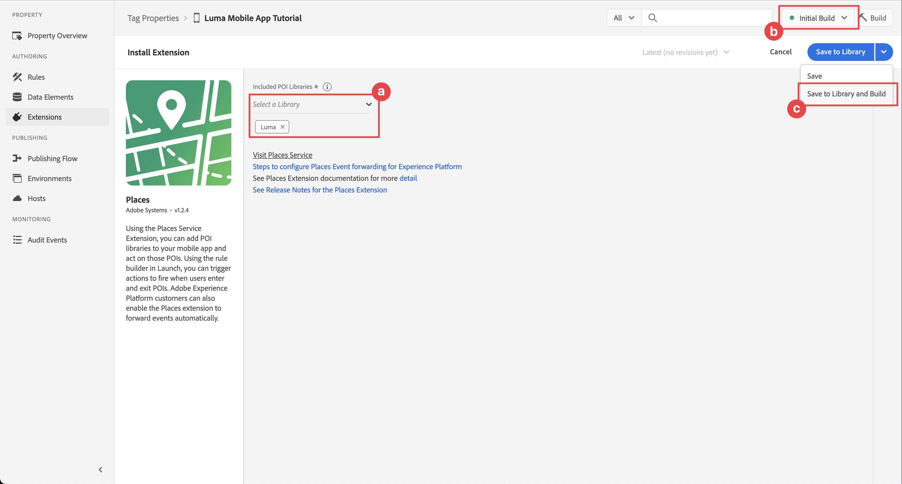
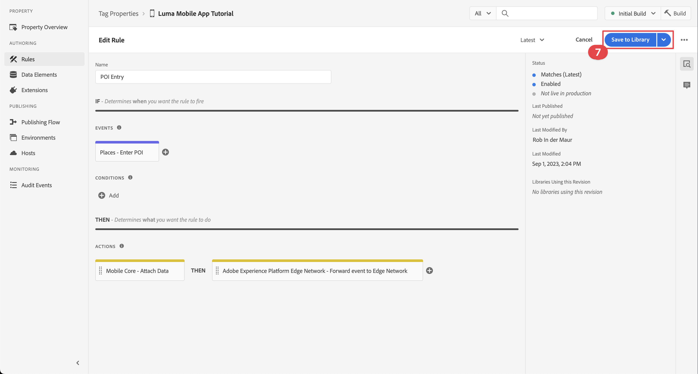

# Plaatsen

Leer hoe u de geolocatieservice in uw app gebruikt.

De Adobe Experience Platform Data Collection Places Service is een geo-locatieservice waarmee mobiele apps met het bewustzijn van de locatie de context van de locatie kunnen begrijpen. De dienst gebruikt rijke en makkelijk te gebruiken interfaces van SDK vergezeld van een flexibele gegevensbestand van belangenpunten (POIs).

## Vereisten

* Alle pakketgebiedsdelen zijn op zijn plaats in het project van Xcode.
* Geregistreerde extensies in AppDelegate.
* MobileCore is geconfigureerd om uw ontwikkelings-appId te gebruiken.
* Geïmporteerde SDK&#39;s.
* De app is gemaakt en uitgevoerd met de bovenstaande wijzigingen.

## Leerdoelstellingen

In deze les zult u

* Begrijp hoe te om punten van belang in de dienst van Plaatsen te bepalen.
* Werk de eigenschap tag bij met de extensie Plaatsen.
* Werk uw schema bij om geolocatiegebeurtenissen vast te leggen.
* Valideer installatie in Betrouwbaarheid.
* Werk uw app bij om de extensie Plaatsen te registreren.
* Implementeer geo-locatie bijhouden via de service Plaatsen in uw app.


## Vereisten

* App is gemaakt en uitgevoerd met de juiste SDK&#39;s geïnstalleerd en geconfigureerd.


## Leerdoelstellingen

In deze les zult u

* Werk uw Edge-configuratie bij voor beslissingsbeheer.
* Werk de eigenschap tag bij met de extensie Journey Optimizer - Decisioning.
* Werk uw schema bij om propositiegebeurtenissen vast te leggen.
* Valideer installatie in Betrouwbaarheid.
* Maak een biedbesluit op basis van aanbiedingen in Journey Optimizer - Beslissingsbeheer.
* Werk uw app bij om de extensie Optimizer te registreren.
* Voer aanbiedingen van Beslissingsbeheer in uw app uit.


## Instellen

De service Plaatsen werkt alleen binnen uw app en in de SDK voor mobiele apparaten als u een aantal instellingen opgeeft.

### Plaatsen definiëren

U definieert enkele aandachtspunten in de service Plaatsen.

1. Selecteer in de gebruikersinterface voor gegevensverzameling de optie **[!UICONTROL Plaatsen]**.
1. Selecteren .
1. Selecteer in het contextmenu de optie **[!UICONTROL Bibliotheken beheren]**.
   
1. In de **[!UICONTROL Bibliotheken beheren]** dialoogvenster, selecteren **[!UICONTROL Nieuw]**.
1. In de **[!UICONTROL Bibliotheek maken]** dialoogvenster een **[!UICONTROL Naam]** bijvoorbeeld `Luma`.
1. Selecteren **[!UICONTROL Bevestigen]**.
   
1. Als u het dialoogvenster **[!UICONTROL Bibliotheken beheren]** dialoogvenster, selecteren **[!UICONTROL Sluiten]**.
1. Terug naar **[!UICONTROL POI-beheer]**, selecteert u **[!UICONTROL POI&#39;s importeren]**.
1. Selecteren **[!UICONTROL Start]** in t**[!UICONTROL De importplaatsen]**.
1. Selecteren **[!UICONTROL Luminantie]** van de lijst van bibliotheken,
1. Selecteren **[!UICONTROL Volgende]**.
   
1. Download de [ZIP-bestand van POI&#39;s van luminantie](assets/luma_pois.csv.zip) en extraheer het naar een locatie op uw computer.
1. In de **[!UICONTROL Plaatsen importeren]** het dialoogvenster, slepen en neerzetten `luma_pois.csv` bestand aan **[!UICONTROL CSV-bestand kiezen - uw bestand slepen en neerzetten]**. U moet **[!UICONTROL Validatie voltooid]** - **[!UICONTROL Het CSV-bestand is gevalideerd]**.
1. Selecteren **[!UICONTROL Importeren beginnen]**. U moet **[!UICONTROL Succes]** - **[!UICONTROL 6 nieuwe POI&#39;s toegevoegd]**.
1. Selecteren **[!UICONTROL Gereed]**.
1. In **[!UICONTROL POI-beheer]**, ziet u dat er zes nieuwe Luma-winkels aan de lijst worden toegevoegd. U kunt schakelen tussen  lijst en  kaartweergave.
   .


### De extensie Plaatsen installeren

1. Navigeren naar **[!UICONTROL Tags]** en zoekt u de eigenschap voor de mobiele tag en opent u deze.
1. Selecteren **[!UICONTROL Extensies]**.
1. Selecteren **[!UICONTROL Catalogus]**.
1. Zoeken naar **[!UICONTROL Plaatsen]** extensie.
1. De extensie installeren.

   

1. In de **[!UICONTROL Extensie installeren]** dialoogvenster:
   1. Selecteren **[!UICONTROL Luminantie]** van de **[!UICONTROL Een bibliotheek selecteren]** lijst.
   1. Controleer of u de werkbibliotheek hebt gekozen, bijvoorbeeld **[!UICONTROL Eerste build]**.
   1. Selecteren **[!UICONTROL Opslaan in bibliotheek en samenstellen]** van **[!UICONTROL Opslaan in bibliotheek]**.
      .

1. Uw bibliotheek wordt opnieuw opgebouwd.


### Uw schema verifiëren

Controleren of uw schema, zoals gedefinieerd in [Schema maken](create-schema.md), worden de benodigde veldgroepen en klassen opgenomen om gegevens over de POI en de geolocatie te verzamelen.

1. Navigeer naar de interface voor gegevensverzameling en selecteer **[!UICONTROL Schemas]** van de linkerspoorstaaf.
1. Selecteren **[!UICONTROL Bladeren]** in de bovenste balk.
1. Selecteer het schema om het te openen.
1. Selecteer in de Schema-editor de optie **[!UICONTROL Consumentenervaringsgebeurtenis]**.
1. U ziet een **[!UICONTROL placeContext]** -object met object en velden voor het vastleggen van POI-interactie en geolocatiegegevens.
   .


### De tag bijwerken

De extensie Plaatsen voor tags biedt functionaliteit om gebeurtenissen met betrekking tot geolocatie te controleren en biedt u de mogelijkheid om handelingen te activeren op basis van deze gebeurtenissen. U kunt deze functionaliteit gebruiken om de API-codering die u in de app moet implementeren, tot een minimum te beperken.

**Gegevenselementen**

Eerst maakt u verschillende gegevenselementen.

1. Ga naar uw markeringsbezit in de UI van de Inzameling van Gegevens.
1. Selecteren **[!UICONTROL Gegevenselementen]** van de linkerspoorstaaf.
1. Selecteren **[!UICONTROL Gegevenselement toevoegen]**.
1. In de **[!UICONTROL Gegevenselement maken]** scherm, ga een naam in, bijvoorbeeld `Name - Entered`.
1. Selecteren **[!UICONTROL Plaatsen]** van de **[!UICONTROL Extensie]** lijst.
1. Selecteren **[!UICONTROL Naam]** van de **[!UICONTROL Type gegevenselement]** lijst.
1. Selecteren **[!UICONTROL Huidige POI]** ondergronds **[!UICONTROL DOEL]**.
1. Selecteren **[!UICONTROL Opslaan in bibliotheek]**.
   

1. Herhaal stap 4 - 8 met behulp van de informatie uit de onderstaande tabel om aanvullende gegevenselementen te maken.

   | Naam | Extensie | Type gegevenselement | DOEL |
   |---|---|---|---|
   | `Name - Exited` | Plaatsen | Naam | Laatst afgesloten POI |
   | `Category - Current` | Plaatsen | Categorie | Huidige POI |
   | `Category - Exited` | Plaatsen | Categorie | Laatst afgesloten POI |
   | `City - Current` | Plaatsen | Plaats | Huidige POI |
   | `City - Exited` | Plaatsen | Plaats | Laatst afgesloten POI |

   U moet de volgende lijst met gegevenselementen hebben.

   

**Regels**

Vervolgens gaat u regels definiëren om met deze gegevenselementen te werken.

1. In uw eigenschap tag. selecteren **[!UICONTROL Regels]** van de linkerspoorstaaf.
1. Selecteren **[!UICONTROL Regel toevoegen]**.
1. In de **[!UICONTROL Regel maken]** scherm, ga een naam voor de regel in, bijvoorbeeld `POI - Entry`.
1. Selecteren  ondergronds **[!UICONTROL EVENTS]**.
   1. Selecteren **[!UICONTROL Plaatsen]** van de **[!UICONTROL Extensie]** lijst en selecteer **[!UICONTROL POI invoeren]** van de **[!UICONTROL Type gebeurtenis]** lijst.
   1. Selecteren **[!UICONTROL Wijzigingen behouden]**.
      .
1. Selecteren  ondergronds **[!UICONTROL ACTIES]**.
   1. Selecteren **[!UICONTROL Mobiele kern]** van de **[!UICONTROL Extensie]** list, selecteer **[!UICONTROL Gegevens bijvoegen]** van **[!UICONTROL Type handeling]** de lijst. Met deze handeling worden gegevens over de lading gekoppeld.
   1. In de **[!UICONTROL JSON Payload]**, plakt u de volgende payload:

      ```json
      {
          "xdm": {
              "eventType": "location.entry",
              "placeContext": {
                  "geo": {
                      "city": "{%%City - Current%%}"
                  },
                  "POIinteraction": {
                      "poiDetail": {
                          "name": "{%%Name - Current%%}",
                          "category": "{%%Category - Current%%}"
                      },
                      "poiEntries": {
                          "value": 1
                      }
                  }
              }
          }
      }
      ```

      U kunt ook invoegen `{%% ... %%}` plaatsaanduidingswaarden voor gegevenselementen in JSON door de . In een pop-updialoogvenster kunt u elk gegevenselement kiezen dat u hebt gemaakt.

   1. Selecteren **[!UICONTROL Wijzigingen behouden]**.
      

1. Selecteren  naast de **[!UICONTROL Mobile Core - Gegevens koppelen]** handeling.
   1. Selecteren **[!UICONTROL Adobe Experience Platform Edge Network]** van de **[!UICONTROL Extensie]** lijst en selecteer **[!UICONTROL Door gebeurtenis naar Edge Network]**. Deze actie zorgt ervoor dat de gebeurtenis en de extra ladingsgegevens aan het Netwerk van de Rand door:sturen.
   1. Selecteren **[!UICONTROL Wijzigingen behouden]**.

1. Als u de regel wilt opslaan, selecteert u **[!UICONTROL Opslaan in bibliotheek]**.

   

Laten we een andere regel maken

1. In de **[!UICONTROL Regel maken]** scherm, ga een naam voor de regel in, bijvoorbeeld `POI - Exit`.
1. Selecteren  ondergronds **[!UICONTROL EVENTS]**.
   1. Selecteren **[!UICONTROL Plaatsen]** van de **[!UICONTROL Extensie]** lijst en selecteer **[!UICONTROL POI invoeren]** van de **[!UICONTROL Type gebeurtenis]** lijst.
   1. Selecteren **[!UICONTROL Wijzigingen behouden]**.
1. Selecteren  ondergronds **[!UICONTROL ACTIES]**.
   1. Selecteren **[!UICONTROL Mobiele kern]** van **[!UICONTROL Extensie]** list, selecteer **[!UICONTROL Gegevens bijvoegen]** van **[!UICONTROL Type handeling]** lijst.
   1. In de **[!UICONTROL JSON Payload]**, plakt u de volgende payload:

      ```json
      {
          "xdm": {
              "eventType": "location.exit",
              "placeContext": {
                  "geo": {
                      "city": "{%%City - Exited%%}"
                  },
                  "POIinteraction": {
                      "poiExits": {
                          "value": 1
                      },
                      "poiDetail": {
                          "name": "{%%Name - Exited%%}",
                          "category": "{%%Category - Exited%%}"
                      }
                  }
              }
          }
      }
      ```

   1. Selecteren **[!UICONTROL Wijzigingen behouden]**.

1. Selecteren  naast de **[!UICONTROL Mobile Core - Gegevens koppelen]** handeling.
   1. Selecteren **[!UICONTROL Adobe Experience Platform Edge Network]** van de **[!UICONTROL Extensie]** lijst en selecteer **[!UICONTROL Door gebeurtenis naar Edge Network]**.
   1. Selecteren **[!UICONTROL Wijzigingen behouden]**.


Alle wijzigingen in de tag worden gepubliceerd

1. Selecteren **[!UICONTROL Eerste build]** als de bibliotheek die moet worden gemaakt.
1. Selecteren **[!UICONTROL Opbouwen]**.
   


## Setup valideren bij Betrouwbaarheid

Uw instellingen valideren in Betrouwbaarheid:

1. Ga naar de betrouwbaarheidsinterface.
1. Indien niet reeds beschikbaar in het linkerspoor, selecteer **[!UICONTROL Configureren]** in linkerspoor en selecteer  naast **[!UICONTROL Gebeurtenissen]** en **[!UICONTROL Toewijzen en simuleren]** ondergronds **[!UICONTROL PLAATSINGSSERVICE]**.
1. Selecteren **[!UICONTROL Opslaan]**.
1. Selecteren **[!UICONTROL Toewijzen en simuleren]** in het linkerspoor.
1. Selecteer een van de POI&#39;s die zijn gedefinieerd in de service Plaatsen en selecteer in het pop-upvenster  **[!UICONTROL Invoergebeurtenis simuleren]**.
   
1. Selecteren **[!UICONTROL Gebeurtenissen]** van de linkerspoorstaaf, en je zou de gebeurtenissen moeten zien die je simuleerde.
   


## Plaatsen in uw app implementeren

Zoals in vorige lessen is besproken, biedt het installeren van een extensie voor mobiele tags alleen de configuratie. Vervolgens moet u de SDK van Plaatsen installeren en registreren. Als deze stappen niet duidelijk zijn, herzie [SDK&#39;s installeren](install-sdks.md) sectie.

>[!NOTE]
>
>Als u het [SDK&#39;s installeren](install-sdks.md) , is de SDK van Plaatsen al geïnstalleerd en kunt u deze stap overslaan.
>

1. Controleer in Xcode of [AEP-plaatsen](https://github.com/adobe/aepsdk-places-ios) wordt toegevoegd aan de lijst met pakketten in Pakketafhankelijke onderdelen. Zie [Swift Package Manager](install-sdks.md#swift-package-manager).
1. Navigeren naar **[!UICONTROL Luminantie]** > **[!UICONTROL Luminantie]** > **[!UICONTROL AppDelegate]** in de Xcode-projectnavigator.
1. Zorgen `AEPPlaces` maakt deel uit van uw lijst met importbewerkingen.

   `import AEPPlaces`

1. Zorgen `Places.self` maakt deel uit van de array met extensies die u registreert.

   ```swift
   let extensions = [
       AEPIdentity.Identity.self,
       Lifecycle.self,
       Signal.self,
       Edge.self,
       AEPEdgeIdentity.Identity.self,
       Consent.self,
       UserProfile.self,
       Places.self,
       Messaging.self,
       Optimize.self,
       Assurance.self
   ]
   ```

1. Navigeren naar **[!UICONTROL Luminantie]** > **[!UICONTROL Luminantie]** > **[!UICONTROL Utils]** > **[!UICONTROL MobileSDK]** in de Xcode-projectnavigator en zoek de `func processRegionEvent(regionEvent: PlacesRegionEvent, forRegion region: CLRegion) async` function.Voeg de volgende code toe:

   ```swift
   // Process geolocation event
   Places.processRegionEvent(regionEvent, forRegion: region)
   ```

   Dit [`Places.processRegionEvent`](https://developer.adobe.com/client-sdks/documentation/places/api-reference/#processregionevent) API deelt de geolocatiegegevens aan de dienst van Plaatsen mee.

1. Navigeren naar **[!UICONTROL Luminantie]** > **[!UICONTROL Luminantie]** > **[!UICONTROL Weergaven]** > **[!UICONTROL Locatie]** > **[!UICONTROL GeofenceSheet]** in Xcode&#39;s Project navigator.

   1. Voer voor de knop Item de volgende code in

   ```swift
   // Simulate geofence entry event
   Task {
       await MobileSDK.shared.processRegionEvent(regionEvent: .entry, forRegion: region)
   }
   ```

   1. Voer voor de knop Afsluiten de volgende code in

   ```swift
   // Simulate geofence exit event
   Task {
       await MobileSDK.shared.processRegionEvent(regionEvent: .exit, forRegion: region)
   }
   ```

Het is buiten het onderwerp van deze les om details over de implementatie van plaatsmanager binnen iOS te verklaren.


## Valideren met uw app

1. Open uw app op een apparaat of in de simulator.

1. Ga naar de **[!UICONTROL Locatie]** tab.

1. Verplaats de kaart om ervoor te zorgen dat de blauwe cirkel in het midden boven op een van je POI&#39;s ligt, bijvoorbeeld Londen.

1. Tik op  herhaaldelijk tot u de categorie en de naam bij het bodemrecht ziet.

1. Tik op het label van de POI, die het **[!UICONTROL Nearby POI]** blad.

   

1. Druk op **[!UICONTROL Invoer]** of **[!UICONTROL Afsluiten]** knoppen om geofence-entry- en geofence exit-gebeurtenissen uit de app te simuleren.

   

1. U zou de gebeurtenissen in de Verzekering UI moeten zien.


## Volgende stappen

U moet nu over alle gereedschappen beschikken om meer functionaliteit toe te voegen aan de functie voor geolocatie in de app. Nadat u de gebeurtenissen naar Edge Network hebt doorgestuurd, kunt u de app voor [Experience Platform](platform.md)worden de ervaringsgebeurtenissen weergegeven voor het profiel dat wordt gebruikt in de app.

In het Journey Optimizer gedeelte van deze zelfstudie ziet u dat ervaringsgebeurtenissen kunnen worden gebruikt om ritten te activeren (zie [pushmelding](journey-optimizer-inapp.md) en [in-app-berichten](journey-optimizer-push.md) met Journey Optimizer). Bijvoorbeeld, het gebruikelijke voorbeeld om uw toepassingsgebruiker een dupbericht met één of andere productbevordering te verzenden wanneer die gebruiker de geofence van een fysieke opslag ingaat.

U hebt een implementatie van de functionaliteit voor uw app gezien, voornamelijk door de service Plaatsen en gegevenselementen en -regels die u in de eigenschap Tag hebt gedefinieerd. Hierdoor wordt de code in uw app geminimaliseerd. U kunt dezelfde functionaliteit ook rechtstreeks in uw app implementeren met de [`Edge.sendEvent`](https://developer.adobe.com/client-sdks/documentation/edge-network/api-reference/#sendevent) API (zie [Gebeurtenissen](events.md) voor meer informatie) met een XDM nuttige lading die een bevolkt bevat `placeContext` object.

>[!SUCCESS]
>
>U hebt de app voor geolocatieservices nu ingeschakeld met de extensie Plaatsen in de Experience Platform Mobile SDK.<br/>Bedankt dat u tijd hebt geïnvesteerd in het leren van Adobe Experience Platform Mobile SDK. Als u vragen hebt, algemene feedback wilt delen of suggesties voor toekomstige inhoud wilt hebben, deelt u deze over deze [Experience League Communautaire discussiestuk](https://experienceleaguecommunities.adobe.com/t5/adobe-experience-platform-launch/tutorial-discussion-implement-adobe-experience-cloud-in-mobile/td-p/443796).

Volgende: **[Gegevens toewijzen aan Adobe Analytics](analytics.md)**
