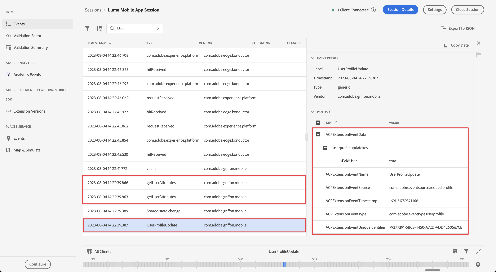

# Profiel

Leer hoe u profielgegevens kunt verzamelen in een mobiele app.

U kunt de extensie Profiel gebruiken om kenmerken van de gebruiker op de client op te slaan. Deze informatie kan later worden gebruikt om berichten tijdens online of off-line scenario&#39;s te richten en te personaliseren, zonder het moeten met een server voor optimale prestaties verbinden. De extensie Profiel beheert het Client-Side Operation Profile (CSOP), biedt een manier om op API&#39;s te reageren, werkt gebruikersprofielkenmerken bij en deelt de gebruikersprofielkenmerken met de rest van het systeem als een gegenereerde gebeurtenis.

De profielgegevens worden door andere extensies gebruikt om acties met betrekking tot profielen uit te voeren. Een voorbeeld is de uitbreiding van de Motor van Regels die de profielgegevens verbruikt en regels in werking stelt die op de profielgegevens worden gebaseerd. Meer informatie over de [Profielextensie](https://developer.adobe.com/client-sdks/documentation/profile/) in de documentatie

>[!IMPORTANT]
>
>De functionaliteit Profiel die in deze les wordt beschreven is los van de Real-Time functionaliteit van het Profiel van de Klant in Adobe Experience Platform en Platform-based toepassingen.


## Vereisten

* App met SDK&#39;s geïnstalleerd en geconfigureerd met succes gemaakt en uitgevoerd.
* De SDK van het profiel is geïmporteerd.

  ```swift
  import AEPUserProfile
  ```

## Leerdoelstellingen

In deze les zult u:

* Gebruikerskenmerken instellen of bijwerken.
* Gebruikerskenmerken ophalen.


## Gebruikerskenmerken instellen en bijwerken

Het zou handig zijn als u zich richt op en/of personalisatie om snel te weten of een gebruiker al eerder een aankoop heeft gedaan in de app. Laten we dat instellen in de Luma-app.

1. Navigeren naar **[!UICONTROL Luminantie]** > **[!UICONTROL Luminantie]** > **[!UICONTROL Utils]** >  **[!UICONTROL MobileSDK]** en de `func updateUserAttribute(attributeName: String, attributeValue: String)` functie. Voeg de volgende code toe:

   ```swift
   // Create a profile map
   var profileMap = [String: Any]()
   // Add attributes to profile map
   profileMap[attributeName] = attributeValue
   // Use profile map to update user attributes
   UserProfile.updateUserAttributes(attributeDict: profileMap)
   ```

   Deze code:

   1. Hiermee wordt een leeg woordenboek ingesteld met de naam `profileMap`.

   1. Hiermee wordt een element aan het woordenboek toegevoegd met `attributeName` (bijvoorbeeld `isPaidUser`), en `attributeValue` (bijvoorbeeld `yes`).

   1. Gebruikt de `profileMap` woordenboek als een waarde voor de `attributeDict` parameter van de `UserProfile.updateUserAttributes` API-aanroep.

1. Navigeren naar **[!UICONTROL Luminantie]** > **[!UICONTROL Luminantie]** > **[!UICONTROL Weergaven]** > **[!UICONTROL Producten]** > **[!UICONTROL ProductView]** in de navigator van het Project van Xcode en vind de vraag aan `updateUserAttributes` (binnen de code voor de aankopen  knop):

   ```swift
   // Update attributes
   MobileSDK.shared.updateUserAttributes(attributeName: "isPaidUser", attributeValue: "yes")
   ```

Aanvullende documentatie is te vinden [hier](https://developer.adobe.com/client-sdks/documentation/profile/api-reference/#updateuserattribute).

## Gebruikerskenmerken ophalen

Zodra u het attribuut van een gebruiker hebt bijgewerkt, is het beschikbaar aan andere Adobe SDKs maar u kunt attributen ook uitdrukkelijk terugwinnen.

1. Navigeren naar **[!UICONTROL Luminantie]** > **[!UICONTROL Luminantie]** > **[!UICONTROL Weergaven]** > Algemeen > **[!UICONTROL HomeView]** in Xcode Project navigator en vind `.onAppear` modifier. Voeg de volgende code toe:

   ```swift
   // Get attributes
   UserProfile.getUserAttributes(attributeNames: ["isPaidUser"]) { attributes, error in
       if attributes?["isPaidUser"] as! String == "yes" {
           showBadgeForUser = true
       }
       else {
           showBadgeForUser = false
       }
   }
   ```

   Deze code:

   1. roept de `UserProfile.getUserAttributes` sluiting met de `iPaidUser` kenmerknaam als één element in het dialoogvenster `attributeNames` array.
   1. Vervolgens wordt gecontroleerd op de waarde van de optie `isPaidUser` kenmerk en wanneer `yes`, plaatst een badge op de  in de werkbalk rechtsboven.

Aanvullende documentatie is te vinden [hier](https://developer.adobe.com/client-sdks/documentation/profile/api-reference/#getuserattributes).

## Valideren met betrouwbaarheid

1. Controleer de [installatie-instructies](assurance.md) sectie.
1. Installeer de toepassing.
1. Start de app met de gegenereerde URL voor Betrouwbaarheid.
1. Voer de app uit om u aan te melden en te communiceren met een product.

   1. Verplaats het pictogram Verzekering naar links.
   1. Selecteren **[!UICONTROL Home]** in de tabbalk.
   1. Als u het aanmeldingsblad wilt openen, selecteert u de optie  knop.
   1. Als u een willekeurige e-mail en een klant-id wilt invoegen, selecteert u de  knop .
   1. Selecteren **[!UICONTROL Aanmelden]**.
   1. Selecteren **[!UICONTROL Producten]** in de tabbalk.
   1. Selecteer één product.
   1. Selecteer .
   1. Selecteer .
   1. Selecteer .
   1. Terug naar **[!UICONTROL Home]** scherm. U moet de bijgewerkte waarden voor **[!UICONTROL E-mail]** en **[!UICONTROL CRM-id]**.

         

1. In de UI van de Verzekering, zou u een **[!UICONTROL UserProfileUpdate]** en **[!UICONTROL getUserAttributes]** gebeurtenissen met de bijgewerkte `profileMap` waarde.
   

>[!SUCCESS]
>
>U hebt nu uw app ingesteld om kenmerken van profielen in het Edge-netwerk bij te werken en (wanneer deze is ingesteld) met Adobe Experience Platform.<br/>Bedankt dat u tijd hebt geïnvesteerd in het leren van Adobe Experience Platform Mobile SDK. Als u vragen hebt, algemene feedback wilt delen of suggesties voor toekomstige inhoud wilt hebben, deelt u deze over deze [Experience League Communautaire discussiestuk](https://experienceleaguecommunities.adobe.com/t5/adobe-experience-platform-launch/tutorial-discussion-implement-adobe-experience-cloud-in-mobile/td-p/443796).

Volgende: **[Gegevens toewijzen aan Adobe Analytics](analytics.md)**
