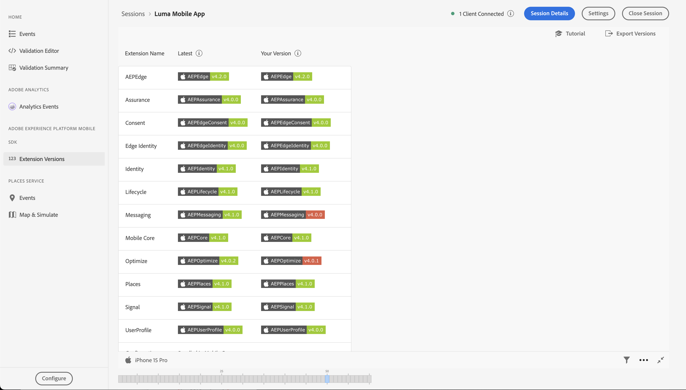

# Assurance instellen

Leer hoe u Adobe Experience Platform Assurance instelt in een mobiele app.

Assurance, officieel bekend als Project Griffon, is ontworpen om u te helpen bij het inspecteren, testen, simuleren en valideren van de manier waarop u gegevens verzamelt of ervaringen opdoet in uw mobiele app.

Assurance helpt u onbewerkte SDK-gebeurtenissen die zijn gegenereerd door de Adobe Experience Platform Mobile SDK te inspecteren. Alle gebeurtenissen die door de SDK zijn verzameld, kunnen worden geïnspecteerd. SDK-gebeurtenissen worden geladen in een lijstweergave, gesorteerd op tijd. Elke gebeurtenis heeft een gedetailleerde weergave met meer details. Er worden ook extra weergaven geboden voor het bladeren door de SDK-configuratie, gegevenselementen, Gedeelde statussen en SDK-extensieversies. Leer meer over [ Assurance ](https://experienceleague.adobe.com/en/docs/experience-platform/assurance/home) in de productdocumentatie.


## Vereisten

* De app is geïnstalleerd en geconfigureerd met SDK&#39;s.

## Leerdoelstellingen

In deze les zult u:

* Bevestig dat uw organisatie toegang heeft (en verzoek het als u niet).
* Stel de basis-URL in.
* Voeg de vereiste iOS-specifieke code toe.
* Maak verbinding met een sessie.

## Toegang bevestigen

Bevestig dat uw organisatie toegang heeft tot Assurance. U moet als gebruiker aan het profiel voor Adobe Experience Platform worden toegevoegd. Zie {de toegang van 0} Gebruiker [ in de gids van Assurance voor meer informatie.](https://experienceleague.adobe.com/en/docs/experience-platform/assurance/user-access)

## Implementeren

Assurance in uw app implementeren:

>[!BEGINTABS]

>[!TAB  iOS ]

Naast de algemene [ installatie van SDK ](install-sdks.md), vereist iOS ook de volgende extra code om de zitting van Assurance voor uw app te beginnen.

1. Navigeer naar **[!DNL Luma]** > **[!DNL Luma]** > **[!UICONTROL SceneDelegate]** in de projectnavigator van uw Xcode.

1. Voeg de volgende code toe aan `func scene(_ scene: UIScene, openURLContexts URLContexts: Set<UIOpenURLContext>` :

   ```swift
   // Called when the app in background is opened with a deep link.
   if let deepLinkURL = URLContexts.first?.url {
       // Start the Assurance session
       Assurance.startSession(url: deepLinkURL)
   }
   ```

   Met deze code wordt een verzekeringssessie gestart wanneer de toepassing op de achtergrond wordt uitgevoerd en via een diepe koppeling wordt geopend.

>[!TAB  Android ]

Naast de algemene [ installatie van SDK ](install-sdks.md), vereist Android ook de volgende extra code om de zitting van Assurance voor uw app te beginnen.

1. Navigeer in Android Studio in de **[!UICONTROL Android]** -weergave naar **[!UICONTROL app]** > **[!UICONTROL kotlin+java]** > **[!UICONTROL com.adobe.luma.tutorial.android]** > **[!UICONTROL LumaApplication]** .

1. Voeg de volgende code toe aan `fun handleDeeplink(deeplink: String?)` :

   ```kotlin
   // Called when the app in background is opened with a deep link.
   if (deeplink.isNullOrEmpty()) {
      Log.w("Luma", "Deeplink is null or empty")
      return
   }
   
   Log.i("Luma", "Handling deeplink: $deeplink")
   Assurance.startSession(deeplink)
   ```

   Met deze code wordt een verzekeringssessie gestart wanneer de toepassing op de achtergrond wordt uitgevoerd en via een diepe koppeling wordt geopend.

>[!ENDTABS]


Zie [ Assurance API verwijzing ](https://developer.adobe.com/client-sdks/documentation/platform-assurance-sdk/api-reference/){target="_blank"} voor meer informatie.


## Een bundel-id definiëren

U moet een unieke bundle-id opgeven voor uw app.

>[!BEGINTABS]

>[!TAB  iOS ]

1. Open het project in Xcode.
1. Selecteer **[!DNL Luma]** in de projectnavigator.
1. Selecteer het doel **[!DNL Luma]** .
1. Selecteer het **Ondertekenen &amp; Capabilities** lusje.
1. Definieer een **[!UICONTROL Bundle Identifier]** .

Verzeker u a _uniek_ bundelherkenningsteken gebruikt en vervang het `com.adobe.luma.tutorial.swiftui` bundelherkenningsteken, aangezien elk bundelherkenningsteken uniek moet zijn. Gewoonlijk gebruikt u een omgekeerde DNS-indeling voor bundle ID-tekenreeksen, zoals `com.organization.brand.uniqueidentifier` . De voltooide versie van deze zelfstudie gebruikt bijvoorbeeld `com.adobe.luma.tutorial.swiftui` .

{zoomable="yes"}{zoomable="yes"}

>[!TAB  Android ]

1. Open het project in Android Studio.
1. Selecteer **[!UICONTROL build.gradle.kts (Module :app)]** in de navigator.
1. Verzeker u a _uniek_ bundelherkenningsteken gebruikt en vervang de `com.adobe.luma.tutorial.android` waarde voor `namespace` in `android`
1. Verzeker u het zelfde _unieke_ bundelherkenningsteken gebruikt `com.adobe.luma.tutorial.android` voor `applicationId` binnen `defaultConfig` in `android`

Gewoonlijk gebruikt u een omgekeerde DNS-indeling voor bundle ID-tekenreeksen, zoals `com.organization.brand.uniqueidentifier` . De voltooide versie van deze zelfstudie gebruikt bijvoorbeeld `com.adobe.luma.tutorial.android` .

{zoomable="yes"}{zoomable="yes"}

>[!ENDTABS]


## Een basis-URL instellen

U moet een basis-URL instellen om te zorgen dat deep linking werkt.

>[!BEGINTABS]

>[!TAB  iOS ]

1. Ga naar uw project in Xcode.
1. Selecteer **[!DNL Luma]** in de projectnavigator.
1. Selecteer het doel **[!DNL Luma]** .
1. Selecteer het **Info** lusje.
1. Om een basis URL toe te voegen, scrol neer aan **Types URL** en selecteer **+** knoop.
1. Plaats **Herkenningsteken** aan het bundelherkenningsteken van uw keus en plaats a **Schema&#39;s URL** van uw keus.

   {zoomable="yes"}

Verzeker u a _uniek_ bundelherkenningsteken gebruikt en vervang het `com.adobe.luma.tutorial.swiftui` bundelherkenningsteken, aangezien elk bundelherkenningsteken uniek moet zijn. Gewoonlijk gebruikt u een omgekeerde DNS-indeling voor bundle ID-tekenreeksen, zoals `com.organization.brand.uniqueidentifier` . U kunt het zelfde bundelherkenningsteken gebruiken dat u bij [ hebt gebruikt bepaalt bundelherkenningsteken ](#define-bundle-identifier).<br/> Op dezelfde manier gebruik een uniek schema URL, en vervang reeds verstrekt `lumatutorialswiftui` met uw uniek schema URL.

Meer over regelingen URL in iOS leren, herzie [ documentatie van Apple ](https://developer.apple.com/documentation/xcode/defining-a-custom-url-scheme-for-your-app){target="_blank"}.

Assurance werkt door een URL te openen, via een browser of QR-code. Die URL begint met de basis-URL die de app opent en aanvullende parameters bevat. Deze unieke parameters worden gebruikt om de sessie te verbinden. In de voorbeeld-app is de diepe koppeling `lumatutorialswiftui://` .

>[!TAB  Android ]

1. Ga naar de **[!UICONTROL Android]** weergave van uw project in Android Studio.
1. Selecteer **[!UICONTROL app]** > **[!UICONTROL manifests]** > **[!UICONTROL AndroidManifest.xml]** in de navigator.
1. Zorg ervoor dat het XML-element **[!UICONTROL manifest]** > **[!UICONTROL application]** > **[!UICONTROL activity]** er als volgt uitziet:

   ```xml
   <activity
      android:name=".MainActivity"
      android:exported="true"
      android:theme="@style/Theme.LumaAndroid">
      <intent-filter>
            <action android:name="android.intent.action.MAIN" />
            <category android:name="android.intent.category.LAUNCHER" />
      </intent-filter>
      <intent-filter
            android:label="@string/app_name">
            <action android:name="android.intent.action.VIEW" />
            <category android:name="android.intent.category.DEFAULT" />
            <category android:name="android.intent.category.BROWSABLE" />
            <data android:scheme="lumatutorialandroid"
               android:host="default" />
      </intent-filter>
   </activity>
   ```

Zorg ervoor dat u een `android:scheme` opgeeft (bijvoorbeeld `lumatutorialandroid` ) en `android:host` (bijvoorbeeld `default` ) om de basis-URL te definiëren.

Meer over diepe verbindingen in Android leren, zie [ Diepe Verbindingen tot de Inhoud van de Toepassing ](https://developer.apple.com/documentation/xcode/defining-a-custom-url-scheme-for-your-app){target="_blank"} creëren.

Assurance werkt door een URL te openen, via een browser of QR-code. Die URL begint met de basis-URL, die de app opent en aanvullende parameters bevat. Deze unieke parameters worden gebruikt om de sessie te verbinden.  In de voorbeeld-app is de diepe koppeling `lumatutorialandroid://default` .

>[!ENDTABS]


## Verbinding maken met een sessie

U kunt nu met Assurance verbinding maken met een sessie.

>[!BEGINTABS]

>[!TAB  iOS ]

In Xcode:

1. Bouw of herbouwt en stel app in de simulator of op een fysiek apparaat van Xcode in werking, gebruikend .

   Naar keuze, zou u ** uw bouwstijl kunnen willen schoonmaken, vooral wanneer u onverwachte resultaten ziet. Selecteer **[!UICONTROL Clean Build Folder…]** in het menu Xcode **[!UICONTROL Product]** .


1. Selecteer **[!UICONTROL Allow "Luma App" to use your location]** in het dialoogvenster **[!UICONTROL Allow While Using App]** .

   

1. Selecteer **[!UICONTROL "Luma App" Would Like to Send You Notifications]** in het dialoogvenster **[!UICONTROL Allow]** .

   

1. Selecteer **[!UICONTROL Continue…]** om toe te staan dat de app uw activiteiten bijhoudt.

   

1. Selecteer **[!UICONTROL Allow "Luma App" to track your activity across other companies' apps and websites]** in het dialoogvenster **[!UICONTROL Allow]** .

   

1. Selecteer **[!UICONTROL Continue]**.


In uw browser:

1. Ga naar de interface voor gegevensverzameling.
1. Selecteer **[!UICONTROL Assurance]** in het linkerspoor.
1. Selecteer **[!UICONTROL Create New Session]** en kies de optie **[!UICONTROL Deep link connect]** .
1. Selecteer **[!UICONTROL Start]**.
1. Geef een **[!UICONTROL Session Name]** zoals `Luma Mobile App Session` en **[!UICONTROL Base URL]** op. Dit zijn de URL-schema&#39;s die u in Xcode hebt ingevoerd, gevolgd door `://` Bijvoorbeeld: `lumatutorialswiftui://`
1. Selecteer **[!UICONTROL Next]**.
   {zoomable="yes"}
1. In het modale dialoogvenster **[!UICONTROL Create New Session]** :

   Als u een fysiek apparaat gebruikt:

   * Selecteer **[!UICONTROL Scan QR Code]**. Als u de app wilt openen, gebruikt u de camera op het fysieke apparaat om de QR-code te scannen en tikt u op de koppeling.

     {zoomable="yes"}

   Als u een simulator gebruikt:

   1. Selecteer **[!UICONTROL Copy Link]**.
   1. Kopieer de diepe verbinding gebruikend  en gebruik de diepe verbinding om app met Safari in de simulator te openen.
      {zoomable="yes"}

1. Wanneer de app wordt geladen, ziet u een modaal dialoogvenster waarin u wordt gevraagd de pincode in te voeren die in stap 7 wordt getoond.

   

   Voer de pincode in en selecteer **[!UICONTROL Connect]** .


1. Als de verbinding tot stand is gebracht, ziet u:
   * Een Assurance-pictogram dat boven op uw app zweeft.

     

   * Experience Cloud-updates die worden weergegeven in de gebruikersinterface van Assurance:

      1. Ervaar gebeurtenissen die afkomstig zijn uit de app.
      1. Details van een geselecteerde gebeurtenis.
      1. Het apparaat en de tijdlijn.

         {zoomable="yes"}

1. Selecteer **[!UICONTROL Continue]** om naar het scherm Home te gaan.

>[!TAB  Android ]

In Android Studio:

1. Bouw of herbouwt en stel app in de simulator of op een fysiek apparaat van de Studio van Android in werking, gebruikend .

   Naar keuze, zou u ** uw bouwstijl kunnen willen schoonmaken, vooral wanneer u onverwachte resultaten ziet. Selecteer **[!UICONTROL Clean Project]** in het menu Android Studio **[!UICONTROL Build]** .


1. Selecteer **[!UICONTROL Allow Luma Android to send you notifications]** in het dialoogvenster **[!UICONTROL Allow]** .

   

1. Selecteer **[!UICONTROL Show permission dialog]**.

   

1. In de lus **[!UICONTROL Allow Luma Android to access this device's location?]**..

   

   * Selecteer **[!UICONTROL Precise]**.
   * Selecteer **[!UICONTROL While using the app]**.

1. Selecteer **[!UICONTROL Open device settings]** weer in het scherm van de introductieapp.

1. Selecteer **[!UICONTROL Location permission]** in het **[!UICONTROL Allow all the time]** -scherm. Selecteer vervolgens **[!UICONTROL ←]** om terug te keren naar het startscherm van de app.

   

1. Selecteer **[!UICONTROL Continue]** om naar het scherm Home te gaan.


In uw browser:

1. Ga naar de interface voor gegevensverzameling.
1. Selecteer **[!UICONTROL Assurance]** in het linkerspoor.
1. Selecteer **[!UICONTROL Create New Session]** en kies de optie **[!UICONTROL Deep link connect]** .
1. Selecteer **[!UICONTROL Start]**.
1. Geef een **[!UICONTROL Session Name]** zoals `Luma Mobile App Session` en de **[!UICONTROL Base URL]** op. Dit zijn de `android:scheme` en `android:host` die u in **[!UICONTROL AndroidManifest.xml]** in Android Studio hebt gedefinieerd, gescheiden door `://` bijvoorbeeld: `lumatutorialandroid://default`
1. Selecteer **[!UICONTROL Next]**.
   {zoomable="yes"}

1. In het modale dialoogvenster **[!UICONTROL Create New Session]** :

   Als u een fysiek apparaat gebruikt:

   * Selecteer **[!UICONTROL Scan QR Code]**. Als u de app wilt openen, gebruikt u de camera op het fysieke apparaat om de QR-code te scannen en tikt u op de koppeling.

     {zoomable="yes"}

   Als u een simulator gebruikt:

   1. Selecteer **[!UICONTROL Copy Link]**.
   1. Kopieer de diepe verbinding gebruikend  en gebruik de diepe verbinding om app met Chrome in de simulator te openen.

   {zoomable="yes"}

   Wanneer ertoe aangezet in Chrome **aan Luma Android** verdergaan, uitgezochte **gaat** verder.

1. Wanneer de app wordt geladen, ziet u een modaal dialoogvenster waarin u wordt gevraagd de pincode in te voeren die in stap 7 wordt getoond.

   

   Voer de pincode in en selecteer **[!UICONTROL Connect]** .


1. Als de verbinding tot stand is gebracht, ziet u:
   * Een Assurance-pictogram dat boven op uw app zweeft.

     

   * Experience Cloud-updates die worden weergegeven in de gebruikersinterface van Assurance:

      1. Ervaar gebeurtenissen die afkomstig zijn uit de app.
      1. Details van een geselecteerde gebeurtenis.
      1. Het apparaat en de tijdlijn.

         {zoomable="yes"}

>[!ENDTABS]

Als u in om het even welke uitdagingen in werking stelt, herzie [ technische ](https://developer.adobe.com/client-sdks/documentation/platform-assurance-sdk/){target="_blank"} en [ algemene documentatie ](https://experienceleague.adobe.com/en/docs/experience-platform/assurance/home){target="_blank"}.


## Extensies verifiëren

Om te controleren of uw app de meest actuele extensies gebruikt:

1. Selecteer **[!UICONTROL Configure]**.

1. Selecteer  voor  **[!UICONTROL Extension Versions]**.

1. Selecteer **[!UICONTROL Save]**.

   {zoomable="yes"}

1. Selecteer  **[!UICONTROL Extension Versions]** om een overzicht van de recentste beschikbare uitbreidingen en de uitbreidingen te zien die in uw versie van app worden gebruikt.

>[!BEGINTABS]

>[!TAB  iOS ]

{zoomable="yes"}

Als u uw extensieversies wilt bijwerken (bijvoorbeeld **[!UICONTROL Messaging]** en **[!UICONTROL Optimize]** ), selecteert u het pakket (de extensie) in **[!UICONTROL Package Dependencies]** (bijvoorbeeld **[!UICONTROL AEPMessaging]** ) en selecteert u **[!UICONTROL Update Package]** in het contextmenu. Xcode werkt de pakketafhankelijkheden bij.

>[!TAB  Android ]

{zoomable="yes"}

Als u verouderde uitbreidingen ziet, verwijs naar de [ documentatie van de Studio van Android ](https://developer.android.com/build/agp-upgrade-assistant) op hoe te om uw gebiedsdeelmodules voor uw project bij te werken.


>[!ENDTABS]

>[!NOTE]
>
>Zodra u uw uitbreidingen (pakketten) in uw ontwikkelomgeving hebt bijgewerkt, sluit en schrapt uw huidige zitting en herhaalt alle stappen van [ die met een zitting ](#connecting-to-a-session) verbinden en [ verifiëren uitbreidingen ](#verify-extensions) om ervoor te zorgen dat Assurance behoorlijk de correcte uitbreidingen in een nieuwe zitting van Assurance meldt.
>


>[!SUCCESS]
>
>U hebt nu uw app zo ingesteld dat deze voor de rest van de zelfstudie Assurance gebruikt.
>
>Bedankt dat je tijd hebt geïnvesteerd in het leren van Adobe Experience Platform Mobile SDK. Als u vragen hebt, algemene terugkoppelen willen delen, of suggesties over toekomstige inhoud hebben, hen op deze [ Communautaire besprekingspost van Experience League ](https://experienceleaguecommunities.adobe.com/t5/adobe-experience-platform-data/tutorial-discussion-implement-adobe-experience-cloud-in-mobile/td-p/443796) delen


Volgende: **[voer Toestemming](consent.md)** uit
