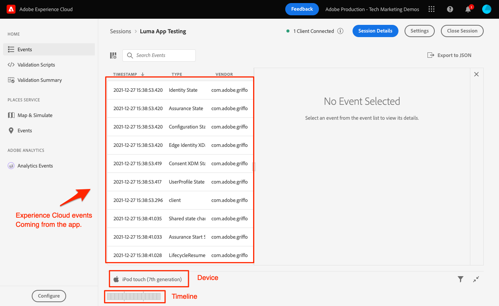

# Betrouwbaarheid

Leer hoe u Adobe Experience Platform Assurance instelt in een mobiele app.

De borging, die formeel Project Griffon wordt genoemd, wordt ontworpen om u te helpen inspecteren, beproeven, simuleren, en bevestigen hoe u gegevens verzamelt of ervaringen in uw mobiele app dient.

Met de optie Betrouwbaarheid kunt u onbewerkte SDK-gebeurtenissen controleren die zijn gegenereerd door de Adobe Experience Platform Mobile SDK. Alle gebeurtenissen die door de SDK worden verzameld, zijn beschikbaar voor inspectie. SDK-gebeurtenissen worden geladen in een lijstweergave, gesorteerd op tijd. Elke gebeurtenis heeft een gedetailleerde weergave met meer details. Er worden ook extra weergaven geboden voor het bladeren in de SDK-configuratie, gegevenselementen, Gedeelde statussen en SDK-extensieversies. Meer informatie over de [Betrouwbaarheid](https://aep-sdks.gitbook.io/docs/foundation-extensions/adobe-experience-platform-assurance) in de productdocumentatie.


## Vereisten

* De voorbeeldtoepassing is gemaakt en uitgevoerd met SDK&#39;s geïnstalleerd en geconfigureerd.

## Leerdoelstellingen

In deze les zult u:

* Bevestig dat uw organisatie toegang heeft (en verzoek het als u niet).
* Stel de basis-URL in.
* Voeg de vereiste iOS-specifieke code toe.
* Maak verbinding met een sessie.

## Toegang bevestigen

Bevestig dat uw organisatie toegang tot Verzekering heeft door de volgende stappen te voltooien:

1. Bezoek [https://experience.adobe.com/#/assurance](https://experience.adobe.com/griffon){target="_blank"}
1. Meld u aan met uw Adobe ID-referenties voor de Experience Cloud.
1. Als u naar de **[!UICONTROL Sessies]** , hebt u toegang. Selecteer **[!UICONTROL Registreren]**.

## Implementeren

Naast de algemene [SDK-installatie](install-sdks.md) die u in de vorige les hebt voltooid, vereist iOS ook de volgende toevoeging. Voeg de volgende code toe aan de `AppDelegate.swift` bestand:

```swift
func application(_ app: UIApplication, open url: URL, options: [UIApplication.OpenURLOptionsKey: Any] = [:]) -> Bool {
    Assurance.startSession(url: url)
    return true
}
```

Het voorbeeld Luma dat voor deze zelfstudie wordt geleverd, gebruikt iOS 12.0. Als u met iOS 13 en hoger de volgende stappen uitvoert in uw eigen op scènes gebaseerde toepassing, gebruikt u de opdracht `UISceneDelegate's scene(_:openURLContexts:)` als volgt:

```swift
func scene(_ scene: UIScene, openURLContexts URLContexts: Set<UIOpenURLContext>) {
    // Called when the app in background is opened with a deep link.
    if let deepLinkURL = URLContexts.first?.url {
        Assurance.startSession(url: deepLinkURL)
    }
}
```

Meer informatie is beschikbaar op [hier](https://aep-sdks.gitbook.io/docs/foundation-extensions/adobe-experience-platform-assurance#implement-aep-assurance-session-start-apis-ios-only){target="_blank"}.

## Een basis-URL instellen

1. Open XCode en selecteer de projectnaam.
1. Ga naar de **Info** tab.
1. Omlaag schuiven naar **URL-typen** en selecteert u de **+** om een nieuwe toe te voegen.
1. Set **Id** en **URL-schema&#39;s** in &quot;lumadeplink&quot;.
1. Ontwikkel en voer de app uit.


Voor meer informatie over URL-schema&#39;s in iOS raadpleegt u [Apple-documentatie](https://developer.apple.com/documentation/xcode/defining-a-custom-url-scheme-for-your-app){target="_blank"}.

De verzekering werkt door een URL, of via browser of code QR, te openen die URL met de basis URL begint die app opent en extra parameters bevat. Deze unieke parameters worden gebruikt om de sessie te verbinden.

## Verbinding maken met een sessie

1. Ga naar de [Assurance UI](https://experience.adobe.com/griffon){target="_blank"}.
1. Selecteren **[!UICONTROL Sessie maken]**.
1. Verlenen **[!UICONTROL Naam van sessie]** zoals `Luma App QA` en de **[!UICONTROL Basis-URL]** `lumadeeplink://default`
1. Selecteren **[!UICONTROL Volgende]**.
   
1. **[!UICONTROL QR-code scannen]** als je een fysiek apparaat gebruikt. Als u de simulator gebruikt, dan **[!UICONTROL Koppeling kopiëren]** en open het met Safari in de simulator.
   
1. Wanneer de app wordt geladen, ziet u een modaal waarin u wordt gevraagd om de pincode van de vorige stap in te voeren.
   
1. Als de verbinding tot stand is gebracht, ziet u gebeurtenissen in de gebruikersinterface van het venster Betrouwbaarheid en een zwevend betrouwbaarheidspictogram in de app.
   * Verzekeringspictogram zwevend.
      
   * Experience Cloud-gebeurtenissen die worden weergegeven in de webinterface.
      

Als u problemen ondervindt, kunt u de [technisch](https://aep-sdks.gitbook.io/docs/foundation-extensions/adobe-experience-platform-assurance){target="_blank"} and [general documentation](https://aep-sdks.gitbook.io/docs/beta/project-griffon){target="_blank"}.

Volgende: **[Toestemming](consent.md)**

>[!NOTE]
>
>Bedankt dat u tijd hebt geïnvesteerd in het leren van Adobe Experience Platform Mobile SDK. Als u vragen hebt, algemene feedback wilt delen of suggesties voor toekomstige inhoud hebt, kunt u deze delen over deze [Experience League Communautaire discussiestuk](https://experienceleaguecommunities.adobe.com/t5/adobe-experience-platform-launch/tutorial-discussion-implement-adobe-experience-cloud-in-mobile/td-p/443796)
