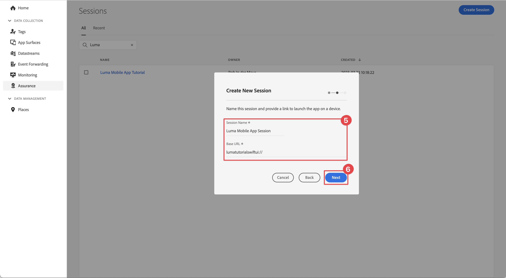

# Betrouwbaarheid instellen

Leer hoe u Adobe Experience Platform Assurance instelt in een mobiele app.

De borging, die formeel Project Griffon wordt genoemd, wordt ontworpen om u te helpen inspecteren, beproeven, simuleren, en bevestigen hoe u gegevens verzamelt of ervaringen in uw mobiele app dient.

Met de optie Betrouwbaarheid kunt u onbewerkte SDK-gebeurtenissen controleren die zijn gegenereerd door de Adobe Experience Platform Mobile SDK. Alle gebeurtenissen die door de SDK worden verzameld, zijn beschikbaar voor inspectie. SDK-gebeurtenissen worden geladen in een lijstweergave, gesorteerd op tijd. Elke gebeurtenis heeft een gedetailleerde weergave met meer details. Er worden ook extra weergaven geboden voor het bladeren in de SDK-configuratie, gegevenselementen, Gedeelde statussen en SDK-extensieversies. Leer meer over de [ Verzekering ](https://experienceleague.adobe.com/docs/experience-platform/assurance/home.html?lang=nl-NL) in de productdocumentatie.


## Vereisten

* De app is geïnstalleerd en geconfigureerd met SDK&#39;s.

## Leerdoelstellingen

In deze les zult u:

* Bevestig dat uw organisatie toegang heeft (en verzoek het als u niet).
* Stel de basis-URL in.
* Voeg de vereiste iOS-specifieke code toe.
* Maak verbinding met een sessie.

## Toegang bevestigen

Bevestig dat uw organisatie toegang tot Verzekering heeft. U moet als gebruiker aan het profiel voor Adobe Experience Platform worden toegevoegd. Zie {de toegang van 0} Gebruiker [&#128279;](https://experienceleague.adobe.com/docs/experience-platform/assurance/user-access.html?lang=nl-NL) in de gids van de Verzekering voor meer informatie.

## Implementeren

Naast de algemene [ installatie van SDK ](install-sdks.md), voltooide u in de vroegere les, vereist iOS ook de volgende toevoeging om de zitting van de Verzekering voor uw app te beginnen.

1. Navigeer naar **[!DNL Luma]** > **[!DNL Luma]** > **[!UICONTROL SceneDelegate]** in de projectnavigator van uw Xcode.

1. Voeg de volgende code toe aan `func scene(_ scene: UIScene, openURLContexts URLContexts: Set<UIOpenURLContext>` :

   ```swift
   // Called when the app in background is opened with a deep link.
   if let deepLinkURL = URLContexts.first?.url {
       // Start the Assurance session
       Assurance.startSession(url: deepLinkURL)
   }
   ```

   Met deze code wordt een verzekeringssessie gestart wanneer de toepassing op de achtergrond wordt uitgevoerd en via een diepe koppeling wordt geopend.

Meer informatie kan [ hier ](https://developer.adobe.com/client-sdks/documentation/platform-assurance-sdk/api-reference/){target="_blank"}  worden gevonden.


## Bbundle-id definiëren

U moet een unieke bundle-id opgeven voor uw app.

1. Open het project in Xcode.
1. Selecteer **[!DNL Luma]** in de projectnavigator.
1. Selecteer het doel **[!DNL Luma]** .
1. Selecteer het **Ondertekenen &amp; Capabilities** lusje.
1. Definieer een **[!UICONTROL Bundle Identifier]** .

   >[!IMPORTANT]
   >
   >Verzeker u a _uniek_ bundelherkenningsteken gebruikt en vervang het `com.adobe.luma.tutorial.swiftui` bundelherkenningsteken, aangezien elk bundelherkenningsteken uniek moet zijn. Gewoonlijk gebruikt u een omgekeerde DNS-indeling voor bundle ID-tekenreeksen, zoals `com.organization.brand.uniqueidentifier` . De voltooide versie van deze zelfstudie gebruikt bijvoorbeeld `com.adobe.luma.tutorial.swiftui` .


   {zoomable="yes"}


## Een basis-URL instellen

1. Ga naar uw project in Xcode.
1. Selecteer **[!DNL Luma]** in de projectnavigator.
1. Selecteer het doel **[!DNL Luma]** .
1. Selecteer het **Info** lusje.
1. Om een basis URL toe te voegen, scrol neer aan **Types URL** en selecteer **+** knoop.
1. Plaats **Herkenningsteken** aan het Herkenningsteken van de Bundel van uw keus en plaats a **regelingen URL** van uw keus.

   

   >[!IMPORTANT]
   >
   >Verzeker u a _uniek_ bundelherkenningsteken gebruikt en vervang het `com.adobe.luma.tutorial.swiftui` bundelherkenningsteken, aangezien elk bundelherkenningsteken uniek moet zijn. Gewoonlijk gebruikt u een omgekeerde DNS-indeling voor bundle ID-tekenreeksen, zoals `com.organization.brand.uniqueidentifier` . U kunt het zelfde bundelherkenningsteken gebruiken dat u bij [ hebt gebruikt bepaalt bundelherkenningsteken ](#define-bundle-identifier).<br/> Op dezelfde manier gebruik een uniek schema URL, en vervang reeds verstrekt `lumatutorialswiftui` met uw uniek schema URL.

Meer over regelingen URL in iOS leren, herzie [ de documentatie van Apple ](https://developer.apple.com/documentation/xcode/defining-a-custom-url-scheme-for-your-app){target="_blank"} .

De verzekering werkt door een URL, of via browser of QR code te openen. Die URL begint met de basis-URL die de app opent en aanvullende parameters bevat. Deze unieke parameters worden gebruikt om de sessie te verbinden.


## Verbinding maken met een sessie

In Xcode:

1. Bouw of herbouwt en stel app in de simulator of op een fysiek apparaat van Xcode in werking, gebruikend .

   >[!TIP]
   >
   >U kunt desgewenst uw build &#39;opschonen&#39;, vooral wanneer u onverwachte resultaten ziet. Selecteer hiervoor **[!UICONTROL Clean Build Folder…]** in het menu Xcode **[!UICONTROL Product]** .


1. Selecteer **[!UICONTROL Allow While Using App]** in het dialoogvenster **[!UICONTROL Allow "Luma App" to use your location]** .

   

1. Selecteer **[!UICONTROL Allow]** in het dialoogvenster **[!UICONTROL "Luma App" Would Like to Send You Notifications]** .

   

1. Selecteer **[!UICONTROL Continue…]** om toe te staan dat de app uw activiteiten bijhoudt.

   

1. Selecteer **[!UICONTROL Allow]** in het dialoogvenster **[!UICONTROL Allow "Luma App" to track your activity across other companies' apps and websites]** .

   


In uw browser:

1. Ga naar de interface voor gegevensverzameling.
1. Selecteer **[!UICONTROL Assurance]** in het linkerspoor.
1. Selecteer **[!UICONTROL Create Session]**.
1. Selecteer **[!UICONTROL Start]**.
1. Geef een **[!UICONTROL Session Name]** zoals `Luma Mobile App Session` en **[!UICONTROL Base URL]** op. Dit zijn de URL-schema&#39;s die u in Xcode hebt ingevoerd, gevolgd door `://` Bijvoorbeeld: `lumatutorialswiftui://`
1. Selecteer **[!UICONTROL Next]**.
   
1. In het modale dialoogvenster **[!UICONTROL Create New Session]** :

   Als u een fysiek apparaat gebruikt:

   * Selecteer **[!UICONTROL Scan QR Code]**. Als u de app wilt openen, gebruikt u de camera op het fysieke apparaat om de QR-code te scannen en tikt u op de koppeling.

     

   Als u een simulator gebruikt:

   1. Selecteer **[!UICONTROL Copy Link]**.
   1. Kopieer de diepe verbinding gebruikend  en gebruik de diepe verbinding om app met Safari in de simulator te openen.

      

1. Wanneer de app wordt geladen, ziet u een modaal dialoogvenster waarin u wordt gevraagd de pincode in te voeren die in stap 7 wordt getoond.

   

   Voer de pincode in en selecteer **[!UICONTROL Connect]** .


1. Als de verbinding tot stand is gebracht, ziet u:
   * Er zweeft een verzekeringspictogram boven op uw app.

     

   * De updates van het Experience Cloud die door in Assurance UI komen, die tonen:

      1. Ervaar gebeurtenissen die afkomstig zijn uit de app.
      1. Details van een geselecteerde gebeurtenis.
      1. Het apparaat en de tijdlijn.

         

Als u in om het even welke uitdagingen loopt, herzie [ technisch ](https://developer.adobe.com/client-sdks/documentation/platform-assurance-sdk/){target="_blank"}  en [ algemene documentatie ](https://experienceleague.adobe.com/docs/experience-platform/assurance/home.html?lang=nl-NL){target="_blank"} .


## Extensies verifiëren

Om te controleren of uw app de meest actuele extensies gebruikt:

1. Selecteer **[!UICONTROL Configure]**.

1. Selecteer  voor  **[!UICONTROL Extension Versions]**.

1. Selecteer **[!UICONTROL Save]**.

   

1. Selecteer  **[!UICONTROL Extension Versions]** om een overzicht van de recentste beschikbare uitbreidingen en de uitbreidingen te zien die in uw versie van app worden gebruikt.

   

1. Als u uw extensieversies wilt bijwerken (bijvoorbeeld **[!UICONTROL Messaging]** en **[!UICONTROL Optimize]** ), selecteert u het pakket (de extensie) in **[!UICONTROL Package Dependencies]** (bijvoorbeeld **[!UICONTROL AEPMessaging]** ) en selecteert u **[!UICONTROL Update Package]** in het contextmenu. Xcode werkt de pakketafhankelijkheden bij.


>[!NOTE]
>
>Zodra u uw uitbreidingen (pakketten) in Xcode hebt bijgewerkt, sluit en schrapt uw huidige zitting en herhaalt alle stappen van [ die met een zitting ](#connecting-to-a-session) verbinden en [ verifiëren uitbreidingen ](#verify-extensions) om de verzekering behoorlijk te verzekeren meldt de correcte uitbreidingen in een nieuwe zitting van de Verzekering.


>[!SUCCESS]
>
>U hebt nu een app ingesteld om Verzekering te gebruiken voor de rest van de zelfstudie.
>
>Bedankt dat u tijd hebt geïnvesteerd in het leren van Adobe Experience Platform Mobile SDK. Als u vragen hebt, algemene terugkoppelen willen delen, of suggesties over toekomstige inhoud hebben, hen op deze [ Communautaire besprekingspost van de Experience League ](https://experienceleaguecommunities.adobe.com/t5/adobe-experience-platform-data/tutorial-discussion-implement-adobe-experience-cloud-in-mobile/td-p/443796) delen


Volgende: **[voer Toestemming](consent.md)** uit
