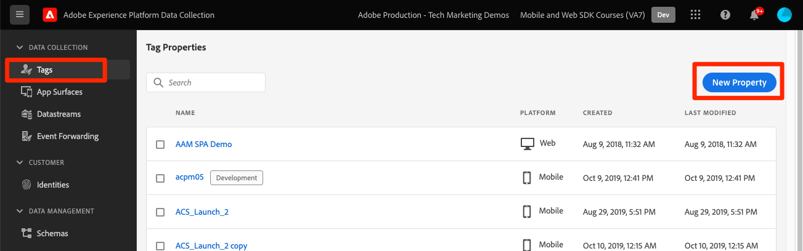
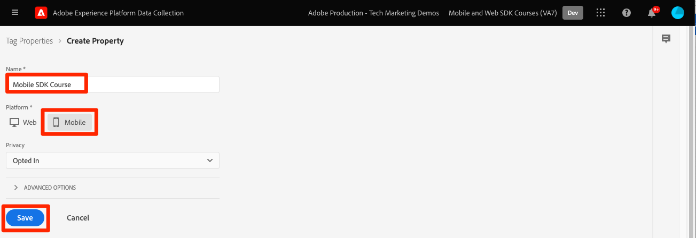
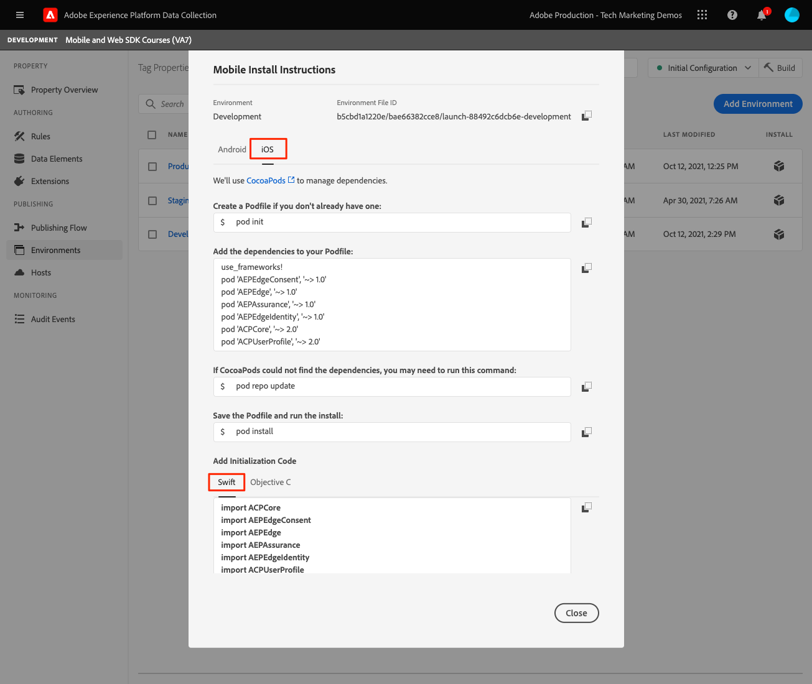

# Een eigenschap voor een tag configureren

Leer hoe u een eigenschap tag in het dialoogvenster [!UICONTROL Gegevensverzameling] interface.

>[!INFO]
>
> Deze zelfstudie wordt eind november 2023 vervangen door een nieuwe zelfstudie met een nieuwe mobiele voorbeeldtoepassing

Tags in Adobe Experience Platform zijn de volgende generatie mogelijkheden voor tagbeheer van Adobe. Met labels kunnen klanten eenvoudig alle analytische, marketing- en advertentietags implementeren en beheren die nodig zijn om relevante klantervaringen te stimuleren. Meer informatie over [tags](https://experienceleague.adobe.com/docs/experience-platform/tags/home.html?lang=nl) in de productdocumentatie.

## Vereisten

Om de les te voltooien, moet u toestemming hebben om een markeringsbezit tot stand te brengen. Het is ook nuttig om basislijninzicht in markeringen te hebben.

>[!NOTE]
>
> Platform launch (clientzijde) is nu [tags](https://experienceleague.adobe.com/docs/experience-platform/tags/home.html?lang=en)

## Leerdoelstellingen

In deze les zult u:

* Installeer en configureer de extensies voor mobiele tags.
* Genereer de SDK-installatie-instructies.

## Eerste configuratie

1. Een nieuwe eigenschap voor mobiele tags maken:
   1. In de [Interface voor gegevensverzameling](https://experience.adobe.com/data-collection/){target="_blank"}, selecteert u **[!UICONTROL Tags]** in de linkernavigatie
   1. Selecteren **[!UICONTROL Nieuwe eigenschap]**
      .
   1. Voor de **[!UICONTROL Naam]**, enter `Mobile SDK Course`.
   1. Voor de **[!UICONTROL Platform]**, selecteert u **[!UICONTROL Mobiel]**.
   1. Selecteren  **[!UICONTROL Opslaan]**.

      

      >[!NOTE]
      >
      > Standaardinstellingen voor toestemming voor de op randen gebaseerde mobiele SDK-implementaties, zoals de instellingen die u in deze zelfstudie uitvoert, zijn afkomstig uit de [!UICONTROL Toegestane extensie] en niet de [!UICONTROL Privacy] het plaatsen in de configuratie van het markeringsbezit. U zult de uitbreiding van de Toestemming later in deze les toevoegen en vormen. Zie voor meer informatie [de documentatie](https://developer.adobe.com/client-sdks/documentation/privacy-and-gdpr/).

1. De nieuwe eigenschap openen
1. Een bibliotheek maken:

   1. Ga naar **[!UICONTROL Publishing Flow]** in de linkernavigatie.
   1. Selecteren **[!UICONTROL Bibliotheek toevoegen]**.

      

   1. Voor de **[!UICONTROL Naam]**, enter `Initial Build`.
   1. Voor de **[!UICONTROL Omgeving]**, selecteert u **[!UICONTROL Ontwikkeling]**.
   1. Selecteren  **[!UICONTROL Alle gewijzigde bronnen toevoegen]**.
   1. Selecteren **[!UICONTROL Opslaan en samenstellen tot ontwikkeling]**.

      

   1. Tot slot plaatst het als uw **[!UICONTROL Werkbibliotheek]**.
      
1. Selecteren **[!UICONTROL Extensies]**.

   De mobiele Core- en profielextensies moeten vooraf worden geïnstalleerd.

1. Selecteren **[!UICONTROL Catalogus]**.

   

1. Gebruik de [!UICONTROL Zoeken] om de volgende extensies te zoeken en te installeren. Geen van deze extensies vereist configuratie:
   * Identiteit
   * AEP-betrouwbaarheid

## Extensieconfiguratie

1. Installeer de **Toestemming** extensie.

   In deze zelfstudie selecteert u **[!UICONTROL In behandeling]**. Meer informatie over de extensie Goedkeuring in [de documentatie](https://developer.adobe.com/client-sdks/documentation/consent-for-edge-network/).

   

1. Installeer de **Adobe Experience Platform Edge Network** extensie.

   In de **[!UICONTROL Edge-configuratie]** selecteert u de gegevensstroom die u in het dialoogvenster [vorige stap](create-datastream.md).

1. Selecteren **[!UICONTROL Opslaan in bibliotheek en samenstellen]**.

   

## SDK-installatie-instructies genereren

1. Selecteren **[!UICONTROL Omgevingen]**.

1. Selecteer de **[!UICONTROL Ontwikkeling]** installatiepictogram

   

1. Selecteren **[!UICONTROL iOS]**.

1. Selecteren **[!UICONTROL Swift]**.

   

1. De installatieinstructies bieden u een goed beginpunt voor de implementatie.

   Meer informatie vindt u [hier](https://developer.adobe.com/client-sdks/documentation/getting-started/get-the-sdk/).

   * **[!UICONTROL Omgevingsbestand-id]**: Deze unieke id verwijst naar uw ontwikkelomgeving en noteert deze waarde. Productie/Staging/Ontwikkeling hebben allemaal verschillende id-waarden.
   * **[!UICONTROL Podfile]**: CocoaPods wordt gebruikt om SDK-versies en -downloads te beheren. Voor meer informatie raadpleegt u de [documentatie](https://cocoapods.org/).
   * **[!UICONTROL Initialisatiecode]**: Dit codeblok laat zien hoe u de vereiste SDK&#39;s kunt importeren en de extensies kunt registreren bij het starten.

>[!NOTE]
>De installatie-instructies moeten worden beschouwd als een beginpunt en niet als definitieve documentatie. De meest recente SDK-versies en codevoorbeelden vindt u in de officiële [documentatie](https://developer.adobe.com/client-sdks/documentation/).

## Architectuur van mobiele tags

Als u bekend bent met de webversie van tags, voorheen Starten, is het belangrijk dat u de verschillen op mobiele apparaten begrijpt.

Op het web wordt een eigenschap tag gerenderd in JavaScript, die vervolgens (gewoonlijk) wordt gehost in de cloud. Er wordt rechtstreeks in de website naar dat JS-bestand verwezen.

In een eigenschap voor mobiele tags worden regels en configuraties gerenderd in JSON-bestanden die worden gehost in de cloud. De JSON-bestanden worden gedownload en gelezen door de Mobile Core-extensie in de mobiele app. Extensies zijn afzonderlijke SDK&#39;s die samenwerken. Als u een extensie toevoegt aan de eigenschap tag, moet u de app ook bijwerken. Als u een extensie-instelling wijzigt of een regel maakt, worden deze wijzigingen doorgevoerd in de app nadat u de bijgewerkte tagbibliotheek hebt gepubliceerd.

Volgende: **[SDK&#39;s installeren](install-sdks.md)**

>[!NOTE]
>
>Bedankt dat u tijd hebt geïnvesteerd in het leren van Adobe Experience Platform Mobile SDK. Als u vragen hebt, algemene feedback wilt delen of suggesties voor toekomstige inhoud wilt hebben, deelt u deze over deze [Experience League Communautaire discussiestuk](https://experienceleaguecommunities.adobe.com/t5/adobe-experience-platform-data/tutorial-discussion-implement-adobe-experience-cloud-in-mobile/td-p/443796)