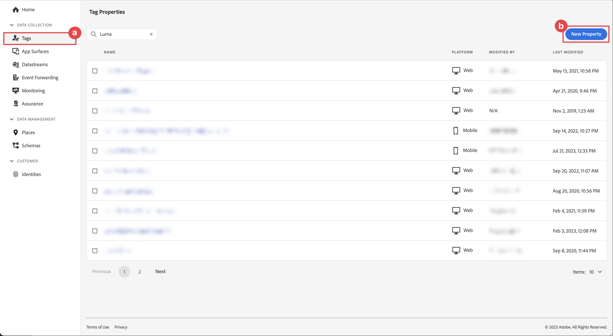

# Een eigenschap voor een tag configureren

Leer hoe u een eigenschap tag in de interface [!UICONTROL Data Collection] configureert.

Tags in Adobe Experience Platform zijn de volgende generatie mogelijkheden voor tagbeheer van Adobe. Met labels kunnen klanten eenvoudig analyses, marketing en advertentietags implementeren en beheren die nodig zijn om relevante klantervaringen te stimuleren. Leer meer over [ Markeringen ](https://experienceleague.adobe.com/docs/experience-platform/tags/home.html?lang=nl) in de productdocumentatie.

## Vereisten

Om de les te voltooien, moet u toestemming hebben om een markeringsbezit tot stand te brengen. Het is ook nuttig om basislijninzicht in markeringen te hebben.

>[!NOTE]
>
> Platform launch (Kant van de Cliënt) is nu [ Markeringen ](https://experienceleague.adobe.com/docs/experience-platform/tags/home.html?lang=nl-NL)

## Leerdoelstellingen

In deze les zult u:

* Installeer en configureer de extensies voor mobiele tags.
* Genereer de SDK-installatie-instructies.

## Eerste configuratie

1. Maak een nieuwe eigenschap voor mobiele tags in de interface voor gegevensverzameling:
   1. Selecteer **[!UICONTROL Tags]** in de linkernavigatie.
   1. Selecteren **[!UICONTROL New Property]**

      .
   1. Voer bij **[!UICONTROL Name]** `Luma Mobile App Tutorial` in.
   1. Selecteer **[!UICONTROL Mobile]** voor **[!UICONTROL Platform]** .
   1. Selecteer **[!UICONTROL Save]** .

      

      >[!NOTE]
      >
      > Standaardinstellingen voor toestemming voor de op randen gebaseerde mobiele SDK-implementaties, zoals de implementatie die u in deze les uitvoert, zijn afkomstig uit de [!UICONTROL Consent extension] -instelling en niet uit de [!UICONTROL Privacy] -instelling in de configuratie van de eigenschap Tag. U voegt en vormt de uitbreiding van de Toestemming later in deze les toe. Voor meer info, zie [ de documentatie ](https://developer.adobe.com/client-sdks/edge/consent-for-edge-network/).

1. Open de nieuwe eigenschap.
1. Een bibliotheek maken:

   1. Ga naar **[!UICONTROL Publishing Flow]** in de linkernavigatie.
   1. Selecteer **[!UICONTROL Add Library]**.

       toe

   1. Voer bij **[!UICONTROL Name]** `Initial Build` in.
   1. Selecteer **[!UICONTROL Development (development)]** voor **[!UICONTROL Environment]** .
   1. Selecteer  **[!UICONTROL Add All Changed Resources]**.
   1. Selecteer **[!UICONTROL Save and Build to Development]**.

      

   1. Selecteer ten slotte **[!UICONTROL Initial Build]** als werkbibliotheek in het menu **[!UICONTROL Select a working library]** .

      
1. Extensies controleren:

   1. Zorg ervoor dat **[!UICONTROL Initial Build]** is geselecteerd als standaardbibliotheek.

   1. Selecteer **[!UICONTROL Extensions]** in het linkerspoor.

   1. Selecteer het tabblad **[!UICONTROL Installed]**. 

      De extensies [!UICONTROL Mobile Core] en [!UICONTROL Profile] moeten vooraf zijn geïnstalleerd.

      

## Extensieconfiguratie

1. Zorg ervoor dat u zich in **[!UICONTROL Extensions]** bevindt binnen de eigenschap voor uw mobiele app.

1. Selecteer **[!UICONTROL Catalog]**.

   

1. Gebruik het  **[!UICONTROL Search]** het vinden van de **uitbreiding van de Identiteit**.

   1. Zoeken naar `Identity` .

   2. Selecteer de extensie **[!UICONTROL Identity]** .

   3. Selecteer **[!UICONTROL Install]**.

      

   Voor deze extensie is geen verdere configuratie vereist.

1. Gebruik het  **[!UICONTROL Search]** om de **Verzekering AEP** uitbreiding te vinden en te installeren.

   Voor deze extensie is geen verdere configuratie vereist.

1. Gebruik het  **[!UICONTROL Search]** om de **toestemming** uitbreiding te vinden en te installeren. In het configuratiescherm:

   1. Selecteer **[!UICONTROL Pending]**. In deze zelfstudie beheert u de toestemming verder in de toepassing. Leer meer over de uitbreiding van de Toestemming in [ de documentatie ](https://developer.adobe.com/client-sdks/documentation/consent-for-edge-network/).
   1. Selecteer **[!UICONTROL Save to Library]**.

      

1. Gebruik het  **[!UICONTROL Search]** om de **Edge Network van Adobe Experience Platform** uitbreiding te vinden en te installeren.

   1. In **[!UICONTROL Datastreams]** selecteer **[!UICONTROL Datastream]** dat u in de [ vorige stap ](create-datastream.md) voor elk van de milieu&#39;s, bijvoorbeeld **[!DNL Luma Mobile App]** creeerde.

   1. Als deze nog niet is gevuld, geeft u de **[!UICONTROL Edge Network domain]** within **[!UICONTROL Domain Configuration]** op. Het domein Edge Network is de naam van uw organisatie, gevolgd door `data.adobedc.net`, bijvoorbeeld `techmarketingdemos.data.adobedc.net` .

   1. Selecteer **[!UICONTROL Save to Library and Build]** in het menu **[!UICONTROL Save to Library]** .

      

Uw bibliotheek is gemaakt voor de nieuwe extensies en configuraties. Een succesvolle bouwstijl wordt aangewezen door a  ・  in de **[!UICONTROL Initial Build]** knoop.

## SDK-installatie-instructies genereren

1. Selecteer **[!UICONTROL Environments]** in het linkerspoor.

1. Selecteer **[!UICONTROL Development]** installeer pictogram .

   

1. Selecteer de tab **[!UICONTROL iOS]** in het dialoogvenster **[!UICONTROL Mobile Install Instructions]** .

1. U kunt  de instructies aan opstelling uw project kopiëren gebruikend CocoaPods. CocoaPods worden gebruikt om SDK-versies en -downloads te beheren. Om meer te leren, te herzien gelieve de [ documentatie CocoaPods ](https://cocoapods.org/). Als u Android™ als ontwikkelingsplatform gebruikt, is Gradle het hulpmiddel om de versie van SDK, downloads, en gebiedsdelen te beheren. Om meer te leren, te herzien gelieve de [ documentatie van de Gradle ](https://gradle.org/)

   De installatieinstructies bieden u een goed beginpunt voor de implementatie. U kunt extra informatie [ hier ](https://developer.adobe.com/client-sdks/documentation/getting-started/get-the-sdk/) vinden.

   >[!INFO]
   >
   >Voor de rest van dit leerprogramma, zult u **&#x200B;**&#x200B;niet de instructies CocoaPods gebruiken maar in plaats daarvan een inheemse Swift gebaseerde Opstelling van de Manager van het Pakket (SPM) gebruiken.
   >

1. Selecteer de tab **[!UICONTROL Swift]** onder **[!UICONTROL Add Initialization Code]** . Dit codeblok laat zien hoe u de vereiste SDK&#39;s kunt importeren en de extensies kunt registreren bij het starten. Dit wordt behandeld meer in detail in [ installeert SDKs ](install-sdks.md).

1. Het exemplaar  **[!UICONTROL Environment File ID]** en slaat het op een plaats op aangezien u het later nodig hebt. Deze unieke id verwijst naar uw ontwikkelomgeving. Elke omgeving (Productie, Staging, Ontwikkeling) heeft zijn eigen unieke id-waarde.

   

>[!NOTE]
>
>De installatie-instructies moeten worden beschouwd als een beginpunt en niet als definitieve documentatie. De recentste versies van SDK en codesteekproeven kunnen in de officiële [ documentatie ](https://developer.adobe.com/client-sdks/home/) worden gevonden.

## Architectuur van mobiele tags

Als u bekend bent met de webversie van Tags, voorheen Starten, is het belangrijk dat u de verschillen op mobiele apparaten begrijpt.

* Op het web wordt een tag-eigenschap gerenderd naar JavaScript die vervolgens (gewoonlijk) wordt gehost in de cloud. Er wordt rechtstreeks in de website naar dat JavaScript-bestand verwezen.

* In een eigenschap voor mobiele tags worden regels en configuraties gerenderd in JSON-bestanden die worden gehost in de cloud. De JSON-bestanden worden gedownload en gelezen door de Mobile Core-extensie in de mobiele app. Extensies zijn afzonderlijke SDK&#39;s die samenwerken. Als u een extensie toevoegt aan de eigenschap tag, moet u de app ook bijwerken. Als u een extensie-instelling wijzigt of een regel maakt, worden deze wijzigingen doorgevoerd in de app nadat u de bijgewerkte tagbibliotheek hebt gepubliceerd. Dankzij deze flexibiliteit kunt u instellingen wijzigen (zoals de id van Adobe Analytics-rapportsuite) of zelfs het gedrag van uw app wijzigen (met gegevenselementen en regels, zoals u in latere lessen zult zien) zonder dat u code hoeft te wijzigen in uw app en de App Store opnieuw hoeft in te dienen.

>[!SUCCESS]
>
>U kunt nu een eigenschap voor mobiele tags gebruiken in de rest van deze zelfstudie.
>
>Bedankt dat u tijd hebt geïnvesteerd in het leren van Adobe Experience Platform Mobile SDK. Als u vragen hebt, algemene terugkoppelen willen delen, of suggesties over toekomstige inhoud hebben, hen op deze [ Communautaire besprekingspost van de Experience League ](https://experienceleaguecommunities.adobe.com/t5/adobe-experience-platform-data/tutorial-discussion-implement-adobe-experience-cloud-in-mobile/td-p/443796) delen

Volgende: **[installeer SDKs](install-sdks.md)**
