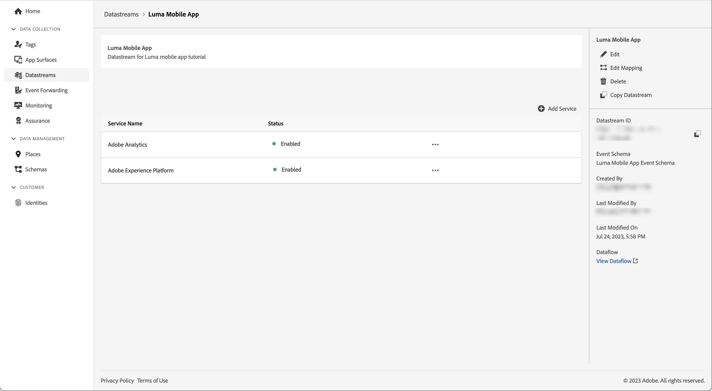

# Een gegevensstroom maken

Leer hoe u een gegevensstroom in Experience Platform maakt.

Een gegevensstroom is een server-zijconfiguratie op de Edge Network van het Platform. De gegevensstroom zorgt ervoor dat de inkomende gegevens aan de Edge Network van het Platform aan de toepassingen en de diensten van Adobe Experience Cloud geschikt worden verpletterd. Voor meer informatie, zie de [ documentatie ](https://experienceleague.adobe.com/docs/experience-platform/datastreams/overview.html) of deze [ video ](https://experienceleague.adobe.com/docs/platform-learn/data-collection/edge-network/configure-datastreams.html).

## Vereisten

Om een gegevensstroom tot stand te brengen, moet uw organisatie voor deze eigenschap in de interface van de Inzameling van Gegevens (vroeger [!UICONTROL Launch]) worden provisioned en u moet gebruikerstoestemmingen hebben gegevensstromen beheren en bekijken.

## Leerdoelstellingen

In deze les zult u:

* Weet wanneer u een gegevensstroom wilt gebruiken.
* Maak een gegevensstroom.
* Configureer een gegevensstroom.

## Een gegevensstroom maken

Gegevensstromen kunnen in de [!UICONTROL Data Collection] interface worden gecreeerd gebruikend het [!UICONTROL Datastream] configuratiehulpmiddel. Een gegevensstroom maken:

1. Zorg ervoor dat u zich in de juiste sandbox met Experience Platforms bevindt, aangezien gegevensstreams op sandboxniveau zijn gedefinieerd.
1. Selecteer **[!UICONTROL Datastreams]** in het linkerspoor.
1. Selecteer **[!UICONTROL New Datastream]**.

   

1. Geef bijvoorbeeld een **[!UICONTROL Name]** `Luma Mobile App` en een **[!UICONTROL Description]** `Datastream for Luma Mobile App` op.

   >[!NOTE]
   >
   >Laatste herinnering: als u deze zelfstudie doorloopt met meerdere personen in één sandbox of als u een gedeelde account gebruikt, kunt u overwegen een identificatie toe te voegen of voor te bereiden als onderdeel van uw naamgevingsconventies. Gebruik bijvoorbeeld `Luma Mobile App Event Dataset - Joe Smith` in plaats van `Luma Mobile App Event Dataset` . Zie ook de nota in [ Overzicht ](overview.md).

1. Selecteer het schema dat u in de vorige les van het **Schema van de Gebeurtenis** lijst creeerde.
1. Selecteer **[!UICONTROL Save]**.

   

## Services toevoegen

Wanneer u door de (facultatieve) [ Analytics ](analytics.md) en [ Experience Platform ](platform.md) lessen in dit leerprogramma gaat, voegt u de diensten aan uw gegevensstroom toe zodat de gegevens die naar de Edge Network van het Platform worden verzonden door:sturen naar deze toepassingen.

<!--

### Adobe Analytics

1. Select **[!UICONTROL Add Service]**.

1. Add **[!UICONTROL Adobe Analytics]** from the [!UICONTROL Service] list, 

1. Enter the name of the report site that you want to use in **[!UICONTROL Report Suite ID]**.

1. Enable the service by switching **[!UICONTROL Enabled]** on.

1. Select **[!UICONTROL Save]**.

   

### Adobe Experience Platform

You might also want to enable the Adobe Experience Platform service. 

>[!IMPORTANT]
>
>You can only enable the Adobe Experience Platform service when having created an event dataset. If you don't already have an event dataset created, follow the instructions [here](platform.md).

1. Click  **[!UICONTROL Add Service]** to add another service.

1. Select **[!UICONTROL Adobe Experience Platform]** from the [!UICONTROL Service] list.

1. Enable the service by switching **[!UICONTROL Enabled]** on.

1. Select the **[!UICONTROL Event Dataset]** that you created as part of the [Create a dataset](platform.md#create-a-dataset) instructions, for example **Luma Mobile App Event Dataset**

1. Select **[!UICONTROL Save]**.

   
1. The final configuration should look something like this.
   
   

-->

>[!NOTE]
>
>Als u alle services inschakelt die uw organisatie gebruikt, zorgt u ervoor dat gegevens die in de mobiele app zijn verzameld, overal kunnen worden gebruikt. Voor meer informatie over gegevensstroommontages, herzie de documentatie [ hier ](https://experienceleague.adobe.com/docs/experience-platform/datastreams/overview.html).

Wanneer u Platform Mobile SDK implementeert in uw eigen app, moet u uiteindelijk drie gegevensstreams maken om toe te wijzen aan uw drie tagomgevingen (ontwikkeling, werkgebied en productie). Als u Platform Mobile SDK met op platform-gebaseerde toepassingen zoals Adobe Real-time Customer Data Platform of Adobe Journey Optimizer gebruikt, zou u zeker moeten zijn om die gegevensstromen in de aangewezen zandbakken tot stand te brengen.

>[!SUCCESS]
>
>U hebt nu een gegevensstroom voor de rest van de zelfstudie te gebruiken.
>
>Bedankt dat u tijd hebt geïnvesteerd in het leren van Adobe Experience Platform Mobile SDK. Als u vragen hebt, algemene terugkoppelen willen delen, of suggesties over toekomstige inhoud hebben, hen op deze [ Communautaire besprekingspost van de Experience League ](https://experienceleaguecommunities.adobe.com/t5/adobe-experience-platform-data/tutorial-discussion-implement-adobe-experience-cloud-in-mobile/td-p/443796) delen

Volgende: **[vorm een markeringsbezit](configure-tags.md)**
