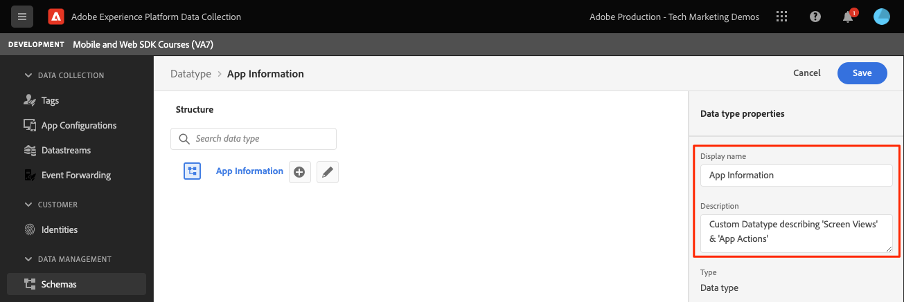

# Een XDM-schema maken

Leer hoe u een XDM-schema maakt voor mobiele toepassingsgebeurtenissen.

>[!INFO]
>
> Deze zelfstudie wordt eind november 2023 vervangen door een nieuwe zelfstudie met een nieuwe mobiele voorbeeldtoepassing

Standaardisering en interoperabiliteit zijn de belangrijkste concepten achter Adobe Experience Platform. Het Model van Gegevens van de ervaring (XDM), die door Adobe wordt gedreven, is een inspanning om de gegevens van de klantenervaring te standaardiseren en schema&#39;s voor het beheer van de klantenervaring te bepalen.

## Wat zijn XDM-schema&#39;s?

XDM is een openbaar gedocumenteerde specificatie die wordt ontworpen om de macht van digitale ervaringen te verbeteren. Het verstrekt gemeenschappelijke structuren en definities die om het even welke toepassing toestaan om met de diensten van het Platform te communiceren. Door zich aan de normen van XDM te houden, kunnen alle gegevens van de klantenervaring in een gemeenschappelijke vertegenwoordiging worden opgenomen die inzichten op een snellere, meer geïntegreerde manier kan leveren. U kunt waardevolle inzichten van klantenacties bereiken, klantenpubliek door segmenten bepalen, en klantenattributen voor verpersoonlijkingsdoeleinden uitdrukken.

Het Experience Platform gebruikt schema&#39;s om de structuur van gegevens op een verenigbare en herbruikbare manier te beschrijven. Door gegevens consistent in verschillende systemen te definiëren, wordt het eenvoudiger om betekenis te behouden en zo waarde te verkrijgen van gegevens.

Voordat gegevens in Platform kunnen worden opgenomen, moet een schema worden samengesteld om de gegevensstructuur te beschrijven en beperkingen te bieden aan het type gegevens dat binnen elk veld kan worden opgenomen. De schema&#39;s bestaan uit een basisklasse en nul of meer groepen van het schemagebied.

Voor meer informatie over het model van de schemacompositie, met inbegrip van ontwerpprincipes en beste praktijken, zie [grondbeginselen van de schemacompositie](https://experienceleague.adobe.com/docs/experience-platform/xdm/schema/composition.html?lang=en) of de cursus [Uw klantgegevens modelleren met XDM](https://experienceleague.adobe.com/?recommended=ExperiencePlatform-D-1-2021.1.xdm).

>[!TIP]
>
>Als u met de Verwijzing van het Ontwerp van de Oplossing van de Analyse vertrouwd bent (SDRs), kunt u aan een schema als robuustere SDR denken.

## Vereisten

Om de les te voltooien, moet u toestemming hebben om een schema van het Experience Platform tot stand te brengen.

## Leerdoelstellingen

In deze les zult u:

* Een schema maken in de interface voor gegevensverzameling
* Een standaardveldgroep toevoegen aan het schema
* Een aangepaste veldgroep maken en aan het schema toevoegen

## Naar schema&#39;s navigeren

1. Log in bij de Adobe Experience Cloud.

1. Open de app-switch en selecteer **[!UICONTROL Gegevensverzameling]**

   

1. Zorg ervoor dat u zich in de sandbox Experience Platform bevindt die u voor deze zelfstudie gebruikt.

   >[!NOTE]
   >
   > Klanten van platformgebaseerde toepassingen zoals Real-Time CDP dienen een ontwikkelingssandbox te gebruiken voor deze zelfstudie. Andere klanten gebruiken de standaardproductiesandbox.

1. Selecteren **[!UICONTROL Schemas]** krachtens **[!UICONTROL Gegevensbeheer]**.

   

U bevindt zich nu op de pagina met hoofdschema&#39;s en krijgt een lijst met bestaande schema&#39;s te zien. U kunt ook tabbladen zien die overeenkomen met de kernelementen van een schema:

* **Veldgroepen** zijn herbruikbare componenten die een of meer velden definiëren voor het vastleggen van specifieke gegevens, zoals persoonlijke gegevens, hotelvoorkeuren of adres.
* **Klassen** definieert de gedragsaspecten van de gegevens die het schema bevat. Bijvoorbeeld: `XDM ExperienceEvent` legt tijdreeksen, gebeurtenisgegevens en `XDM Individual Profile` vangt kenmerkgegevens over een individu.
* **Gegevenstypen** worden op dezelfde manier als letterlijke basisvelden gebruikt als referentieveldtypen in klassen of veldgroepen.

De bovenstaande beschrijvingen zijn een overzicht op hoog niveau. Zie voor meer informatie de [Bouwstenen voor schema](https://experienceleague.adobe.com/docs/platform-learn/tutorials/schemas/schema-building-blocks.html) video of lezen [Basisbeginselen van de schemacompositie](https://experienceleague.adobe.com/docs/experience-platform/xdm/schema/composition.html?lang=en) in de productdocumentatie.

In deze zelfstudie gebruikt u de vervolgkeuzelijst Consumer Experience Event en maakt u een aangepaste les om het proces aan te tonen.

>[!NOTE]
>
>De Adobe blijft meer standaardveldgroepen toevoegen en zij zouden waar mogelijk moeten worden gebruikt aangezien deze gebieden impliciet door de diensten van het Experience Platform worden begrepen en grotere consistentie verstrekken wanneer gebruikt over de componenten van het Platform. Het gebruik van standaardveldgroepen biedt tastbare voordelen, zoals automatische toewijzing in Analytics en AI-functies in Platform.

## Luma-toepassingsschemaarchitectuur

In een echt scenario, zou het proces van het schemaontwerp als dit kunnen kijken:

* Verzamel bedrijfsvereisten.
* Vooraf samengestelde veldgroepen zoeken die zoveel mogelijk vereisten dekken.
* Maak aangepaste veldgroepen voor eventuele tussenruimten.

Voor leerdoeleinden gebruikt u vooraf gebouwde en aangepaste veldgroepen.

* **Consumentenervaringsgebeurtenis**: Geïntegreerde veldgroep met veel voorkomende velden.
* **Toepassingsgegevens**: De veldgroep van de douane wordt ontworpen om concepten te simuleren TrackState/TrackAction Analytics die.

<!--Later in the tutorial, you can [update the schema](lifecycle-data.md) to include the **[!UICONTROL AEP Mobile Lifecycle Details]** field group.-->

## Een schema maken

1. Selecteren **[!UICONTROL Schema maken]** om het vervolgkeuzemenu met opties weer te geven, selecteert u **[!UICONTROL XDM ExperienceEvent]**.

   

1. Zoeken naar `Consumer Experience Event`.

1. U kunt de velden voorvertonen en/of de beschrijving lezen voor meer informatie voordat u selecteert.

1. Schakel het selectievakje in en **[!UICONTROL Veldgroepen toevoegen]**.

   

   U wordt teruggebracht naar het hoofdscherm van de schemacompositie waar u alle beschikbare gebieden kunt zien.

1. Geef uw schema een naam door te selecteren **[!UICONTROL Naamloos schema]** van linksboven en vervolgens een **[!UICONTROL Weergavenaam]** &amp; **[!UICONTROL Beschrijving]** bijvoorbeeld `Luma Tutorial Mobile` en `"Luma App" schema for Adobe Tutorial`

1. Selecteren **[!UICONTROL Opslaan]**.

   

>[!NOTE]
>
>Houd er rekening mee dat u niet alle velden in een groep hoeft te gebruiken. Als het nuttig is, kunt u aan een schema als lege gegevenslaag denken. In uw app vult u de relevante waarden op het juiste moment in.
>
>De `Consumer Experience Event` heeft een gegevenstype genaamd `Web information`, waarin gebeurtenissen zoals paginaweergave en koppelingsklikken worden beschreven. Op het moment van schrijven is er geen pariteit voor mobiele apps aan deze functie, dus gaat u uw eigen functie maken.

## Een aangepast gegevenstype maken

Eerst maakt u een aangepast gegevenstype waarin de twee gebeurtenissen worden beschreven:

* Schermweergave
* Toepassingsinteractie

1. Selecteer de **[!UICONTROL Gegevenstypen]** tab, dan selecteren **[!UICONTROL Gegevenstype maken]**.

   

1. Geef het een **[!UICONTROL Weergavenaam]** en **[!UICONTROL Beschrijving]** bijvoorbeeld `App Information` en `Custom data type describing "Screen Views" & "App Actions"`

   

   >[!TIP]
   >
   > Altijd leesbaar, beschrijvend gebruiken [!UICONTROL weergavenamen] voor uw douanegebieden, aangezien deze praktijk hen toegankelijker voor marketers maakt wanneer de gebieden in de stroomafwaartse diensten zoals de segmentbouwer overstijgen.

1. Selecteer de knop (+) om een veld toe te voegen.

   Dit veld is een containerobject voor toepassingsinteractie. Geef het een kamelentcase **[!UICONTROL Veldnaam]** `appInteraction`, **[!UICONTROL weergavenaam]** `App Interaction`, en **[!UICONTROL type]** `Object`.

1. Selecteren **[!UICONTROL Toepassen]**.

   

1. Als u wilt meten hoe vaak een actie is uitgevoerd, voegt u een veld toe door op de knop (+) naast de knop `appInteraction` door u gemaakt object.

1. Geef het een kamelentcase **[!UICONTROL Veldnaam]** `appAction`, **[!UICONTROL weergavenaam]** van `App Action` en **[!UICONTROL type]** `Measure`.

   Deze stap zou het equivalent zijn van een succesgebeurtenis in Adobe Analytics.

1. Selecteren **[!UICONTROL Toepassen]**.

   

1. Voeg een veld toe waarin het type interactie wordt beschreven door op de knop (+) naast de knop `appInteraction` object.

1. Geef het een **[!UICONTROL Veldnaam]** `name`, **[!UICONTROL weergavenaam]** van `Name` en **[!UICONTROL type]** `String`.

   Deze stap is het equivalent van een dimensie in Adobe Analytics.

   

1. Schuif naar de onderkant van de rechterrail en selecteer **[!UICONTROL Toepassen]**.

1. Volg hetzelfde patroon om een `appStateDetails` object met een veld Meetlat genaamd `screenView` en twee geroepen Koorden `screenName` en `screenType`.

1. Selecteren **[!UICONTROL Opslaan]**.

   

## Een aangepaste veldgroep toevoegen

Voeg nu een aangepaste veldgroep toe met behulp van het aangepaste gegevenstype:

1. Open het schema dat u eerder in deze les creeerde.

1. Selecteren **[!UICONTROL Toevoegen]** naast **[!UICONTROL Veldgroepen]**.

   

1. Deze keer maakt u een aangepaste veldgroep door de optie **[!UICONTROL Nieuwe veldgroep maken]** keuzerondje boven in het scherm, geef een naam en een beschrijving, bijvoorbeeld `App Interactions` en `Fields for app interactions`.

   

1. Van het belangrijkste samenstellingsscherm, voeg een gebied aan de wortel van het schema toe.

1. Selecteer de (+) naast de naam van het schema.

1. Geef in de rechterspoorlijn een **[!UICONTROL Veldnaam]** van `appInformation`, een weergavenaam van `App Information`.

1. Selecteren `App Information` van de **[!UICONTROL Type]** vervolgkeuzelijst, het gegevenstype dat u in de vorige oefening hebt gemaakt.

1. Selecteren **[!UICONTROL Toepassen]**.

   

>[!NOTE]
>
>Aangepaste veldgroepen worden altijd onder uw Experience Cloud-Org-id geplaatst.
>
>`_techmarketingdemos` wordt vervangen door de unieke waarde van uw organisatie.

U hebt nu een schema om voor de rest van het leerprogramma te gebruiken.

Volgende: **[Een [!UICONTROL datastream]](create-datastream.md)**

>[!NOTE]
>
>Bedankt dat u tijd hebt geïnvesteerd in het leren van Adobe Experience Platform Mobile SDK. Als u vragen hebt, algemene feedback wilt delen of suggesties voor toekomstige inhoud wilt hebben, deelt u deze over deze [Experience League Communautaire discussiestuk](https://experienceleaguecommunities.adobe.com/t5/adobe-experience-platform-data/tutorial-discussion-implement-adobe-experience-cloud-in-mobile/td-p/443796)