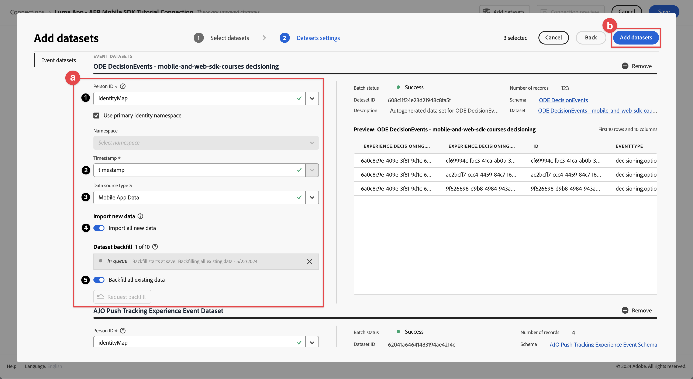

# Rapport en analyse met Customer Journey Analytics

Leer hoe u interacties tussen mobiele apps en Customer Journey Analytics kunt rapporteren en analyseren.

De gebeurtenisgegevens van de mobiele app, die u in eerdere lessen hebt verzameld en naar Platform Edge Network hebt verzonden, worden doorgestuurd naar de services die in uw gegevensstroom zijn geconfigureerd. Als u [ volgde verzendt gegevens naar Experience Platform ](platform.md) les, wordt dat gegeven nu opgeslagen in een dataset van Experience Platform en voor Customer Journey Analytics beschikbaar voor rapportering en analyse te gebruiken.

In tegenstelling tot Adobe Analytics, gebruikt Customer Journey Analytics ** gegevens van datasets die in Experience Platform worden gecreeerd. Gegevens worden niet rechtstreeks naar Customer Journey Analytics verzonden met de Adobe Experience Platform Mobile SDK, maar de gegevens worden naar gegevenssets verzonden. De verbindingen worden dan gevormd in Customer Journey Analytics om de datasets te selecteren u in uw rapportering en analyseprojecten zult gebruiken.

Deze les in de zelfstudie is gericht op het rapporteren en analyseren van de gegevens die zijn vastgelegd in de zelfstudie-app Luma. Een van de unieke mogelijkheden van Customer Journey Analytics is het combineren van gegevens uit meerdere bronnen (CRM, verkooppunt, loyaliteitstoepassing, callcenter) en kanalen (web, mobiel, offline) om diepgaande inzichten in klantreizen te kunnen krijgen. Dat vermogen is voorbij het werkingsgebied van deze les. Zie [ overzicht van Customer Journey Analytics ](https://experienceleague.adobe.com/en/docs/analytics-platform/using/cja-overview/cja-overview) voor meer informatie.

## Vereisten

Uw organisatie moet zijn voorzien van provisioning en toestemming verlenen voor Customer Journey Analytics. Beheerders moeten toegang hebben tot Customer Journey Analytics.

## Leerdoelstellingen

In deze les zult u:

- Maak een verbinding om de gegevenssets van Experience Platform te definiëren die u in Customer Journey Analytics wilt gebruiken.
- Creeer een gegevensmening om de gegevens van de datasets voor uw rapportering en analyse voor te bereiden
- Maak een project voor het samenstellen van rapporten en visualisaties, zodat u de gegevens van uw mobiele app kunt analyseren.

De reeks is opzettelijk. De verbindingen gebruiken datasets, en de gegevensmeningen gebruiken verbindingen.

## Verbinding maken

Een verbinding in Customer Journey Analytics bepaalt de datasets (en de gegevens binnen deze datasets) van Experience Platform die u voor rapportering en analyse wilt gebruiken.

1. Navigeer aan de interface van Customer Journey Analytics gebruikend Apps  menu in het hoogste recht.

1. Selecteer **[!UICONTROL Connections]** in de bovenste menubalk.

1. Selecteer het tabblad **[!UICONTROL List]** in de interface Verbindingen. Er wordt een lijst met bestaande verbindingen weergegeven.

1. Selecteer **[!UICONTROL Create new connection]**.

1. In het scherm **[!UICONTROL Connections]** > **[!UICONTROL Untitled connection]** , in **[!UICONTROL Connection settings]**

   1. Voer een **[!UICONTROL Connection name]** in, bijvoorbeeld `Luma App - AEP Mobile SDK Tutorial Connection` .
   2. Voer een **[!UICONTROL Connection description]** in, bijvoorbeeld `Connection for the Luma app used in the AEP Mobile SDK tutorial` .

      In **[!UICONTROL Data settings]**:

   3. Selecteer de sandbox die u hebt gebruikt om gegevens van uw mobiele app te verzamelen, bijvoorbeeld **[!UICONTROL Mobile and Web SDK Courses]** .
   4. Selecteer **[!UICONTROL less than 1 million]** in het menu **[!UICONTROL Average number of daily events]** .

   5. Selecteer **[!UICONTROL Add datasets]** om de datasets van Experience Platform te selecteren u in Customer Journey Analytics wilt gebruiken.

      {zoomable="yes"}

   6. Ga in de stap **[!UICONTROL Add datasets]** van de wizard **[!UICONTROL Select datasets]** naar:

      1. Selecteer de volgende gegevenssets:

         - **[!UICONTROL Luma Mobile App Event Dataset]**, de dataset u als deel van [ creeerde creeer een dataset ](platform.md#create-a-dataset) sectie in de les van Experience Platform.
         - **[!UICONTROL ODE DecisionEvents - *zandbaknaam *]besluit**
         - **[!UICONTROL AJO Push Tracking Event Datasets]**

      1. Selecteer **[!UICONTROL Next]**.

         {zoomable="yes"}

   7. In de **[!UICONTROL Add datasets]** tovenaar, **[!UICONTROL Datasets settings]** stap, moet u de details voor elk van de gebeurtenisdatasets bepalen.
      1. Zie de volgende lijsten voor de juiste opstelling:

         | Gegevensset | Persoon-id   | Tijdstempel   | ③ gegevensbron | Alle nieuwe ④ importeren | Back-up maken van alle bestaande ⑤ |
         |---|---|---|---|---|---|
         | Dataset voor Luma Mobile-toepassingsgebeurtenis | identityMap | tijdstempel | Mobiele toepassingsgegevens | enable | enable |
         | ODE DecisionEvents - *zandbaknaam* besluit | identityMap | tijdstempel | Mobiele toepassingsgegevens | enable | enable |
         | Dataset voor AJO Push Tracking Experience | identityMap | tijdstempel | Mobiele toepassingsgegevens | enable | enable |

      1. Selecteer **[!UICONTROL Add datasets]**.

         {zoomable="yes"}

1. Ga terug in **[!UICONTROL Connections]** > **[!UICONTROL Luma App - AEP Mobile SDK Tutorial Connection]** en selecteer **[!UICONTROL Save]** om uw verbinding op te slaan.

   {zoomable="yes"}

U hebt nu uw verbinding gedefinieerd en Customer Journey Analytics voegt de gegevens uit de datasets toe aan zijn eigen interne database. Deze gegevensverzameling kan enige tijd in beslag nemen, afhankelijk van de hoeveelheid gegevens. Voor uw zelfstudie-app verwacht u een paar uur voordat de gegevens in Customer Journey Analytics worden weergegeven.

U kunt als volgt de status van uw verbinding weergeven:

1. Selecteer **[!UICONTROL Connections]** in de hoofdinterface van Customer Journey Analytics.
1. Selecteer de naam van de verbinding, bijvoorbeeld **[!UICONTROL Luma App - AEP Mobile SDK Tutorial Connection]** .

In de lus **[!UICONTROL Connections]** > **[!UICONTROL Luma App - AEP Mobile SDK Tutorial Connection]** ziet u:

1. Informatie over het totaal aantal toegevoegde records, overgeslagen records en verwijderde records. Selecteer **[!UICONTROL All datasets]** en selecteer een geschikte tijdsperiode om details over uw verbinding weer te geven. U kunt  gebruiken om een dialoog te openen om de tijdspanne te selecteren.
1. Informatie voor individuele datasets over toegevoegde verslagen, overgeslagen verslagen, verslagen geschrapt, en meer.

   {zoomable="yes"}

## Een gegevensweergave maken

Nadat de verslagen van de datasets aan Customer Journey Analytics zijn toegevoegd, kunt u een gegevensmening tot stand brengen om te bepalen welke componenten van de gegevens u wilt melden.

Een gegevensweergave is een container specifiek voor Customer Journey Analytics waarmee u kunt bepalen hoe gegevens van een verbinding moeten worden geïnterpreteerd. U kunt standaard en schemagebieden van om het even welke datasets vormen die u in uw Verbinding als componenten (afmetingen, metriek) in Analysis Workspace hebt bepaald.

Een gegevensweergave in Customer Journey Analytics biedt enorme flexibiliteit bij het correct instellen en definiëren van de gegevens van uw verbinding. In deze zelfstudie gebruikt u alleen de functionaliteit die vereist is voor uw rapportage en analyse. Zie [ meningen van Gegevens ](https://experienceleague.adobe.com/en/docs/analytics-platform/using/cja-dataviews/data-views) voor meer informatie.

Uw gegevensweergave maken:

1. Navigeer aan de interface van Customer Journey Analytics gebruikend Apps  menu in het hoogste recht.

1. Selecteer **[!UICONTROL Data views]** in de bovenste menubalk.
1. Selecteer **[!UICONTROL Create new data view]**.
1. Controleer in **[!UICONTROL Data views >]** of de tab **[!UICONTROL Configure]** is geselecteerd.

   1. Selecteer bijvoorbeeld de verbinding in de vervolgkeuzelijst Verbinding met instellingen **[!UICONTROL Luma App - AEP Mobile SDK Tutorial Connection]** .
   1. Voer een naam in voor de gegevensweergave, bijvoorbeeld: `Luma App - AEP Mobile SDK Tutorial Data view` .
   1. Selecteer **[!UICONTROL Save and continue]**.

      {zoomable="yes"}

1. Op het tabblad **[!UICONTROL Components]** van het **[!UICONTROL Luma App - AEP Mobile SDK Tutorial Data view]** -venster kunt u de metriek en dimensie definiëren die u wilt gebruiken voor het rapporteren op uw mobiele app. Door gebrek, worden een aantal standaardmetriek en afmetingen (gezamenlijk die naar een componenten worden verwezen) reeds gevormd voor uw gegevensmening. Maar uw gegevensweergave vereist meer componenten.   om een schemagebied van uw eerder bepaald schema of uit-van-de-doos schema&#39;s (zie [ tot een schema ](create-schema.md) les leiden) toe te voegen, als component (afmeting of metrisch):

   1. Het schemaveld zoeken:

      - onderzoek naar de component die het  onderzoeksgebied van het 1&rbrace; Onderzoek ***[!UICONTROL Search schema fields]*** gebruikt. bijvoorbeeld `productListAdd` , of

        {zoomable="yes"}

      - Ga neer naar het schemagebied binnen  **[!UICONTROL Event datasets]** .   bijvoorbeeld,  **[!UICONTROL Event datasets]**   **[!UICONTROL commerce]**   **[!UICONTROL productListAdds]** 

        {zoomable="yes"}

   1. Sleep het specifieke schemaveld van het venster van de gebieden van het Schema en laat vallen het op de **[!UICONTROL METRICS]** of **[!UICONTROL DIMENSIONS]** lijst in de [!UICONTROL Included components] ruit.

      {zoomable="yes"}

   1. U kunt de instellingen van een component configureren. Selecteer de component en configureer instellingen in het rechterdeelvenster.   Bijvoorbeeld, kunt u **[!UICONTROL commerce.productListAdds]** aan `Product Add To Lists` anders noemen gebruikend het **[!UICONTROL COMPONENT SETTINGS]** > **[!UICONTROL Component name]** gebied in de juiste ruit.

      {zoomable="yes"}

      Of configureer **[!UICONTROL INCLUDE EXCLUDE VALUES]** .

      {zoomable="yes"}

   1. Nu u begrijpt hoe u velden aan uw gegevensweergave kunt toevoegen en de resulterende component kunt configureren, gebruikt u de onderstaande tabellen voor een lijst met schemavelden die u als metriek of afmetingen wilt toevoegen. Gebruik de **kolomwaarde van de Weg van het Schema 0&rbrace; &lbrace;van de lijst hieronder om naar het specifieke schemagebied te zoeken of te doorlopen.** Zodra de metriek en de afmetingen worden toegevoegd, controleer de **kolomwaarde van de Montages van de Component** in de lijst of de specifieke montages voor een component, zoals zijn **[!UICONTROL Component name]** of het bepalen **[!UICONTROL INCLUDE EXCLUDE VALUES]** worden vereist.

      **METRICS**

      | Componentnaam | Gegevensset | Gegevenstype schema | Schemapad | Componentinstellingen |
      |---|---|---|---|---|
      | Afwijzen | Dataset voor AJO Push Tracking Experience, Luma Mobile App Event | Geheel | _experience.decisions.  propositionEventType.dismiss | Componentnaam: `Dismiss` |
      | Abonnement opzeggen | Dataset voor AJO Push Tracking Experience, Luma Mobile App Event | Geheel | _experience.decisions.  propositionEventType.unsubscribe | Componentnaam: `Unsubscribe` |
      | Trigger | Dataset voor AJO Push Tracking Experience, Luma Mobile App Event | Geheel | _experience.decisions.  propositionEventType.trigger | Componentnaam: `Trigger` |
      | Weergave | Dataset voor AJO Push Tracking Experience, Luma Mobile App Event | Geheel | _experience.decisions.  propositionEventType.display | Componentnaam: `Display` |
      | Verzenden | Dataset voor AJO Push Tracking Experience, Luma Mobile App Event | Geheel | _experience.decisions.  propositionEventType.send | Componentnaam: `Send` |
      | Interactie | Dataset voor AJO Push Tracking Experience, Luma Mobile App Event | Geheel | _experience.decisions.  propositionEventType.interact | Componentnaam: `Interact` |
      | Locatiegebeurtenissen | AJO Push Tracking Experience Event Dataset, Luma Mobile App Event Dataset, ODE DecisionEvents - mobile-and-web-sdk-cursussen beslissen | String | Type gebeurtenis | De Naam van de component: `Location Events`  {zoomable="yes"} uit |
      | Productweergaven | Dataset voor Luma Mobile-toepassingsgebeurtenis | Dubbel | commerce.productViews.value | Componentnaam: `Product Views` |
      | Product toevoegen aan lijsten | Dataset voor Luma Mobile-toepassingsgebeurtenis | Dubbel | commerce.productListAdds.value | Componentnaam: `Product Add To Lists` |
      | Aankopen | Dataset voor Luma Mobile-toepassingsgebeurtenis | Dubbel | commerce.purchases.value | Componentnaam: `Purchases` |
      | Opslaan voor later | Dataset voor Luma Mobile-toepassingsgebeurtenis | Dubbel | commerce.saveForLaters.value | Componentnaam: `Save For Laters` |
      | Interacties tussen toepassingen | Dataset voor Luma Mobile-toepassingsgebeurtenis | Dubbel | _techmarketingdemos.appInformation.  appInteraction.appAction.value | Componentnaam: `App Interactions` |
      | Schermweergaven | Dataset voor Luma Mobile-toepassingsgebeurtenis | Dubbel | _techmarketingdemos.appInformation.  appStateDetails.screenView.value | Componentnaam: `Screen Views` |

      {style="table-layout:auto"}

      >[!NOTE]
      >
      >Merk op hoe het schemagebied voor de metrische waarde van de Gebeurtenissen van de Plaats **[!UICONTROL INCLUDE EXCLUDE VALUES]** gebruikt om gebeurtenistypen te tellen die `location` bevatten.

      De configuratie van de gegevensweergave voor **[!UICONTROL METRICS]** moet hieronder overeenkomen nadat u alle schemavelden uit de bovenstaande tabel hebt toegevoegd als een metrische component:

      {zoomable="yes"}

      **AFMETINGEN**

      | Componentnaam | Gegevensset | Gegevenstype schema | Schemapad | Componentinstellingen |
      |---|---|---|---|---|
      | Plaats | Dataset voor AJO Push Tracking Experience, Luma Mobile App Event | String | placeContext.geo.city | Componentnaam: `City` |
      | Gebeurtenistypen | AJO Push Tracking Experience Event Dataset, Luma Mobile App Event Dataset, ODE DecisionEvents - mobile-and-web-sdk-cursussen beslissen | String | eventType | Componentnaam: `Event Types` |
      | Naam van beslissingsoptie | AJO Push Tracking Experience Event Dataset, Luma Mobile App Event Dataset, ODE DecisionEvents - mobile-and-web-sdk-cursussen beslissen | String | _experience.decisions.  proposities.items.name | Componentnaam: `Decision Option Name` |
      | Interactienaam app | Dataset voor Luma Mobile-toepassingsgebeurtenis | String | _techmarketingdemos.appInformation.  appInteraction.name | Componentnaam: `App Interaction Name` |
      | Schermnaam | Dataset voor Luma Mobile-toepassingsgebeurtenis | String | _techmarketingdemos.appInformation.  appStateDetails.screenName | Componentnaam: `Screen Name` |
      | Naam activiteit | ODE-beslissingsgebeurtenissen - beslissingen over mobiele en webcursussen | String | _experience.decisions.  propositionDetails.activity.name | Componentnaam: `Activity Name` |
      | Naam voorstel | ODE-beslissingsgebeurtenissen - beslissingen over mobiele en webcursussen | String | _experience.decisions.  propositionDetails.selections.name | Componentnaam: `Offer Name` |

      {style="table-layout:auto"}

      De configuratie van de gegevensweergave voor **[!UICONTROL DIMENSIONS]** moet hieronder overeenkomen nadat u alle schemavelden uit de bovenstaande tabel hebt toegevoegd als een dimensiecomponent:

      {zoomable="yes"}

   1. Selecteer **[!UICONTROL Save and continue]**.

1. Op het tabblad **[!UICONTROL Settings]** van **[!UICONTROL Luma App - AEP Mobile SDK Tutorial Data view]** kunt u filters en sessie-instellingen configureren. Voor deze zelfstudie is geen aanvullende configuratie vereist.

   - Selecteer **[!UICONTROL Save and finish]**.

U hebt de gegevensweergave gedefinieerd en alles is op zijn plaats om uw rapporten en visualisaties op te stellen.

## Een project maken

Workspace-projecten worden in Customer Journey Analytics gebruikt om rapporten en visualisaties samen te stellen. Er zijn vele mogelijkheden om uitvoerige rapporten en het in dienst nemen van visualisaties te bouwen, maar dit is buiten het werkingsgebied van deze zelfstudie. Zie [ het Overzicht van Workspace ](https://experienceleague.adobe.com/en/docs/customer-journey-analytics-learn/tutorials/analysis-workspace/workspace-projects/analysis-workspace-overview) en [ een nieuw project ](https://experienceleague.adobe.com/en/docs/customer-journey-analytics-learn/tutorials/analysis-workspace/workspace-projects/build-a-new-project) voor meer informatie bouwen.

In deze sectie van de les, creeert u een project dat rapporten en visualisaties over toont:

- Toepassingsgebruik: de informatie op het scherm en de interacties tussen de apps gebruiken.
- Commerce: gebruik van de handelsgebeurtenissen, zoals de productweergave, voeg toe aan winkelwagentje en koop.
- Aanbiedingen: de aanbiedingen gebruiken die in de app worden weergegeven.
- Bezoeken opslaan: de (gesimuleerde) geofence-gebeurtenissen uit de app gebruiken.

Uw project maken:

1. Navigeer aan de interface van Customer Journey Analytics gebruikend Apps  menu in het hoogste recht.

1. Selecteer **[!UICONTROL Workspace]** in de bovenste menubalk.

1. Selecteer **[!UICONTROL Create project]**.

   1. Selecteer **[!UICONTROL Blank Workspace project]** in het pop-updialoogvenster.

   1. Selecteer **[!UICONTROL Create]**.

      {zoomable="yes"}

1. U krijgt de interface **[!UICONTROL New project]** te zien. In deze interface, bouwt u uw rapporten en visualisaties.

1. Selecteer de naam van het project (**[!UICONTROL New project]**) en verstrek uw eigen naam voor het project. Bijvoorbeeld `Luma App - AEP Mobile SDK Tutorial Project` .
   {zoomable="yes"}

1. Selecteer **[!UICONTROL Project]** > **[!UICONTROL Save]** om het project op te slaan.
   {zoomable="yes"}

1. In het dialoogvenster **[!UICONTROL Save]** negeert u alle andere velden en selecteert u **[!UICONTROL Save]** .
   {zoomable="yes"}

>[!IMPORTANT]
>
>   Vergeet niet uw project regelmatig op te slaan, anders gaan de wijzigingen verloren. U kunt uw project snel opslaan met **[!UICONTROL ctrl + s]** (Windows) of **[!UICONTROL ⌘ (cmd) + s]** (macOS).

U hebt nu uw project ingesteld. Een tabel met vrije vorm wordt standaard opgegeven. Voordat u componenten toevoegt, moet u ervoor zorgen dat het deelvenster Vrije vorm de juiste gegevensweergave en tijdsperiode gebruikt.

1. Selecteer de gegevensweergave in de vervolgkeuzelijst. Bijvoorbeeld **[!UICONTROL Luma App - AEP Mobile SDK Tutorial Data view]** . Als de gegevensweergave niet in de lijst wordt weergegeven, selecteert u **[!UICONTROL Show all]** onder aan de vervolgkeuzelijst.
   {zoomable="yes"}

1. Als u de juiste tijdsperiode voor het deelvenster wilt definiëren, selecteert u de standaardvoorinstelling **[!UICONTROL This month]** en voert u een aangepaste begin- en einddatum in. U kunt ook een **[!UICONTROL Preset]** (zoals **[!UICONTROL Last 6 full months]** ) gebruiken en **[!UICONTROL Apply]** selecteren.
   {zoomable="yes"}

### Toepassingsgebruik

Nu kunt u aangeven hoe de app wordt gebruikt. U hebt de noodzakelijke code in app toegevoegd om toepassingsinteractie te registreren en welke schermen in app (zie de [ les van Gebeurtenissen van het 0&rbrace; Spoor &lbrace;) worden gebruikt en u wilt nu over deze gegevens rapporteren.](events.md)

#### Schermnamen

Rapporteer de schermen die in de app worden weergegeven:

1. Wijzig de naam van het deelvenster **[!UICONTROL Freeform]** in `App Usage` .

1. Wijzig de naam van de **[!UICONTROL Freeform table]** in `Screen Names` .

1. Selecteer **[!UICONTROL Show all]** onder de lijst van **[!UICONTROL METRICS]** .

1. Sleep en laat vallen de **[!UICONTROL Screen Views]** component op [!UICONTROL _Daling a **metrisch**&#x200B;hier (of een andere component_) &#x200B;].
   {zoomable="yes"}
Uw vrije lijst toont nu het schermmeningen voor elke dag voor uw geselecteerde tijdspanne. U wilt echter het aantal schermweergaven weergeven voor elk van de verschillende schermen die in de app worden gebruikt.

1. Om de **[!UICONTROL DIMENSIONS]** lijst van componenten te tonen, selecteer  om de  **[!UICONTROL Metrics]** filter uit de componentenspoorstaaf te verwijderen.
   {zoomable="yes"}

1. Selecteer **[!UICONTROL Show all]** onder de lijst van **[!UICONTROL DIMENSIONS]** .

1. Sleep de component **[!UICONTROL Screen Name]** naar de koptekst van **[!UICONTROL Day]** . De verrichting toont  **[!UICONTROL Replace]** om op de vervanging van de afmeting te wijzen.
   {zoomable="yes"}

Uw eerste Freeform-tabel in uw rapport is voltooid.

{zoomable="yes"}

>[!NOTE]
>
>Sla uw project op voordat u verdergaat.

#### Interacties tussen toepassingen

Vervolgens maakt u een tabel met Freeform om te rapporteren hoe gebruikers met de app hebben gewerkt.

1. Selecteer  en van popup  om een nieuwe lijst van de Vrije vorm toe te voegen.
   {zoomable="yes"}

1. Wijzig de naam **[!UICONTROL Freeform table (2)]** in `App Interactions` .

1. Sleep en laat vallen **[!UICONTROL App Interactions]** metrisch op [!UICONTROL _Daling a **metrisch**&#x200B;hier (of een andere component_) &#x200B;].

1. Sleep de **[!UICONTROL App Interaction Name]** -dimensie naar de koptekst van **[!UICONTROL Day]** om deze dimensie te vervangen.

Uw tweede rapport is nu klaar en toont de interactie tussen de apps.
{zoomable="yes"}

De informatie is beperkt, voornamelijk omdat u API-aanroepen van `MobileSDK.shared.sendAppInteractionEvent(actionName: "<actionName>")` alleen op het aanmeldingsscherm hebt geïmplementeerd. Als u deze API-aanroep toevoegt aan meer schermen van uw app, wordt dit rapport informatief.

>[!NOTE]
>
>Sla uw project op voordat u verdergaat.

### Commerce

U wilt nu in een afzonderlijk deelvenster rapporteren over de handelsgebeurtenissen die plaatsvinden in de app.

#### Commerce Events

1. Selecteer  buiten het huidige [!UICONTROL App Usage] paneel, om een nieuw paneel tot stand te brengen.
   {zoomable="yes"}

1. Zorg ervoor dat u de juiste tijdsperiode selecteert.

1. Selecteer  **[!UICONTROL Freeform table]** om een nieuwe lijst van de Vrije vorm tot stand te brengen.
   {zoomable="yes"}

1. Wijzig de naam **[!UICONTROL Panel]** in `Commerce` .

1. Wijzig de naam **[!UICONTROL Freeform table]** in `Commerce Events` .

1. De belemmering en laat vallen **[!UICONTROL Product Views]** metrisch op [!UICONTROL _Daling a **metrisch**&#x200B;hier (of een andere component_) &#x200B;].

1. Sleep de metrische waarde van **[!UICONTROL Product Add To Lists]** naar rechts van de kolom van **[!UICONTROL Product Views]** om deze kolom in te voegen in de vrije-vormtabel. Zorg ervoor dat **[!UICONTROL + Add]** (in blauw) wordt weergegeven wanneer u de kolom invoegt.
   {zoomable="yes"}

1. Herhaal de vorige stap om **[!UICONTROL Save For Laters]** metrisch en **[!UICONTROL Purchases]** metrisch aan de vrije vormlijst toe te voegen.

1. Sleep de **[!UICONTROL Month]** -dimensie boven op de **[!UICONTROL Day]** -dimensie om de rapportage te wijzigen van dagelijks naar maandelijks.

Het Commerce Events-rapport is voltooid.

{zoomable="yes"}

>[!NOTE]
>
>Sla uw project op voordat u verdergaat.

#### Fallout

Daarna, zult u een fallout visualisatie voor de handelrechter bouwen die toont hoeveel gebruikers die producten bekeken deze producten aan hun kar toevoegden, en van daaruit, hoeveel gebruikers deze producten voor later bewaarde.

1. Selecteer  binnen het **[!UICONTROL Commerce]** paneel en van popup uitgezocht  (die de visualisatie van de Uitval vertegenwoordigen).

1. Selecteer **[!UICONTROL Product Views]** van [!UICONTROL *toevoegen touchpoint*] dropdown lijst.
   {zoomable="yes"}
U kunt de **[!UICONTROL Products View]** -dimensie ook onder de **[!UICONTROL All people]** -dimensie in de **[!UICONTROL Fallout]** visualisatie slepen.

1. Herhaal de bovenstaande stap voor **[!UICONTROL Product Add To Lists]** - en **[!UICONTROL Purchases]** -afmetingen.

Uw Fallout-visualisatierapport is voltooid.
{zoomable="yes"}

>[!NOTE]
>
>Sla uw project op voordat u verdergaat.

### Aanbiedingen

U wilt rapporteren over hoeveel aanbiedingen en welke aanbiedingen worden weergegeven aan de gebruikers van uw app.

#### Maandelijks overzicht

1. Selecteer  buiten het huidige paneel van Commerce, om een nieuw paneel tot stand te brengen.

1. Wijzig de naam **[!UICONTROL Panel]** in `Offers` .

1. Zorg ervoor dat u de juiste periode selecteert.

1. Selecteer  Vrije vorm lijst om een nieuwe vrije vormlijst tot stand te brengen.

1. Wijzig de naam **[!UICONTROL Freeform table]** in `Monthly Overview` .

1. Sleep en laat vallen **[!UICONTROL Display]** metrisch op [!UICONTROL _Daling a **metrisch**&#x200B;hier (of een andere component_) &#x200B;].

1. Sleep de **[!UICONTROL Month]** -dimensie naar de kolom **[!UICONTROL Day]** om deze te vervangen.

Je maandelijkse overzicht voor voorstellen is voltooid.

{zoomable="yes"}

>[!NOTE]
>
>Sla uw project op voordat u verdergaat.

#### Aanbiedingen aan personen

U wilt ook een rapport hebben waarin wordt aangegeven welke aanbiedingen zijn weergegeven in welke nummers gebruikers van de app hebben ontvangen.

1. Selecteer  binnen het **[!UICONTROL Offers]** paneel en  van popup om een nieuwe lijst van de Vrije vorm toe te voegen.

1. Wijzig de naam **[!UICONTROL Freeform table (2)]** in `People` .

1. Sleep en laat vallen **[!UICONTROL People]** metrisch op [!UICONTROL _Daling a **metrisch**&#x200B;hier (of een andere component_) &#x200B;].

1. Sleep de **[!UICONTROL Activity Name]** over de kolom **[!UICONTROL Day]** om de dimensie te vervangen.

1. Klik op de rij met de rechtermuisknop aan, identificerend één of meer van de aanbiedingsbesluiten u in [ creeerde en vertoningsaanbiedingen met de 1&rbrace; les van het Beslissingsbeheer &lbrace;bepaalde. ](journey-optimizer-offers.md) Bijvoorbeeld **[!UICONTROL Luma - Mobile App Decision]** .

1. Selecteer in het contextmenu **[!UICONTROL Breakdown]** > **[!UICONTROL Dimensions]** > **[!UICONTROL Offer Name]** . Deze selectie zal de dimensie van de Naam van de Activiteit in de Namen van de Aanbieding verdelen.
   {zoomable="yes"}

Je voorstel aan Personen is voltooid.

{zoomable="yes"}

>[!NOTE]
>
>Sla uw project op voordat u verdergaat.

### Winkelbezoeken

Tot slot wilt u verslag uitbrengen over winkelbezoeken.

1. Selecteer  buiten het huidige paneel van Aanbiedingen, om een nieuw paneel tot stand te brengen.

1. Wijzig de naam **[!UICONTROL Panel]** in `Store Visits` .

1. Zorg ervoor dat u de juiste periode selecteert.

1. Selecteer  Vrije vorm lijst om een nieuwe vrije vormlijst tot stand te brengen.

1. Wijzig de naam **[!UICONTROL Freeform table]** in `Store Entries / Exits Across Cities` .

1. Sleep en laat vallen **[!UICONTROL Location Events]** metrisch op [!UICONTROL _Daling a **metrisch**&#x200B;hier (of een andere component_) &#x200B;]. Het rapport bevat nu een dagelijks overzicht van alle locatiegebeurtenissen die in de app hebben plaatsgevonden. Herinner hoe u specifiek deze afmeting als deel van uw [ gegevensmening ](#create-a-data-view) vormde.

1. Sleep de **[!UICONTROL City]** -dimensie naar de kolomkop **[!UICONTROL Day]** om de dimensie te vervangen. In het verslag worden nu de steden voor de locatiegebeurtenissen getoond.

1. Om geolocatiegebeurtenissen zonder steden te verwijderen verbonden aan het selecteren , en uit **[!UICONTROL Search]** popup, draai **[!UICONTROL Include "No value"]**, dan uitgezochte **[!UICONTROL Apply]**.

   {zoomable="yes"}

   Met deze actie verwijdert u de rij **[!UICONTROL No value]** uit het rapport.

1. Selecteer alle rijen in de tabel, klik met de rechtermuisknop en kies in het contextmenu Onderverdeling > Dimension > Gebeurtenistypen.

Je winkelbezoekersrapport is voltooid. U hebt nu een rapport tonen dat gebruikers binnen en uit de nabijheid van uw opslagplaatsen (aangezien u deze plaatsen in de [ Plaatsen ](places.md) les) bepaalt.

{zoomable="yes"}

Let op: als je echt wilt rapporteren over mensen die je winkel fysiek bezoeken, kun je bakens gebruiken. Maar hopelijk heb je het concept van rapportage over geolocatiegegevens vastgelegd.

## Volgende stappen

U hebt nu een basiskennis van het rapporteren en visualiseren van het gebruik van uw mobiele app, interacties en meer met Customer Journey Analytics.

>[!SUCCESS]
>
>
>Bedankt dat je tijd hebt geïnvesteerd in het leren van Adobe Experience Platform Mobile SDK. Als u vragen hebt, algemene terugkoppelen willen delen, of suggesties over toekomstige inhoud hebben, hen op deze [ Communautaire besprekingspost van Experience League ](https://experienceleaguecommunities.adobe.com/t5/adobe-experience-platform-data/tutorial-discussion-implement-adobe-experience-cloud-in-mobile/td-p/443796) delen.

Volgende: **[Conclusie en volgende stappen](conclusion.md)**
