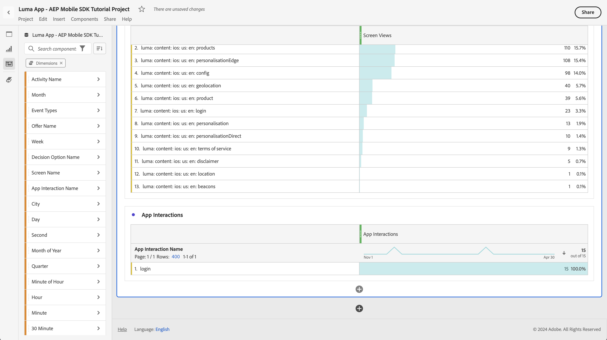
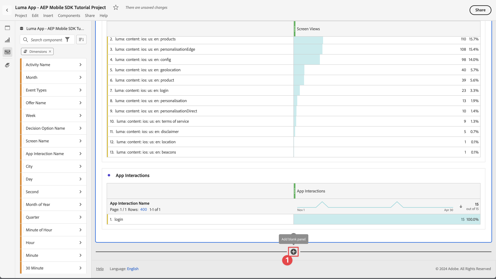

# Rapport en analyse met Customer Journey Analytics

Leer hoe u interacties van uw mobiele app met Customer Journey Analytics kunt rapporteren en analyseren.

De mobiele gegevens van de toepassingsgebeurtenis, die u verzamelde en naar de Edge Network van het Platform in vroegere lessen verstuurde, worden door:sturen aan de diensten die in uw gegevensstroom worden gevormd. Als u de [Gegevens naar Experience Platform verzenden](platform.md) les, dat het gegeven nu in een dataset van het Experience Platform wordt opgeslagen en beschikbaar voor Customer Journey Analytics voor het melden en analyse te gebruiken.

In tegenstelling tot Adobe Analytics, Customer Journey Analytics *gebruik* gegevens van datasets die in Experience Platform worden gecreeerd. Gegevens worden niet rechtstreeks naar de Customer Journey Analytics verzonden met de Adobe Experience Platform Mobile SDK, maar de gegevens worden naar gegevenssets verzonden. De verbindingen worden dan gevormd in Customer Journey Analytics om de datasets te selecteren u in uw het melden en analyseprojecten zult gebruiken.

Deze les in de zelfstudie is gericht op het rapporteren en analyseren van de gegevens die zijn vastgelegd in de zelfstudie-app Luma. Één van de unieke mogelijkheden van Customer Journey Analytics is het combineren van gegevens uit veelvoudige bronnen (CRM, verkooppunt, loyaliteitstoepassing, call-center) en kanalen (Web, mobiel, off-line) voor het verlenen van diepe inzichten in klantenreizen. Dat vermogen is voorbij het werkingsgebied van deze les. Zie [Overzicht van Customer Journey Analytics](https://experienceleague.adobe.com/en/docs/analytics-platform/using/cja-overview/cja-overview) voor meer informatie .

## Vereisten

Uw organisatie moet provisioned en toestemming voor Customer Journey Analytics worden verleend. U moet beheerdertoegang tot Customer Journey Analytics hebben.

## Leerdoelstellingen

In deze les zult u:

- Creeer een verbinding om de datasets van Experience Platform te bepalen u in Customer Journey Analytics wilt gebruiken.
- Creeer een gegevensmening om de gegevens van de datasets voor uw rapportering en analyse voor te bereiden
- Maak een project voor het samenstellen van rapporten en visualisaties, zodat u de gegevens van uw mobiele app kunt analyseren.

De reeks is opzettelijk. De verbindingen gebruiken datasets, en de gegevensmeningen gebruiken verbindingen.

## Verbinding maken

Een verbinding in Customer Journey Analytics bepaalt de datasets (en de gegevens binnen deze datasets) van Experience Platform dat u voor rapportering en analyse wilt gebruiken.

1. Navigeren naar de interface Customer Journey Analytics met de toepassingen  in de rechterbovenhoek.

1. Selecteren **[!UICONTROL Connections]** in de bovenste menubalk.

1. Zorg ervoor dat u de **[!UICONTROL List]** in de interface Verbindingen. Er wordt een lijst met bestaande verbindingen weergegeven.

1. Selecteren **[!UICONTROL Create new connection]**.

1. In de **[!UICONTROL Connections]** > **[!UICONTROL Untitled connection]** scherm, in **[!UICONTROL Connection settings]**

   1. Voer een **[!UICONTROL Connection name]** bijvoorbeeld `Luma App - AEP Mobile SDK Tutorial Connection`.
   2. Voer een **[!UICONTROL Connection description]** bijvoorbeeld `Connection for the Luma app used in the AEP Mobile SDK tutorial`.

      In **[!UICONTROL Data settings]**:

   3. Selecteer de sandbox die u hebt gebruikt om gegevens van uw mobiele app te verzamelen, bijvoorbeeld **[!UICONTROL Mobile and Web SDK Courses]**.
   4. Selecteren **[!UICONTROL less than 1 million]** van de **[!UICONTROL Average number of daily events]**.

   5. Selecteren **[!UICONTROL Add datasets]** om de datasets van Experience Platform te selecteren u in Customer Journey Analytics wilt gebruiken.

      

   6. In de **[!UICONTROL Add datasets]** wizard, **[!UICONTROL Select datasets]** stap,

      1. Selecteer de volgende gegevenssets:

         - **[!UICONTROL Luma Mobile App Event Dataset]**, de gegevensset die u hebt gemaakt als onderdeel van de [Een gegevensset maken](platform.md#create-a-dataset) in de les Experience Platforms.
         - **[!UICONTROL ODE DecisionEvents - *naam sandbox *]beslissing**
         - **[!UICONTROL AJO Push Tracking Event Datasets]**

      1. Selecteren **[!UICONTROL Next]**.

         

   7. In de **[!UICONTROL Add datasets]** wizard, **[!UICONTROL Datasets settings]** stap, moet u de details voor elk van de gebeurtenisdatasets bepalen.
      1. Zie de volgende lijsten voor de juiste opstelling:

         | Gegevensset | Persoon-id AANBIEDEN | Tijdstempel Plakken | ③ gegevensbron | Alle nieuwe ④ importeren | Back-up maken van alle bestaande ⑤ |
         |---|---|---|---|---|---|
         | Dataset voor Luma Mobile-toepassingsgebeurtenis | identityMap | tijdstempel | Mobiele toepassingsgegevens | enable | enable |
         | ODE-beslissingsgebeurtenissen - *naam sandbox* beslissing | identityMap | tijdstempel | Mobiele toepassingsgegevens | enable | enable |
         | Dataset voor AJO-gebeurtenis voor het bijhouden van push | identityMap | tijdstempel | Mobiele toepassingsgegevens | enable | enable |

      1. Selecteren **[!UICONTROL Add datasets]**.

         

1. Terug in de **[!UICONTROL Connections]** > **[!UICONTROL Luma App - AEP Mobile SDK Tutorial Connection]**, selecteert u **[!UICONTROL Save]** om uw verbinding op te slaan.

   

U hebt nu uw verbinding bepaald en de Customer Journey Analytics voegt de gegevens van de datasets aan zijn eigen intern gegevensbestand toe. Deze gegevensverzameling kan enige tijd in beslag nemen, afhankelijk van de hoeveelheid gegevens. Voor uw zelfstudie-app verwacht u een paar uur voordat de gegevens in de Customer Journey Analytics worden weergegeven.

U kunt als volgt de status van uw verbinding weergeven:

1. Selecteren **[!UICONTROL Connections]** in de hoofdinterface van Customer Journey Analytics.
1. Selecteer bijvoorbeeld de naam van de verbinding **[!UICONTROL Luma App - AEP Mobile SDK Tutorial Connection]**.

In de **[!UICONTROL Connections]** > **[!UICONTROL Luma App - AEP Mobile SDK Tutorial Connection]**, zie je:

1. Informatie over het totaal aantal toegevoegde records, overgeslagen records en verwijderde records. Zorg ervoor dat u **[!UICONTROL All datasets]** en selecteer een geschikte tijdsperiode om details over uw verbinding te bekijken. U kunt  om een dialoogvenster te openen waarin u de tijdsperiode kunt selecteren.
1. Informatie voor individuele datasets over toegevoegde verslagen, overgeslagen verslagen, verslagen geschrapt, en meer.

   

## Een gegevensweergave maken

Nadat de verslagen van de datasets aan Customer Journey Analytics zijn toegevoegd, kunt u een gegevensmening tot stand brengen om te bepalen welke componenten van de gegevens u wilt melden.

Een gegevensmening is een container specifiek voor Customer Journey Analytics die u laat bepalen hoe te om gegevens van een verbinding te interpreteren. U kunt standaard en schemagebieden van om het even welke datasets vormen die u in uw Verbinding als componenten (afmetingen, metriek) in Analysis Workspace hebt bepaald.

Een gegevensweergave in Customer Journey Analytics biedt een enorme mate van flexibiliteit bij het correct instellen en definiëren van de gegevens van uw verbinding. In deze zelfstudie gebruikt u alleen de functionaliteit die vereist is voor uw rapportage en analyse. Zie [Gegevensweergaven](https://experienceleague.adobe.com/en/docs/analytics-platform/using/cja-dataviews/data-views) voor meer informatie .

Uw gegevensweergave maken:

1. Navigeren naar de interface Customer Journey Analytics met de toepassingen  in de rechterbovenhoek.

1. Selecteren **[!UICONTROL Data views]** in de bovenste menubalk.
1. Selecteren **[!UICONTROL Create new data view]**.
1. In **[!UICONTROL Data views >]** ervoor te zorgen dat de **[!UICONTROL Configure]** is geselecteerd.

   1. Selecteer bijvoorbeeld uw verbinding in de vervolgkeuzelijst Verbinding met instellingen **[!UICONTROL Luma App - AEP Mobile SDK Tutorial Connection]**.
   1. Voer bijvoorbeeld een naam in voor de gegevensweergave: `Luma App - AEP Mobile SDK Tutorial Data view`.
   1. Selecteren **[!UICONTROL Save and continue]**.

      

1. In de **[!UICONTROL Components]** tabblad van het **[!UICONTROL Luma App - AEP Mobile SDK Tutorial Data view]** kunt u de metriek en de dimensie definiëren die u wilt gebruiken wanneer u rapporteert over uw mobiele app. Door gebrek, worden een aantal standaardmetriek en afmetingen (gezamenlijk die naar een componenten worden verwezen) reeds gevormd voor uw gegevensmening. Maar uw gegevensweergave vereist meer componenten.  Om een schemagebied van uw eerder bepaald schema of uit-van-de-doosschema&#39;s toe te voegen (zie [Een schema maken](create-schema.md) les), als component (afmetingen of metrisch):

   1. Het schemaveld zoeken:

      - zoeken naar de component met de  ***[!UICONTROL Search schema fields]*** zoekveld. Bijvoorbeeld: `productListAdd`, of

        

      - omlaag doorlopen naar het schemaveld binnen  **[!UICONTROL Event datasets]** .  Bijvoorbeeld:  **[!UICONTROL Event datasets]**   **[!UICONTROL commerce]**   **[!UICONTROL productListAdds]** 

        

   1. Sleep het specifieke schemaveld uit het venster Schema-velden en zet het neer op het tabblad **[!UICONTROL METRICS]** of **[!UICONTROL DIMENSIONS]** in de lijst [!UICONTROL Included components] venster.

      

   1. U kunt de instellingen van een component configureren. Selecteer de component en configureer instellingen in het rechterdeelvenster.  U kunt bijvoorbeeld de naam wijzigen **[!UICONTROL commerce.productListAdds]** tot `Product Add To Lists` met de **[!UICONTROL COMPONENT SETTINGS]** > **[!UICONTROL Component name]** in het rechterdeelvenster.

      

      Of configureer **[!UICONTROL INCLUDE EXCLUDE VALUES]**.

      

   1. Nu u begrijpt hoe u velden aan uw gegevensweergave kunt toevoegen en de resulterende component kunt configureren, gebruikt u de onderstaande tabellen voor een lijst met schemavelden die u als metriek of afmetingen wilt toevoegen. Gebruik de **Schemapad** de kolomwaarde van de lijst hieronder om naar het specifieke schemagebied te zoeken of te doorkruisen. Als u metriek en afmetingen hebt toegevoegd, controleert u de **Componentinstellingen** kolomwaarde in de tabel of specifieke instellingen zijn vereist voor een component, zoals de kolomwaarde in de tabel **[!UICONTROL Component name]** of definiëren **[!UICONTROL INCLUDE EXCLUDE VALUES]**.

      **METRISCHE**

      | Componentnaam | Gegevensset | Gegevenstype schema | Schemapad | Componentinstellingen |
      |---|---|---|---|---|
      | Afwijzen | Dataset voor AJO-push Tracking Experience en Luma Mobile App Event | Geheel | _experience.decisions. propositionEventType.dismiss | Componentnaam: `Dismiss` |
      | Abonnement opzeggen | Dataset voor AJO-push Tracking Experience en Luma Mobile App Event | Geheel | _experience.decisions. propositionEventType.unsubscribe | Componentnaam: `Unsubscribe` |
      | Trigger | Dataset voor AJO-push Tracking Experience en Luma Mobile App Event | Geheel | _experience.decisions. propositionEventType.trigger | Componentnaam: `Trigger` |
      | Weergave | Dataset voor AJO-push Tracking Experience en Luma Mobile App Event | Geheel | _experience.decisions. propositionEventType.display | Componentnaam: `Display` |
      | Verzenden | Dataset voor AJO-push Tracking Experience en Luma Mobile App Event | Geheel | _experience.decisions. propositionEventType.send | Componentnaam: `Send` |
      | Interactie | Dataset voor AJO-push Tracking Experience en Luma Mobile App Event | Geheel | _experience.decisions. propositionEventType.interact | Componentnaam: `Interact` |
      | Locatiegebeurtenissen | AJO Push Tracking Experience Event Dataset, Luma Mobile App Event Dataset, ODE DecisionEvents - mobile-and-web-sdk-cursussen beslissen | String | Type gebeurtenis | Componentnaam: `Location Events`   |
      | Productweergaven | Dataset voor Luma Mobile-toepassingsgebeurtenis | Dubbel | commerce.productViews.value | Componentnaam: `Product Views` |
      | Product toevoegen aan lijsten | Dataset voor Luma Mobile-toepassingsgebeurtenis | Dubbel | commerce.productListAdds.value | Componentnaam: `Product Add To Lists` |
      | Aankopen | Dataset voor Luma Mobile-toepassingsgebeurtenis | Dubbel | commerce.purchases.value | Componentnaam: `Purchases` |
      | Opslaan voor later | Dataset voor Luma Mobile-toepassingsgebeurtenis | Dubbel | commerce.saveForLaters.value | Componentnaam: `Save For Laters` |
      | Interacties tussen toepassingen | Dataset voor Luma Mobile-toepassingsgebeurtenis | Dubbel | _techmarketingdemos.appInformation. appInteraction.appAction.value | Componentnaam: `App Interactions` |
      | Schermweergaven | Dataset voor Luma Mobile-toepassingsgebeurtenis | Dubbel | _techmarketingdemos.appInformation. appStateDetails.screenView.value | Componentnaam: `Screen Views` |

      {style="table-layout:auto"}

      >[!NOTE]
      >
      >Merk op hoe het schemagebied voor de Metrische Gebeurtenissen van de Plaats gebruikt **[!UICONTROL INCLUDE EXCLUDE VALUES]** om gebeurtenistypen te tellen die bevatten `location`.

      Uw configuratie van de gegevensweergave voor **[!UICONTROL METRICS]** moet hieronder overeenkomen nadat u alle schemavelden uit de bovenstaande tabel als een metrische component hebt toegevoegd:

      

      **DIMENSIONEN**

      | Componentnaam | Gegevensset | Gegevenstype schema | Schemapad | Componentinstellingen |
      |---|---|---|---|---|
      | Plaats | Dataset voor AJO-push Tracking Experience en Luma Mobile App Event | String | placeContext.geo.city | Componentnaam: `City` |
      | Gebeurtenistypen | AJO Push Tracking Experience Event Dataset, Luma Mobile App Event Dataset, ODE DecisionEvents - mobile-and-web-sdk-cursussen beslissen | String | eventType | Componentnaam: `Event Types` |
      | Naam van beslissingsoptie | AJO Push Tracking Experience Event Dataset, Luma Mobile App Event Dataset, ODE DecisionEvents - mobile-and-web-sdk-cursussen beslissen | String | _experience.decisions. proposities.items.name | Componentnaam: `Decision Option Name` |
      | Interactienaam app | Dataset voor Luma Mobile-toepassingsgebeurtenis | String | _techmarketingdemos.appInformation. appInteraction.name | Componentnaam: `App Interaction Name` |
      | Schermnaam | Dataset voor Luma Mobile-toepassingsgebeurtenis | String | _techmarketingdemos.appInformation. appStateDetails.screenName | Componentnaam: `Screen Name` |
      | Naam activiteit | ODE-beslissingsgebeurtenissen - beslissingen over mobiele en webcursussen | String | _experience.decisions. propositionDetails.activity.name | Componentnaam: `Activity Name` |
      | Naam voorstel | ODE-beslissingsgebeurtenissen - beslissingen over mobiele en webcursussen | String | _experience.decisions. propositionDetails.selections.name | Componentnaam: `Offer Name` |

      {style="table-layout:auto"}

      Uw configuratie van de gegevensweergave voor **[!UICONTROL DIMENSIONS]** moet hieronder overeenkomen nadat u alle schemavelden uit de bovenstaande tabel hebt toegevoegd als dimensie-component:

      

   1. Selecteren **[!UICONTROL Save and continue]**.

1. De **[!UICONTROL Settings]** tabblad van het **[!UICONTROL Luma App - AEP Mobile SDK Tutorial Data view]** kunt u filters en zittingsmontages vormen. Voor deze zelfstudie is geen aanvullende configuratie vereist.

   - Selecteren **[!UICONTROL Save and finish]**.

U hebt de gegevensweergave gedefinieerd en alles is op zijn plaats om uw rapporten en visualisaties op te stellen.

## Een project maken

De projecten van de werkruimte worden gebruikt in Customer Journey Analytics om rapporten en visualisaties te bouwen. Er zijn vele mogelijkheden om uitvoerige rapporten en het in dienst nemen van visualisaties te bouwen, maar dit is buiten het werkingsgebied van deze zelfstudie. Zie [Overzicht van werkruimte](https://experienceleague.adobe.com/en/docs/customer-journey-analytics-learn/tutorials/analysis-workspace/workspace-projects/analysis-workspace-overview) en [Een nieuw project maken](https://experienceleague.adobe.com/en/docs/customer-journey-analytics-learn/tutorials/analysis-workspace/workspace-projects/build-a-new-project) voor meer informatie .

In deze sectie van de les, creeert u een project dat rapporten en visualisaties over toont:

- Toepassingsgebruik: de informatie op het scherm en de interacties tussen de apps gebruiken.
- Commerce: gebruik van de handelsgebeurtenissen, zoals de productweergave, voeg toe aan winkelwagentje en koop.
- Aanbiedingen: de aanbiedingen gebruiken die in de app worden weergegeven.
- Bezoeken opslaan: de (gesimuleerde) geofence-gebeurtenissen uit de app gebruiken.

Uw project maken:

1. Navigeren naar de interface Customer Journey Analytics met de toepassingen  in de rechterbovenhoek.

1. Selecteren **[!UICONTROL Workspace]** in de bovenste menubalk.

1. Selecteren **[!UICONTROL Create project]**.

   1. Selecteren **[!UICONTROL Blank Workspace project]** in het pop-updialoogvenster.

   1. Selecteren **[!UICONTROL Create]**.

      

1. U krijgt de **[!UICONTROL New project]** interface. In deze interface, bouwt u uw rapporten en visualisaties.

1. Selecteer de naam van het project (**[!UICONTROL New project]**) en geef uw eigen naam voor het project op. Bijvoorbeeld: `Luma App - AEP Mobile SDK Tutorial Project`.
   

1. Als u het project wilt opslaan, selecteert u **[!UICONTROL Project]** > **[!UICONTROL Save]**.
   

1. In de **[!UICONTROL Save]** alle andere velden negeren en selecteren **[!UICONTROL Save]**.
   

>[!IMPORTANT]
>
>   Vergeet niet uw project regelmatig op te slaan, anders gaan de wijzigingen verloren. U kunt uw project snel opslaan met **[!UICONTROL ctrl + s]** (Windows) of **[!UICONTROL ⌘ (cmd) + s]** (macOS)

U hebt nu uw project ingesteld. Een tabel met vrije vorm wordt standaard opgegeven. Voordat u componenten toevoegt, moet u ervoor zorgen dat het deelvenster Vrije vorm de juiste gegevensweergave en tijdsperiode gebruikt.

1. Selecteer de gegevensweergave in de vervolgkeuzelijst. Bijvoorbeeld: **[!UICONTROL Luma App - AEP Mobile SDK Tutorial Data view]**. Als de gegevensweergave niet in de lijst wordt weergegeven, selecteert u **[!UICONTROL Show all]** onder aan de vervolgkeuzelijst.
   

1. Selecteer de standaardvoorinstelling als u de juiste tijdsperiode voor het deelvenster wilt definiëren **[!UICONTROL This month]** Voer een aangepaste begin- en einddatum in of gebruik een **[!UICONTROL Preset]** (zoals **[!UICONTROL Last 6 full months]**) en selecteert u **[!UICONTROL Apply]**.
   

### Toepassingsgebruik

Nu kunt u aangeven hoe de app wordt gebruikt. U hebt de vereiste code toegevoegd aan de app om de interacties tussen apps te registreren en welke schermen in de app worden gebruikt (zie de [Gebeurtenissen bijhouden](events.md) les) en u wilt nu over deze gegevens rapporteren.

#### Schermnamen

Rapporteer de schermen die in de app worden weergegeven:

1. De naam van uw **[!UICONTROL Freeform]** van `App Usage`.

1. De naam van uw **[!UICONTROL Freeform table]** tot `Screen Names`.

1. Selecteren **[!UICONTROL Show all]** onder de **[!UICONTROL METRICS]** lijst.

1. Sleep de **[!UICONTROL Screen Views]** component on [!UICONTROL _Een dropknop **metrisch**hier (of een andere component)_)].
   
Uw vrije lijst toont nu het schermmeningen voor elke dag voor uw geselecteerde tijdspanne. U wilt echter het aantal schermweergaven weergeven voor elk van de verschillende schermen die in de app worden gebruikt.

1. Als u het dialoogvenster **[!UICONTROL DIMENSIONS]** lijst met componenten, selecteert u  om de  **[!UICONTROL Metrics]** filter uit de spoorstaaf van de componenten.
   

1. Selecteren **[!UICONTROL Show all]** onder de **[!UICONTROL DIMENSIONS]** lijst.

1. Sleep de **[!UICONTROL Screen Name]** component op de **[!UICONTROL Day]** header. De bewerking toont  **[!UICONTROL Replace]** om de vervanging van de dimensie aan te geven.
   

Uw eerste Freeform-tabel in uw rapport is voltooid.

>[!NOTE]
>
>Sla uw project op voordat u verdergaat.

#### Interacties tussen toepassingen

Vervolgens maakt u een tabel met Freeform om te rapporteren hoe gebruikers met de app hebben gewerkt.

1. Selecteren  en van de pop-up  om een nieuwe tabel voor vrije vorm toe te voegen.
   

1. Naam wijzigen **[!UICONTROL Freeform table (2)]** tot `App Interactions`.

1. Sleep de **[!UICONTROL App Interactions]** metrisch op [!UICONTROL _Een dropknop **metrisch**hier (of een andere component)_)].

1. Sleep de **[!UICONTROL App Interaction Name]** dimensie van de **[!UICONTROL Day]** om deze dimensie te vervangen.

Uw tweede rapport is nu klaar en toont de interactie tussen de apps.

De informatie is beperkt, voornamelijk omdat u deze hebt geïmplementeerd `MobileSDK.shared.sendAppInteractionEvent(actionName: "<actionName>")` API-aanroepen alleen op het aanmeldingsscherm. Als u deze API-aanroep toevoegt aan meer schermen van uw app, wordt dit rapport informatief.

>[!NOTE]
>
>Sla uw project op voordat u verdergaat.

### Commerce

U wilt nu in een afzonderlijk deelvenster rapporteren over de handelsgebeurtenissen die plaatsvinden in de app.

#### Commerce Events

1. Selecteren  buiten de huidige [!UICONTROL App Usage] om een nieuw deelvenster te maken.
   

1. Zorg ervoor dat u de juiste tijdsperiode selecteert.

1. Selecteren  **[!UICONTROL Freeform table]** om een nieuwe tabel voor vrije vorm te maken.
   

1. Naam wijzigen **[!UICONTROL Panel]** tot `Commerce`.

1. Naam wijzigen **[!UICONTROL Freeform table]** tot `Commerce Events`.

1. Slepen en slepen **[!UICONTROL Product Views]** metrisch op tot [!UICONTROL _Een dropknop **metrisch**hier (of een andere component)_)].

1. Sleep de **[!UICONTROL Product Add To Lists]** metrisch rechts van het **[!UICONTROL Product Views]** kolom om deze kolom in te voegen in de vrije-vormlijst. Zorgen **[!UICONTROL + Add]** (in blauw) wordt weergegeven bij het invoegen van de kolom.
   

1. Herhaal de vorige stap om de **[!UICONTROL Save For Laters]** en de **[!UICONTROL Purchases]** metrisch aan de vrije vormlijst.

1. Sleep de **[!UICONTROL Month]** afmeting boven op de **[!UICONTROL Day]** dimensie om de rapportage te wijzigen van dagelijks naar maandelijks.

Het Commerce Events-rapport is voltooid.

>[!NOTE]
>
>Sla uw project op voordat u verdergaat.

#### Fallout

Daarna, zult u een fallout visualisatie voor de handelrechter bouwen die toont hoeveel gebruikers die producten bekeken deze producten aan hun kar toevoegden, en van daaruit, hoeveel gebruikers deze producten voor later bewaarde.

1. Selecteren  binnen de **[!UICONTROL Commerce]** en uit de pop-upselectie  (die de Fallout visualisatie vertegenwoordigt).

1. Selecteren **[!UICONTROL Product Views]** van de [!UICONTROL *Aanraakpunt toevoegen*] vervolgkeuzelijst.
   
U kunt ook de **[!UICONTROL Products View]** afmeting onder de **[!UICONTROL All people]** in de **[!UICONTROL Fallout]** visualisatie.

1. Herhaal bovenstaande stap voor **[!UICONTROL Product Add To Lists]** en **[!UICONTROL Purchases]** afmetingen.

Uw Fallout-visualisatierapport is voltooid.

>[!NOTE]
>
>Sla uw project op voordat u verdergaat.

### Aanbiedingen

U wilt rapporteren over hoeveel aanbiedingen en welke aanbiedingen worden weergegeven aan de gebruikers van uw app.

#### Maandelijks overzicht

1. Selecteren  buiten het huidige Commerce-deelvenster om een nieuw deelvenster te maken.

1. De naam van de **[!UICONTROL Panel]** tot `Offers`.

1. Zorg ervoor dat u de juiste periode selecteert.

1. Selecteren  Een tabel met vrije vorm maken om een nieuwe tabel met vrije vorm te maken.

1. De naam van de **[!UICONTROL Freeform table]** tot `Monthly Overview`.

1. Sleep de **[!UICONTROL Display]** metrisch op tot [!UICONTROL _Een dropknop **metrisch**hier (of een andere component)_)].

1. Sleep de **[!UICONTROL Month]** dimensie van de **[!UICONTROL Day]** kolom ter vervanging van de dimensie.

Je maandelijkse overzicht voor voorstellen is voltooid.

>[!NOTE]
>
>Sla uw project op voordat u verdergaat.

#### Aanbiedingen aan personen

U wilt ook een rapport hebben waarin wordt aangegeven welke aanbiedingen zijn weergegeven in welke nummers gebruikers van de app hebben ontvangen.

1. Selecteren  binnen de **[!UICONTROL Offers]** en van popup om een nieuwe lijst van de Vrije vorm toe te voegen.

1. Naam wijzigen **[!UICONTROL Freeform table (2)]** tot `People`.

1. Sleep de **[!UICONTROL People]** metrisch op tot [!UICONTROL _Een dropknop **metrisch**hier (of een andere component)_)].

1. Sleep de **[!UICONTROL Activity Name]** op de **[!UICONTROL Day]** kolom ter vervanging van de dimensie.

1. Klik met de rechtermuisknop op de rij en identificeer een of meer van de aanbiedingsbeslissingen die u in het dialoogvenster hebt gedefinieerd [Aanbiedingen maken en weergeven met Besluitbeheer](journey-optimizer-offers.md) les. Bijvoorbeeld: **[!UICONTROL Luma - Mobile App Decision]**.

1. Selecteer in het contextmenu de optie **[!UICONTROL Breakdown]** > **[!UICONTROL Dimensions]** > **[!UICONTROL Offer Name]**. Deze selectie zal de dimensie van de Naam van de Activiteit in de Namen van de Aanbieding verdelen.
   

Je voorstel aan Personen is voltooid.

>[!NOTE]
>
>Sla uw project op voordat u verdergaat.

### Winkelbezoeken

Tot slot wilt u verslag uitbrengen over winkelbezoeken.

1. Selecteren  buiten het huidige deelvenster Aanbiedingen om een nieuw deelvenster te maken.

1. De naam van de **[!UICONTROL Panel]** tot `Store Visits`.

1. Zorg ervoor dat u de juiste periode selecteert.

1. Selecteren  Een tabel met vrije vorm maken om een nieuwe tabel met vrije vorm te maken.

1. Naam wijzigen **[!UICONTROL Freeform table]** tot `Store Entries / Exits Across Cities`.

1. Sleep de **[!UICONTROL Location Events]** metrisch op tot [!UICONTROL _Een dropknop **metrisch**hier (of een andere component)_)]. Het rapport bevat nu een dagelijks overzicht van alle locatiegebeurtenissen die in de app hebben plaatsgevonden. Herinner hoe u specifiek deze afmeting als deel van uw vormde [gegevensweergave](#create-a-data-view).

1. Sleep de **[!UICONTROL City]** dimensie van de **[!UICONTROL Day]** kolomkop om de dimensie te vervangen. In het verslag worden nu de steden voor de locatiegebeurtenissen getoond.

1. Geolocatiegebeurtenissen verwijderen zonder bijbehorende steden selecteren en van de **[!UICONTROL Search]** popup, uitschakelen **[!UICONTROL Include "No value"]** selecteert u vervolgens **[!UICONTROL Apply]**.

   

   Met deze handeling verwijdert u de **[!UICONTROL No value]** rij uit het rapport.

1. Selecteer alle rijen in de tabel, klik met de rechtermuisknop en kies in het contextmenu Onderverdeling > Dimension > Gebeurtenistypen.

Je winkelbezoekersrapport is voltooid. U hebt nu een rapport waarin gebruikers worden weergegeven die zich in en buiten de nabijheid van uw opslaglocaties bevinden (aangezien u deze locaties hebt gedefinieerd in het dialoogvenster [Plaatsen](places.md) les).

Let op: als je echt wilt rapporteren over mensen die je winkel fysiek bezoeken, kun je bakens gebruiken. Maar hopelijk heb je het concept van rapportage over geolocatiegegevens vastgelegd.

## Volgende stappen

U hebt nu een basiskennis van het rapporteren en visualiseren van het gebruik van uw mobiele app, interacties en meer via Customer Journey Analytics.

>[!SUCCESS]
>
>
>Bedankt dat u tijd hebt geïnvesteerd in het leren van Adobe Experience Platform Mobile SDK. Als u vragen hebt, algemene feedback wilt delen of suggesties voor toekomstige inhoud wilt hebben, deelt u deze over deze [Experience League Communautaire discussiestuk](https://experienceleaguecommunities.adobe.com/t5/adobe-experience-platform-data/tutorial-discussion-implement-adobe-experience-cloud-in-mobile/td-p/443796).

Volgende: **[Conclusie en volgende stappen](conclusion.md)**
