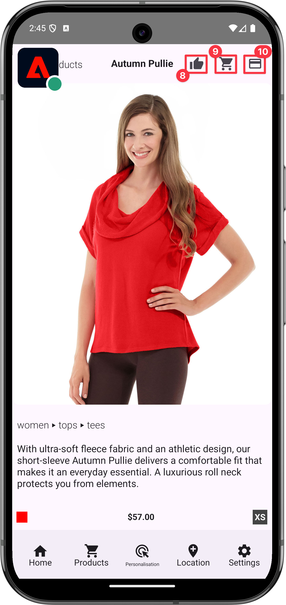

# Gebeurtenisgegevens bijhouden

Leer hoe u gebeurtenissen in een mobiele app kunt bijhouden.

De Edge Network-extensie biedt een API waarmee u ervaringsgebeurtenissen kunt verzenden naar het Platform Edge Network. Een ervaringsgebeurtenis is een object dat gegevens bevat die voldoen aan de XDM ExperienceEvent-schemadefinitie. Meer eenvoudig, deze gebeurtenissen vangen wat mensen in uw mobiele app doen. Zodra het Platform Edge Network gegevens ontving, kunnen die gegevens aan toepassingen en de diensten worden door:sturen die in uw gegevensstroom, zoals Adobe Analytics en Experience Platform worden gevormd. Leer meer over de [ Gebeurtenissen van de Ervaring ](https://developer.adobe.com/client-sdks/documentation/getting-started/track-events/) in de productdocumentatie.

## Vereisten

* Alle pakketgebiedsdelen worden gevormd in uw project Xcode.
* Geregistreerde extensies in **[!UICONTROL AppDelegate]** .
* De geconfigureerde MobileCore-extensie voor gebruik van uw ontwikkeling `appId`.
* Geïmporteerde SDK&#39;s.
* De app is gemaakt en uitgevoerd met de bovenstaande wijzigingen.

## Leerdoelstellingen

In deze les zult u

* Begrijp hoe te om XDM gegevens te structureren die op een schema worden gebaseerd.
* Verzend een XDM-gebeurtenis op basis van een standaardveldgroep.
* Verzend een XDM-gebeurtenis op basis van een aangepaste veldgroep.
* Verzend een XDM-aankoopgebeurtenis.
* Valideren met Assurance.

## Een ervaringsgebeurtenis maken

De Adobe Experience Platform Edge-extensie kan gebeurtenissen die een eerder gedefinieerd XDM-schema volgen, naar Adobe Experience Platform Edge Network verzenden.

Het proces gaat als volgt...

1. Identificeer de mobiele toepassingsinteractie die u probeert te volgen.

1. Herzie uw schema en identificeer de aangewezen gebeurtenis.

1. Controleer uw schema en identificeer om het even welke extra gebieden die zouden moeten worden gebruikt om de gebeurtenis te beschrijven.

1. Hiermee wordt het gegevensobject samengesteld en gevuld.

1. Maak en verzend gebeurtenis.

1. Valideren.


### Standaardveldgroepen

Voor de standaardveldgroepen ziet het proces er als volgt uit:

* In uw schema, identificeer de gebeurtenissen die u probeert te verzamelen. In dit voorbeeld volgt u de gebeurtenissen van de handelservaring, bijvoorbeeld een gebeurtenis van de productmening (**[!UICONTROL productViews]**).

  {zoomable="yes"}

* Als u een object wilt maken dat de ervaringsgebeurtenisgegevens in uw app bevat, gebruikt u de volgende code:

>[!BEGINTABS]

>[!TAB  iOS ]

```swift
var xdmData: [String: Any] = [
    "eventType": "commerce.productViews",
    "commerce": [
        "productViews": [
        "value": 1
        ]
    ]
]
```

In deze code:

* `eventType`: Beschrijft de gebeurtenis die voorkwam, gebruik a [ bekende waarde ](https://github.com/adobe/xdm/blob/master/docs/reference/classes/experienceevent.schema.md#xdmeventtype-known-values) wanneer mogelijk.

* `commerce.productViews.value` : de numerieke of Booleaanse waarde van de gebeurtenis. Als het een Booleaanse waarde (of &quot;Teller&quot; in Adobe Analytics) is, wordt de waarde altijd ingesteld op 1. Als het een numerieke of valutagebeurtenis is, kan de waarde > 1 zijn.

>[!TAB  Android ]

```kotlin
val xdmData = mapOf(
    "eventType" to "commerce.productViews",
    "commerce" to mapOf(
        "productViews" to mapOf(
        "value": 1
        )
    )
)
```

In deze code:

* `eventType`: Beschrijft de gebeurtenis die voorkwam, gebruik a [ bekende waarde ](https://github.com/adobe/xdm/blob/master/docs/reference/classes/experienceevent.schema.md#xdmeventtype-known-values) wanneer mogelijk.

* `commerce.productViews.value` : de numerieke of Booleaanse waarde van de gebeurtenis. Als het een Booleaanse waarde (of &quot;Teller&quot; in Adobe Analytics) is, wordt de waarde altijd ingesteld op 1. Als het een numerieke of valutagebeurtenis is, kan de waarde > 1 zijn.

>[!ENDTABS]


* In uw schema, identificeer om het even welke extra gegevens verbonden aan de gebeurtenis van de de meningsmening van het handelsproduct. In dit voorbeeld neemt u **[!UICONTROL productListItems]** op. Dit is een standaardset velden die worden gebruikt met aan handel gerelateerde gebeurtenissen:

  {zoomable="yes"}
   * **[!UICONTROL productListItems]** is een array, zodat meerdere producten kunnen worden geleverd.

* Als u deze gegevens wilt toevoegen, vouwt u het `xdmData` -object uit om aanvullende gegevens op te nemen:

>[!BEGINTABS]

>[!TAB  iOS ]

```swift
var xdmData: [String: Any] = [
    "eventType": "commerce.productViews",
    "commerce": [
        "productViews": [
            "value": 1
        ]
    ],
    "productListItems": [
        [
            "name":  productName,
            "SKU": sku,
            "priceTotal": priceString,
            "quantity": 1
        ]
    ]
]
```

>[!TAB  Android ]

```kotlin
val xdmData = mapOf(
    "eventType" to "commerce.productViews",
    "commerce" to mapOf(
        "productViews" to mapOf(
        "value": 1
        )
    ),
    "productListItems" to mapOf(
        "name": productName,
        "SKU": sku,
        "priceTotal", priceString,
        "quantity", 1
    )
)
```

>[!ENDTABS]

* U kunt deze gegevensstructuur nu gebruiken om een `ExperienceEvent` te maken:

>[!BEGINTABS]

>[!TAB  iOS ]

```swift
let productViewEvent = ExperienceEvent(xdm: xdmData)
```

>[!TAB  Android ]

```kotlin
val productViewEvent = ExperienceEvent.Builder().setXdmSchema(xdmData).build()
```

>[!ENDTABS]

* En verzend de gebeurtenis en de gegevens naar Platform Edge Network met behulp van de `sendEvent` API:

>[!BEGINTABS]

>[!TAB  iOS ]

```swift
Edge.sendEvent(experienceEvent: productViewEvent)
```

>[!TAB  Android ]

```kotlin
Edge.sendEvent(productViewEvent, null)
```

>[!ENDTABS]


De [`Edge.sendEvent` ](https://developer.adobe.com/client-sdks/documentation/edge-network/api-reference/#sendevent) API is de AEP Mobile SDK equivalent aan de [`MobileCore.trackAction` ](https://developer.adobe.com/client-sdks/documentation/mobile-core/api-reference/#trackaction) en [`MobileCore.trackState` ](https://developer.adobe.com/client-sdks/documentation/mobile-core/api-reference/#trackstate) API vraag. Zie [ van de mobiele uitbreiding van Analytics aan Adobe Experience Platform Edge Network ](https://developer.adobe.com/client-sdks/documentation/adobe-analytics/migrate-to-edge-network/) voor meer informatie migreren.

U gaat nu deze code in uw project uitvoeren.
U hebt verschillende acties met betrekking tot handelsproducten in uw app en u wilt gebeurtenissen verzenden op basis van deze acties die door de gebruiker worden uitgevoerd:

* weergave: vindt plaats wanneer een gebruiker een specifiek product weergeeft,
* toevoegen aan winkelwagentje: wanneer een gebruiker tikt  in een productdetailscherm,
* opslaan voor later: wanneer een gebruiker op tikt  /  in een productdetailscherm,
* aankoop: wanneer een gebruiker tikt  in een productdetailscherm.

Om het verzenden van aan handel gerelateerde ervaringsgebeurtenissen op een herbruikbare manier uit te voeren, gebruikt u een specifieke functie:

>[!BEGINTABS]

>[!TAB  iOS ]

1. Navigeer naar **[!DNL Luma]** > **[!DNL Luma]** > **[!DNL Utils]** > **[!UICONTROL MobileSDK]** in Xcode Project navigator en voeg het volgende toe aan de `func sendCommerceExperienceEvent(commerceEventType: String, product: Product)` functie.

   ```swift
   // Set up a data dictionary, create an experience event and send the event.
   let xdmData: [String: Any] = [
       "eventType": "commerce." + commerceEventType,
       "commerce": [
           commerceEventType: [
               "value": 1
           ]
       ],
       "productListItems": [
           [
               "name": product.name,
               "priceTotal": product.price,
               "SKU": product.sku
           ]
       ]
   ]
   
   let commerceExperienceEvent = ExperienceEvent(xdm: xdmData)
   Edge.sendEvent(experienceEvent: commerceExperienceEvent)
   ```

   Deze functie neemt het type en het product van de handelservaring als parameters en

   * stelt de XDM-payload in als een woordenboek, waarbij de parameters van de functie worden gebruikt;
   * stelt een ervaringsgebeurtenis op met behulp van het woordenboek;
   * verzendt de ervaringsgebeurtenis gebruikend [`Edge.sendEvent` ](https://developer.adobe.com/client-sdks/documentation/edge-network/api-reference/#sendevent) API.

1. Navigeer naar **[!DNL Luma]** > **[!DNL Luma]** > **[!DNL Views]** > **[!DNL Products]** > **[!UICONTROL ProductView]** in de Xcode-projectnavigator en voeg verschillende aanroepen toe aan de functie `sendCommerceExperienceEvent` :

   1. Bij de `.task` -modifier, binnen de `ATTrackingManager.trackingAuthorizationStatus` -closure. Deze optie `.task` wordt aangeroepen wanneer de productweergave wordt geïnitialiseerd en weergegeven, zodat u op dat specifieke moment een productweergave-gebeurtenis wilt verzenden.

      ```swift
      // Send productViews commerce experience event
      MobileSDK.shared.sendCommerceExperienceEvent(commerceEventType: "productViews", product: product)
      ```

   1. Voor elk van de knoppen ( ,  en ) voegt u in de werkbalk de relevante aanroep toe in de map `ATTrackingManager.trackingAuthorizationStatus == .authorized` closure:

      1. Voor :

         ```swift
         // Send saveForLater commerce experience event
         MobileSDK.shared.sendCommerceExperienceEvent(commerceEventType: "saveForLaters", product: product)
         ```

      1. Voor :

         ```swift
         // Send productListAdds commerce experience event
         MobileSDK.shared.sendCommerceExperienceEvent(commerceEventType: "productListAdds", product: product)
         ```

      1. Voor :

         ```swift
         // Send purchase commerce experience event
         MobileSDK.shared.sendCommerceExperienceEvent(commerceEventType: "purchases", product: product)
         ```

>[!TAB  Android ]

1. Navigeer aan **[!UICONTROL Android]**  > **[!UICONTROL app]** > **[!UICONTROL kotlin+java]** > **[!UICONTROL com.adobe.luma.tutorial.android]** > **[!UICONTROL models]** > **[!UICONTROL MobileSDK]** in de navigator van Android Studio, en voeg het volgende aan de `func sendCommerceExperienceEvent(commerceEventType: String, product: Product)` functie toe.

   ```kotlin
   // Set up a data map, create an experience event and send the event.
   val xdmData = mapOf(
       "eventType" to "commerce.$commerceEventType",
       "commerce" to mapOf(commerceEventType to mapOf("value" to 1)),
       "productListItems" to listOf(
           mapOf(
               "name" to product.name,
               "priceTotal" to product.price,
               "SKU" to product.sku
           )
       )
   )
   val commerceExperienceEvent = ExperienceEvent.Builder().setXdmSchema(xdmData).build()
   Edge.sendEvent(commerceExperienceEvent, null)
   ```

   Deze functie neemt het type en het product van de handelservaring als parameters en

   * stelt de XDM nuttige lading als kaart, gebruikend de parameters van de functie op;
   * stelt een ervaringsgebeurtenis op met behulp van de kaart;
   * verzendt de ervaringsgebeurtenis gebruikend [`Edge.sendEvent` ](https://developer.adobe.com/client-sdks/documentation/edge-network/api-reference/#sendevent) API.

1. Navigeer naar **[!UICONTROL app]** > **[!UICONTROL kotlin+java]** > **[!UICONTROL com.adobe.luma.tutorial.android]** > **[!UICONTROL views]** > **[!UICONTROL ProductView.kt]** in de Android Studio-navigator en voeg verschillende aanroepen toe aan de functie `sendCommerceExperienceEvent` :

   1. Bij de functie `LaunchedEffect(Unit)` composable wilt u een productweergave-gebeurtenis verzenden op het specifieke moment dat een product wordt weergegeven.

      ```kotlin
      // Send productViews commerce experience event
      MobileSDK.shared.sendCommerceExperienceEvent("productViews", product)
      ```

   1. Voor elk van de knoppen (,  en ) in de werkbalk voegt u de relevante aanroep toe in de map `scope.launch` van de `if (MobileSDK.shared.trackingEnabled == TrackingStatus.AUTHORIZED)  statement` :

      1. Voor :

         ```kotlin
         // Send saveForLater commerce experience event
         MobileSDK.shared.sendCommerceExperienceEvent("saveForLaters", product)
         ```

      1. Voor :

         ```kotlin
         // Send productListAdds commerce experience event
         MobileSDK.shared.sendCommerceExperienceEvent("productListAdds", product)
         ```

      1. Voor :

         ```kotlin
         // Send purchase commerce experience event
         MobileSDK.shared.sendCommerceExperienceEvent("purchases", product)
         ```

>[!ENDTABS]

>[!TIP]
>
>Voor het geval u voor Android™ ontwikkelt, gebruik Kaart (`java.util.Map`) als stichtingsinterface om uw nuttige lading XDM te construeren.


### Aangepaste veldgroepen

Stel dat u schermweergaven en interacties wilt bijhouden in de app zelf. U hebt een aangepaste veldgroep voor dit type gebeurtenissen gedefinieerd.

* In uw schema, identificeer de gebeurtenissen u probeert te verzamelen.
  {zoomable="yes"}

* Constructie van het object beginnen.

  >[!NOTE]
  >
  >* Standaardveldgroepen beginnen altijd in de hoofdmap van het object.
  >
  >* Groepen met aangepaste velden beginnen altijd onder een object dat uniek is voor uw Experience Cloud-organisatie, `_techmarketingdemos` in dit voorbeeld.

* Voor de toepassingsinteractiegebeurtenis maakt u een object als:

>[!BEGINTABS]

>[!TAB  iOS ]

```swift
let xdmData: [String: Any] = [
    "eventType": "application.interaction",
    "_techmarketingdemos": [
    "appInformation": [
        "appInteraction": [
            "name": "login",
            "appAction": [
                "value": 1
                ]
            ]
        ]
    ]
]
```

>[!TAB  Android ]

```kotlin
val xdmData = mapOf(
    "eventType" to "application.interaction",
    "_techmarketingdemos" to mapOf(
        "appInformation" to mapOf(
            "appInteraction" to mapOf(
                "name" to "login",
                "appAction" to mapOf("value" to 1)
            )
        )
    )
)
```

>[!ENDTABS]

* Voor de gebeurtenis screen tracking zou u een object maken zoals:

>[!BEGINTABS]

>[!TAB  iOS ]

```swift
var xdmData: [String: Any] = [
    "eventType": "application.scene",
    "_techmarketingdemos": [
        "appInformation": [
            "appStateDetails": [
                "screenType": "App",
                "screenName": "luma: content: ios: us: en: login",
                "screenView": [
                    "value": 1
                ]
            ]
        ] 
    ]
]
```

>[!TAB  Android ]

```kotlin
val xdmData = mapOf(
    "eventType" to "application.scene",
    tenant.value to mapOf(
        "appInformation" to mapOf(
            "appStateDetails" to mapOf(
                "screenType" to "App",
                "screenName" to stateName,
                "screenView" to mapOf("value" to 1)
            )
        )
    )
)
```

>[!ENDTABS]


* U kunt deze gegevensstructuur nu gebruiken om een `ExperienceEvent` te maken.

>[!BEGINTABS]

>[!TAB  iOS ]

```swift
let event = ExperienceEvent(xdm: xdmData)
```

>[!TAB  Android ]

```kotlin
val event = ExperienceEvent(xdmData)
```

>[!ENDTABS]


* Verzend de gebeurtenis en gegevens naar Platform Edge Network.

>[!BEGINTABS]

>[!TAB  iOS ]

```swift
Edge.sendEvent(experienceEvent: event)
```

>[!TAB  Android ]

```kotlin
Edge.sendEvent(event, null)
```

>[!ENDTABS]

Implementeer deze code opnieuw in uw project.

>[!BEGINTABS]

>[!TAB  iOS ]

1. Voor het gemak definieert u twee functies in **[!UICONTROL MobileSDK]** . Navigeer naar **[!DNL Luma]** > **[!DNL Luma]** > **[!DNL Utils]** > **[!UICONTROL MobileSDK]** in de Xcode-projectnavigator.

   * Een voor app-interacties. Voeg deze code toe aan de functie `func sendAppInteractionEvent(actionName: String)` :

     ```swift
     // Set up a data dictionary, create an experience event and send the event.
     let xdmData: [String: Any] = [
         "eventType": "application.interaction",
         tenant : [
             "appInformation": [
                 "appInteraction": [
                     "name": actionName,
                     "appAction": [
                         "value": 1
                     ]
                 ]
             ]
         ]
     ]
     let appInteractionEvent = ExperienceEvent(xdm: xdmData)
     Edge.sendEvent(experienceEvent: appInteractionEvent)
     ```

     Deze functie gebruikt de naam van de handeling als parameter en

      * stelt de XDM-payload in als een woordenboek, waarbij de parameter van de functie wordt gebruikt;
      * stelt een ervaringsgebeurtenis op met behulp van het woordenboek;
      * verzendt de ervaringsgebeurtenis gebruikend [`Edge.sendEvent` ](https://developer.adobe.com/client-sdks/documentation/edge-network/api-reference/#sendevent) API.


   * En één voor het volgen van het scherm. Voeg deze code toe aan de functie `func sendTrackScreenEvent(stateName: String) ` :

     ```swift
     // Set up a data dictionary, create an experience event and send the event.
     let xdmData: [String: Any] = [
         "eventType": "application.scene",
         tenant : [
             "appInformation": [
                 "appStateDetails": [
                     "screenType": "App",
                     "screenName": stateName,
                     "screenView": [
                         "value": 1
                     ]
                 ]
             ]
         ]
     ]
     let trackScreenEvent = ExperienceEvent(xdm: xdmData)
     Edge.sendEvent(experienceEvent: trackScreenEvent)
     ```

     Deze functie gebruikt de statusnaam als parameter en

      * stelt de XDM-payload in als een woordenboek, waarbij de parameter van de functie wordt gebruikt;
      * stelt een ervaringsgebeurtenis op met behulp van het woordenboek;
      * verzendt de ervaringsgebeurtenis gebruikend [`Edge.sendEvent` ](https://developer.adobe.com/client-sdks/documentation/edge-network/api-reference/#sendevent) API.

1. Navigeer naar **[!DNL Luma]** > **[!DNL Luma]** > **[!DNL Views]** > **[!DNL General]** > **[!UICONTROL LoginSheet]** .

   1. Voeg de volgende gemarkeerde code toe aan de knop Aanmelden:

      ```swift
      // Send app interaction event
      MobileSDK.shared.sendAppInteractionEvent(actionName: "login")
      ```

   1. Voeg de volgende gemarkeerde code toe aan de optie `onAppear` :

      ```swift
      // Send track screen event
      MobileSDK.shared.sendTrackScreenEvent(stateName: "luma: content: ios: us: en: login")
      ```

>[!TAB  Android ]

1. Voor het gemak definieert u twee functies in **[!UICONTROL MobileSDK]** . Navigeer aan **[!UICONTROL Android]**  **[!DNL app]** > **[!DNL kotlin+java]** > **[!DNL com.adobe.luma.tutorial.android]** > **[!UICONTROL models]** > **[!UICONTROL MobileSDK]** in uw navigator van Android Studio.

   * Een voor app-interacties. Voeg deze code toe aan de functie `fun sendAppInteractionEvent(actionName: String)` :

     ```kotlin
     // Set up a data map, create an experience event and send the event.
     val xdmData = mapOf(
         "eventType" to "application.interaction",
         tenant.value to mapOf(
             "appInformation" to mapOf(
                 "appInteraction" to mapOf(
                     "name" to actionName,
                     "appAction" to mapOf("value" to 1)
                 )
             )
         )
     )
     val appInteractionEvent = ExperienceEvent.Builder().setXdmSchema(xdmData).build()
     Edge.sendEvent(appInteractionEvent, null)
     ```

     Deze functie gebruikt de naam van de handeling als parameter en

      * stelt de XDM nuttige lading als kaart, gebruikend de parameter van de functie op;
      * stelt een ervaringsgebeurtenis op met behulp van de kaart;
      * verzendt de ervaringsgebeurtenis gebruikend [`Edge.sendEvent` ](https://developer.adobe.com/client-sdks/documentation/edge-network/api-reference/#sendevent) API.


   * En één voor het volgen van het scherm. Voeg deze code toe aan de functie `fun sendTrackScreenEvent(stateName: String)` :

     ```kotlin
     // Set up a data map, create an experience event and send the event.
     val xdmData = mapOf(
         "eventType" to "application.scene",
         tenant.value to mapOf(
             "appInformation" to mapOf(
                 "appStateDetails" to mapOf(
                     "screenType" to "App",
                     "screenName" to stateName,
                     "screenView" to mapOf("value" to 1)
                 )
             )
         )
     )
     val trackScreenEvent = ExperienceEvent.Builder().setXdmSchema(xdmData).build()
     Edge.sendEvent(trackScreenEvent, null)
     ```

     Deze functie gebruikt de statusnaam als parameter en

      * stelt de XDM nuttige lading als kaart, gebruikend de parameter van de functie op;
      * stelt een ervaringsgebeurtenis op met behulp van de kaart;
      * verzendt de ervaringsgebeurtenis gebruikend [`Edge.sendEvent` ](https://developer.adobe.com/client-sdks/documentation/edge-network/api-reference/#sendevent) API.

1. Ga aan **[!UICONTROL Android]** **[!DNL app]**>**[!DNL kotlin+java]**>**[!DNL com.adobe.luma.tutorial.android]**>**[!UICONTROL views]**>**[!UICONTROL LoginSheet.kt]**

   1. Voeg de volgende gemarkeerde code toe aan de gebeurtenis **[!UICONTROL Button]** **[!UICONTROL onClick]** :

      ```kotlin
      // Send app interaction event
      MobileSDK.shared.sendAppInteractionEvent("login")
      ```

   1. Voeg de volgende gemarkeerde code toe aan de functie `LaunchedEffect(Unit)` composable:

      ```kotlin
      // Send track screen event
      MobileSDK.shared.sendTrackScreenEvent("luma: content: android: us: en: login")
      ```

>[!ENDTABS]


## Validatie

1. Herzie de [ sectie van opstellingsinstructies ](assurance.md#connecting-to-a-session) om uw simulator of apparaat met Assurance te verbinden.

   1. Het Assurance-pictogram naar links verplaatsen.
   1. Selecteer **[!UICONTROL Home]** in de tabbalk en controleer of de **[!UICONTROL ECID]** , **[!UICONTROL Email]** en **[!UICONTROL CRM ID]** in het scherm Home worden weergegeven.
   1. Selecteer **[!DNL Products]** in de tabbalk.
   1. Selecteer een product.
   1. Selecteren  (iOS) of  (Android).
   1. Selecteren .
   1. Selecteren .

>[!BEGINTABS]

>[!TAB  iOS ]


>[!TAB  Android ]



>[!ENDTABS]

1. Zoek in de gebruikersinterface van Assurance naar de **[!UICONTROL hitReceived]** -gebeurtenissen van de **[!UICONTROL com.adobe.edge.konductor]** -leverancier.
1. Selecteer de gebeurtenis en bekijk de XDM-gegevens in het **[!UICONTROL messages]** -object. Alternatief, kunt u  gebruiken **[!UICONTROL Copy Raw Event]** en een tekst of coderedacteur van uw voorkeur gebruiken om de gebeurtenis te kleven en te inspecteren.

   {zoomable="yes"}


## Volgende stappen

U moet nu over alle gereedschappen beschikken om gegevensverzameling aan uw app toe te voegen. U kunt meer informatie toevoegen over de manier waarop de gebruiker in de app met uw producten werkt en u kunt meer oproepen voor interactie tussen de apps en het bijhouden van schermen toevoegen aan de app:

* Implementeer de opdracht, kassa, lege mand en andere functionaliteit van de app en voeg relevante gebeurtenissen uit de handelservaring toe aan deze functionaliteit.
* Herhaal de aanroep van `sendAppInteractionEvent` met de juiste parameter om andere toepassingsinteracties van de gebruiker bij te houden.
* Herhaal de aanroep van `sendTrackScreenEvent` met de juiste parameter om schermen bij te houden die door de gebruiker in de app worden weergegeven.

>[!TIP]
>
>Herzie [ voltooide app ](https://github.com/Adobe-Marketing-Cloud/Luma-iOS-Mobile-App) voor meer voorbeelden.


## Gebeurtenissen verzenden naar Analytics en Platform

Nu u de gebeurtenissen hebt verzameld en hen verzonden naar Platform Edge Network, worden zij verzonden naar de toepassingen en de diensten die in uw [ worden gevormd datastream ](create-datastream.md). In recentere lessen, brengt u deze gegevens in kaart aan [ Adobe Analytics ](analytics.md), [ Adobe Experience Platform ](platform.md), en andere oplossingen van Adobe Experience Cloud (als [ Adobe Target ](target.md) en Adobe Journey Optimizer).

>[!SUCCESS]
>
>U hebt nu uw app ingesteld om gebeurtenissen op het gebied van handel, interactie tussen apps en het bijhouden van schermen bij te houden op de Adobe Experience Platform Edge Network. En aan alle diensten die u in uw gegevensstroom hebt bepaald.
>
>Bedankt dat je tijd hebt geïnvesteerd in het leren van Adobe Experience Platform Mobile SDK. Als u vragen hebt, algemene terugkoppelen willen delen, of suggesties over toekomstige inhoud hebben, hen op deze [ Communautaire besprekingspost van Experience League ](https://experienceleaguecommunities.adobe.com/t5/adobe-experience-platform-data/tutorial-discussion-implement-adobe-experience-cloud-in-mobile/td-p/443796) delen.

Volgende: **[Handle WebViews](web-views.md)**
