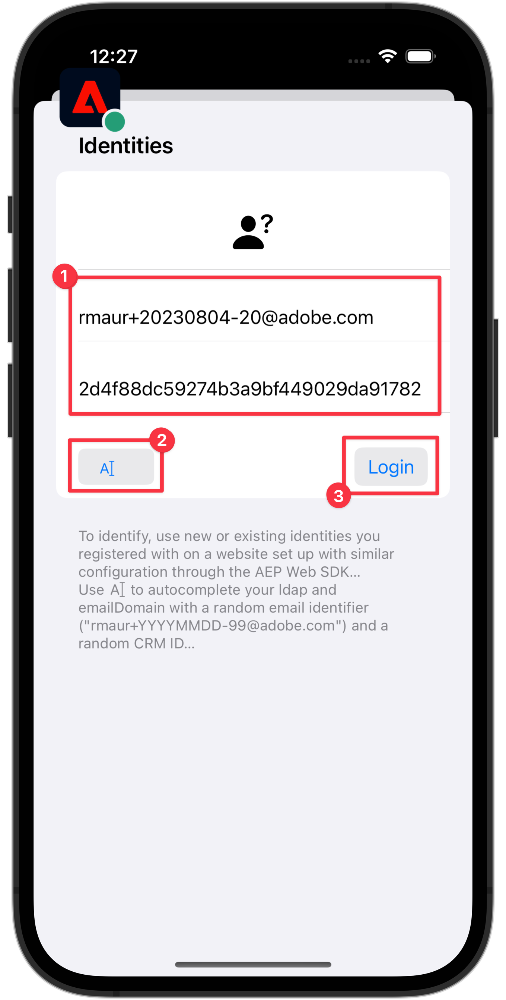

# Identiteitsgegevens verzamelen

Leer hoe u identiteitsgegevens kunt verzamelen in een mobiele app.

Met Adobe Experience Platform Identity Service kunt u uw klanten en hun gedrag beter zien. De services bieden een brug tussen identiteiten op verschillende apparaten en systemen en bieden u de mogelijkheid om in real-time effectieve, persoonlijke digitale ervaringen te bieden. Identiteitsvelden en naamruimten zijn de lijm die verschillende gegevensbronnen samenvoegt om het 360 graden klantenprofiel in real time te bouwen.

Leer meer over de [ uitbreiding van de Identiteit ](https://developer.adobe.com/client-sdks/documentation/identity-for-edge-network/) en de [ identiteitsdienst ](https://experienceleague.adobe.com/nl/docs/experience-platform/identity/home) in de documentatie.

## Vereisten

* App met SDK&#39;s geïnstalleerd en geconfigureerd met succes gemaakt en uitgevoerd.

## Leerdoelstellingen

In deze les zult u:

* Stel een naamruimte voor een aangepaste identiteit in.
* Identiteiten bijwerken.
* Valideer de identiteitsgrafiek.
* ECID en andere identiteiten ophalen.


## Een aangepaste naamruimte voor identiteiten instellen

Identiteitsnaamruimten zijn componenten van [ Dienst van de Identiteit ](https://experienceleague.adobe.com/nl/docs/experience-platform/identity/home) die als indicatoren van de context dienen waarop een identiteit betrekking heeft. Ze onderscheiden bijvoorbeeld de waarde `name@email.com` als e-mailadres of `443522` als een numerieke CRM-id.

>[!NOTE]
>
>De Mobile SDK genereert een unieke identiteit in een eigen naamruimte, de naam Experience Cloud ID (ECID), wanneer de toepassing wordt geïnstalleerd. Deze ECID wordt opgeslagen in permanent geheugen op het mobiele apparaat en wordt bij elke hit verzonden. De ECID wordt verwijderd wanneer de gebruiker de app verwijdert of wanneer de gebruiker de algemene privacystatus van Mobile SDK instelt op Weigeren. In de voorbeeldtoepassing Luma moet u de toepassing verwijderen en opnieuw installeren om een nieuw profiel met een eigen unieke ECID te maken.


Een nieuwe naamruimte maken:

1. Selecteer in de interface Gegevensverzameling de optie **[!UICONTROL Identities]** bij de navigatie links/rechts.
1. Selecteer **[!UICONTROL Create identity namespace]**.
1. Geef **[!UICONTROL Display name]** van `Luma CRM ID` en **[!UICONTROL Identity symbol]** de waarde `lumaCRMId` op.
1. Selecteer **[!UICONTROL Cross-device ID]**.
1. Selecteer **[!UICONTROL Create]**.

   {zoomable="yes"}


## Identiteiten bijwerken

U wilt zowel de standaardidentiteit (e-mail) als de aangepaste identiteit (Luma CRM-id) bijwerken wanneer de gebruiker zich aanmeldt bij de app.

>[!BEGINTABS]

>[!TAB  iOS ]

1. Navigeer naar **[!DNL Luma]** > **[!DNL Luma]** > **[!DNL Utils]** > **[!UICONTROL MobileSDK]** in de Xcode Project navigator en zoek de `func updateIdentities(emailAddress: String, crmId: String)` functie-implementatie. Voeg de volgende code toe aan de functie.

   ```swift
   // Set up identity map, add identities to map and update identities
   let identityMap: IdentityMap = IdentityMap()
   
   let emailIdentity = IdentityItem(id: emailAddress, authenticatedState: AuthenticatedState.authenticated)
   let crmIdentity = IdentityItem(id: crmId, authenticatedState: AuthenticatedState.authenticated)
   identityMap.add(item:emailIdentity, withNamespace: "Email")
   identityMap.add(item: crmIdentity, withNamespace: "lumaCRMId")
   
   Identity.updateIdentities(with: identityMap)
   ```

   Deze code:

   1. Maakt een leeg `IdentityMap` -object.

      ```swift
      let identityMap: IdentityMap = IdentityMap()
      ```

   1. Stelt `IdentityItem` -objecten in voor e-mail- en CRM-id.

      ```swift
      let emailIdentity = IdentityItem(id: emailAddress, authenticatedState: AuthenticatedState.authenticated)
      let crmIdentity = IdentityItem(id: crmId, authenticatedState: AuthenticatedState.authenticated)
      ```

   1. Voegt deze `IdentityItem` -objecten toe aan het `IdentityMap` -object.

      ```swift
      identityMap.add(item:emailIdentity, withNamespace: "Email")
      identityMap.add(item: crmIdentity, withNamespace: "lumaCRMId")
      ```

   1. Verzendt het `IdentityItem` -object als onderdeel van de `Identity.updateIdentities` API-aanroep naar de Edge Network.

      ```swift
      Identity.updateIdentities(with: identityMap) 
      ```

1. Navigeer naar **[!DNL Luma]** > **[!DNL Luma]** > **[!DNL Views]** > **[!DNL General]** > **[!UICONTROL LoginSheet]** in de Xcode-projectnavigator en zoek de uit te voeren code wanneer u de knop **[!UICONTROL Login]** selecteert. Voeg de volgende code toe:

   ```swift
   // Update identities
   MobileSDK.shared.updateIdentities(emailAddress: currentEmailId, crmId: currentCRMId)                             
   ```


>[!TAB  Android ]

1. Navigeer aan **[!UICONTROL Android]**  > **[!DNL app]** > **[!DNL kotlin+java]** > **[!DNL com.adobe.luma.tutorial.android]** > **[!UICONTROL models]** > **[!UICONTROL MobileSDK]** in de navigator van Android Studio en vind de `fun updateIdentities(emailAddress: String, crmId: String) ` functie implementatie. Voeg de volgende code toe aan de functie.

   ```kotlin
   // Set up identity map, add identities to map and update identities
   val identityMap = IdentityMap()
   
   val emailIdentity = IdentityItem(emailAddress, AuthenticatedState.AUTHENTICATED, true)
   val crmIdentity = IdentityItem(crmId, AuthenticatedState.AUTHENTICATED, true)
   identityMap.addItem(emailIdentity, "Email")
   identityMap.addItem(crmIdentity, "lumaCRMId")
   
   Identity.updateIdentities(identityMap)
   ```

   Deze code:

   1. Maakt een leeg `IdentityMap` -object.

      ```kotlin
      val identityMap = IdentityMap()
      ```

   1. Stelt `IdentityItem` -objecten in voor e-mail- en CRM-id.

      ```kotlin
      val emailIdentity = IdentityItem(emailAddress, AuthenticatedState.AUTHENTICATED, true)
      val crmIdentity = IdentityItem(crmId, AuthenticatedState.AUTHENTICATED, true)
      ```

   1. Voegt deze `IdentityItem` -objecten toe aan het `IdentityMap` -object.

      ```kotlin
      identityMap.addItem(emailIdentity, "Email")
      identityMap.addItem(crmIdentity, "lumaCRMId")
      ```

   1. Verzendt het `IdentityItem` -object als onderdeel van de `Identity.updateIdentities` API-aanroep naar de Edge Network.

      ```kotlin
      Identity.updateIdentities(identityMap)
      ```

1. Navigeer aan **[!UICONTROL Android]**  > **[!DNL app]** > **[!DNL kotlin+java]** > **[!DNL com.adobe.luma.tutorial.android]** > **[!UICONTROL views]** > **[!UICONTROL LoginSheet.kt]** in de navigator van Android Studio en vind de uit te voeren code wanneer het selecteren van de **[!UICONTROL Login]** knoop. Voeg de volgende code toe:

   ```kotlin
   // Update identities
   MobileSDK.shared.updateIdentities(
      MobileSDK.shared.currentEmailId.value,
      MobileSDK.shared.currentCRMId.value
   )                             
   ```


>[!ENDTABS]


>[!NOTE]
>
>U kunt meerdere identiteiten verzenden in één `updateIdentities` oproep. U kunt eerder verzonden identiteiten ook wijzigen.


## Een identiteit verwijderen

U kunt [`Identity.removeIdentity` gebruiken ](https://developer.adobe.com/client-sdks/documentation/identity-for-edge-network/api-reference/#removeidentity) API om de identiteit uit de opgeslagen cliënt-zijidentiteitskaart te verwijderen. De identiteitsextensie verzendt de id niet meer naar de Edge Network. Het gebruik van deze API verwijdert de id niet uit de identiteitsgrafiek aan de serverzijde. Zie [ identiteitsgrafieken van de Mening ](https://experienceleague.adobe.com/nl/docs/platform-learn/tutorials/identities/view-identity-graphs) voor meer informatie over identiteitsgrafieken.


>[!BEGINTABS]

>[!TAB  iOS ]

1. Navigeer naar **[!DNL Luma]** > **[!DNL Luma]** > **[!DNL Utils]** > **[!UICONTROL MobileSDK]** in de Xcode Project navigator en voeg de volgende code toe aan de `func removeIdentities(emailAddress: String, crmId: String)` functie:

   ```swift
   // Remove identities and reset email and CRM Id to their defaults
   Identity.removeIdentity(item: IdentityItem(id: emailAddress), withNamespace: "Email")
   Identity.removeIdentity(item: IdentityItem(id: crmId), withNamespace: "lumaCRMId")
   currentEmailId = "testUser@gmail.com"
   currentCRMId = "b642b4217b34b1e8d3bd915fc65c4452"
   ```

1. Navigeer naar **[!DNL Luma]** > **[!DNL Luma]** > **[!DNL Views]** > **[!DNL General]** > **[!UICONTROL LoginSheet]** in de Xcode-projectnavigator en zoek de uit te voeren code wanneer u de knop **[!UICONTROL Logout]** selecteert. Voeg de volgende code toe:

   ```swift
   // Remove identities
   MobileSDK.shared.removeIdentities(emailAddress: currentEmailId, crmId: currentCRMId)                  
   ```

>[!TAB  Android ]

1. Navigeer aan **[!UICONTROL Android]**  > **[!DNL app]** > **[!DNL kotlin+java]** > **[!DNL com.adobe.luma.tutorial.android]** > **[!UICONTROL models]** > **[!UICONTROL MobileSDK]** in de navigator van Android Studio en voeg de volgende code aan de `fun removeIdentities(emailAddress: String, crmId: String)` functie toe:

   ```kotlin
   // Remove identities and reset email and CRM Id to their defaults
   Identity.removeIdentity(IdentityItem(emailAddress), "Email")
   Identity.removeIdentity(IdentityItem(crmId), "lumaCRMId")
   currentEmailId.value = "testUser@gmail.com"
   currentCRMId.value = "112ca06ed53d3db37e4cea49cc45b71e"
   ```

1.Navigeer naar **[!DNL app]** > **[!DNL kotlin+java]** > **[!DNL com.adobe.luma.tutorial.android]** > **[!UICONTROL views]** > **[!UICONTROL LoginSheet.kt]** in de Android Studio-navigator en zoek naar de code die moet worden uitgevoerd wanneer u de knop **[!UICONTROL Logout]** selecteert. Voeg de volgende code toe:

```kotlin
// Remove identities
MobileSDK.shared.removeIdentities(
   MobileSDK.shared.currentEmailId.value,
   MobileSDK.shared.currentCRMId.value
)              
```


>[!ENDTABS]

## Valideren met Assurance

1. Herzie de [ sectie van opstellingsinstructies ](assurance.md#connecting-to-a-session) om uw simulator of apparaat met Assurance te verbinden.
1. In de app Luma
   1. Selecteer de tab **[!UICONTROL Home]** en verplaats het Assurance-pictogram naar links.
   1. Selecteer de  vanaf de rechterbovenhoek.

>[!BEGINTABS]

>[!TAB  iOS ]


>[!TAB  Android ]


>[!ENDTABS]

1. Geef een e-mailadres en een CRM-id op, of
1. Selecteren  (iOS) of **[!UICONTROL Generate Random Email]** (Android) om een **[!UICONTROL Email]** en **[!UICONTROL CRM ID]** willekeurig te genereren.
1. Selecteer **[!UICONTROL Login]**.

>[!BEGINTABS]

>[!TAB  iOS ]



>[!TAB  Android ]


>[!ENDTABS]

Terug in Assurance:

1. Ga naar de Assurance-webinterface voor de **[!UICONTROL Edge Identity Update Identities]** -gebeurtenis van de **[!UICONTROL com.adobe.griffon.mobile]** -leverancier.
1. Selecteer de gebeurtenis en bekijk de gegevens in het **[!UICONTROL ACPExtensionEventData]** -object. U moet de identiteiten zien die u hebt bijgewerkt.
   {zoomable="yes"}

## Valideren met identiteitsgrafiek

Zodra u de stappen in de [ les van Experience Platform ](platform.md) voltooit, kunt u de identiteit bevestigen vangen in de kijker van de identiteitsgrafiek van Experience Platform:

1. Selecteer **[!UICONTROL Identities]** in de gebruikersinterface voor gegevensverzameling.
1. Selecteer **[!UICONTROL Identity Graph]** in de bovenste balk.
1. Voer `Luma CRM ID` in als de **[!UICONTROL Identity namespace]** en uw CRM-id (bijvoorbeeld `24e620e255734d8489820e74f357b5c8` ) als de **[!UICONTROL Identity value]** .
1. U ziet de **[!UICONTROL Identities]** weergegeven.

   {zoomable="yes"}

>[!INFO]
>
>De toepassing bevat geen code om de ECID opnieuw in te stellen. U kunt de ECID alleen opnieuw instellen (en daadwerkelijk een nieuw profiel met een nieuwe ECID maken) door de toepassing te verwijderen en opnieuw te installeren. Om het terugstellen van herkenningstekens uit te voeren, zie [`Identity.resetIdentities` ](https://developer.adobe.com/client-sdks/documentation/mobile-core/identity/api-reference/#resetidentities) en [`MobileCore.resetIdentities` ](https://developer.adobe.com/client-sdks/documentation/mobile-core/api-reference/#resetidentities) API vraag. Ben zich ervan bewust dat wanneer u een herkenningsteken van het duw- bericht gebruikt (zie [ Verzendende dupberichten ](journey-optimizer-push.md)), dat herkenningsteken een andere &quot;kleverige&quot;profielherkenningsteken op het apparaat wordt.


>[!SUCCESS]
>
>U hebt nu een app ingesteld om de identiteiten in de Edge Network en (wanneer deze is ingesteld) in Adobe Experience Platform bij te werken.
>
>Bedankt dat je tijd hebt geïnvesteerd in het leren van Adobe Experience Platform Mobile SDK. Als u vragen hebt, algemene terugkoppelen willen delen, of suggesties over toekomstige inhoud hebben, hen op deze [ Communautaire besprekingspost van Experience League ](https://experienceleaguecommunities.adobe.com/t5/adobe-experience-platform-data/tutorial-discussion-implement-adobe-experience-cloud-in-mobile/td-p/443796) delen

Volgende: **[verzamel profielgegevens](profile.md)**
