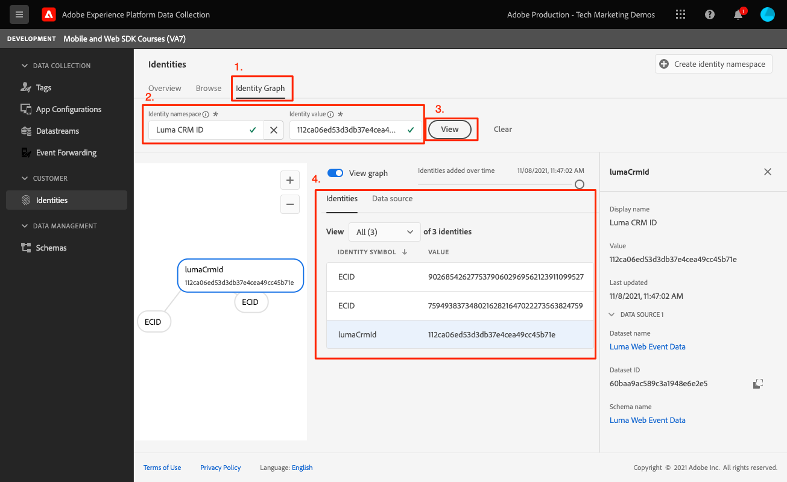

# Identiteit

Leer hoe u identiteitsgegevens kunt verzamelen in een mobiele app.

Met de Adobe Experience Platform Identity Service kunt u uw klanten en hun gedrag beter zien door identiteiten tussen apparaten en systemen te overbruggen, zodat u in real-time een indrukwekkende, persoonlijke digitale ervaring kunt bieden. Identiteitsvelden en naamruimten zijn de lijm die verschillende gegevensbronnen samenvoegt om het 360 graden klantenprofiel in real time te bouwen.

Meer informatie over de [Identiteitsextensie](https://developer.adobe.com/client-sdks/documentation/identity-for-edge-network/) en de [identiteitsservice](https://experienceleague.adobe.com/docs/experience-platform/identity/home.html?lang=nl) in de documentatie.

## Vereisten

* App met SDK&#39;s geïnstalleerd en geconfigureerd met succes gemaakt en uitgevoerd.

## Leerdoelstellingen

In deze les zult u:

* Een standaardidentiteit bijwerken.
* Stel een aangepaste identiteit in.
* Een aangepaste identiteit bijwerken.
* Valideer de identiteitsgrafiek.
* ECID en andere identiteiten ophalen.

## Een standaardidentiteit bijwerken

Begin door de identiteitskaart van de gebruiker bij te werken wanneer zij login.

1. Navigeren naar `Login.swift` als de toepassing Luma en de functie die wordt aangeroepen `loginButt`.

   In de voorbeeldtoepassing Luma is er geen validatie van gebruikersnaam of wachtwoord. Tik gewoon op de knoppen om u aan te melden.

1. Maak de `IdentityMap` en `IdentityItem`.

   ```swift
   let identityMap: IdentityMap = IdentityMap()
   let emailIdentity = IdentityItem(id: emailAddress, authenticatedState: AuthenticatedState.authenticated)
   ```

1. Voeg de `IdentityItem` aan de `IdentityMap`

   ```swift
   identityMap.add(item:emailIdentity, withNamespace: "Email")
   ```

1. Bellen `updateIdentities` om de gegevens naar het Netwerk van de Rand van het Platform te verzenden.

   ```swift
   Identity.updateIdentities(with: identityMap)
   ```

>[!NOTE]
>
>U kunt veelvoudige identiteiten in één enkele updateIdentities vraag verzenden. U kunt eerder verzonden identiteiten ook wijzigen.


## Een aangepaste naamruimte voor identiteiten instellen

Identiteitsnaamruimten zijn onderdelen van [Identiteitsservice](https://experienceleague.adobe.com/docs/experience-platform/identity/home.html?lang=en) die dienen als indicatoren van de context waarop een identiteit betrekking heeft. Ze onderscheiden bijvoorbeeld de waarde &quot;name@email.com&quot; als e-mailadres of &quot;443522&quot; als een numerieke CRM-id.

1. Selecteer in de interface Gegevensverzameling de optie **[!UICONTROL Identiteiten]** van de linkse spoorwegnavigatie.
1. Selecteren **[!UICONTROL Naamruimte maken]**.
1. Een **[!UICONTROL Weergavenaam]** van `Luma CRM ID` en **[!UICONTROL Identiteitssymbool]** waarde van `lumaCrmId`.
1. Selecteren **[!UICONTROL Apparaatoverschrijdende id]**.
1. Selecteer **[!UICONTROL Maken]**.


## Een aangepaste identiteit bijwerken

Nu u een douaneIdentiteit hebt gecreeerd, begin het te verzamelen door het te wijzigen `updateIdentities` code die u in de vorige stap hebt toegevoegd. U maakt gewoon een IdentityItem en voegt dit toe aan de IdentityMap. Zo ziet het volledige codeblok eruit:

```swift
//Hardcoded identity values
let emailAddress = "testuser@gmail.com"
let crmId = "112ca06ed53d3db37e4cea49cc45b71e"

// Create identity map
let identityMap: IdentityMap = IdentityMap()
// Add email (standard)
let emailIdentity = IdentityItem(id: emailAddress, authenticatedState: AuthenticatedState.authenticated)
identityMap.add(item:emailIdentity, withNamespace: "Email")
// Add lumaCrmId (custom)
let crmIdentity = IdentityItem(id: crmId, authenticatedState: AuthenticatedState.authenticated)
identityMap.add(item: crmIdentity, withNamespace: "lumaCrmId")
// Update
Identity.updateIdentities(with: identityMap)
```

## Een identiteit verwijderen

U kunt `removeIdentity` om de identiteit uit de opgeslagen cliënt-kant IdentityMap te verwijderen. De uitbreiding van de Identiteit houdt op verzendend het herkenningsteken naar het Netwerk van de Rand. Als u deze API gebruikt, wordt de id niet verwijderd uit de grafiek of de identiteitsgrafiek van het gebruikersprofiel aan de serverzijde.

Voeg het volgende toe `removeIdentity` code aan logout knoop klik binnen `Account.swift`.

```swift
// Logout
let logout = UIAlertAction(title: "Logout", style: .destructive, handler: { (action) -> Void in
    isLoggedIn = false;
    ////Hardcoded identity values
    let emailAddress = "testuser@gmail.com"
    let crmId = "112ca06ed53d3db37e4cea49cc45b71e"
    // Adobe Experience Platform - Remove Identity
    Identity.removeIdentity(item: IdentityItem(id: emailAddress), withNamespace: "Email")
    Identity.removeIdentity(item: IdentityItem(id: crmId), withNamespace: "lumaCrmId")
})
```

>[!NOTE]
>In de bovenstaande voorbeelden: `crmId` en `emailAddress` zijn hardcoded maar in een real-world app zouden de waarden dynamisch zijn.

## Valideren met betrouwbaarheid

1. Controleer de [installatie-instructies](assurance.md) en sluit de simulator of het apparaat aan op Betrouwbaarheid.
1. Selecteer in de app het accountpictogram rechtsonder.

   
1. Selecteer **Aanmelden** knop.
1. U krijgt de optie om een gebruikersnaam en wachtwoord in te voeren. Beide opties zijn optioneel en u kunt gewoon **Aanmelden**.

   
1. Kijk in het Web UI van de Verzekering voor het Web `Edge Identity Update Identities` gebeurtenis van de `com.adobe.griffon.mobile` leverancier.
1. Selecteer de gebeurtenis en bekijk de gegevens in het dialoogvenster `ACPExtensionEventData` object. U moet de identiteiten zien die u hebt bijgewerkt.
   

## Valideren met identiteitsgrafiek

Nadat u de stappen in het dialoogvenster [Experience Platform les](platform.md), kunt u ook de id capture bevestigen in de viewer voor identiteitsgrafieken van Platforms:




Volgende: **[Profiel](profile.md)**

>[!NOTE]
>
>Bedankt dat u tijd hebt geïnvesteerd in het leren van Adobe Experience Platform Mobile SDK. Als u vragen hebt, algemene feedback wilt delen of suggesties voor toekomstige inhoud hebt, kunt u deze delen over deze [Experience League Communautaire discussiestuk](https://experienceleaguecommunities.adobe.com/t5/adobe-experience-platform-launch/tutorial-discussion-implement-adobe-experience-cloud-in-mobile/td-p/443796)