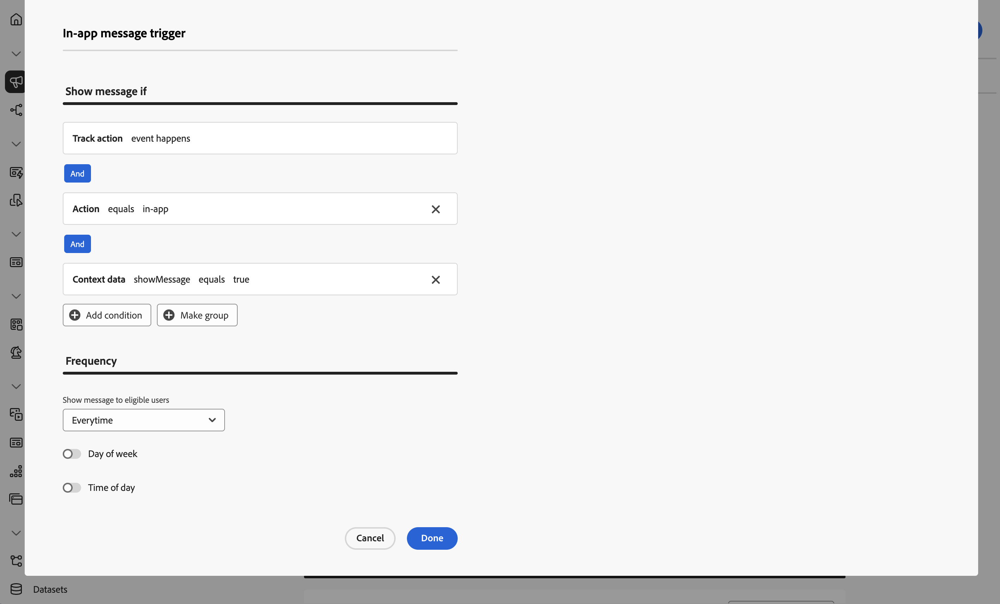

# In-app berichten maken en verzenden

Leer hoe u in-app berichten voor mobiele apps maakt met Experience Platform Mobile SDK en Journey Optimizer.

Met Journey Optimizer kunt u campagnes maken om in-app berichten naar bepaalde doelgroepen te verzenden. Campagnes in Journey Optimizer worden gebruikt om via verschillende kanalen eenmalige inhoud aan een specifiek publiek te leveren. Met campagnes, worden de acties uitgevoerd gelijktijdig, of onmiddellijk, of gebaseerd op een gespecificeerd programma. Wanneer het gebruiken van reizen (zie [ Journey Optimizer duw berichten ](journey-optimizer-push.md) les), worden de acties uitgevoerd in opeenvolging.

{zoomable="yes"}

Voordat u in-app berichten verzendt met Journey Optimizer, moet u ervoor zorgen dat de juiste configuraties en integratie aanwezig zijn. Om de in-app overseinenstroom in Journey Optimizer te begrijpen, verwijs naar [ de documentatie ](https://experienceleague.adobe.com/en/docs/journey-optimizer/using/in-app/inapp-configuration).

>[!NOTE]
>
>Deze les is optioneel en is alleen van toepassing op Journey Optimizer-gebruikers die in-app berichten willen verzenden.


## Vereisten

* App met SDK&#39;s geïnstalleerd en geconfigureerd met succes gemaakt en uitgevoerd.
* Stel de app in voor Adobe Experience Platform.
* De toegang tot Journey Optimizer en [ voldoende toestemmingen voor dupberichten ](https://experienceleague.adobe.com/en/docs/journey-optimizer/using/push/push-config/push-configuration). U hebt ook voldoende machtigingen nodig voor de volgende Journey Optimizer-functies.
   * Campagnes beheren.
* Fysiek iOS-apparaat of simulator voor testen.


## Leerdoelstellingen

In deze les zult u

* Maak een kanaalconfiguratie in Journey Optimizer.
* De Journey Optimizer-tagextensie installeren en configureren.
* Werk uw app bij om de Journey Optimizer-tagextensie te registreren.
* Instellingen valideren in Assurance.
* Definieer uw eigen campagne en berichtervaring in de app in Journey Optimizer.
* Verzend uw eigen in-app-bericht vanuit de app.

## Instellen

>[!TIP]
>
>Als u opstelling uw milieu reeds als deel van [ Journey Optimizer duw overseinen ](journey-optimizer-push.md) les hebt, zou u sommige stappen in deze opstellingssectie reeds kunnen reeds uitgevoerd hebben.


### Een kanaalconfiguratie maken

Om te beginnen moet u een kanaalconfiguratie maken om meldingen van App-berichten van Journey Optimizer te kunnen verzenden.

1. Open in de Journey Optimizer-interface het menu **[!UICONTROL Channels]** > **[!UICONTROL General settings]** > **[!UICONTROL Channel configurations]** en selecteer vervolgens **[!UICONTROL Create channel configuration]** .

1. Voer een naam en beschrijving (optioneel) voor de configuratie in. Bijvoorbeeld `LumaInAppMessaging` en `Channel for in-app messaging` .

   >[!NOTE]
   >
   > Namen moeten beginnen met een letter (A-Z). Het mag alleen alfanumerieke tekens bevatten. U kunt ook onderstrepingsteken `_` -, punt `.` - en afbreekstreepjes `-` gebruiken.

1. Als u aangepaste of basislabels voor gegevensgebruik aan de configuratie wilt toewijzen, kunt u **[!UICONTROL Manage access]** selecteren. [ leer meer over de Controle van de Toegang van het Niveau van Objecten (OLAC) ](https://experienceleague.adobe.com/en/docs/journey-optimizer/using/access-control/object-based-access).

1. Selecteer het **In-app overseinen** kanaal.

1. Selecteer **[!UICONTROL Marketing action]**(s) om het toestemmingsbeleid aan de berichten te associëren die deze configuratie gebruiken. Alle toestemmingsbeleid verbonden aan de marketing actie wordt gebruikt om de voorkeur van uw klanten te respecteren. [ leer meer over marketing acties ](https://experienceleague.adobe.com/en/docs/journey-optimizer/using/privacy/consent/consent#surface-marketing-actions). Bijvoorbeeld: push-gericht.

1. Selecteer het platform waarvoor u de instellingen wilt definiëren. Met deze instelling kunt u de doelapp voor elk platform opgeven en zorgt u voor consistente levering van inhoud op meerdere platforms.

   >[!NOTE]
   >
   >Voor iOS- en Android-platforms is de levering uitsluitend gebaseerd op de toepassings-id. Als beide toepassingen dezelfde toepassings-id hebben, wordt inhoud geleverd aan beide toepassingen, ongeacht het platform dat is geselecteerd in de **[!UICONTROL Channel configuration]** .

1. Voer de app-id in voor het platform dat u wilt ondersteunen.

   {zoomable="yes"}

1. Selecteer **[!UICONTROL Submit]** om uw wijzigingen op te slaan.

### Gegevensstroomconfiguratie bijwerken

Werk de configuratie van Experience Edge bij om ervoor te zorgen dat gegevens die vanuit uw mobiele app naar de Edge Network worden verzonden, naar Journey Optimizer worden doorgestuurd.


1. Selecteer **[!UICONTROL Datastreams]** in de gebruikersinterface voor gegevensverzameling en selecteer de gegevensstroom, bijvoorbeeld **[!DNL Luma Mobile App]** .
1. Selecteer  voor **[!UICONTROL Experience Platform]** en selecteer  **[!UICONTROL Edit]** van het contextmenu.
1. In **[!UICONTROL Datastreams]** >  > **[!UICONTROL Adobe Experience Platform]** scherm, zorg ervoor **[!UICONTROL Adobe Journey Optimizer]** wordt geselecteerd. Zie {de montages van 0} Adobe Experience Platform [ voor meer informatie.](https://experienceleague.adobe.com/en/docs/experience-platform/datastreams/configure)
1. Selecteer **[!UICONTROL Save]** om de configuratie van de gegevensstroom op te slaan.


   {zoomable="yes"}


### Journey Optimizer-extensie installeren

Uw app werkt alleen met Journey Optimizer als u de eigenschap tag bijwerkt.

1. Navigeer naar **[!UICONTROL Tags]** > **[!UICONTROL Extensions]** > **[!UICONTROL Catalog]** .
1. Open uw eigenschap, bijvoorbeeld **[!DNL Luma Mobile App Tutorial]** .
1. Selecteer **[!UICONTROL Catalog]**.
1. Zoek naar de extensie **[!UICONTROL Adobe Journey Optimizer]** .
1. De extensie installeren.

Wanneer *slechts* gebruikend in-app berichten in uw app, in **[!UICONTROL Install Extension]** of **[!UICONTROL Configure Extension]**, te hoeven u om het even wat te vormen. Als u reeds de [ Push berichten ](journey-optimizer-push.md) les in het leerprogramma hebt gevolgd, ziet u dat voor het **[!UICONTROL Development]** milieu, de **[!UICONTROL AJO Push Tracking Experience Event Dataset]** dataset van de **[!UICONTROL Event Dataset]** lijst wordt geselecteerd.


### Journey Optimizer implementeren in de app

Zoals in vorige lessen is besproken, biedt het installeren van een extensie voor mobiele tags alleen de configuratie. Vervolgens moet u de Messaging SDK installeren en registreren. Als deze stappen niet duidelijk zijn, herzie [ installeer SDKs ](install-sdks.md) sectie.

>[!NOTE]
>
>Als u [ voltooide installeerde SDKs ](install-sdks.md) sectie, dan is SDK reeds geïnstalleerd en u kunt deze stap overslaan.
>

>[!BEGINTABS]

>[!TAB  iOS ]

1. In Xcode, zorg ervoor dat [ het Overseinen van AEP ](https://github.com/adobe/aepsdk-messaging-ios) aan de lijst van pakketten in de Afhankelijkheden van het Pakket wordt toegevoegd. Zie {de Manager van het Pakket van 0} Swift [.](install-sdks.md#swift-package-manager)
1. Navigeer naar **[!DNL Luma]** > **[!DNL Luma]** > **[!UICONTROL AppDelegate]** in de Xcode-projectnavigator.
1. Controleer of `AEPMessaging` deel uitmaakt van uw lijst met importbewerkingen.

   `import AEPMessaging`

1. Controleer of `Messaging.self` deel uitmaakt van de array met extensies die u registreert.

   ```swift
   let extensions = [
       AEPIdentity.Identity.self,
       Lifecycle.self,
       Signal.self,
       Edge.self,
       AEPEdgeIdentity.Identity.self,
       Consent.self,
       UserProfile.self,
       Places.self,
       Messaging.self,
       Optimize.self,
       Assurance.self
   ]
   ```

>[!TAB  Android ]

1. In de Studio van Android, zorg ervoor dat [ aepsdk-overseinen-android ](https://github.com/adobe/aepsdk-messaging-android) deel van de gebiedsdelen in **[!UICONTROL build.gradle.kts]** in **[!UICONTROL Android]**  > **[!UICONTROL Gradle Scripts]** uitmaakt. Zie [ Gradle ](install-sdks.md#gradle).
1. Navigeer aan **[!UICONTROL Android]**  **[!DNL app]** > **[!DNL kotlin+java]** > **[!UICONTROL com.adobe.luma.tutorial.android]** > **[!UICONTROL LumaApplication]** in de het projectnavigator van Android Studio.
1. Controleer of `com.adobe.marketing.mobile.Messaging` deel uitmaakt van uw lijst met importbewerkingen.

   `import import com.adobe.marketing.mobile.Messaging`

1. Controleer of `Messaging.EXTENSION` deel uitmaakt van de array met extensies die u registreert.

   ```kotlin
   val extensions = listOf(
       Identity.EXTENSION,
       Lifecycle.EXTENSION,
       Signal.EXTENSION,
       Edge.EXTENSION,
       Consent.EXTENSION,
       UserProfile.EXTENSION,
       Places.EXTENSION,
       Messaging.EXTENSION,
       Optimize.EXTENSION,
       Assurance.EXTENSION
   )
   ```

>[!ENDTABS]

## Setup valideren met Assurance

1. Herzie de [ sectie van opstellingsinstructies ](assurance.md#connecting-to-a-session) om uw simulator of apparaat met Assurance te verbinden.
1. Selecteer **[!UICONTROL Configure]** in de gebruikersinterface van Assurance.
   {zoomable="yes"}
1. Selecteer  knoop naast **[!UICONTROL In-App Messaging]**.
1. Selecteer **[!UICONTROL Save]**.
   {zoomable="yes"}
1. Selecteer **[!UICONTROL In-App Messaging]** in de linkernavigatie.
1. Selecteer het tabblad **[!UICONTROL Validation]**. Bevestig dat u geen fouten krijgt.

   {zoomable="yes"}


## Uw eigen bericht in de app maken

Als u uw eigen bericht in de app wilt maken, moet u een campagne in Journey Optimizer definiëren die een bericht in de app activeert op basis van gebeurtenissen die plaatsvinden. Deze gebeurtenissen kunnen zijn:

* naar Adobe Experience Platform verzonden gegevens;
* kern volgende gebeurtenissen, zoals actie, of staat of inzameling van PII- gegevens, door Mobile Core generische APIs;
* levenscyclusgebeurtenissen van toepassingen, zoals starten, installeren, upgraden, sluiten of vastlopen,
* gebeurtenissen voor geolocatie, zoals het betreden of afsluiten van een interessant punt.

In dit leerprogramma, gaat u de Mobiele Kern generische en uitbreiding-onafhankelijke APIs gebruiken (zie [ Mobiele Kern generische APIs ](https://developer.adobe.com/client-sdks/documentation/mobile-core/#mobile-core-generic-apis)) om gebeurtenis het volgen van gebruikersschermen, acties, en PII gegevens te vergemakkelijken. Gebeurtenissen die door deze API&#39;s worden gegenereerd, worden gepubliceerd naar de SDK-gebeurtenishub en zijn beschikbaar voor gebruik door extensies. De SDK-gebeurtenishub biedt de basisgegevensstructuur die is gekoppeld aan alle SDK-extensies voor mobiele platforms. De gebeurtenishub onderhoudt een lijst van geregistreerde uitbreidingen en interne modules, een lijst van geregistreerde gebeurtenisluisteraars, en een gedeeld staatsgegevensbestand.

De SDK-gebeurtenishub publiceert en ontvangt gebeurtenisgegevens van geregistreerde extensies om de integratie met Adobe en oplossingen van derden te vereenvoudigen. Wanneer bijvoorbeeld de extensie Optimize is geïnstalleerd, verwerkt de gebeurtenishub alle verzoeken en interacties met de aanbiedingsengine Journey Optimizer - Decision Management.

1. Selecteer in de gebruikersinterface van Journey Optimizer de optie **[!UICONTROL Campaigns]** in het linkerspoor.
1. Selecteer **[!UICONTROL Create Campaign]**.
1. In de **[!UICONTROL Create your campaign]** dialoog, uitgezochte  **[!UICONTROL Scheduled - Marketing]** en selecteert **[!UICONTROL Confirm]**.
1. In het **[!UICONTROL Campaign - *YYYY-MM-DD HH :MM: SS UTC+XX:XX*]** scherm:

   1. Op het tabblad **[!UICONTROL Properties]** :

      1. Voer bijvoorbeeld een naam in voor de campagne `Luma Mobile In-App Campaign` .
      1. Voeg desgewenst een beschrijving toe.


   1. Selecteer het tabblad **[!UICONTROL Action]**. 

      1. Onder **[!UICONTROL Show message if]**, uitgezocht  toe **[!UICONTROL Add action]**. Selecteer **[!UICONTROL In-app message]** in het keuzemenu.
      1. Selecteer uw configuratie in het vervolgkeuzemenu **[!UICONTROL In-app message configuration]** . Bijvoorbeeld **[!UICONTROL LumaInAppMessaging]** .
      1. Selecteer  **[!UICONTROL Edit triggers]**.
      1. In het dialoogvenster **[!UICONTROL In-app message trigger]** :

         1. Selecteer **[!UICONTROL Application launch]** en selecteer **[!UICONTROL Track action]** in het vervolgkeuzemenu.
         1. Selecteer  **[!UICONTROL Add condition]**.
         1. Selecteer **[!UICONTROL Action]** en **[!UICONTROL equals]** in de vervolgkeuzemenu&#39;s.
         1. Voer `in-app` in.
         1. Selecteer  **[!UICONTROL Add condition]**.
         1. Selecteer **[!UICONTROL Context data]** in de vervolgkeuzelijst en voer `showMessage` in.
         1. Selecteer **[!UICONTROL equals]** in de vervolgkeuzelijst en voer `true` in.

            {zoomable="yes"} uit
         1. Selecteer **[!UICONTROL Done]**.

   1. Selecteer de tab **[!UICONTROL Content]** in het scherm met de hoofddefinitie van de campagne.

      1. Schakel **[!UICONTROL Advanced formatting]** in.
      1. Selecteer **[!UICONTROL Modal]** als de **[!UICONTROL Messaging layout]** . Selecteer **[!UICONTROL Switch layout]** in het dialoogvenster **[!UICONTROL Change layout]** .
      1. Op het tabblad **[!UICONTROL Content]** .
         1. Voer `https://luma.enablementadobe.com/content/dam/luma/en/logos/Luma_Logo.png` in voor de **[!UICONTROL Media URL]** .
         1. Voer bijvoorbeeld een **[!UICONTROL Header]** `Welcome to this Luma In-App Message` in en voer een **[!UICONTROL Body]** in, bijvoorbeeld `Triggered by pushing that button in the app...` .

         {zoomable="yes"}

      1. Selecteer **[!UICONTROL Settings]** tab.
         1. Selecteer **[!UICONTROL Customize size]** in **[!UICONTROL Message]** .
         1. Schakel **[!UICONTROL Fit to content]** uit.
         1. Stel **[!UICONTROL Height]** in op **[!UICONTROL 75%]** .

         {zoomable="yes"}

1. Selecteer **[!UICONTROL Review to activate]**. Om naar keuze om het even welke configuraties voor **[!UICONTROL Content]** uit te geven, **[!UICONTROL Properties]**, **[!UICONTROL Actions]**, of meer, uitgezocht  uit.
1. In het **[!UICONTROL Review to activate (*campagnenaam *)]**&#x200B;scherm, selecteer **[!UICONTROL Activate]**.
1. Na een tijdje, ziet u uw **_campagnenaam_** met status **[!UICONTROL Live]** in de **[!UICONTROL Campaigns]** lijst.
   {zoomable="yes"}


## Het bericht in de app activeren

U beschikt over alle ingrediënten om een bericht in de app te verzenden. Dit bericht in de app blijft in de app geactiveerd.

>[!BEGINTABS]

>[!TAB  iOS ]

1. Ga naar **[!DNL Luma]** > **[!DNL Luma]** > **[!DNL Utils]** > **[!UICONTROL MobileSDK]** in de Xcode-projectnavigator. Vind de `func sendTrackAction(action: String, data: [String: Any]?)` functie, en voeg de volgende code toe, die de [`MobileCore.track` ](https://developer.adobe.com/client-sdks/documentation/mobile-core/api-reference/#trackaction) functie, die op de parameters `action` en `data` wordt gebaseerd roept.


   ```swift
   // Send trackAction event
   MobileCore.track(action: action, data: data)
   ```

1. Ga naar **[!DNL Luma]** > **[!DNL Luma]** > **[!DNL Views]** > **[!DNL General]** > **[!UICONTROL ConfigView]** in de Xcode Project Navigator. Zoek de code voor de knoop van het Bericht in-App en voeg de volgende code toe:

   ```swift
   // Setting parameters and calling function to send in-app message
   Task {
       MobileSDK.shared.sendTrackAction(action: "in-app", data: ["showMessage": "true"])
   }
   ```

>[!TAB  Android ]

1. Ga naar **[!UICONTROL Android]**  > **[!DNL app]** > **[!DNL kotlin+java]** > **[!DNL com.adobe.luma.tutorial.android]** > **[!DNL models]** > **[!UICONTROL MobileSDK]** in de navigator van Android Studio. Vind de `fun sendTrackAction(action: String, data: Map<String, String>?)` functie, en voeg de volgende code toe, die de [`MobileCore.track` ](https://developer.adobe.com/client-sdks/documentation/mobile-core/api-reference/#trackaction) functie, die op de parameters `action` en `data` wordt gebaseerd roept.


   ```kotlin
   // Send trackAction event
   MobileCore.track(action, data)
   ```

1. Ga naar **[!UICONTROL Android]**  > **[!DNL app]** > **[!DNL kotlin+java]** > **[!DNL com.adobe.luma.tutorial.androi]** > **[!DNL views]** > **[!UICONTROL ConfigView.kt]** in de navigator van Android Studio. Zoek de code voor de `onInAppMessageClick` handlerknop en voeg de volgende code toe:

   ```kotlin
   // Setting parameters and calling function to send in-app message
   MobileSDK.shared.sendTrackAction(
       "in-app",
       mapOf("showMessage" to "true")
   )
   ```

>[!ENDTABS]

## Valideren met uw app

U kunt de berichten in de app valideren vanuit de app zelf.

>[!BEGINTABS]

>[!TAB  iOS ]

1. Rebuild en stel app in werking in de simulator of op een fysiek apparaat van Xcode, gebruikend .

1. Ga naar het tabblad **[!UICONTROL Settings]**.

1. Tik op **[!UICONTROL In-App Message]**. Het bericht in de app wordt weergegeven in uw app.

   


>[!TAB  Android ]

1. Rebuild en stel app in werking in de simulator of op een fysiek apparaat van de Studio van Android, gebruikend .

1. Ga naar het tabblad **[!UICONTROL Settings]**.

1. Tik op **[!UICONTROL In-App Message]**. Het bericht in de app wordt weergegeven in uw app.

   


>[!ENDTABS]


## Implementatie valideren in Assurance

U kunt uw berichten in de app valideren in de gebruikersinterface van Assurance.

1. Herzie de [ sectie van opstellingsinstructies ](assurance.md#connecting-to-a-session) om uw simulator of apparaat met Assurance te verbinden.
1. Selecteer **[!UICONTROL In-App Messaging]**.
1. Selecteer **[!UICONTROL Event List]**.
1. Selecteer een **[!UICONTROL Display message]** -item.
1. Inspecteer de onbewerkte gebeurtenis, met name de `html` , die de volledige lay-out en inhoud van het bericht in de app bevat.
   {zoomable="yes"}


## Volgende stappen

U moet nu over alle gereedschappen beschikken om waar nodig en van toepassing in-app berichten toe te voegen. Zo kunt u bijvoorbeeld producten promoten op basis van specifieke interacties die u in uw app bijhoudt.

>[!SUCCESS]
>
>U hebt de app voor berichten in de app ingeschakeld en een berichtcampagne in de app toegevoegd met Journey Optimizer en de Journey Optimizer-extensie voor de Experience Platform Mobile SDK.
>
>Bedankt dat je tijd hebt geïnvesteerd in het leren van Adobe Experience Platform Mobile SDK. Als u vragen hebt, algemene terugkoppelen willen delen, of suggesties over toekomstige inhoud hebben, hen op deze [ Communautaire besprekingspost van Experience League ](https://experienceleaguecommunities.adobe.com/t5/adobe-experience-platform-data/tutorial-discussion-implement-adobe-experience-cloud-in-mobile/td-p/443796) delen.

Volgende: **[creeer en vertoningsaanbiedingen](journey-optimizer-offers.md)**
