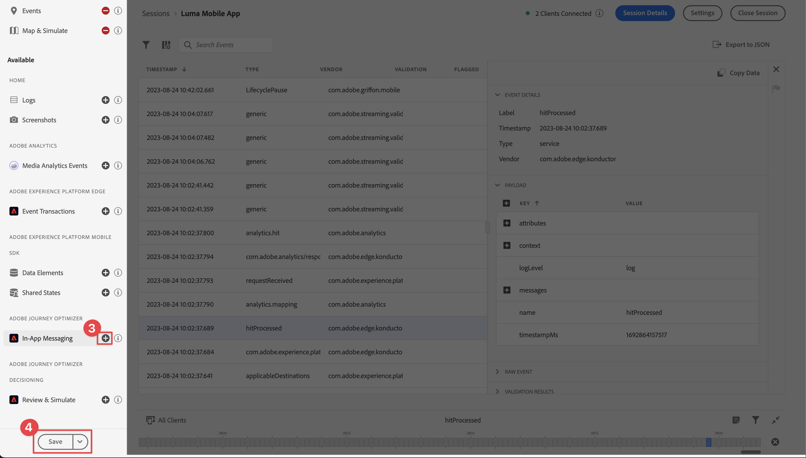
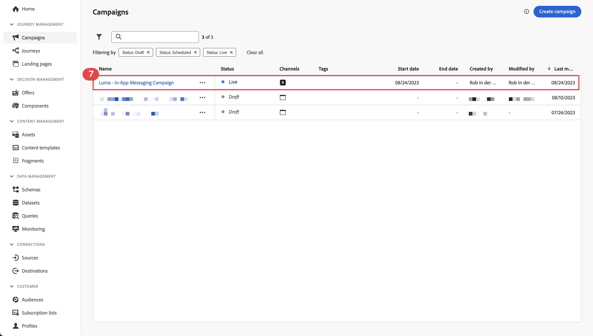

# In-app berichten maken en verzenden

Leer hoe u in-app berichten voor mobiele apps maakt met Experience Platform Mobile SDK en Journey Optimizer.

Met Journey Optimizer kunt u campagnes maken om in-app berichten naar bepaalde doelgroepen te verzenden. Campagnes in Journey Optimizer worden gebruikt om via verschillende kanalen eenmalige inhoud aan een specifiek publiek te leveren. Met campagnes, worden de acties uitgevoerd gelijktijdig, of onmiddellijk, of gebaseerd op een gespecificeerd programma. Wanneer het gebruiken van reizen (zie [ Journey Optimizer duw berichten ](journey-optimizer-push.md) les), worden de acties uitgevoerd in opeenvolging.


Voordat u in-app berichten verzendt met Journey Optimizer, moet u ervoor zorgen dat de juiste configuraties en integratie aanwezig zijn. Om de in-app overseinenstroom in Journey Optimizer te begrijpen, verwijs naar [ de documentatie ](https://experienceleague.adobe.com/docs/journey-optimizer/using/in-app/inapp-configuration.html?lang=en).

>[!NOTE]
>
>Deze les is optioneel en is alleen van toepassing op Journey Optimizer-gebruikers die in-app berichten willen verzenden.


## Vereisten

* App met SDK&#39;s geïnstalleerd en geconfigureerd met succes gemaakt en uitgevoerd.
* Stel de app in voor Adobe Experience Platform.
* Toegang tot Journey Optimizer en voldoende toestemmingen zoals die [ hier ](https://experienceleague.adobe.com/docs/journey-optimizer/using/push/push-config/push-configuration.html) worden beschreven. U hebt ook voldoende machtigingen nodig voor de volgende Journey Optimizer-functies.
   * Campagnes beheren.
* Fysiek iOS-apparaat of simulator voor testen.


## Leerdoelstellingen

In deze les zult u

* Maak een App Surface in AJO.
* De Journey Optimizer-tagextensie installeren en configureren.
* Werk uw app bij om de Journey Optimizer-tagextensie te registreren.
* Instellingen valideren in Assurance.
* Definieer uw eigen campagne en berichtervaring in de app in Journey Optimizer.
* Verzend uw eigen in-app-bericht vanuit de app.

## Instellen

>[!TIP]
>
>Als u opstelling uw milieu reeds als deel van [ Journey Optimizer duw overseinen ](journey-optimizer-push.md) les hebt, zou u sommige stappen in deze opstellingssectie reeds kunnen reeds uitgevoerd hebben.


### Een kanaalconfiguratie maken in Journey Optimizer

Om te beginnen moet u een kanaalconfiguratie maken om meldingen van App-berichten van Journey Optimizer te kunnen verzenden.

1. Open in de Journey Optimizer-interface het menu **[!UICONTROL Channels]** > **[!UICONTROL General settings]** > **[!UICONTROL Channel configurations]** en selecteer vervolgens **[!UICONTROL Create channel configuration]** .

   

1. Voer een naam en beschrijving (optioneel) voor de configuratie in.

   >[!NOTE]
   >
   > Namen moeten beginnen met een letter (A-Z). Het mag alleen alfanumerieke tekens bevatten. U kunt ook onderstrepingsteken `_` -, punt `.` - en afbreekstreepjes `-` gebruiken.


1. Als u aangepaste of basislabels voor gegevensgebruik aan de configuratie wilt toewijzen, kunt u **[!UICONTROL Manage access]** selecteren. [ leer meer over de Controle van de Toegang van het Niveau van Objecten (OLAC) ](https://experienceleague.adobe.com/en/docs/journey-optimizer/using/access-control/object-based-access).

1. Selecteer het **In-app overseinen** kanaal.

1. Selecteer **[!UICONTROL Marketing action]**(s) om het toestemmingsbeleid aan de berichten te associëren gebruikend deze configuratie. Alle toestemmingsbeleid verbonden aan de marketing actie wordt gebruikt om de voorkeur van uw klanten te respecteren. [ leer meer over marketing acties ](https://experienceleague.adobe.com/en/docs/journey-optimizer/using/privacy/consent/consent#surface-marketing-actions).

1. Selecteer het platform waarvoor u de instellingen wilt definiëren. Op deze manier kunt u de doelapp voor elk platform opgeven en zorgt u voor consistente levering van inhoud op meerdere platforms.

   >[!NOTE]
   >
   >Voor iOS- en Android-platforms is de levering uitsluitend gebaseerd op de toepassings-id. Als beide toepassingen dezelfde toepassings-id hebben, wordt inhoud geleverd aan beide toepassingen, ongeacht het platform dat is geselecteerd in de **[!UICONTROL Channel configuration]** .

1. Selecteer **[!UICONTROL Submit]** om uw wijzigingen op te slaan.

   

### Gegevensstroomconfiguratie bijwerken

Werk de configuratie van Experience Edge bij om ervoor te zorgen dat gegevens die vanuit uw mobiele app naar de Edge Network worden verzonden, naar Journey Optimizer worden doorgestuurd.


1. Selecteer **[!UICONTROL Datastreams]** in de gebruikersinterface voor gegevensverzameling en selecteer de gegevensstroom, bijvoorbeeld **[!DNL Luma Mobile App]** .
1. Selecteer  voor **[!UICONTROL Experience Platform]** en selecteer  **[!UICONTROL Edit]** van het contextmenu.
1. In **[!UICONTROL Datastreams]** >  > **[!UICONTROL Adobe Experience Platform]** scherm, zorg ervoor **[!UICONTROL Adobe Journey Optimizer]** wordt geselecteerd. Zie {de montages van 0} Adobe Experience Platform ](https://experienceleague.adobe.com/docs/experience-platform/datastreams/configure.html?lang=en#aep) voor meer informatie.[
1. Selecteer **[!UICONTROL Save]** om de configuratie van de gegevensstroom op te slaan.


   


### Journey Optimizer-extensie installeren

Uw app werkt alleen met Journey Optimizer als u de eigenschap tag bijwerkt.

1. Navigeer naar **[!UICONTROL Tags]** > **[!UICONTROL Extensions]** > **[!UICONTROL Catalog]** .
1. Open uw eigenschap, bijvoorbeeld **[!DNL Luma Mobile App Tutorial]** .
1. Selecteer **[!UICONTROL Catalog]**.
1. Zoek naar de extensie **[!UICONTROL Adobe Journey Optimizer]** .
1. De extensie installeren.

Wanneer *slechts* gebruikend in-app berichten in uw app, in **[!UICONTROL Install Extension]** of **[!UICONTROL Configure Extension]**, te hoeven u om het even wat te vormen. Nochtans, als u reeds de [ Push berichten ](journey-optimizer-push.md) les in het leerprogramma hebt gevolgd, zult u zien dat voor het **[!UICONTROL Development]** milieu, de **[!UICONTROL AJO Push Tracking Experience Event Dataset]** dataset van de **[!UICONTROL Event Dataset]** lijst wordt geselecteerd.


### Journey Optimizer implementeren in de app

Zoals in vorige lessen is besproken, biedt het installeren van een extensie voor mobiele tags alleen de configuratie. Vervolgens moet u de Messaging SDK installeren en registreren. Als deze stappen niet duidelijk zijn, herzie [ installeer SDKs ](install-sdks.md) sectie.

>[!NOTE]
>
>Als u [ voltooide installeerde SDKs ](install-sdks.md) sectie, dan is SDK reeds geïnstalleerd en u kunt deze stap overslaan.
>

1. In Xcode, zorg ervoor dat [ het Overseinen van AEP ](https://github.com/adobe/aepsdk-messaging-ios) aan de lijst van pakketten in de Afhankelijkheden van het Pakket wordt toegevoegd. Zie {de Manager van het Pakket van 0} Swift ](install-sdks.md#swift-package-manager).[
1. Navigeer naar **[!DNL Luma]** > **[!DNL Luma]** > **[!UICONTROL AppDelegate]** in de Xcode-projectnavigator.
1. Controleer of `AEPMessaging` deel uitmaakt van uw lijst met importbewerkingen.

   `import AEPMessaging`

1. Controleer of `Messaging.self` deel uitmaakt van de array met extensies die u registreert.

   ```swift
   let extensions = [
       AEPIdentity.Identity.self,
       Lifecycle.self,
       Signal.self,
       Edge.self,
       AEPEdgeIdentity.Identity.self,
       Consent.self,
       UserProfile.self,
       Places.self,
       Messaging.self,
       Optimize.self,
       Assurance.self
   ]
   ```


## Setup valideren met Assurance

1. Herzie de [ sectie van opstellingsinstructies ](assurance.md#connecting-to-a-session) om uw simulator of apparaat met Assurance te verbinden.
1. Selecteer **[!UICONTROL Configure]** in de gebruikersinterface van Assurance.
   
1. Selecteer  knoop naast **[!UICONTROL In-App Messaging]**.
1. Selecteer **[!UICONTROL Save]**.
   
1. Selecteer **[!UICONTROL In-App Messaging]** in de linkernavigatie.
1. Selecteer het tabblad **[!UICONTROL Validation]**. Bevestig dat u geen fouten krijgt.

   


## Uw eigen bericht in de app maken

Als u uw eigen bericht in de app wilt maken, moet u een campagne in Journey Optimizer definiëren die een bericht in de app activeert op basis van gebeurtenissen die plaatsvinden. Deze gebeurtenissen kunnen zijn:

* naar Adobe Experience Platform verzonden gegevens;
* kern volgende gebeurtenissen, zoals actie, of staat of inzameling van PII- gegevens, door Mobile Core generische APIs;
* levenscyclusgebeurtenissen van toepassingen, zoals starten, installeren, upgraden, sluiten of vastlopen,
* gebeurtenissen voor geolocatie, zoals het betreden of afsluiten van een interessant punt.

In dit leerprogramma, gaat u de Mobiele Kern generische en uitbreiding-onafhankelijke APIs gebruiken (zie [ Mobiele Kern generische APIs ](https://developer.adobe.com/client-sdks/documentation/mobile-core/#mobile-core-generic-apis)) om gebeurtenis het volgen van gebruikersschermen, acties, en PII gegevens te vergemakkelijken. Gebeurtenissen die door deze API&#39;s worden gegenereerd, worden gepubliceerd naar de SDK-gebeurtenishub en zijn beschikbaar voor gebruik door extensies. De SDK-gebeurtenishub biedt de basisgegevensstructuur die is gekoppeld aan alle SDK-extensies van het mobiele platform, een lijst met geregistreerde extensies en interne modules, een lijst met geregistreerde gebeurtenislisteners en een database met gedeelde statussen.

De SDK-gebeurtenishub publiceert en ontvangt gebeurtenisgegevens van geregistreerde extensies om de integratie met Adobe en oplossingen van derden te vereenvoudigen. Wanneer bijvoorbeeld de extensie Optimize is geïnstalleerd, worden alle verzoeken en interacties met de aanbiedingsengine van Journey Optimizer - Decision Management afgehandeld door de gebeurtenishub.

1. Selecteer in de gebruikersinterface van Journey Optimizer de optie **[!UICONTROL Campaigns]** in het linkerspoor.
1. Selecteer **[!UICONTROL Create Campaign]**.
1. In het **[!UICONTROL Create Campaign]** -scherm:
   1. Selecteer **[!UICONTROL In-app message]** en selecteer bijvoorbeeld een toepassingsoppervlak in de lijst **[!UICONTROL App surface]** **[!DNL Luma Mobile App]** .
   1. Selecteren **[!UICONTROL Create]**
      
1. Voer in het definitiescherm Campagne op **[!UICONTROL Properties]** een **[!UICONTROL Name]** voor de campagne in, bijvoorbeeld `Luma - In-App Messaging Campaign` , en een **[!UICONTROL Description]** , bijvoorbeeld `In-app messaging campaign for Luma app` .
   
1. Schuif omlaag naar **[!UICONTROL Action]** en selecteer **[!UICONTROL Edit Content]** .
1. In het **[!UICONTROL In-App Message]** -scherm:
   1. Selecteer **[!UICONTROL Modal]** als de **[!UICONTROL Message Layout]** .
   2. Voer `https://luma.enablementadobe.com/content/dam/luma/en/logos/Luma_Logo.png` in voor de **[!UICONTROL Media URL]** .
   3. Voer bijvoorbeeld een **[!UICONTROL Header]** `Welcome to this Luma In-App Message` in en voer een **[!UICONTROL Body]** in, bijvoorbeeld `Triggered by pushing that button in the app...` .
   4. Voer **[!UICONTROL Dismiss]** in als de **[!UICONTROL Button #1 text (primary)]** .
   5. De voorvertoning wordt bijgewerkt.
   6. Selecteer **[!UICONTROL Review to activate]**.
      
1. In het **[!UICONTROL Review to activate (Luma - In-App Messaging Campaign)]** scherm, uitgezocht  in de **[!UICONTROL Schedule]** tegel uit.
   
1. Terug in het **[!DNL Luma - In-App Messaging Campaign]** scherm, uitgezocht  **[!UICONTROL Edit triggers]** uit.
1. In het dialoogvenster **[!UICONTROL In-app message trigger]** configureert u de details van de handeling track waarmee het bericht in de app wordt geactiveerd:
   1. Om **[!UICONTROL Application launch event]** te verwijderen, selecteer .
   1. Het gebruik  toe **[!UICONTROL Add condition]** herhaaldelijk om de volgende logica voor **[!UICONTROL Show message if]** te bouwen.
   1. Klik op **[!UICONTROL Done]**.
      

   U hebt een handeling track gedefinieerd, waarbij de waarde **[!UICONTROL Action]** gelijk is aan `in-app` en de waarde **[!UICONTROL Context data]** aan de handeling een sleutelwaardepaar is van `"showMessage" : "true"` .

1. Selecteer **[!UICONTROL Review to activate]** weer in het **[!DNL Luma - In-App Messaging Campaign]** -scherm.
1. Selecteer **[!UICONTROL Activate]** in het **[!UICONTROL Review to activate (Luma - In-App Messaging Campaign)]** -scherm.
1. U ziet de **[!DNL Luma - In-App Messaging Campaign]** with status **[!UICONTROL Live]** in de lijst **[!UICONTROL Campaigns]** .
   


## Het bericht in de app activeren

U beschikt over alle ingrediënten om een bericht in de app te verzenden. Dit bericht in de app blijft in de app geactiveerd.

1. Ga naar **[!DNL Luma]** > **[!DNL Luma]** > **[!DNL Utils]** > **[!UICONTROL MobileSDK]** in de Xcode-projectnavigator. Vind de `func sendTrackAction(action: String, data: [String: Any]?)` functie, en voeg de volgende code toe, die de [`MobileCore.track` ](https://developer.adobe.com/client-sdks/documentation/mobile-core/api-reference/#trackaction) functie, die op de parameters `action` en `data` wordt gebaseerd roept.


   ```swift
   // Send trackAction event
   MobileCore.track(action: action, data: data)
   ```

1. Ga naar **[!DNL Luma]** > **[!DNL Luma]** > **[!DNL Views]** > **[!DNL General]** > **[!UICONTROL ConfigView]** in de Xcode Project Navigator. Zoek de code voor de knoop van het Bericht in-App en voeg de volgende code toe:

   ```swift
   // Setting parameters and calling function to send in-app message
   Task {
       MobileSDK.shared.sendTrackAction(action: "in-app", data: ["showMessage": "true"])
   }
   ```

## Valideren met uw app

1. Rebuild en stel app in werking in de simulator of op een fysiek apparaat van Xcode, gebruikend .

1. Ga naar de tab **[!UICONTROL Settings]** .

1. Tik op **[!UICONTROL In-App Message]**. Het bericht in de app wordt weergegeven in uw app.

   


## Implementatie valideren in Assurance

U kunt uw berichten in de app valideren in de gebruikersinterface van Assurance.

1. Herzie de [ sectie van opstellingsinstructies ](assurance.md#connecting-to-a-session) om uw simulator of apparaat met Assurance te verbinden.
1. Selecteer **[!UICONTROL In-App Messaging]**.
1. Selecteer **[!UICONTROL Event List]**.
1. Selecteer een **[!UICONTROL Display message]** -item.
1. Inspecteer de onbewerkte gebeurtenis, met name de `html` , die de volledige lay-out en inhoud van het bericht in de app bevat.
   


## Volgende stappen

U moet nu over alle gereedschappen beschikken om waar nodig en van toepassing in-app berichten toe te voegen. Zo kunt u bijvoorbeeld producten promoten op basis van specifieke interacties die u in uw app bijhoudt.

>[!SUCCESS]
>
>U hebt de app voor berichten in de app ingeschakeld en een berichtcampagne in de app toegevoegd met Journey Optimizer en de Journey Optimizer-extensie voor de Experience Platform Mobile SDK.
>
>Bedankt dat je tijd hebt geïnvesteerd in het leren van Adobe Experience Platform Mobile SDK. Als u vragen hebt, algemene terugkoppelen willen delen, of suggesties over toekomstige inhoud hebben, hen op deze [ Communautaire besprekingspost van Experience League ](https://experienceleaguecommunities.adobe.com/t5/adobe-experience-platform-data/tutorial-discussion-implement-adobe-experience-cloud-in-mobile/td-p/443796) delen.

Volgende: **[creeer en vertoningsaanbiedingen](journey-optimizer-offers.md)**
