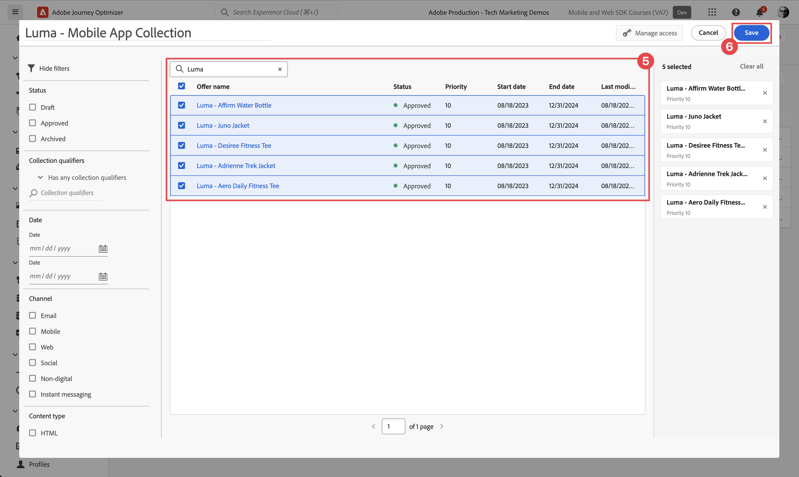

# Aanbiedingen maken en weergeven met Besluitbeheer

Leer hoe u aanbiedingen van Journey Optimizer Decision Management in uw mobiele apps kunt weergeven met Experience Platform Mobile SDK.

Met Journey Optimizer-Beslissingsbeheer kunt u uw klanten op elk aanraakpunt op het juiste moment de beste aanbieding en ervaring bieden. Als u ze eenmaal hebt ontworpen, richt u zich op uw publiek met persoonlijke aanbiedingen.


Beslissingsbeheer maakt personalisatie gemakkelijk met een centrale bibliotheek van marketingaanbiedingen en een beslissingsmotor die regels en beperkingen toepast op rijke, real-time profielen die door Adobe Experience Platform worden gecreëerd. Dientengevolge, laat het u toe om uw klanten de juiste aanbieding op het juiste ogenblik te verzenden. Zie [ Ongeveer Beslissingsbeheer ](https://experienceleague.adobe.com/docs/journey-optimizer/using/offer-decisioning/get-started-decision/starting-offer-decisioning.html?lang=en) voor meer informatie.


>[!NOTE]
>
>Deze les is optioneel en is alleen van toepassing op Journey Optimizer-gebruikers die de functie Beslissingsbeheer willen gebruiken om aanbiedingen in een mobiele app weer te geven.


## Vereisten

* App met SDK&#39;s geïnstalleerd en geconfigureerd met succes gemaakt en uitgevoerd.
* Stel de app in voor Adobe Experience Platform.
* Toegang tot Journey Optimizer - het Beheer van het Besluit met de juiste toestemmingen om aanbiedingen en besluiten te beheren zoals [ hier ](https://experienceleague.adobe.com/docs/journey-optimizer/using/access-control/privacy/high-low-permissions.html?lang=en#decisions-permissions) wordt beschreven.


## Leerdoelstellingen

In deze les zult u

* Werk uw Edge-configuratie bij voor Beslissingsbeheer.
* Werk de eigenschap tag bij met de extensie Offer Decisioning en Target.
* Werk uw schema bij om propositiegebeurtenissen vast te leggen.
* Instellingen valideren in Assurance.
* Maak een biedbesluit op basis van aanbiedingen in Journey Optimizer - Beslissingsbeheer.
* Werk uw app bij om de extensie Optimizer te registreren.
* Voer aanbiedingen van Beslissingsbeheer in uw app uit.


## Instellen

>[!TIP]
>
>Als u opstelling uw milieu reeds als deel van de [ tests A/B van de Opstelling met de les van het Doel ](target.md) hebt gehad, zou u sommige stappen in deze opstellingssectie reeds kunnen hebben uitgevoerd.

### Gegevensstroomconfiguratie bijwerken

Om ervoor te zorgen dat gegevens die van uw mobiele app naar Platform Edge Network worden verzonden, naar Journey Optimizer - Beslissingsbeheer worden doorgestuurd, werkt u uw gegevensstroom bij.

1. Selecteer **[!UICONTROL Datastreams]** in de gebruikersinterface voor gegevensverzameling en selecteer de gegevensstroom, bijvoorbeeld **[!DNL Luma Mobile App]** .
1. Selecteer  voor **[!UICONTROL Experience Platform]** en selecteer  **[!UICONTROL Edit]** van het contextmenu.
1. In **[!UICONTROL Datastreams]** >  > **[!UICONTROL Adobe Experience Platform]** scherm, zorg **[!UICONTROL Offer Decisioning]** ervoor, **[!UICONTROL Edge Segmentation]**, en **[!UICONTROL Adobe Journey Optimizer]** worden geselecteerd. Als u de les van het Doel zult doen, uitgezocht **[!UICONTROL Personalization Destinations]**, ook. Zie {de montages van 0} Adobe Experience Platform [ voor meer informatie.](https://experienceleague.adobe.com/docs/experience-platform/datastreams/configure.html?lang=en#aep)
1. Selecteer **[!UICONTROL Save]** om de configuratie van de gegevensstroom op te slaan.

   


### Journey Optimizer installeren - extensie voor beslissingstags

1. Navigeer naar **[!UICONTROL Tags]** , zoek de eigenschap mobile tag en open deze.
1. Selecteer **[!UICONTROL Extensions]**.
1. Selecteer **[!UICONTROL Catalog]**.
1. Zoek naar de extensie **[!UICONTROL Offer Decisioning and Target]** .
1. De extensie installeren. Voor de extensie is geen aanvullende configuratie vereist.

   


### Uw schema bijwerken

1. Navigeer naar de interface voor gegevensverzameling en selecteer **[!UICONTROL Schemas]** in de linkertrack.
1. Selecteer **[!UICONTROL Browse]** in de bovenste balk.
1. Selecteer het schema om het te openen.
1. In de schemaredacteur, voegt de uitgezochte  toe **[!UICONTROL Add]** naast de groepen van het Gebied.
1. In de **[!UICONTROL Add fields groups]** dialoog,  onderzoek naar `proposition`, selecteert **[!UICONTROL Experience Event - Proposition Interactions]** en selecteert **[!UICONTROL Add field groups]**. Deze veldgroep verzamelt de gegevens van de ervaringsgebeurtenis die relevant zijn voor aanbiedingen: wat aanbod wordt gepresenteerd, als onderdeel van welke verzameling, beslissing en andere parameters (zie later in deze les). Maar wat gebeurt er ook met het aanbod? Wordt het getoond, interactie met, gesloten, etc.
   
1. Selecteer **[!UICONTROL Save]** om de wijzigingen in uw schema op te slaan.


## Instellingen valideren in Assurance

Uw instellingen valideren in Assurance:

1. Ga naar de gebruikersinterface van Assurance.
1. Selecteer **[!UICONTROL Configure]** in linkerspoor en selecteer  naast **[!UICONTROL Validate Setup]** onder **[!UICONTROL OFFER DECISIONING AND TARGET]**.
1. Selecteer **[!UICONTROL Save]**.
1. Selecteer **[!UICONTROL Validate Setup]** in het linkerspoor. Zowel de gegevensstroominstelling als de SDK-instelling in uw toepassing worden gevalideerd.
   


## Plaatsing maken

Voordat u aanbiedingen kunt maken, moet u definiëren hoe en waar deze aanbiedingen in de mobiele app kunnen worden geplaatst. In Beslissingsbeheer definieert u plaatsingen voor dit doel en definieert u een plaatsing voor het mobiele kanaal dat een JSON-payload ondersteunt:

1. In Journey Optimizer UI, uitgezochte  **[!UICONTROL Components]** van **[!UICONTROL DECISION MANAGEMENT]** in het linkerspoor.

1. Selecteer **[!UICONTROL Placements]** in de bovenste balk.

1. Als er geen plaatsing met de naam **[!UICONTROL Mobile JSON]** , **[!UICONTROL Mobile]** as **[!UICONTROL Channel type]** en **[!UICONTROL JSON]** as **[!UICONTROL Content type]** wordt vermeld, moet u een plaatsing maken. Anders, blijf [ aanbiedingen ](#create-offers) creëren.

De Mobile JSON-plaatsing maken:

1. Selecteer  plaatsing creëren.

   1. Voer in de sectie **[!UICONTROL Details]** `Mobile JSON` in als de **[!UICONTROL Name]** , selecteer **[!UICONTROL Mobile]** from **[!UICONTROL Channel type]** en **[!UICONTROL JSON]** from **[!UICONTROL Content type]** .
   1. Selecteer **[!UICONTROL Save]** om de plaatsing op te slaan.

   


## Aanbiedingen maken

1. In Journey Optimizer UI, uitgezochte  **[!UICONTROL Offers]** van **[!UICONTROL DECISION MANAGEMENT]** in het linkerspoor.
1. Selecteer **[!UICONTROL Offers]** in het scherm **[!UICONTROL Browse]** om de lijst met aanbiedingen weer te geven.
1. Selecteer **[!UICONTROL Create offer]**.
1. Selecteer **[!UICONTROL New offer]** in het dialoogvenster **[!UICONTROL Personalized offer]** en klik op **[!UICONTROL Next]** .
1. In de **[!UICONTROL Details]** -stap van **[!UICONTROL Create new personalized offer]** :
   1. Voer een **[!UICONTROL Name]** in voor de aanbieding, bijvoorbeeld `Luma - Juno Jacket` , en voer een **[!UICONTROL Start date and time]** en een **[!UICONTROL End date and time]** in. Buiten deze datums wordt de aanbieding niet geselecteerd door de beslissingsengine.
   1. Selecteer **[!UICONTROL Next]**.

      

1. In de **[!UICONTROL Add representations]** -stap van **[!UICONTROL Create new personalized offer]** :
   1. Selecteer  **[!UICONTROL Mobile]** van **[!UICONTROL Channel]** lijst, en selecteer **[!UICONTROL Mobile JSON]** van de **[!UICONTROL Placement]** lijst.
   1. Selecteer **[!UICONTROL Custom]** voor **[!UICONTROL Content]** .
   1. Selecteer **[!UICONTROL Add content]**. In het dialoogvenster **[!UICONTROL Add personalization]** :
      1. Als er een [!UICONTROL Mode] -kiezer beschikbaar is, controleert u of deze is ingesteld op **[!UICONTROL JSON]** .
      1. Voer de volgende JSON in:

         ```json
         { 
             "title": "Juno Jacket",
             "text": "On colder-than-comfortable mornings, you'll love warming up in the Juno All-Ways Performance Jacket, designed to compete with wind and chill. Built-in Cocona&trade; technology aids evaporation, while a special zip placket and stand-up collar keep your neck protected.", 
             "image": "https://luma.enablementadobe.com/content/dam/luma/en/products/women/tops/jackets/wj06-purple_main.jpg" 
         }  
         ```

      1. Selecteer **[!UICONTROL Save]**.

         
   1. Selecteer **[!UICONTROL Next]**.

      

1. In de stap **[!UICONTROL Add constraints]** van **[!UICONTROL Create new personalized offer]** :
   1. Stel **[!UICONTROL Priority]** in op `10` .
   1. Schakelen **[!UICONTROL Include capping]** uit.
   1. Selecteer **[!UICONTROL Next]**.

      

1. In de **[!UICONTROL Review]** -stap van **[!UICONTROL Create new personalized]** -aanbieding:
   1. Controleer de aanbieding en selecteer vervolgens **[!UICONTROL Finish]** .
   1. Selecteer **[!UICONTROL Save offer]** in het dialoogvenster **[!UICONTROL Save and approve]** .

1. Herhaal stap 3 - 8 om nog vier aanbiedingen met verschillende namen en inhoud te maken. Alle andere configuratiewaarden, bijvoorbeeld Begindatum en -tijd of Prioriteit, zijn vergelijkbaar met de eerste aanbieding die u hebt gemaakt. U kunt snel dubbele aanbiedingen maken en deze bewerken.

   1. In Journey Optimizer UI, uitgezochte  **[!UICONTROL Offers]** van het linkerspoor, dan uitgezochte Aanbiedingen van de hoogste bar.
   1. Selecteer de rij van de aanbieding die u hebt gemaakt.
   1. In de juiste ruit, uitgezochte  **[!UICONTROL More actions]** en van het contextmenu uitgezocht  **[!UICONTROL Duplicate]**.

      In de onderstaande tabel kunt u de vier andere aanbiedingen definiëren.

      | Naam van aanbieding | Inhoud aanbieden in JSON |
      |---|---|
      | Luminantie - Fles in water met bevestigen | `{ "title": "Affirm Water Bottle", "text": "You'll stay hydrated with ease with the Affirm Water Bottle by your side or in hand. Measurements on the outside help you keep track of how much you're drinking, while the screw-top lid prevents spills. A metal carabiner clip allows you to attach it to the outside of a backpack or bag for easy access.", "image": "https://luma.enablementadobe.com/content/dam/luma/en/products/gear/fitness-equipment/ug06-lb-0.jpg" }` |
      | Luminantie - Desiree Fitness Tee | `{ "title": "Desiree Fitness Tee", "text": "When you're too far to turn back, thank yourself for choosing the Desiree Fitness Tee. Its ultra-lightweight, ultra-breathable fabric wicks sweat away from your body and helps keeps you cool for the distance.", "image": "https://luma.enablementadobe.com/content/dam/luma/en/products/women/tops/tees/ws05-yellow_main.jpg" }` |
      | Luma - Adrienne Trek Jacket | `{ "title": "Adrienne Trek Jacket", "text": "You're ready for a cross-country jog or a coffee on the patio in the Adrienne Trek Jacket. Its style is unique with stand collar and drawstrings, and it fits like a jacket should.", "image": "https://luma.enablementadobe.com/content/dam/luma/en/products/women/tops/jackets/wj08-gray_main.jpg" }` |
      | Luma - Aero Daily Fitness Tee | `{ "title": "Aero Daily Fitness Tee", "text": "Need an everyday action tee that helps keep you dry? The Aero Daily Fitness Tee is made of 100% polyester wicking knit that funnels moisture away from your skin. Don't be fooled by its classic style; this tee hides premium performance technology beneath its unassuming look.", "image": "https://luma.enablementadobe.com/content/dam/luma/en/products/men/tops/tees/ms01-black_main.jpg" }` |

      {style="table-layout:fixed"}

1. Als laatste stap moet u een fallback-aanbieding maken. Dit is een aanbieding die naar klanten wordt gestuurd als ze niet in aanmerking komen voor andere aanbiedingen.
   1. Selecteer **[!UICONTROL Create offer]**.
   1. Selecteer **[!UICONTROL New offer]** in het dialoogvenster **[!UICONTROL Personalized offer]** van **[!UICONTROL Next]** .
   1. Voer in de **[!UICONTROL Details]** stap van **[!UICONTROL Create new fallback offer]** een **[!UICONTROL Name]** voor de aanbieding in, bijvoorbeeld `Luma - Fallback Offer` , en selecteer **[!UICONTROL Next]** .

   1. In de **[!UICONTROL Add representations]** -stap van **[!UICONTROL Create new fallback offer]** :
      1. Selecteer  **[!UICONTROL Mobile]** van **[!UICONTROL Channel]** lijst, en selecteer **[!UICONTROL Mobile JSON]** van **[!UICONTROL Placement]** lijst.
      1. Selecteer **[!UICONTROL Custom]** voor **[!UICONTROL Content]** .
      1. Selecteer **[!UICONTROL Add content]**.
      1. Voer in het dialoogvenster **[!UICONTROL Add personalization]** de volgende JSON in en selecteer **[!UICONTROL Save]** :

         ```json
         {  
            "title": "Luma",
            "text": "Your store for sports wear and equipment.", 
            "image": "https://luma.enablementadobe.com/content/dam/luma/en/logos/Luma_Logo.png" 
         }  
         ```

      1. Selecteer **[!UICONTROL Next]**.


1. In de **[!UICONTROL Review]** -stap van **[!UICONTROL Create new fallback]** -aanbieding:
   1. Controleer de aanbieding en selecteer vervolgens **[!UICONTROL Finish]** .
   1. Selecteer **[!UICONTROL Save offer]** in het dialoogvenster **[!UICONTROL Save and approve]** .

Je moet nu de volgende lijst met voorstellen hebben:


## Een verzameling maken

Als u een voorstel aan uw mobiele-app-gebruiker wilt aanbieden, moet u een aanbiedingsverzameling definiëren die bestaat uit een of meer van de aanbiedingen die u hebt gemaakt.

1. Selecteer in de gebruikersinterface van Journey Optimizer de optie **[!UICONTROL Offers]** in het linkerspoor.
1. Selecteer **[!UICONTROL Collections]** in de bovenste balk.
1. Selecteer  **[!UICONTROL Create collection]**.
1. Voer in het dialoogvenster **[!UICONTROL New collection]** een **[!UICONTROL Name]** voor uw verzameling in, bijvoorbeeld `Luma - Mobile App Collection` , selecteer **[!UICONTROL Create static collection]** en klik op **[!UICONTROL Next]** .
1. Selecteer in **[!DNL Luma - Mobile App Collection]** de aanbiedingen die u in de verzameling wilt opnemen. Kies voor deze zelfstudie de vijf aanbiedingen die u hebt gemaakt. U kunt de lijst eenvoudig filteren met het zoekveld, bijvoorbeeld door **[!DNL Luma]** te typen.
1. Selecteer **[!UICONTROL Save]**.

   


## Een beslissing nemen

De laatste stap bestaat uit het definiëren van een beslissing, die bestaat uit de combinatie van een of meer beslissingsbereiken en uw fallback-aanbod.

Een beslissingsbereik is een combinatie van een specifieke plaatsing (bijvoorbeeld HTML in een e-mail of JSON in een mobiele app) en een of meer evaluatiecriteria.

Een evaluatiecriterium is de combinatie van

* een aanbod-collectie;
* subsidiabiliteitsregels: is het aanbod bijvoorbeeld alleen beschikbaar voor een specifiek publiek;
* een rangschikkingsmethode: wanneer er meerdere aanbiedingen beschikbaar zijn waaruit u kunt kiezen, welke methode gebruikt u om deze te rangschikken (bijvoorbeeld op aanbiedingsprioriteit, met behulp van een formule of een AI-model).

Zie [ Zeer belangrijke stappen om aanbiedingen ](https://experienceleague.adobe.com/docs/journey-optimizer/using/offer-decisioning/get-started-decision/key-steps.html?lang=en) tot stand te brengen en te beheren als u beter wilt begrijpen hoe de plaatsen, de regels, de rangschikkingen, aanbiedingen, vertegenwoordiging, inzamelingen, besluiten, etc., op elkaar inwerken en op elkaar betrekking hebben. Deze les richt zich uitsluitend op het gebruik van de output van een besluit in plaats van op de flexibiliteit bij het bepalen van beslissingen binnen Journey Optimizer - Decision Management.

1. Selecteer in de gebruikersinterface van Journey Optimizer de optie **[!UICONTROL Offers]** in het linkerspoor.
1. Selecteer **[!UICONTROL Decisions]** in de bovenste balk.
1. Selecteer  **[!UICONTROL Create decision]**.
1. In de **[!UICONTROL Details]** -stap van **[!UICONTROL Create a new offer decision]** :
   1. Voer een **[!UICONTROL Name]** voor de beslissing in, bijvoorbeeld `Luma - Mobile App Decision` , voer **[!UICONTROL Start date and time]** en **[!UICONTROL End date and time]** in.
   1. Selecteer **[!UICONTROL Next]**.

1. In de **[!UICONTROL Add decision scopes]** -stap van **[!UICONTROL Create a new offer decision]** :
   1. Selecteer **[!UICONTROL Mobile JSON]** in de lijst van **[!UICONTROL Placement]** .
   1. In de **[!UICONTROL Evaluation Criteria]** tegel, uitgezocht  **[!UICONTROL Add]** toe.
      1. Selecteer in het dialoogvenster **[!UICONTROL Add Offer Collection]** de verzameling met aanbiedingen. Bijvoorbeeld **[!DNL Luma - Mobile App Collection]** .
      1. Selecteer **[!UICONTROL Add]**.

         
   1. Zorg ervoor dat **[!UICONTROL None]** is geselecteerd voor **[!UICONTROL Eligibility]** en dat **[!UICONTROL Offer priority]** is geselecteerd als **[!UICONTROL Ranking method]** .
   1. Selecteer **[!UICONTROL Next]**.

      .
1. In de **[!UICONTROL Add fallback offer]** -stap van **[!UICONTROL Create a new offer decision]** :
   1. Selecteer de fallback-aanbieding, bijvoorbeeld de **[!DNL Luma - Fallback offer]** .
   1. Selecteer **[!UICONTROL Next]**.
1. In de **[!UICONTROL Summary]** -stap van **[!UICONTROL Create a new offer decision]** :
   1. Selecteer **[!UICONTROL Finish]**.
   1. Selecteer **[!UICONTROL Save offer decision]** in het dialoogvenster **[!UICONTROL Save and activate]** .
   1. Op het tabblad **[!UICONTROL Decisions]** wordt uw beslissing met status **[!UICONTROL Live]** weergegeven.

Je biedingsbesluit, dat uit een reeks voorstellen bestaat, is nu klaar voor gebruik. Als u de beslissing in uw app wilt gebruiken, moet u in uw code naar het beslissingsbereik verwijzen.

1. Selecteer **[!UICONTROL Offers]** in de gebruikersinterface van Journey Optimizer.
1. Selecteer **[!UICONTROL Decisions]** in de bovenste balk.
1. Selecteer uw beslissing, bijvoorbeeld **[!DNL Luma - Mobile App Decision]** .
1. In de **[!UICONTROL Decision scopes]** tegel, uitgezochte  **[!UICONTROL Copy]**.
1. Selecteer **[!UICONTROL Decision scope]** in het contextmenu.
   
1. Gebruik om het even welke tekstredacteur om het beslissingswerkingsgebied voor later gebruik te kleven. Het beslissingsbereik heeft de volgende JSON-indeling.

   ```json
   {
       "xdm:activityId":"xcore:offer-activity:xxxxxxxxxxxxxxx",
       "xdm:placementId":"xcore:offer-placement:xxxxxxxxxxxxxxx"
   }
   ```

## Aanbiedingen in uw app implementeren

Zoals in vorige lessen is besproken, biedt het installeren van een extensie voor mobiele tags alleen de configuratie. Vervolgens moet u de Optimize SDK installeren en registreren. Als deze stappen niet duidelijk zijn, herzie [ installeer SDKs ](install-sdks.md) sectie.

>[!NOTE]
>
>Als u [ voltooide installeerde SDKs ](install-sdks.md) sectie, dan is SDK reeds geïnstalleerd en u kunt deze stap overslaan.
>

1. In Xcode, zorg ervoor dat [ AEP optimaliseert ](https://github.com/adobe/aepsdk-messaging-ios) aan de lijst van pakketten in de Afhankelijkheden van het Pakket wordt toegevoegd. Zie {de Manager van het Pakket van 0} Swift [.](install-sdks.md#swift-package-manager)
1. Navigeer naar **[!DNL Luma]** > **[!DNL Luma]** > **[!UICONTROL AppDelegate]** in de Xcode-projectnavigator.
1. Controleer of `AEPOptimize` deel uitmaakt van uw lijst met importbewerkingen.

   ```swift
   import AEPOptimize
   ```

1. Controleer of `Optimize.self` deel uitmaakt van de array met extensies die u registreert.

   ```swift
   let extensions = [
       AEPIdentity.Identity.self,
       Lifecycle.self,
       Signal.self,
       Edge.self,
       AEPEdgeIdentity.Identity.self,
       Consent.self,
       UserProfile.self,
       Places.self,
       Messaging.self,
       Optimize.self,
       Assurance.self
   ]
   ```

1. Navigeer naar **[!DNL Luma]** > **[!DNL Luma]** > **[!DNL Model]** > **[!DNL Data]** > **[!UICONTROL decisions]** in de Xcode-projectnavigator. Werk de waarden `activityId` en `placementId` bij met de gegevens van het beslissingsbereik die u hebt gekopieerd van de Journey Optimizer-interface.

1. Navigeer naar **[!DNL Luma]** > **[!DNL Luma]** > **[!DNL Utils]** > **[!UICONTROL MobileSDK]** in de Xcode-projectnavigator. Zoek de functie `func updatePropositionOD(ecid: String, activityId: String, placementId: String, itemCount: Int) async` . Voeg de volgende code toe:

   ```swift
   // set up the XDM dictionary, define decision scope and call update proposition API
   Task {  
      let ecid = ["ECID" : ["id" : ecid, "primary" : true] as [String : Any]]
      let identityMap = ["identityMap" : ecid]
      let xdmData = ["xdm" : identityMap]
      let decisionScope = DecisionScope(activityId: activityId, placementId: placementId, itemCount: UInt(itemCount))
      Optimize.clearCachedPropositions()
      Optimize.updatePropositions(for: [decisionScope], withXdm: xdmData)
   }
   ```

   Deze functie:

   * Hiermee stelt u een XDM-woordenboek `xdmData` in met de ECID om het profiel te identificeren waarvoor u de aanbiedingen moet presenteren.
   * bepaalt `decisionScope`, een voorwerp dat op het besluit gebaseerd is u in Journey Optimizer - de interface van het Beheer van het Besluit hebt bepaald en gebruikend het gekopieerde besluitvormingswerkingsgebied van [ wordt bepaald creeer een besluit ](#create-a-decision).  De toepassing Luma gebruikt een configuratiedossier (`decisions.json`) dat de werkingsgebiedparameters terugwint, die op het volgende formaat JSON worden gebaseerd:

     ```swift
     "scopes": [
         {
             "name": "name of the scope",
             "activityId": "xcore:offer-activity:xxxxxxxxxxxxxxx",
             "placementId": "xcore:offer-placement:xxxxxxxxxxxxxxx",
             "itemCount": 2
         }
     ]
     ```

     Nochtans, kunt u om het even welk soort implementatie gebruiken om te verzekeren optimaliseer APIs de juiste parameters (`activityId` krijgt, `placementId` en, `itemCount`), om een geldig [`DecisionScope` ](https://developer.adobe.com/client-sdks/documentation/adobe-journey-optimizer-decisioning/api-reference/#decisionscope) voorwerp voor uw implementatie te construeren. <br/> voor uw informatie: de andere zeer belangrijke-waarden in het `decisions.json` dossier zijn voor toekomstig gebruik en niet relevant en gebruikt momenteel in deze les en als deel van het leerprogramma.

   * roept twee APIs aan: [`Optimize.clearCachePropositions` ](https://support.apple.com/en-ie/guide/mac-help/mchlp1015/mac) en [`Optimize.updatePropositions` ](https://developer.adobe.com/client-sdks/documentation/adobe-journey-optimizer-decisioning/api-reference/#updatepropositions).  Met deze functies worden alle in de cache opgeslagen voorstellingen gewist en worden de voorstellingen voor dit profiel bijgewerkt.

1. Navigeer naar **[!DNL Luma]** > **[!DNL Luma]** > **[!DNL Views]** > **[!UICONTROL Personalization]** > **[!UICONTROL EdgeOffersView]** in de Xcode-projectnavigator. Zoek de functie `func onPropositionsUpdateOD(activityId: String, placementId: String, itemCount: Int) async` en inspecteer de code van deze functie. Het belangrijkste deel van deze functie is de [`Optimize.onPropositionsUpdate` ](https://developer.adobe.com/client-sdks/documentation/adobe-journey-optimizer-decisioning/api-reference/#onpropositionsupdate) API vraag, die

   * de voorstellen voor het huidige profiel ophaalt op basis van het beslissingsbereik (dat u hebt gedefinieerd in Journey Optimizer - Decision Management),
   * het aanbod uit het voorstel ophaalt;
   * de inhoud van de aanbieding opheft, zodat deze correct in de app kan worden weergegeven, en
   * activeert de `displayed()` -actie op de aanbieding die een gebeurtenis terugstuurt naar de Edge Network op de hoogte dat de aanbieding wordt weergegeven.

1. Nog steeds in **[!DNL EdgeOffersView]** , voeg de volgende code aan de `.onFirstAppear` bepaling toe. Deze code zorgt ervoor dat callback voor het bijwerken van de aanbiedingen slechts eenmaal wordt geregistreerd.

   ```swift
   // Invoke callback for offer updates
   Task {
       await self.onPropositionsUpdateOD(activityId: decision.activityId, placementId: decision.placementId, itemCount: decision.itemCount)
   }
   ```

1. Nog steeds in **[!UICONTROL EdgeOffersView]** , voeg de volgende code aan de `.task` bepaling toe. Met deze code worden de aanbiedingen bijgewerkt wanneer de weergave wordt vernieuwd.

   ```swift
   // Clear and update offers
   await self.updatePropositionsOD(ecid: currentEcid, activityId: decision.activityId, placementId: decision.placementId, itemCount: decision.itemCount)
   ```


## Valideren met de app

1. Rebuild en stel app in werking in de simulator of op een fysiek apparaat van Xcode, gebruikend .

1. Ga naar de tab **[!DNL Personalisation]** .

1. Selecteer **[!DNL Edge Personalisation]**.

1. Blader naar de bovenkant en u ziet twee willekeurige aanbiedingen uit de verzameling die u in de **[!DNL DECISION LUMA - MOBILE APP DECISION]** -tegel hebt gedefinieerd.

   

   De aanbiedingen zijn willekeurig, aangezien u alle aanbiedingen dezelfde prioriteit heeft gegeven en de rangorde voor het besluit is gebaseerd op prioriteit.


## Implementatie valideren in Assurance

De implementatie van aanbiedingen in Assurance valideren:

1. Herzie de [ sectie van opstellingsinstructies ](assurance.md#connecting-to-a-session) om uw simulator of apparaat met Assurance te verbinden.
1. Selecteer **[!UICONTROL Configure]** in linkerspoor en selecteer  naast **[!UICONTROL Review & Simulate]** onder **[!UICONTROL ADOBE JOURNEY OPTIMIZER DECISIONING]**.
1. Selecteer **[!UICONTROL Save]**.
1. Selecteer **[!UICONTROL Review & Simulate]** in het linkerspoor. Zowel de gegevensstroomopstelling wordt bevestigd als de opstelling van SDK in uw toepassing.
1. Selecteer **[!UICONTROL Requests]** op de bovenste balk. Uw **[!UICONTROL Offers]** -aanvragen worden weergegeven.
   

1. U kunt de tabbladen **[!UICONTROL Simulate]** en **[!UICONTROL Event List]** raadplegen voor meer functionaliteit en controleren of Journey Optimizer Decision Management is ingesteld.

## Volgende stappen

Nu hebt u alle gereedschappen om meer functionaliteit toe te voegen aan uw Journey Optimizer - Beslissingsbeheerimplementatie. Bijvoorbeeld:

* verschillende parameters toepassen op uw aanbiedingen (bijvoorbeeld prioriteit, aftopping)
* verzamel profielattributen in app (zie [ Profiel ](profile.md)) en gebruik deze profielattributen om publiek te bouwen. Gebruik deze soorten publiek vervolgens als onderdeel van de subsidiabiliteitsregels in uw besluit.
* meer dan één beslissingsbereik combineren.

>[!SUCCESS]
>
>U hebt de app ingeschakeld om aanbiedingen weer te geven met de Offer Decisioning- en Target-extensie voor de Experience Platform Mobile SDK.
>
>Bedankt dat je tijd hebt geïnvesteerd in het leren van Adobe Experience Platform Mobile SDK. Als u vragen hebt, algemene terugkoppelen willen delen, of suggesties over toekomstige inhoud hebben, hen op deze [ Communautaire besprekingspost van Experience League ](https://experienceleaguecommunities.adobe.com/t5/adobe-experience-platform-data/tutorial-discussion-implement-adobe-experience-cloud-in-mobile/td-p/443796) delen.

Volgende: **[voer A/B tests](target.md)** uit
