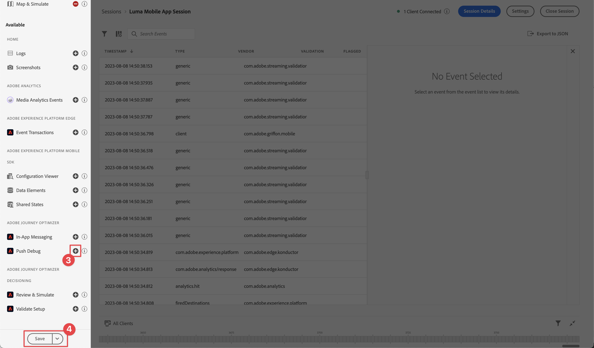
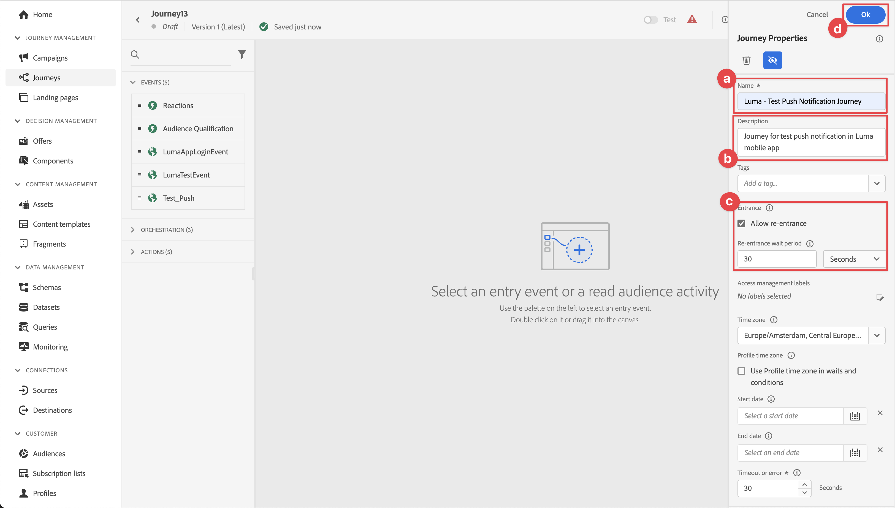
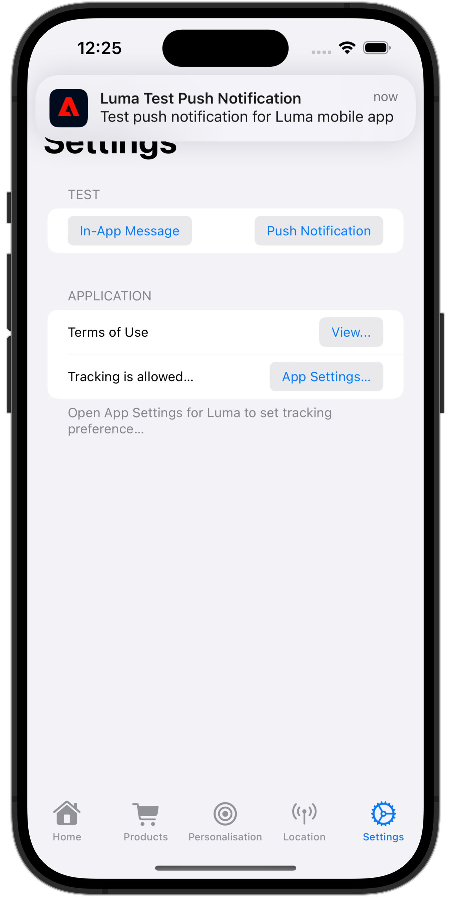

# Pushmeldingen maken en verzenden

Leer hoe u pushmeldingen voor mobiele apps maakt met Experience Platform Mobile SDK en Journey Optimizer.

Met Journey Optimizer kunt u reizen maken en berichten verzenden naar doelgroepen. Voordat u pushmeldingen verzendt met Journey Optimizer, moet u ervoor zorgen dat de juiste configuraties en integratie zijn geïnstalleerd. Als u de gegevensstroom van pushberichten in Journey Optimizer wilt begrijpen, raadpleegt u de [documentatie](https://experienceleague.adobe.com/docs/journey-optimizer/using/push/push-config/push-gs.html).


>[!NOTE]
>
>Deze les is optioneel en is alleen van toepassing op Journey Optimizer-gebruikers die pushberichten willen verzenden.


## Vereisten

* De app is gemaakt en uitgevoerd met SDK&#39;s geïnstalleerd en geconfigureerd.
* Stel de app in voor Adobe Experience Platform.
* Toegang tot Journey Optimizer en voldoende toegangsrechten zoals beschreven [hier](https://experienceleague.adobe.com/docs/journey-optimizer/using/push/push-config/push-configuration.html?lang=en). U hebt ook voldoende machtigingen nodig voor de volgende Journey Optimizer-functies.
   * Maak een toepassingsoppervlak.
   * Een journey maken.
   * Maak een bericht.
   * Voorinstellingen voor berichten maken.
* **Betaald Apple-ontwikkelingsaccount** met voldoende toegang om certificaten, id&#39;s en sleutels te maken.
* Fysiek iOS-apparaat of simulator voor testen.

## Leerdoelstellingen

In deze les zult u

* Registreer de toepassings-id bij de APNs (Apple Push Notification service).
* Maak een App Surface in Journey Optimizer.
* Werk uw schema bij om velden voor pushberichten op te nemen.
* Installeer en configureer de extensie Journey Optimizer.
* Werk uw app bij om de Journey Optimizer-tagextensie te registreren.
* Valideer installatie in Betrouwbaarheid.
* Een testbericht verzenden vanuit de Betrouwbaarheid
* Definieer uw eigen pushmelding voor een Journey Optimizer.
* Verzend uw eigen pushmelding vanuit de app.


## Instellen

>[!TIP]
>
>Als u uw omgeving al hebt ingesteld als onderdeel van de [Journey Optimizer in-app messaging](journey-optimizer-inapp.md) les, zou u sommige stappen in deze opstellingssectie reeds kunnen reeds uitgevoerd hebben.

### Toepassings-id registreren bij APNs

De volgende stappen zijn niet Adobe Experience Cloud-specifiek en zijn ontworpen om u door de configuratie van APNs te begeleiden.

#### Een persoonlijke sleutel maken

1. Navigeer in de Apple Developer Portal naar **[!UICONTROL Toetsen]**.
1. Selecteer **[!UICONTROL +]**.
   

1. Geef een **[!UICONTROL Sleutelnaam]**.
1. Selecteer de **[!UICONTROL Apple Push Notification-service] (APN&#39;s)** selectievakje.
1. Selecteren **[!UICONTROL Doorgaan]**.
   
1. Controleer de configuratie en selecteer **[!UICONTROL Registreren]**.
1. Download de `.p8` persoonlijke sleutel. Het wordt gebruikt in de configuratie van de Oppervlakte van de Toepassing later in deze les.
1. Noteer de **[!UICONTROL Sleutel-id]**. Het wordt gebruikt in de configuratie van de Oppervlakte van de App.
1. Noteer de **[!UICONTROL Team-id]**. Het wordt gebruikt in de configuratie van de Oppervlakte van de App.
   

Aanvullende documentatie kan [hier gevonden](https://help.apple.com/developer-account/#/devcdfbb56a3).

#### Een toepassingsoppervlak toevoegen aan gegevensverzameling

1. Van de [Interface voor gegevensverzameling](https://experience.adobe.com/data-collection/), selecteert u **[!UICONTROL Toepassingsoppervlakken]** in het linkerdeelvenster.
1. Als u een configuratie wilt maken, selecteert u **[!UICONTROL App-oppervlak maken]**.
   
1. Voer een **[!UICONTROL Naam]** voor de configuratie, bijvoorbeeld `Luma App Tutorial`  .
1. Van **[!UICONTROL Configuratie van mobiele toepassingen]**, selecteert u **[!UICONTROL Apple iOS]**.
1. Voer de bundel-id voor de mobiele app in het dialoogvenster **[!UICONTROL Toepassings-id (iOS-bundel-id)]** veld. Bijvoorbeeld,  `com.adobe.luma.tutorial.swiftui`.
1. Schakel de **[!UICONTROL Credentials duwen]** schakelen om uw referenties toe te voegen.
1. Sleep uw `.p8` **Apple Push Notification Authentication Key** bestand.
1. Geef de **[!UICONTROL Sleutel-id]**, een tekenreeks van 10 tekens die is toegewezen tijdens het maken van `p8` auth key. Het bestand is te vinden onder de **[!UICONTROL Toetsen]** in de **Certificaten, id&#39;s en profielen** pagina&#39;s van de Apple Developer-portal. Zie ook [Een persoonlijke sleutel maken](#create-a-private-key).
1. Geef de **[!UICONTROL Team-id]**. De team-id is een waarde die u kunt vinden onder de **Lidmaatschap** of boven aan de pagina Apple Developer Portal. Zie ook [Een persoonlijke sleutel maken](#create-a-private-key).
1. Selecteren **[!UICONTROL Opslaan]**.

   

### Gegevensstroomconfiguratie bijwerken

Om ervoor te zorgen dat gegevens die u van uw mobiele app naar het Edge-netwerk verzendt, naar Journey Optimizer worden doorgestuurd, werkt u de configuratie van Experience Edge bij.

1. Selecteer in de gebruikersinterface voor gegevensverzameling de optie **[!UICONTROL Gegevensstromen]** en selecteert u bijvoorbeeld uw gegevensstroom **[!DNL Luma Mobile App]**.
1. Selecteren  for **[!UICONTROL Experience Platform]** en selecteert u  **[!UICONTROL Bewerken]** in het contextmenu.
1. In de **[!UICONTROL Gegevensstromen]** >  >  **[!UICONTROL Adobe Experience Platform]** scherm:

   1. Als deze optie nog niet is geselecteerd, selecteert u **[!UICONTROL Dataset AJO-pushprofiel]** van **[!UICONTROL Profielgegevens]**. Deze profieldataset wordt vereist wanneer het gebruiken van `MobileCore.setPushIdentifier` API-aanroep (zie [Apparaattoken registreren voor pushberichten](#register-device-token-for-push-notifications)) die ervoor zorgt dat de unieke id voor pushmeldingen (ook wel push-id genoemd) wordt opgeslagen als onderdeel van het profiel van de gebruiker.

   1. **[!UICONTROL Adobe Journey Optimizer]** is geselecteerd. Zie [Adobe Experience Platform-instellingen](https://experienceleague.adobe.com/docs/experience-platform/datastreams/configure.html?lang=en#aep) voor meer informatie .

   1. Als u de configuratie van de gegevensstroom wilt opslaan, selecteert u **[!UICONTROL Opslaan]**.

   


### Journey Optimizer-extensie installeren

Uw app werkt alleen met Journey Optimizer als u de eigenschap tag bijwerkt.

1. Navigeren naar **[!UICONTROL Tags]** > **[!UICONTROL Extensies]** > **[!UICONTROL Catalogus]**,
1. De eigenschap openen, bijvoorbeeld **[!DNL Luma Mobile App Tutorial]**.
1. Selecteren **[!UICONTROL Catalogus]**.
1. Zoeken naar **[!UICONTROL Adobe Journey Optimizer]** extensie.
1. De extensie installeren.
1. In de **[!UICONTROL Extensie installeren]** dialoogvenster
   1. Selecteer bijvoorbeeld een omgeving **[!UICONTROL Ontwikkeling]**.
   1. Selecteer de **[!UICONTROL Dataset voor AJO-gebeurtenis voor het bijhouden van push]** gegevensset van de **[!UICONTROL Gebeurtenisgegevens]** lijst.
   1. Selecteren **[!UICONTROL Opslaan in bibliotheek en samenstellen]**.
      

>[!NOTE]
>
>Als u het niet ziet **[!UICONTROL Dataset voor AJO-gebeurtenis voor het bijhouden van push]** als optie, contacteer klantenzorg.
>

## Setup valideren met betrouwbaarheid

1. Controleer de [installatie-instructies](assurance.md#connecting-to-a-session) om de simulator of het apparaat aan te sluiten op Betrouwbaarheid.
1. Selecteer in de betrouwbaarheidsinterface de optie **[!UICONTROL Configureren]**.
   
1. Selecteren  naast **[!UICONTROL Push Debug]**.
1. Selecteren **[!UICONTROL Opslaan]**.
   
1. Selecteren **[!UICONTROL Push Debug]** in de linkernavigatie.
1. Selecteer de **[!UICONTROL Instellingen valideren]** tab.
1. Selecteer het apparaat in het menu **[!UICONTROL Client]** lijst.
1. Bevestig dat u geen fouten krijgt.
   
1. Selecteer de **[!UICONTROL Test Push verzenden]** tab.
1. (optioneel) Wijzig de standaarddetails voor **[!UICONTROL Titel]** en **[!UICONTROL Lichaam]**
1. Selecteren  **[!UICONTROL Melding van proefdruk verzenden]**.
1. Controleer de **[!UICONTROL Testresultaten]**.
1. De pushmelding voor de test wordt weergegeven in uw app.

   


## Ondertekenen

U moet de app Luma ondertekenen om pushmeldingen te verzenden en **vereist een betaald Apple-ontwikkelingsaccount**.

U kunt als volgt de ondertekening voor uw app bijwerken:

1. Ga naar uw app in Xcode.
1. Selecteren **[!DNL Luma]** in de projectnavigator.
1. Selecteer de **[!DNL Luma]** doel.
1. Selecteer de **Ondertekenen en mogelijkheden** tab.
1. Configureren **[!UICONTROL Automatisch ondertekenen beheren]**, **[!UICONTROL Team]**, en **[!UICONTROL Bundel-id]** of gebruik uw specifieke Apple-ontwikkelinrichtingsgegevens.

   >[!IMPORTANT]
   >
   >Zorg ervoor dat u een _uniek_ bundel-id en vervang de `com.adobe.luma.tutorial.swiftui` bundle identifier, aangezien elke bundel-id uniek moet zijn. Gewoonlijk gebruikt u een omgekeerde DNS-indeling voor bundle ID-tekenreeksen, zoals `com.organization.brand.uniqueidentifier`. De voltooide versie van deze zelfstudie gebruikt bijvoorbeeld `com.adobe.luma.tutorial.swiftui`.


   {zoomable=&quot;yes&quot;}


## Mogelijkheden voor pushmeldingen toevoegen aan uw app

>[!IMPORTANT]
>
>Als u pushmeldingen wilt implementeren en testen in een iOS-app, moet u beschikken over een **betaald** Apple Developer-account. Als u geen betaald Apple-ontwikkelaarsaccount hebt, kunt u het restant van deze les overslaan.

1. Selecteer in Xcode **[!DNL Luma]** van de **[!UICONTROL DOELSTELLINGEN]** Selecteer de **[!UICONTROL Ondertekenen en mogelijkheden]** selecteert u de **[!UICONTROL + Capaciteit]** en vervolgens selecteert u **[!UICONTROL Pushmeldingen]**. Hierdoor kan uw app pushmeldingen ontvangen.

1. Vervolgens moet u een Berichtgevingsextensie aan de app toevoegen. Ga terug naar de **[!DNL General]** en selecteert u de **[!UICONTROL +]** pictogram onder aan **[!UICONTROL DOELSTELLINGEN]** sectie.

1. U wordt gevraagd om de sjabloon voor uw nieuwe doel te selecteren. Selecteren **[!UICONTROL Meldingsservice-extensie]** Selecteer vervolgens **[!UICONTROL Volgende]**.

1. In het volgende venster kunt u `NotificationExtension` als de naam van de extensie en klik op de knop **[!UICONTROL Voltooien]** knop.

Er moet nu een extensie voor pushmeldingen aan uw app worden toegevoegd, vergelijkbaar met het onderstaande scherm.


## Journey Optimizer implementeren in de app

Zoals in vorige lessen is besproken, biedt het installeren van een extensie voor mobiele tags alleen de configuratie. Vervolgens moet u de SDK voor berichten installeren en registreren. Als deze stappen niet duidelijk zijn, herzie [SDK&#39;s installeren](install-sdks.md) sectie.

>[!NOTE]
>
>Als u het [SDK&#39;s installeren](install-sdks.md) is de SDK al geïnstalleerd en kunt u deze stap overslaan.
>

1. Controleer in Xcode of [AEP-berichten](https://github.com/adobe/aepsdk-messaging-ios) wordt toegevoegd aan de lijst met pakketten in Pakketafhankelijke onderdelen. Zie [Swift Package Manager](install-sdks.md#swift-package-manager).
1. Navigeren naar **[!DNL Luma]** > **[!DNL Luma]** > **[!UICONTROL AppDelegate]** in de Xcode-projectnavigator.
1. Zorgen `AEPMessaging` maakt deel uit van uw lijst met importbewerkingen.

   `import AEPMessaging`

1. Zorgen `Messaging.self` maakt deel uit van de array met extensies die u registreert.

   ```swift
   let extensions = [
       AEPIdentity.Identity.self,
       Lifecycle.self,
       Signal.self,
       Edge.self,
       AEPEdgeIdentity.Identity.self,
       Consent.self,
       UserProfile.self,
       Places.self,
       Messaging.self,
       Optimize.self,
       Assurance.self
   ]
   ```

## Apparaattoken registreren voor pushberichten

1. Voeg de [`MobileCore.setPushIdentifier`](https://developer.adobe.com/client-sdks/documentation/mobile-core/api-reference/#setpushidentifier) API aan `func application(_ application: UIApplication, didRegisterForRemoteNotificationsWithDeviceToken deviceToken: Data)` functie.

   ```swift
   // Send push token to Mobile SDK
   MobileCore.setPushIdentifier(deviceToken)
   ```

   Deze functie haalt het apparaattoken op dat uniek is voor het apparaat waarop de toepassing is geïnstalleerd. Dan plaatst het teken voor de levering van het dupbericht gebruikend de configuratie die u opstelling hebt en die op de dienst van het Bericht van de Duw van Apple (APNs) vertrouwt.

>[!IMPORTANT]
>
>De `MobileCore.updateConfigurationWith(configDict: ["messaging.useSandbox": true])` Hiermee bepaalt u of pushberichten een APNs-sandbox of productieserver gebruiken voor het verzenden van pushberichten. Wanneer u uw app in de simulator of op een apparaat test, moet u ervoor zorgen dat `messaging.useSandbox` is ingesteld op `true` dus u ontvangt pushmeldingen. Wanneer u uw app voor productie implementeert om te testen met gebruik van Apple Testflight, moet u controleren of deze is ingesteld `messaging.useSandbox` tot `false` anders kan uw productie-app geen pushmeldingen ontvangen.


## Uw eigen pushmelding maken

Als u uw eigen pushmelding wilt maken, moet u een gebeurtenis in Journey Optimizer definiëren die een rit start die zorgt voor het verzenden van een pushmelding.

### Uw schema bijwerken

U gaat een nieuw gebeurtenistype bepalen, nog niet beschikbaar als deel van de lijst van gebeurtenissen die in uw schema worden bepaald. U gebruikt dit gebeurtenistype later wanneer u pushmeldingen activeert.

1. Selecteer in de gebruikersinterface van Journey Optimizer **[!UICONTROL Schemas]** van de linkerspoorstaaf.
1. Selecteren **[!UICONTROL Bladeren]** in de tabbalk.
1. Selecteer bijvoorbeeld uw schema **[!DNL Luma Mobile App Event Schema]** om het te openen.
1. In de Schema-editor:
   1. Selecteer de **[!UICONTROL eventType]** veld.
   1. In de **[!UICONTROL Veldeigenschappen]** schuift u omlaag om de lijst met mogelijke waarden voor het gebeurtenistype weer te geven. Selecteren **[!UICONTROL Rij toevoegen]** en toevoegen `application.test` als de **[!UICONTROL WAARDE]** en `[!UICONTROL Test event for push notification]` als de `DISPLAY NAME`.
   1. Selecteren **[!UICONTROL Toepassen]**.
   1. Selecteren **[!UICONTROL Opslaan]**.
      

### Een gebeurtenis definiëren

Met gebeurtenissen in Journey Optimizer kunt u uw reizen tijdelijk activeren om berichten te verzenden, bijvoorbeeld pushberichten. Zie [Gebeurtenissen](https://experienceleague.adobe.com/docs/journey-optimizer/using/configuration/configure-journeys/events-journeys/about-events.html?lang=en) voor meer informatie .

1. Selecteer in de gebruikersinterface van Journey Optimizer **[!UICONTROL Configuraties]** van de linkerspoorstaaf.

1. In de **[!UICONTROL Dashboard]** scherm, selecteert u de **[!UICONTROL Beheren]** in de **[!UICONTROL Gebeurtenissen]** tegel.

1. In de **[!UICONTROL Gebeurtenissen]** scherm, selecteren **[!UICONTROL Gebeurtenis maken]**.

1. In de **[!UICONTROL Gebeurtenis 1 bewerken]** deelvenster:

   1. Enter `LumaTestEvent` als de **[!UICONTROL Naam]** van het evenement.
   1. Geef een **[!UICONTROL Beschrijving]** bijvoorbeeld `Test event to trigger push notifications in Luma app`.

   1. Selecteer het gebeurtenissenschema voor de mobiele app-ervaring dat u eerder hebt gemaakt in [Een XDM-schema maken](create-schema.md) van de **[!UICONTROL Schema]** lijst, bijvoorbeeld **[!DNL Luma Mobile App Event Schema v.1]**.
   1. Selecteren  naast de **[!UICONTROL Velden]** lijst.

      

      In de **[!UICONTROL Velden]** selecteert u de volgende velden (boven op de standaardvelden die altijd zijn geselecteerd (**[!UICONTROL _id]**, **[!UICONTROL id]**, en **[!UICONTROL tijdstempel]**). U kunt in de vervolgkeuzelijst schakelen tussen **[!UICONTROL Geselecteerd]**, **[!UICONTROL Alles]** en **[!UICONTROL Primair]** of de  veld.

      * **[!UICONTROL Toepassing geïdentificeerd (id)]**,
      * **[!UICONTROL Type gebeurtenis (eventType)]**,
      * **[!UICONTROL Primair (primair)]**.

      

      Selecteer vervolgens **[!UICONTROL OK]**.

   1. Selecteren  naast de **[!UICONTROL Voorwaarde van id van gebeurtenis]** veld.

      1. In de **[!UICONTROL Voorwaarde voor een gebeurtenis-id toevoegen]** dialoogvenster, slepen en neerzetten **[!UICONTROL Type gebeurtenis (eventType)]** op **[!UICONTROL Een element hier slepen en neerzetten]**.
      1. Blader in de pop-up naar de onderkant en selecteer **[!UICONTROL application.test]** (Dit is het gebeurtenistype dat u eerder als onderdeel van [Uw schema bijwerken](#update-your-schema)). Ga vervolgens omhoog en selecteer **[!UICONTROL OK]**.
      1. Selecteren **[!UICONTROL OK]** om de voorwaarde op te slaan.
         

   1. Selecteren **[!UICONTROL ECID]** van de **[!UICONTROL Naamruimte]** lijst. Automatisch de **[!UICONTROL Profiel-id]** veld is gevuld met **[!UICONTROL De id van het eerste element van de sleutel-ECID voor de map identityMap]**.
   1. Selecteren **[!UICONTROL Opslaan]**.
      

U hebt zojuist een gebeurtenisconfiguratie gemaakt die is gebaseerd op het gebeurtenissenschema voor mobiele apps dat u eerder hebt gemaakt in het kader van deze zelfstudie. Met deze gebeurtenisconfiguratie worden inkomende ervaringsgebeurtenissen gefilterd met uw specifieke gebeurtenistype (`application.test`), dus alleen gebeurtenissen van dat specifieke type die vanuit uw mobiele app worden geïnitieerd, zullen de reis die u maakt, in de volgende stap activeren. In een echt scenario zou u dupberichten van de externe dienst kunnen willen verzenden, nochtans zijn de zelfde concepten van toepassing: van de externe toepassing verzendt een ervaringsgebeurtenis naar Experience Platform dat specifieke gebieden heeft u kunt gebruiken om voorwaarden op toe te passen alvorens deze gebeurtenissen een reis teweegbrengen.

### De reis maken

Uw volgende stap is het maken van de reis die het verzenden van de pushmelding activeert wanneer de juiste gebeurtenis wordt ontvangen.

1. Selecteer in de gebruikersinterface van Journey Optimizer **[!UICONTROL Reizen]** van de linkerspoorstaaf.
1. Selecteren **[!UICONTROL Reis maken]**.
1. In de **[!UICONTROL Reiseigenschappen]** paneel:

   1. Voer een **[!UICONTROL Naam]** bijvoorbeeld voor de reis `Luma - Test Push Notification Journey`.
   1. Voer een **[!UICONTROL Beschrijving]** bijvoorbeeld voor de reis `Journey for test push notifications in Luma mobile app`.
   1. Zorgen **[!UICONTROL Hernieuwde toegang toestaan]** is geselecteerd en ingesteld **[!UICONTROL Wachttijd bij terugkeer]** tot **[!UICONTROL 30]** **[!UICONTROL Seconden]**.
   1. Selecteren **[!UICONTROL OK]**.
      

1. Terug op het reiscanvas, van **[!UICONTROL EVENTS]**, sleept u uw  **[!DNL LumaTestEvent]** op het canvas waar het wordt weergegeven **[!UICONTROL Selecteer een entry-gebeurtenis of een lezen-publieksactiviteit]**.

   * In de **[!UICONTROL Gebeurtenissen: LumaTestEvent]** in, voert u een **[!UICONTROL Label]** bijvoorbeeld `Luma Test Event`.

1. Van de **[!UICONTROL ACTIES]** vervolgkeuzelijst, slepen en neerzetten  **[!UICONTROL Push]** op de  rechts van uw **[!DNL LumaTestEvent]** activiteit. In de **[!UICONTROL Handelingen: Push]** deelvenster:

   1. Geef een **[!UICONTROL Label]** bijvoorbeeld `Luma Test Push Notification`een **[!UICONTROL Beschrijving]** bijvoorbeeld `Test push notification for Luma mobile app`, selecteert u **[!UICONTROL Transactioneel]** van de **[!UICONTROL Categorie]** lijst en selecteer **[!DNL Luma]** van de **[!UICONTROL Push-oppervlak]**.
   1. Selecteren  **[!UICONTROL Inhoud bewerken]** om de werkelijke pushmelding te bewerken.
      

      In de **[!UICONTROL Pushmelding]** editor:

      1. Voer een **[!UICONTROL Titel]** bijvoorbeeld `Luma Test Push Notification` en voert u een **[!UICONTROL Lichaam]** bijvoorbeeld `Test push notification for Luma mobile app`.
      1. Om de redacteur te bewaren en te verlaten, selecteer .
         

   1. Als u de definitie van het pushbericht wilt opslaan en voltooien, selecteert u **[!UICONTROL OK]**.

1. Je reis moet er hieronder uitzien. Selecteren **[!UICONTROL Publiceren]** om uw reis te publiceren en te activeren.
   


## De pushmelding activeren

U hebt alle ingrediënten op zijn plaats om een pushmelding te verzenden. Wat overblijft, is hoe deze pushmelding wordt geactiveerd. In wezen is het hetzelfde als u eerder hebt gezien: verzend eenvoudig een ervaringsgebeurtenis met de juiste lading (zoals in [Gebeurtenissen](events.md)).

Dit keer wordt de ervaringsgebeurtenis die u op het punt staat te verzenden, niet samengesteld als een eenvoudig XDM-woordenboek. U gaat een `struct` die een payload van een pushmelding vertegenwoordigt. Het bepalen van een specifiek gegevenstype is een alternatieve manier op hoe te om het construeren gebeurtenislading in uw toepassing uit te voeren.

1. Navigeren naar **[!DNL Luma]** > **[!DNL Luma]** > **[!UICONTROL Model]** > **[!UICONTROL XDM]** > **[!UICONTROL TestPushPayload]** in de Xcode-projectnavigator en inspecteer de code.

   ```swift
   import Foundation
   
   // MARK: - TestPush
   struct TestPushPayload: Codable {
      let application: Application
      let eventType: String
   }
   
   // MARK: - Application
   struct Application: Codable {
      let id: String
   }
   ```

   De code is een representatie van de volgende eenvoudige lading die u gaat verzenden om de reis van de testpushmelding te activeren

   ```json
   {
      "eventType": string,
      "application" : [
          "id": string
      ]
   }
   ```

1. Navigeren naar **[!DNL Luma]** > **[!DNL Luma]** > **[!DNL Utils]** > **[!UICONTROL MobileSDK]** in de Xcode-projectnavigator en voeg de volgende code toe aan `func sendTestPushEvent(applicationId: String, eventType: String)`:

   ```swift
   // Create payload and send experience event
   Task {
       let testPushPayload = TestPushPayload(
           application: Application(
               id: applicationId
           ),
           eventType: eventType
       )
       // send the final experience event
       await sendExperienceEvent(
           xdm: testPushPayload.asDictionary() ?? [:]
       )
   }
   ```

   Deze code maakt een `testPushPayload` instantie die de parameters gebruikt die aan de functie worden verstrekt (`applicationId` en `eventType`) en vervolgens aanroepen `sendExperienceEvent` tijdens het omzetten van de lading in een woordenboek. Deze code, deze keer, neemt ook de asynchrone aspecten van het roepen van SDK van Adobe Experience Platform in aanmerking door het gelijktijdig valutamodel van Swift te gebruiken dat op wordt gebaseerd `await` en `async`.

1. Navigeren naar **[!DNL Luma]** > **[!DNL Luma]** > **[!DNL Views]** > **[!DNL General]** > **[!UICONTROL ConfigView]** in de Xcode-projectnavigator. Voeg in de definitie van Knop voor pushmeldingen de volgende code toe om de lading van de testpushmelding tijdens de gebeurtenisbeleving te verzenden, zodat de rit wordt geactiveerd wanneer op die knop wordt getikt.

   ```swift
   // Setting parameters and calling function to send push notification
   Task {
       let eventType = testPushEventType
       let applicationId = Bundle.main.bundleIdentifier ?? "No bundle id found"
       await MobileSDK.shared.sendTestPushEvent(applicationId: applicationId, eventType: eventType)
   }
   ```


## Valideren met uw app

1. De app opnieuw samenstellen en uitvoeren in de simulator of op een fysiek apparaat van Xcode met .

1. Ga naar de **[!UICONTROL Instellingen]** tab.

1. Tikken **[!UICONTROL Pushmelding]**. De pushmelding wordt weergegeven in uw app.

   


## Volgende stappen

U moet nu over alle gereedschappen beschikken om pushmeldingen in uw app af te handelen. U kunt bijvoorbeeld een reis maken in Journey Optimizer die een welkomstbericht verstuurt wanneer een gebruiker van de app zich aanmeldt. Of een bevestigingspushmelding wanneer een gebruiker een product in de app aanschaft. Of voert de geofence van een locatie in (zoals u ziet in het dialoogvenster [Plaatsen](places.md) les).

>[!SUCCESS]
>
>U hebt de app voor pushberichten nu ingeschakeld met Journey Optimizer en de Journey Optimizer-extensie voor de Experience Platform Mobile SDK.
>
>Bedankt dat u tijd hebt geïnvesteerd in het leren van Adobe Experience Platform Mobile SDK. Als u vragen hebt, algemene feedback wilt delen of suggesties voor toekomstige inhoud wilt hebben, deelt u deze over deze [Experience League Communautaire discussiestuk](https://experienceleaguecommunities.adobe.com/t5/adobe-experience-platform-data/tutorial-discussion-implement-adobe-experience-cloud-in-mobile/td-p/443796).

Volgende: **[In-app berichten maken en verzenden](journey-optimizer-inapp.md)**
