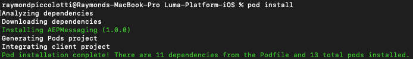
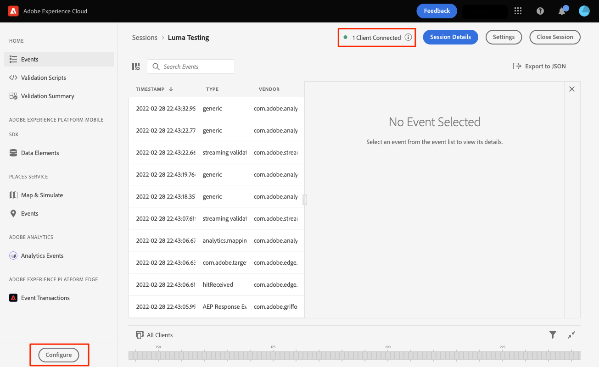

# Adobe Journey Optimizer-pushberichten

Leer hoe u pushberichten voor mobiele apps kunt maken met Platform Mobile SDK en Adobe Journey Optimizer.

>[!INFO]
>
> Deze zelfstudie wordt eind november 2023 vervangen door een nieuwe zelfstudie met een nieuwe mobiele voorbeeldtoepassing

Met Journey Optimizer kunt u uw reizen maken en berichten sturen naar doelgroepen. Voordat u pushmeldingen verzendt met Journey Optimizer, moet u ervoor zorgen dat de juiste configuraties en integratie zijn geïnstalleerd. Als u de gegevensstroom van pushberichten in Adobe Journey Optimizer wilt begrijpen, raadpleegt u [de documentatie](https://experienceleague.adobe.com/docs/journey-optimizer/using/configuration/configuration-message/push-config/push-gs.html).

>[!NOTE]
>
>Deze les is optioneel en is alleen van toepassing op Adobe Journey Optimizer-gebruikers die pushberichten willen verzenden.


## Vereisten

* App met SDK&#39;s geïnstalleerd en geconfigureerd met succes gemaakt en uitgevoerd.
* Toegang tot Adobe Journey Optimizer en voldoende toegangsrechten zoals beschreven [hier](https://experienceleague.adobe.com/docs/journey-optimizer/using/configuration/configuration-message/push-config/push-configuration.html?lang=en). Ook hebt u voldoende rechten nodig voor de volgende Adobe Journey Optimizer-functies.
   * Maak een toepassingsoppervlak.
   * Een journey maken
   * Maak een bericht.
   * Voorinstellingen voor berichten maken.
* Apple-ontwikkelaarsaccount is betaald met voldoende toegang om certificaten, id&#39;s en sleutels te maken.
* Fysiek iOS-apparaat om te testen.

## Leerdoelstellingen

In deze les zult u:

* Registreer app-id bij APN (Apple Push Notification service).
* Een **[!UICONTROL App Surface]** in AJO.
* Werk uw **[!UICONTROL schema]** om velden voor pushberichten op te nemen.
* Installeer en configureer de **[!UICONTROL Adobe Journey Optimizer]** tagextensie.
* Werk uw app bij om de AJO-tagextensie op te nemen.
* Valideer installatie in Betrouwbaarheid.
* Een testbericht verzenden.


## Toepassings-id registreren met APN

De volgende stappen zijn niet Adobe Experience Cloud-specifiek en zijn ontworpen om u door de configuratie van APN te begeleiden.

### Een `.p8` persoonlijke sleutel

1. Navigeer in de Apple Developer Portal naar **[!UICONTROL Toetsen]**.
1. Selecteer + pictogram om een sleutel tot stand te brengen.
   

1. Geef een **[!UICONTROL Sleutelnaam]**.
1. Selecteer de **[!UICONTROL APN]** selectievakje.
1. Selecteren **[!UICONTROL Doorgaan]**.
   
1. Configuratie controleren en selecteren **[!UICONTROL Registreren]**.
1. Download de `.p8` persoonlijke sleutel. Het wordt gebruikt in de configuratie van de Oppervlakte van de App.
1. Noteer de **[!UICONTROL Sleutel-id]**. Het wordt gebruikt in de configuratie van de Oppervlakte van de App.

Aanvullende documentatie kan [hier gevonden](https://help.apple.com/developer-account/#/devcdfbb56a3).

### De Apple-team-id voor ontwikkelaars ophalen

1. Navigeer in de Apple Developer Portal naar **[!UICONTROL Lidmaatschap]**.
1. Uw **[!UICONTROL Team-id]** wordt naast de overige lidmaatschapsgegevens vermeld. Het wordt gebruikt in de configuratie van de Oppervlakte van de App.

## Uw pushreferenties voor de app toevoegen in Gegevensverzameling

1. Van de [Interface voor gegevensverzameling](https://experience.adobe.com/data-collection/)selecteert u het tabblad App Surfaces in het linkerdeelvenster.
1. Selecteren **[!UICONTROL App-oppervlakken maken]** om een configuratie te maken.
   
1. Voer een **[!UICONTROL Naam]** voor de configuratie, bijvoorbeeld `Luma App Tutorial`  .
1. Selecteer in Mobiele toepassingsconfiguratie **[!UICONTROL Apple iOS]**.
1. Voer de bundel-id voor mobiele apps in het veld App ID (iOS Bundle ID) in. Als u samen met de Luma-app de waarde volgt, is `com.adobe.luma.tutorial`.
1. Schakel de **[!UICONTROL Credentials duwen]** om uw referenties toe te voegen.
1. Sleep uw `.p8` **Apple Push Notification Authentication Key** bestand.
1. Geef de sleutel-id op, een tekenreeks van 10 tekens die tijdens het maken van `p8` auth key. U vindt deze onder het tabblad Toetsen in **Certificaten, id&#39;s en profielen** pagina.
1. Geef de team-id op. Dit is een tekenreekswaarde die onder de **Lidmaatschap** tab.
1. Selecteren **[!UICONTROL Opslaan]**.
   

## Adobe Journey Optimizer-extensie installeren

1. Navigeren naar [!UICONTROL Tags] > [!UICONTROL Extensies] > [!UICONTROL Catalogus]en de **[!UICONTROL Adobe Journey Optimizer]** extensie.
1. De extensie installeren.
   
1. Selecteren `CJM Push Tracking Experience Event Dataset` het gegevensbestand van Adobe Experience Platform.
   
1. Selecteren **[!UICONTROL Opslaan in bibliotheek en samenstellen]**.

>[!NOTE]
>Neem contact op met de klantenservice als u &quot;CJM Push Tracking Experience Event Dataset&quot; niet als optie ziet.
>

## Adobe Journey Optimizer implementeren in de app

Zoals in vorige lessen is besproken, biedt het installeren van een extensie voor mobiele tags alleen de configuratie. Daarna moet u het overseinen SDK installeren en registreren. Als deze stappen niet duidelijk zijn, te herzien gelieve [SDK&#39;s installeren](install-sdks.md) sectie.

>[!NOTE]
>
>Als u het [SDK&#39;s installeren](install-sdks.md) , is de SDK al geïnstalleerd en kunt u stap #7 overslaan.

1. Open uw `Podfile` en voeg de volgende regel toe en sla het bestand op.

   `pod 'AEPMessaging', '~>1'`
1. Open uw terminal en navigeer naar de map die uw `Podfile`.
1. De SDK installeren door de opdracht uit te voeren `pod install`.
   
1. XCode openen en naar `AppDelegate.swift`.
1. Voeg het volgende toe aan uw lijst met importbewerkingen.

   `import AEPMessaging`
1. Toevoegen `Messaging.self` op de array met extensies die u registreert.
1. Voeg de volgende functie toe aan het bestand.

   ```swift
   func application(_: UIApplication, didRegisterForRemoteNotificationsWithDeviceToken deviceToken: Data) {
       MobileCore.setPushIdentifier(deviceToken)
   }
   ```

   Deze functie haalt het apparaattoken op dat uniek is voor het apparaat waarop de toepassing is geïnstalleerd en verzendt het naar Adobe/Apple voor het verzenden van pushberichten.

## Valideren door een testpushbericht te verzenden

1. Controleer de [installatie-instructies](assurance.md) sectie.
1. Installeer de toepassing op uw fysieke apparaat.
1. Start de app met de gegenereerde URL voor Betrouwbaarheid.
1. Verzend de app naar de achtergrond.
1. Selecteer in de betrouwbaarheidsinterface de optie **[!UICONTROL Configureren]**.
   
1. Selecteer de **[!UICONTROL +]** knop naast **[!UICONTROL Push Debug]**.
1. Selecteren **[!UICONTROL Opslaan]**.
   
1. Selecteren **[!UICONTROL Push Debug]** in de linkernavigatie.
1. Selecteer het apparaat in het menu **[!UICONTROL Clientlijst]**.
1. Bevestig dat u geen fouten krijgt.
   
1. Omlaag schuiven en selecteren **[!UICONTROL Melding van proefdruk verzenden]**.
1. Bevestig dat u geen fouten en fouten ontvangt en dat u het bericht op uw apparaat ontvangt.
   

Volgende: **[Conclusie en volgende stappen](conclusion.md)**

>[!NOTE]
>
>Bedankt dat u tijd hebt geïnvesteerd in het leren van Adobe Experience Platform Mobile SDK. Als u vragen hebt, algemene feedback wilt delen of suggesties voor toekomstige inhoud wilt hebben, deelt u deze over deze [Experience League Communautaire discussiestuk](https://experienceleaguecommunities.adobe.com/t5/adobe-experience-platform-data/tutorial-discussion-implement-adobe-experience-cloud-in-mobile/td-p/443796)