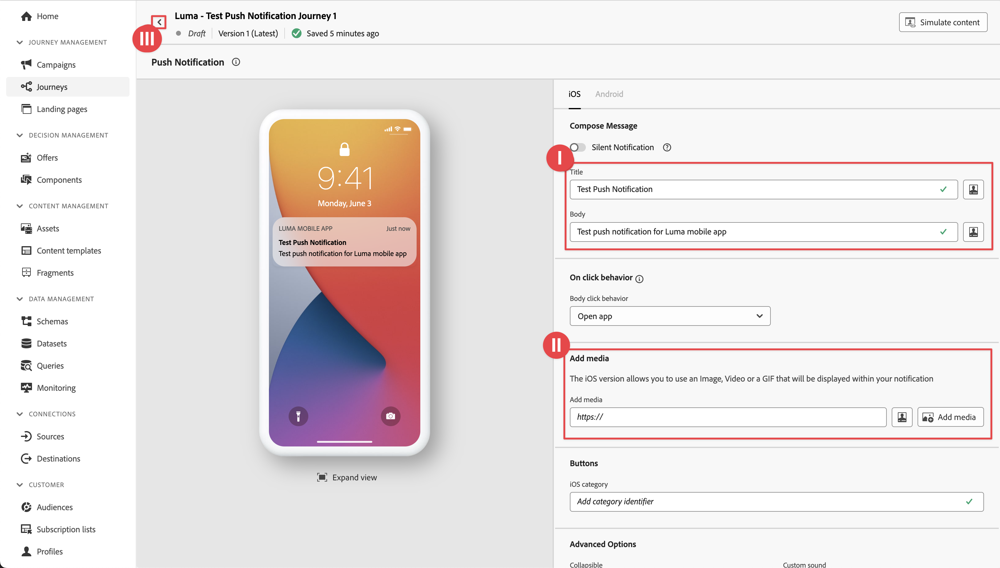

# Pushmeldingen maken en verzenden

Leer hoe u pushmeldingen voor mobiele apps maakt met Experience Platform Mobile SDK en Journey Optimizer.

Met Journey Optimizer kunt u reizen maken en berichten verzenden naar doelgroepen. Voordat u pushmeldingen verzendt met Journey Optimizer, moet u ervoor zorgen dat de juiste configuraties en integratie zijn geïnstalleerd. Om de de gegevensstroom van de Berichten van de Duw in Journey Optimizer te begrijpen, verwijs naar de [ documentatie ](https://experienceleague.adobe.com/docs/journey-optimizer/using/push/push-config/push-gs.html?lang=nl-NL).


>[!NOTE]
>
>Deze les is optioneel en is alleen van toepassing op Journey Optimizer-gebruikers die pushberichten willen verzenden.


## Vereisten

* De app is gemaakt en uitgevoerd met SDK&#39;s geïnstalleerd en geconfigureerd.
* Stel de app in voor Adobe Experience Platform.
* Toegang tot Journey Optimizer en voldoende toestemmingen zoals die [ hier ](https://experienceleague.adobe.com/docs/journey-optimizer/using/push/push-config/push-configuration.html?lang=nl-NL) worden beschreven. U hebt ook voldoende machtigingen nodig voor de volgende Journey Optimizer-functies.
   * Maak een pushreferentie.
   * Maak een push-kanaalconfiguratie.
   * Maak een reis.
   * Maak een bericht.
   * Voorinstellingen voor berichten maken.
* **betaalde de ontwikkelaarsrekening van Apple** met voldoende toegang om certificaten, herkenningstekens, en sleutels tot stand te brengen.
* Fysiek iOS-apparaat of simulator voor testen.

## Leerdoelstellingen

In deze les zult u

* Registreer de toepassings-id bij de APNs (Apple Push Notification service).
* Maak een kanaalconfiguratie in Journey Optimizer.
* Werk uw schema bij om velden voor pushberichten op te nemen.
* Installeer en configureer de extensie Journey Optimizer.
* Werk uw app bij om de Journey Optimizer-tagextensie te registreren.
* Instellingen valideren in Assurance.
* Een testbericht vanuit Assurance verzenden
* Definieer uw eigen pushmelding voor een Journey Optimizer.
* Verzend uw eigen pushmelding vanuit de app.


## Instellen

>[!TIP]
>
>Als u opstelling uw milieu reeds als deel van [ Journey Optimizer in-app overseinen ](journey-optimizer-inapp.md) les hebt, zou u sommige stappen in deze opstellingssectie reeds kunnen reeds uitgevoerd hebben.

### Toepassings-id registreren bij APNs

De volgende stappen zijn niet Adobe Experience Cloud-specifiek en zijn ontworpen om u door de configuratie van APNs te begeleiden.

#### Een persoonlijke sleutel maken

1. Navigeer in de Apple Developer Portal naar **[!UICONTROL Keys]** .
1. Selecteer **[!UICONTROL +]** om een sleutel te maken.
   

1. Geef een **[!UICONTROL Key Name]** op.
1. Selecteer **[!UICONTROL Apple Push Notification service] (APNs)** checkbox.
1. Selecteer **[!UICONTROL Continue]**.
   
1. Controleer de configuratie en selecteer **[!UICONTROL Register]** .
1. Download de persoonlijke sleutel van `.p8` . Het wordt gebruikt in de volgende oefening wanneer u uw de dupcredentie van Journey Optimizer vormt.
1. Noteer de **[!UICONTROL Key ID]** . Het wordt gebruikt in de volgende oefening wanneer u uw de dupcredentie van Journey Optimizer vormt.
1. Noteer de **[!UICONTROL Team ID]** . Het wordt gebruikt in de volgende oefening wanneer u uw de dupcredentie van Journey Optimizer vormt.
   

De extra documentatie kan [ hier ](https://help.apple.com/developer-account/#/devcdfbb56a3) worden gevonden.


#### Uw pushgegevens voor de app toevoegen in Journey Optimizer

Vervolgens moet u pushgegevens voor mobiele toepassingen toevoegen in Journey Optimizer. (In vroegere versies van het product, werden deze toegevoegd als deel van de configuratie &quot;van de Oppervlakte van de App&quot;in de Inzameling van Gegevens).

De registratie van de pushreferenties voor de mobiele app is vereist om Adobe te machtigen pushberichten namens u te verzenden. Raadpleeg de onderstaande stappen:

1. Open het menu **[!UICONTROL Push settings]** > **[!UICONTROL Push credentials]** in de Journey Optimizer-interface.**[!UICONTROL Channels]**

1. Selecteer **[!UICONTROL Create push credential]**.


   

1. Van **[!UICONTROL Platform]** drop-down, selecteer het **iOS** werkende systeem.

1. Voer de bundel-id voor de mobiele app in het veld **[!UICONTROL App ID]** (iOS Bundle ID) in. Bijvoorbeeld com.adobe.luma.tutorial.swiftui

1. Schakel de optie **[!UICONTROL Apply to all sandboxes]** in om deze pushgegevens beschikbaar te maken voor alle sandboxen. Als een specifieke zandbak zijn eigen geloofsbrieven voor het zelfde Platform en toepassings identiteitskaart paar heeft, zullen die zandbakspecifieke geloofsbrieven belangrijkheid nemen.

1. De belemmering en laat vallen uw .p8 **Sleutel van de Authentificatie van het Push- Bericht van Apple** dossier dat van de vorige oefening wordt verkregen.

1. Geef **[!UICONTROL Key ID]** op, een tekenreeks van 10 tekens die is toegewezen tijdens het maken van de `p8` auth-toets. Het kan onder het **[!UICONTROL Keys]** lusje in de **Certificaten, Herkenningstekens en de pagina van Profielen** van de de poortpagina&#39;s van de Ontwikkelaar van Apple worden gevonden. (U had dit tijdens de vorige oefening moeten opmerken.)

1. Geef de **[!UICONTROL Team ID]** op. Identiteitskaart van het Team is een waarde die onder het **1&rbrace; lusje van het Lidmaatschap &lbrace;of bij de bovenkant van de het poortpagina van de Ontwikkelaar van Apple kan worden gevonden.** (U had dit tijdens de vorige oefening moeten opmerken.)

   

1. Klik op **[!UICONTROL Submit]** om uw configuratie voor pushreferenties te maken.

#### Een kanaalconfiguratie maken voor push in Journey Optimizer

Als u eenmaal een configuratie voor pushreferenties hebt gemaakt, moet u een configuratie maken om pushberichten van Journey Optimizer te kunnen verzenden.

1. Open in de Journey Optimizer-interface het menu **[!UICONTROL Channels]** > **[!UICONTROL General settings]** > **[!UICONTROL Channel configurations]** en selecteer vervolgens **[!UICONTROL Create channel configuration]** .

   

1. Voer een naam en beschrijving (optioneel) voor de configuratie in.

   >[!NOTE]
   >
   > Namen moeten beginnen met een letter (A-Z). Het mag alleen alfanumerieke tekens bevatten. U kunt ook onderstrepingsteken `_` -, punt `.` - en afbreekstreepjes `-` gebruiken.


1. Als u aangepaste of basislabels voor gegevensgebruik aan de configuratie wilt toewijzen, kunt u **[!UICONTROL Manage access]** selecteren. [ leer meer over de Controle van de Toegang van het Niveau van Objecten (OLAC) ](https://experienceleague.adobe.com/nl/docs/journey-optimizer/using/access-control/object-based-access).

1. Selecteer het **Push** kanaal.


1. Selecteer **[!UICONTROL Marketing action]**(s) om het toestemmingsbeleid aan de berichten te associëren gebruikend deze configuratie. Alle toestemmingsbeleid verbonden aan de marketing actie wordt gebruikt om de voorkeur van uw klanten te respecteren. [ leer meer over marketing acties ](https://experienceleague.adobe.com/nl/docs/journey-optimizer/using/privacy/consent/consent#surface-marketing-actions).

1. Kies uw **[!UICONTROL Platform]** .

1. Selecteer dezelfde **[!UICONTROL App id]** als voor de hierboven geconfigureerde pushreferentie.

1. Selecteer **[!UICONTROL Submit]** om uw wijzigingen op te slaan.

   


### Gegevensstroomconfiguratie bijwerken

Werk de configuratie van Experience Edge bij om ervoor te zorgen dat gegevens die vanuit uw mobiele app naar de Edge Network worden verzonden, naar Journey Optimizer worden doorgestuurd.

1. Selecteer **[!UICONTROL Datastreams]** in de gebruikersinterface voor gegevensverzameling en selecteer de gegevensstroom, bijvoorbeeld **[!DNL Luma Mobile App]** .
1. Selecteer  voor **[!UICONTROL Experience Platform]** en selecteer  **[!UICONTROL Edit]** van het contextmenu.
1. In **[!UICONTROL Datastreams]** >  > **[!UICONTROL Adobe Experience Platform]** scherm:

   1. Selecteer **[!UICONTROL AJO Push Profile Dataset]** in **[!UICONTROL Profile Dataset]** als dit nog niet is geselecteerd. Deze profieldataset wordt vereist wanneer het gebruiken van de `MobileCore.setPushIdentifier` API vraag (zie [ het apparatenteken van het Register voor duw berichten ](#register-device-token-for-push-notifications)) die het unieke herkenningsteken voor duw berichten (a.k.a. duw herkenningsteken) als deel van het profiel van de gebruiker verzekert.

   1. **[!UICONTROL Adobe Journey Optimizer]** is geselecteerd. Zie {de montages van 0} Adobe Experience Platform [&#128279;](https://experienceleague.adobe.com/docs/experience-platform/datastreams/configure.html?lang=nl-NL#aep) voor meer informatie.

   1. Selecteer **[!UICONTROL Save]** om de configuratie van de gegevensstroom op te slaan.

   


### Journey Optimizer-extensie installeren

Uw app werkt alleen met Journey Optimizer als u de eigenschap tag bijwerkt.

1. Navigeer naar **[!UICONTROL Tags]** > **[!UICONTROL Extensions]** > **[!UICONTROL Catalog]** ,
1. Open uw eigenschap, bijvoorbeeld **[!DNL Luma Mobile App Tutorial]** .
1. Selecteer **[!UICONTROL Catalog]**.
1. Zoek naar de extensie **[!UICONTROL Adobe Journey Optimizer]** .
1. De extensie installeren.
1. In het dialoogvenster **[!UICONTROL Install Extension]**
   1. Selecteer een omgeving, bijvoorbeeld **[!UICONTROL Development]** .
   1. Selecteer de **[!UICONTROL AJO Push Tracking Experience Event Dataset]** dataset van de **[!UICONTROL Event Dataset]** lijst.
   1. Selecteer **[!UICONTROL Save to Library and Build]**.

      

>[!NOTE]
>
>Neem contact op met de klantenservice als u **[!UICONTROL AJO Push Tracking Experience Event Dataset]** niet ziet als een optie.
>

## Setup valideren met Assurance

1. Herzie de [ sectie van opstellingsinstructies ](assurance.md#connecting-to-a-session) om uw simulator of apparaat met Assurance te verbinden.
1. Selecteer **[!UICONTROL Configure]** in de gebruikersinterface van Assurance.
   
1. Selecteer  naast **[!UICONTROL Push Debug]**.
1. Selecteer **[!UICONTROL Save]**.
   
1. Selecteer **[!UICONTROL Push Debug]** in de linkernavigatie.
1. Selecteer het tabblad **[!UICONTROL Validate Setup]**. 
1. Selecteer het apparaat in de lijst **[!UICONTROL Client]** .
1. Bevestig dat u geen fouten krijgt.
   
1. Selecteer het tabblad **[!UICONTROL Send Test Push]**. 
1. (optioneel) Wijzig de standaarddetails voor **[!UICONTROL Title]** en **[!UICONTROL Body]**
1. Selecteer  **[!UICONTROL Send Test Push Notification]**.
1. Controleer **[!UICONTROL Test Results]**.
1. De pushmelding voor de test wordt weergegeven in uw app.

   


## Ondertekenen

Het ondertekenen van app Luma is nodig om pushmeldingen te verzenden en **vereist een betaalde Apple-ontwikkelaarsaccount** .

U kunt als volgt de ondertekening voor uw app bijwerken:

1. Ga naar uw app in Xcode.
1. Selecteer **[!DNL Luma]** in de projectnavigator.
1. Selecteer het doel **[!DNL Luma]** .
1. Selecteer het **Ondertekenen &amp; Capabilities** lusje.
1. Configureer **[!UICONTROL Automatic manage signing]**, **[!UICONTROL Team]** en **[!UICONTROL Bundle Identifier]** of gebruik uw specifieke Apple-ontwikkelinrichtingsgegevens.

   >[!IMPORTANT]
   >
   >Verzeker u a _uniek_ bundelherkenningsteken gebruikt en vervang het `com.adobe.luma.tutorial.swiftui` bundelherkenningsteken, aangezien elk bundelherkenningsteken uniek moet zijn. Gewoonlijk gebruikt u een omgekeerde DNS-indeling voor bundle ID-tekenreeksen, zoals `com.organization.brand.uniqueidentifier` . De voltooide versie van deze zelfstudie gebruikt bijvoorbeeld `com.adobe.luma.tutorial.swiftui` .


   {zoomable="yes"}


## Mogelijkheden voor pushmeldingen toevoegen aan uw app

>[!IMPORTANT]
>
>Om dupmelding in een iOS app uit te voeren en te testen, moet u a **betaalde** de ontwikkelaarsrekening van Apple hebben. Als u geen betaald Apple-ontwikkelaarsaccount hebt, kunt u het restant van deze les overslaan.

1. Selecteer in Xcode **[!DNL Luma]** in de lijst **[!UICONTROL TARGETS]** , selecteer het tabblad **[!UICONTROL Signing & Capabilities]** , selecteer de knop **[!UICONTROL + Capability]** en selecteer vervolgens **[!UICONTROL Push Notifications]** . Hierdoor kan uw app pushmeldingen ontvangen.

1. Vervolgens moet u een Berichtgevingsextensie aan de app toevoegen. Ga terug naar de tab **[!DNL General]** en selecteer het pictogram **[!UICONTROL +]** onder aan de sectie **[!UICONTROL TARGETS]** .

1. U wordt gevraagd om de sjabloon voor uw nieuwe doel te selecteren. Selecteer **[!UICONTROL Notification Service Extension]** en selecteer vervolgens **[!UICONTROL Next]** .

1. Gebruik `NotificationExtension` in het volgende venster als de naam van de extensie en klik op de knop **[!UICONTROL Finish]** .

Er moet nu een extensie voor pushmeldingen aan uw app worden toegevoegd, vergelijkbaar met het onderstaande scherm.


## Journey Optimizer implementeren in de app

Zoals in vorige lessen is besproken, biedt het installeren van een extensie voor mobiele tags alleen de configuratie. Vervolgens moet u de Messaging SDK installeren en registreren. Als deze stappen niet duidelijk zijn, herzie [ installeer SDKs ](install-sdks.md) sectie.

>[!NOTE]
>
>Als u [ voltooide installeerde SDKs ](install-sdks.md) sectie, dan is SDK reeds geïnstalleerd en u kunt deze stap overslaan.
>

1. In Xcode, zorg ervoor dat [ het Overseinen van AEP ](https://github.com/adobe/aepsdk-messaging-ios) aan de lijst van pakketten in de Afhankelijkheden van het Pakket wordt toegevoegd. Zie {de Manager van het Pakket van 0} Swift [&#128279;](install-sdks.md#swift-package-manager).
1. Navigeer naar **[!DNL Luma]** > **[!DNL Luma]** > **[!UICONTROL AppDelegate]** in de Xcode-projectnavigator.
1. Controleer of `AEPMessaging` deel uitmaakt van uw lijst met importbewerkingen.

   `import AEPMessaging`

1. Controleer of `Messaging.self` deel uitmaakt van de array met extensies die u registreert.

   ```swift
   let extensions = [
       AEPIdentity.Identity.self,
       Lifecycle.self,
       Signal.self,
       Edge.self,
       AEPEdgeIdentity.Identity.self,
       Consent.self,
       UserProfile.self,
       Places.self,
       Messaging.self,
       Optimize.self,
       Assurance.self
   ]
   ```

## Apparaattoken registreren voor pushberichten

1. Voeg de [`MobileCore.setPushIdentifier` ](https://developer.adobe.com/client-sdks/documentation/mobile-core/api-reference/#setpushidentifier) API aan de `func application(_ application: UIApplication, didRegisterForRemoteNotificationsWithDeviceToken deviceToken: Data)` functie toe.

   ```swift
   // Send push token to Mobile SDK
   MobileCore.setPushIdentifier(deviceToken)
   ```

   Deze functie haalt het apparaattoken op dat uniek is voor het apparaat waarop de toepassing is geïnstalleerd. Dan plaatst het teken voor de levering van het dupbericht gebruikend de configuratie die u opstelling hebt en die op de dienst van het Bericht van de Duw van Apple (APNs) vertrouwt.

>[!IMPORTANT]
>
>Met `MobileCore.updateConfigurationWith(configDict: ["messaging.useSandbox": true])` bepaalt u of pushberichten een APNs-sandbox of productieserver gebruiken voor het verzenden van pushberichten. Wanneer u de app test in de simulator of op een apparaat, moet u controleren of `messaging.useSandbox` is ingesteld op `true` , zodat u pushmeldingen ontvangt. Wanneer u uw app implementeert voor productie om te testen met gebruik van Apple Testflight, moet u `messaging.useSandbox` instellen op `false` anders kan uw productie-app geen pushmeldingen ontvangen.


## Uw eigen pushmelding maken

Als u uw eigen pushmelding wilt maken, moet u een gebeurtenis in Journey Optimizer definiëren die een rit start die zorgt voor het verzenden van een pushmelding.

### Uw schema bijwerken

U gaat een nieuw gebeurtenistype bepalen, nog niet beschikbaar als deel van de lijst van gebeurtenissen die in uw schema worden bepaald. U gebruikt dit gebeurtenistype later wanneer u pushmeldingen activeert.

1. Selecteer in de gebruikersinterface van Journey Optimizer de optie **[!UICONTROL Schemas]** in het linkerspoor.
1. Selecteer **[!UICONTROL Browse]** in de tabbalk.
1. Selecteer het schema, bijvoorbeeld **[!DNL Luma Mobile App Event Schema]** om het te openen.
1. In de Schema-editor:
   1. Selecteer het veld **[!UICONTROL eventType]** .
   1. Schuif in het deelvenster **[!UICONTROL Field properties]** omlaag om de lijst met mogelijke waarden voor het gebeurtenistype weer te geven. Selecteer **[!UICONTROL Add row]** en voeg `application.test` toe als de **[!UICONTROL VALUE]** en `[!UICONTROL Test event for push notification]` als de `DISPLAY NAME` .
   1. Selecteer **[!UICONTROL Apply]**.
   1. Selecteer **[!UICONTROL Save]**.

       toe

### Een gebeurtenis definiëren

Met gebeurtenissen in Journey Optimizer kunt u uw reizen tijdelijk activeren om berichten te verzenden, bijvoorbeeld pushberichten. Zie [ Ongeveer gebeurtenissen ](https://experienceleague.adobe.com/docs/journey-optimizer/using/configuration/configure-journeys/events-journeys/about-events.html?lang=nl-NL) voor meer informatie.

1. Selecteer in de gebruikersinterface van Journey Optimizer de optie **[!UICONTROL Configurations]** in het linkerspoor.

1. Selecteer in het scherm **[!UICONTROL Dashboard]** de knop **[!UICONTROL Manage]** in de tegel **[!UICONTROL Events]** .

1. Selecteer **[!UICONTROL Create Event]** in het **[!UICONTROL Events]** -scherm.

1. In het deelvenster **[!UICONTROL Edit event event1]** :

   1. Voer `LumaTestEvent` in als de **[!UICONTROL Name]** van de gebeurtenis.
   1. Geef een **[!UICONTROL Description]** op, bijvoorbeeld `Test event to trigger push notifications in Luma app` .

   1. Selecteer het mobiele schema van de toepassingservaring die u vroeger in [ creeerde een schema XDM ](create-schema.md) van de **[!UICONTROL Schema]** lijst, bijvoorbeeld **[!DNL Luma Mobile App Event Schema v.1]** creeerde.
   1. Selecteer  naast de **[!UICONTROL Fields]** lijst.

       uit

      Controleer in het dialoogvenster **[!UICONTROL Fields]** of de volgende velden zijn geselecteerd (boven op de standaardvelden die altijd zijn geselecteerd (**[!UICONTROL _id]** , **[!UICONTROL id]** en **[!UICONTROL timestamp]**). U kunt, het gebruiken van de dropdown lijst, tussen **[!UICONTROL Selected]**, **[!UICONTROL All]** en **[!UICONTROL Primary]** van een knevel voorzien of het  gebied gebruiken.

      * **[!UICONTROL Application Identified (id)]** ,
      * **[!UICONTROL Event Type (eventType)]**,
      * **[!UICONTROL Primary (primary)]**.

       uit

      Selecteer vervolgens **[!UICONTROL Ok]** .

   1. Selecteer  naast het **[!UICONTROL Event id condition]** gebied.

      1. Sleep in het dialoogvenster **[!UICONTROL Add an event id condition]** **[!UICONTROL Event Type (eventType)]** naar **[!UICONTROL Drag and drop an element here]** .
      1. In popover, rol aan de bodem en selecteer **[!UICONTROL application.test]** (dat het gebeurtenistype is u vroeger aan de lijst van gebeurtenistypen als deel van [ toevoegde Werk uw schema ](#update-your-schema)). Blader vervolgens omhoog en selecteer **[!UICONTROL Ok]** .
      1. Selecteer **[!UICONTROL Ok]** om de voorwaarde op te slaan.

          uit

   1. Selecteer **[!UICONTROL ECID (ECID)]** in de lijst **[!UICONTROL Namespace]** . Het veld **[!UICONTROL Profile identifier]** wordt automatisch gevuld met **[!UICONTROL The id of the first element of the key ECID for the map identityMap]** .
   1. Selecteer **[!UICONTROL Save]**.

       uit

U hebt zojuist een gebeurtenisconfiguratie gemaakt die is gebaseerd op het gebeurtenissenschema voor mobiele apps dat u eerder hebt gemaakt in het kader van deze zelfstudie. Deze gebeurtenisconfiguratie zal inkomende ervaringsgebeurtenissen filtreren gebruikend uw specifiek gebeurtenistype (`application.test`), zodat slechts de gebeurtenissen met dat specifieke type, die van uw mobiele app in werking worden gesteld, de reis zullen activeren u in de volgende stap bouwt. In een echt scenario zou u dupberichten van de externe dienst kunnen willen verzenden, nochtans zijn de zelfde concepten van toepassing: van de externe toepassing verzendt een ervaringsgebeurtenis naar Experience Platform die specifieke gebieden heeft u kunt gebruiken om voorwaarden op toe te passen alvorens deze gebeurtenissen een reis teweegbrengen.

### De reis maken

Uw volgende stap is het maken van de reis die het verzenden van de pushmelding activeert wanneer de juiste gebeurtenis wordt ontvangen.

1. Selecteer in de gebruikersinterface van Journey Optimizer de optie **[!UICONTROL Journeys]** in het linkerspoor.
1. Selecteer **[!UICONTROL Create Journey]**.
1. In het deelvenster **[!UICONTROL Journey Properties]** :

   1. Voer een **[!UICONTROL Name]** in voor de rit, bijvoorbeeld `Luma - Test Push Notification Journey` .
   1. Voer een **[!UICONTROL Description]** in voor de rit, bijvoorbeeld `Journey for test push notifications in Luma mobile app` .
   1. Zorg ervoor dat **[!UICONTROL Allow re-entrance]** is geselecteerd en stel **[!UICONTROL Re-entrance wait period]** in op **[!UICONTROL 30]** **[!UICONTROL Seconds]** .
   1. Selecteer **[!UICONTROL Ok]**.

      

1. Terug bij het wegcanvas, van **[!UICONTROL EVENTS]**, sleep en laat vallen uw  **[!DNL LumaTestEvent]** op het canvas waar het **[!UICONTROL Select an entry event or a read audience activity]** toont.

   * Voer in het deelvenster **[!UICONTROL Events: LumaTestEvent]** bijvoorbeeld een **[!UICONTROL Label]** `Luma Test Event` in.

1. Van **[!UICONTROL ACTIONS]** dropdown, belemmering en laat vallen  **[!UICONTROL Push]** op  toe die aan het recht van uw **[!DNL LumaTestEvent]** activiteit verschijnen. In het deelvenster **[!UICONTROL Actions: Push]** :

   1. Geef een **[!UICONTROL Label]** op, bijvoorbeeld `Luma Test Push Notification` , geef een **[!UICONTROL Description]** , bijvoorbeeld `Test push notification for Luma mobile app` , selecteer **[!UICONTROL Transactional]** in de lijst **[!UICONTROL Category]** en selecteer **[!DNL Luma]** in de lijst **[!UICONTROL Push surface]** .
   1. Selecteer  **[!UICONTROL Edit content]** beginnen het daadwerkelijke dupbericht uit te geven.

      

      In de **[!UICONTROL Push Notification]** editor:

      1. Voer bijvoorbeeld een **[!UICONTROL Title]** `Luma Test Push Notification` in en voer een **[!UICONTROL Body]** in, bijvoorbeeld `Test push notification for Luma mobile app` .
      1. U kunt desgewenst een koppeling naar een afbeelding (.png of .jpg) invoeren in **[!UICONTROL Add media]** . Als u dit doet, maakt de afbeelding deel uit van de pushmelding.
      1. Om de redacteur te bewaren en te verlaten, uitgezochte .

         

   1. Selecteer **[!UICONTROL Ok]** als u de definitie van de pushmelding wilt opslaan en voltooien.

1. Je reis moet er hieronder uitzien. Selecteer **[!UICONTROL Publish]** om uw reis te publiceren en te activeren.
   


## De pushmelding activeren

U hebt alle ingrediënten op zijn plaats om een pushmelding te verzenden. Wat overblijft, is hoe deze pushmelding wordt geactiveerd. In wezen, is het het zelfde als u eerder hebt gezien: verzend eenvoudig een ervaringsgebeurtenis met de juiste nuttige lading (zoals in [ Gebeurtenissen ](events.md)).

Dit keer wordt de ervaringsgebeurtenis die u op het punt staat te verzenden, niet samengesteld als een eenvoudig XDM-woordenboek. U gaat een `struct` gebruiken die een payload van een pushmelding vertegenwoordigt. Het bepalen van een specifiek gegevenstype is een alternatieve manier op hoe te om het construeren gebeurtenislading in uw toepassing uit te voeren.

1. Navigeer naar **[!DNL Luma]** > **[!DNL Luma]** > **[!UICONTROL Model]** > **[!UICONTROL XDM]** > **[!UICONTROL TestPushPayload]** in de Xcode-projectnavigator en inspecteer de code.

   ```swift
   import Foundation
   
   // MARK: - TestPush
   struct TestPushPayload: Codable {
      let application: Application
      let eventType: String
   }
   
   // MARK: - Application
   struct Application: Codable {
      let id: String
   }
   ```

   De code is een representatie van de volgende eenvoudige lading die u gaat verzenden om de reis van de testpushmelding te activeren

   ```json
   {
      "eventType": string,
      "application" : [
          "id": string
      ]
   }
   ```

1. Navigeer naar **[!DNL Luma]** > **[!DNL Luma]** > **[!DNL Utils]** > **[!UICONTROL MobileSDK]** in de Xcode Project navigator en voeg de volgende code toe aan `func sendTestPushEvent(applicationId: String, eventType: String)` :

   ```swift
   // Create payload and send experience event
   Task {
       let testPushPayload = TestPushPayload(
           application: Application(
               id: applicationId
           ),
           eventType: eventType
       )
       // send the final experience event
       await sendExperienceEvent(
           xdm: testPushPayload.asDictionary() ?? [:]
       )
   }
   ```

   Met deze code wordt een instantie `testPushPayload` gemaakt met behulp van de parameters die aan de functie ( `applicationId` en `eventType` ) worden doorgegeven. Vervolgens wordt `sendExperienceEvent` aangeroepen tijdens het omzetten van de laadbewerking naar een woordenboek. In deze code worden nu ook de asynchrone aspecten van het aanroepen van de Adobe Experience Platform SDK in aanmerking genomen door gebruik te maken van het gelijktijdige aanroepen van Swift op basis van `await` en `async` .

1. Navigeer naar **[!DNL Luma]** > **[!DNL Luma]** > **[!DNL Views]** > **[!DNL General]** > **[!UICONTROL ConfigView]** in de Xcode-projectnavigator. Voeg in de definitie van Knop voor pushmeldingen de volgende code toe om de lading van de testpushmelding tijdens de gebeurtenisbeleving te verzenden, zodat de rit wordt geactiveerd wanneer op die knop wordt getikt.

   ```swift
   // Setting parameters and calling function to send push notification
   Task {
       let eventType = testPushEventType
       let applicationId = Bundle.main.bundleIdentifier ?? "No bundle id found"
       await MobileSDK.shared.sendTestPushEvent(applicationId: applicationId, eventType: eventType)
   }
   ```


## Valideren met uw app

1. Rebuild en stel app in werking in de simulator of op een fysiek apparaat van Xcode, gebruikend .

1. Ga naar de tab **[!UICONTROL Settings]** .

1. Tik op **[!UICONTROL Push Notification]**. De pushmelding wordt weergegeven in uw app.

   


## Volgende stappen

U moet nu over alle gereedschappen beschikken om pushmeldingen in uw app af te handelen. U kunt bijvoorbeeld een reis maken in Journey Optimizer die een welkomstbericht verstuurt wanneer een gebruiker van de app zich aanmeldt. Of een bevestigingspushmelding wanneer een gebruiker een product in de app aanschaft. Of gaat de geofence van een plaats in (aangezien u in de [&#128279;](places.md) les 0&rbrace; Plaatsen &lbrace;zult zien).

>[!SUCCESS]
>
>U hebt de app voor pushberichten nu ingeschakeld met Journey Optimizer en de Journey Optimizer-extensie voor Experience Platform Mobile SDK.
>
>Bedankt dat je tijd hebt geïnvesteerd in het leren van Adobe Experience Platform Mobile SDK. Als u vragen hebt, algemene terugkoppelen willen delen, of suggesties over toekomstige inhoud hebben, hen op deze [ Communautaire besprekingspost van Experience League ](https://experienceleaguecommunities.adobe.com/t5/adobe-experience-platform-data/tutorial-discussion-implement-adobe-experience-cloud-in-mobile/td-p/443796) delen.

Volgende: **[creeer en verzend in-app berichten](journey-optimizer-inapp.md)**
