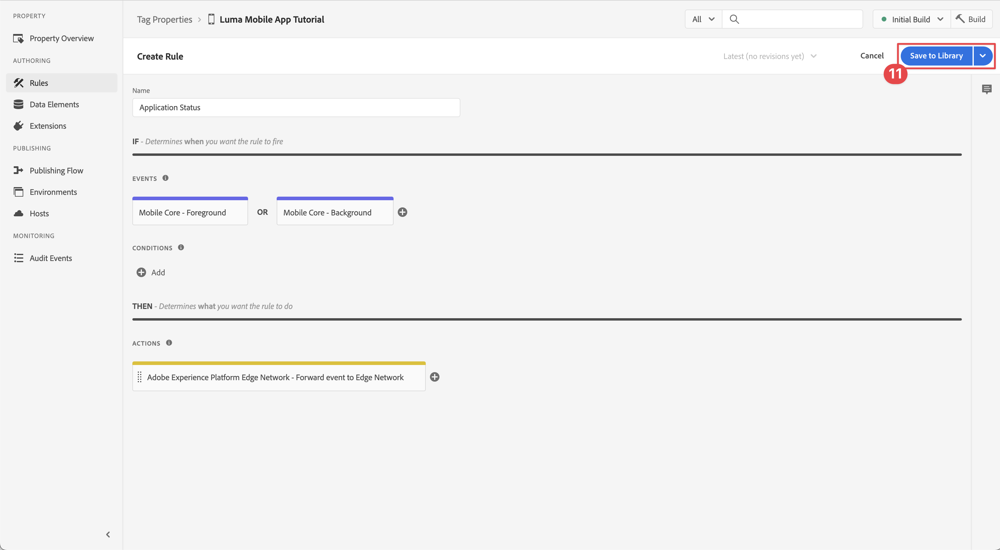

# Levenscyclusgegevens verzamelen

Leer hoe u levenscyclusgegevens kunt verzamelen in een mobiele app.

Met de Adobe Experience Platform Mobile SDK Lifecycle-extensie kunt u levenscyclusgegevens van uw mobiele app verzamelen. De Adobe Experience Platform Edge Network-extensie verzendt deze levenscyclusgegevens naar het Platform Edge Network, waar deze vervolgens worden doorgestuurd naar andere toepassingen en services volgens uw configuratie van de gegevensstroom. Leer meer over de [ uitbreiding van de Levenscyclus ](https://developer.adobe.com/client-sdks/documentation/lifecycle-for-edge-network/) in de productdocumentatie.


## Vereisten

* App met SDK&#39;s geïnstalleerd en geconfigureerd met succes gemaakt en uitgevoerd. Als onderdeel van deze les bent u al begonnen met levenscycluscontrole. Zie [ SDKs installeren - Update AppDelegate ](install-sdks.md#update-appdelegate) aan overzicht.
* Registreerde de uitbreiding van Assurance zoals die in de [ vorige les ](install-sdks.md) wordt beschreven.

## Leerdoelstellingen

In deze les zult u:

<!--
* Add lifecycle field group to the schema.
* -->
* Zorg voor nauwkeurige levenscyclusmetrische gegevens door de toepassing correct te starten/pauzeren wanneer deze van de voorgrond naar de achtergrond gaat.
* Gegevens vanuit de app verzenden naar Platform Edge Network.
* Valideren in Assurance.

<!--
## Add lifecycle field group to schema

The Consumer Experience Event field group you added in the [previous lesson](create-schema.md) already contains the lifecycle fields, so you can skip this step. If you don't use Consumer Experience Event field group in your own app, you can add the lifecycle fields by doing the following:

1. Navigate to the schema interface as described in the [previous lesson](create-schema.md).
1. Open the **Luma Mobile App Event Schema** schema and select **[!UICONTROL Add]** next to Field groups.
    {zoomable="yes"}
1. In the search bar, enter "lifecycle".
1. Select the checkbox next to **[!UICONTROL AEP Mobile Lifecycle Details]**.
1. Select **[!UICONTROL Add field groups]**.
    {zoomable="yes"}
1. Select **[!UICONTROL Save]**.
    {zoomable="yes"}
-->

## Wijzigingen in implementatie

Nu kunt u uw project bijwerken en de levenscyclusgebeurtenissen registreren.

>[!BEGINTABS]

>[!TAB  iOS ]

1. Navigeer naar **[!DNL Luma]** > **[!DNL Luma]** > **[!UICONTROL SceneDelegate]** in de Xcode-projectnavigator.

1. Als uw app wordt gestart en deze wordt hervat vanaf een achtergrondstatus, roept iOS mogelijk uw gedelegeerde methode `sceneWillEnterForeground:` aan. Met deze methode wilt u een start-gebeurtenis voor de levenscyclus activeren. Deze code toevoegen aan `func sceneWillEnterForeground(_ scene: UIScene)` :

   ```swift
   // When in foreground start lifecycle data collection
   MobileCore.lifecycleStart(additionalContextData: nil)
   ```

1. Wanneer de app de achtergrond betreedt, wilt u de gegevensverzameling tijdens de levenscyclus van de gedelegeerde methode van uw app voor `sceneDidEnterBackground:` pauzeren. Deze code toevoegen aan `func sceneDidEnterBackground(_ scene: UIScene)` :

   ```swift
   // When in background pause lifecycle data collection
   MobileCore.lifecyclePause()
   ```

>[!TAB  Android ]

1. Navigeer naar **[!UICONTROL app]** > **[!UICONTROL kotlin+java]** > **[!UICONTROL com.adobe.luma.tutorial.android]** > **[!UICONTROL LumaApplication]** in de Android Studio-navigator.

1. Als uw app wordt gestart en de toepassing op de achtergrond wordt hervat, roept Android mogelijk uw overschrijving `fun onActivityResumed function` aan en u wilt met deze functie een gebeurtenis voor het starten van de levenscyclus activeren. Deze code toevoegen aan `override fun onActivityResumed(activity: Activity)` :

   ```kotlin
   // When in foreground start lifecycle data collection
   MobileCore.lifecycleStart(null)
   ```

1. Wanneer de app de achtergrond betreedt, wilt u de gegevensverzameling tijdens de levenscyclus van de functie `override fun onActivityPaused` van uw app pauzeren. Deze code toevoegen aan `override fun onActivityPaused(activity: Activity)` :

   ```kotlin
   // When in background pause lifecycle data collection
   MobileCore.lifecyclePause()
   ```

>[!ENDTABS]


## Valideren met Assurance

1. Herzie de [ sectie van opstellingsinstructies ](assurance.md#connecting-to-a-session) om uw simulator of apparaat met Assurance te verbinden.
1. Verzend de app naar de achtergrond. Controleren op **[!UICONTROL LifecyclePause]** -gebeurtenissen in de gebruikersinterface van Assurance.
1. Breng de app naar de voorgrond. Controleren op **[!UICONTROL LifecycleResume]** -gebeurtenissen in de gebruikersinterface van Assurance.
   {zoomable="yes"}


## Gegevens doorsturen naar Platform Edge Network

De vorige oefening verzendt de voor- en achtergrondgebeurtenissen naar Adobe Experience Platform Mobile SDK. Deze gebeurtenissen doorsturen naar Platform Edge Network:

1. Selecteer **[!UICONTROL Rules]** in de eigenschap Codes.
   {zoomable="yes"}
1. Selecteer **[!UICONTROL Initial Build]** als de bibliotheek die u wilt gebruiken.
1. Selecteer **[!UICONTROL Create New Rule]**.
   {zoomable="yes"}
1. Typ **[!UICONTROL Create Rule]** for `Application Status` in het scherm **[!UICONTROL Name]** .
1. Selecteer  **[!UICONTROL Add]** hieronder **[!UICONTROL EVENTS]**.
   {zoomable="yes"}
1. In de stap **[!UICONTROL Event Configuration]** :
   1. Selecteer **[!UICONTROL Mobile Core]** als de **[!UICONTROL Extension]** .
   1. Selecteer **[!UICONTROL Foreground]** als de **[!UICONTROL Event Type]** .
   1. Selecteer **[!UICONTROL Keep Changes]**.
      {zoomable="yes"}
1. Terug in het **[!UICONTROL Create Rule]** scherm, uitgezocht  **[!UICONTROL Add]** naast **[!UICONTROL Mobile Core - Foreground]** toe.
   {zoomable="yes"}
1. In de stap **[!UICONTROL Event Configuration]** :
   1. Selecteer **[!UICONTROL Mobile Core]** als de **[!UICONTROL Extension]** .
   1. Selecteer **[!UICONTROL Background]** als de **[!UICONTROL Event Type]** .
   1. Selecteer **[!UICONTROL Keep Changes]**.
      {zoomable="yes"}
1. Terug in het **[!UICONTROL Create Rule]** scherm, uitgezocht  toe **[!UICONTROL Add]** onder **[!UICONTROL ACTIONS]**.

   {zoomable="yes"} toe

1. In de stap **[!UICONTROL Action Configuration]** :
   1. Selecteer **[!UICONTROL Adobe Experience Edge Network]** als de **[!UICONTROL Extension]** .
   1. Selecteer **[!UICONTROL Forward event to Edge Network]** als de **[!UICONTROL Action Type]** .
   1. Selecteer **[!UICONTROL Keep Changes]**.
      {zoomable="yes"}
1. Selecteer **[!UICONTROL Save to Library]**.
   {zoomable="yes"}
1. Selecteer **[!UICONTROL Build]** om de bibliotheek opnieuw samen te stellen.
   {zoomable="yes"}

Zodra u met succes het bezit hebt gebouwd, worden de gebeurtenissen verzonden naar Platform Edge Network, en de gebeurtenissen door:sturen aan andere toepassingen en de diensten volgens uw datastreamconfiguratie.

Gebeurtenissen **[!UICONTROL Application Close (Background)]** en **[!UICONTROL Application Launch (Foreground)]** die XDM-gegevens bevatten, worden weergegeven in Assurance.

{zoomable="yes"}

>[!SUCCESS]
>
>U hebt nu uw app zo ingesteld dat toepassingsstatusgebeurtenissen (voorgrond, achtergrond) naar de Adobe Experience Platform Edge Network en alle services die u in uw gegevensstroom hebt gedefinieerd, worden verzonden.
>
> Bedankt dat je tijd hebt geïnvesteerd in het leren van Adobe Experience Platform Mobile SDK. Als u vragen hebt, algemene terugkoppelen willen delen, of suggesties over toekomstige inhoud hebben, hen op deze [ Communautaire besprekingspost van Experience League ](https://experienceleaguecommunities.adobe.com/t5/adobe-experience-platform-data/tutorial-discussion-implement-adobe-experience-cloud-in-mobile/td-p/443796) delen

Volgende: **[de gebeurtenisgegevens van het Spoor](events.md)**
