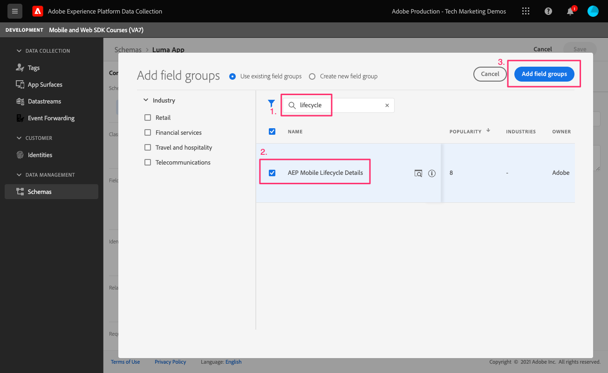

# Levenscyclusgegevens

Leer hoe u levenscyclusgegevens kunt verzamelen in een mobiele app.

Met de Levenscyclusextensie van de Adobe Experience Platform Mobile SDK kunt u levenscyclusgegevens van uw mobiele app verzamelen. De uitbreiding van het Netwerk van Adobe Experience Platform Edge verzendt deze levenscyclusgegevens naar het Netwerk van de Rand van het Platform waar het dan aan andere toepassingen en de diensten volgens uw gegevensstroomconfiguratie door:sturen. Meer informatie over de [Levenscyclusextensie](https://aep-sdks.gitbook.io/docs/foundation-extensions/lifecycle-for-edge-network) in de productdocumentatie.


## Vereisten

* App met SDK&#39;s geïnstalleerd en geconfigureerd met succes gemaakt en uitgevoerd.
* Geïmporteerd de SDK van de Betrouwbaarheid.

   ```swift
   import AEPAssurance
   ```

* Geregistreerd de uitbreiding van de Verzekering zoals die in [vorige les](install-sdks.md).

## Leerdoelstellingen

In deze les zult u:

* Voeg levenscyclusveldgroep toe aan het schema.
* Zorg voor nauwkeurige levenscyclusmetrische gegevens door de toepassing correct te starten/pauzeren wanneer deze van de voorgrond naar de achtergrond gaat.
* Gegevens vanuit de toepassing verzenden naar Edge Network van Platform.
* Valideren bij Betrouwbaarheid.

## Levenscyclusveldgroep toevoegen aan schema

De de gebiedsgroep van de Gebeurtenis van de Ervaring van de consument u in toevoegde [vorige les](create-schema.md) bevat al de velden voor de levenscyclus, dus u kunt deze stap overslaan. Als u de het gebiedsgroep van de Gebeurtenis van de Ervaring van de Consumenten in uw eigen app niet gebruikt, kunt u de gebieden van de levenscyclus toevoegen door het volgende te doen:

1. Ga naar de schemainterface zoals die in wordt beschreven [vorige les](create-schema.md).
1. Open het schema &quot;Luma App&quot; en selecteer **[!UICONTROL Toevoegen]**.
   
1. Voer in de zoekbalk &quot;levenscyclus&quot; in.
1. Schakel het selectievakje in naast **[!UICONTROL AEP Mobile Lifecycle Details]**.
1. Selecteren **[!UICONTROL Veldgroepen toevoegen]**.
   
1. Selecteren **[!UICONTROL Opslaan]**.
   


## Wijzigingen in implementatie

Nu kunt u bijwerken `AppDelegate.swift` om de levenscyclusgebeurtenissen te registreren:

1. Als uw toepassing wordt gestart en de toepassing wordt hervat vanuit een achtergrondstatus, kan iOS mogelijk uw `applicationWillEnterForeground:` gedelegeerde methode. Toevoegen `lifecycleStart:`

   ```swift
   MobileCore.lifecycleStart(additionalContextData: nil)
   ```

1. Wanneer de app op de achtergrond wordt geplaatst, moet u de verzameling van gegevens over de levenscyclus van uw app pauzeren `applicationDidEnterBackground:` gedelegeerde methode.

   ```swift
   MobileCore.lifecyclePause()
   ```

>[!NOTE]
>
>Voor iOS 13 en hoger raadpleegt u de [documentatie](https://aep-sdks.gitbook.io/docs/foundation-extensions/mobile-core/lifecycle#register-lifecycle-with-mobile-core-and-add-appropriate-start-pause-calls) voor iets andere code.

## Valideren met betrouwbaarheid

1. Controleer de [installatie-instructies](assurance.md) en sluit de simulator of het apparaat aan op Betrouwbaarheid.
1. Start de app.
1. Verzend de app naar de achtergrond. Controleren op `LifecyclePause`.
1. Breng de app naar de voorgrond. Controleren op `LifecycleResume`.
   


## Gegevens doorsturen naar Edge Network van Platform

De vorige oefening verzendt de voor- en achtergrondgebeurtenissen naar Mobile SDK. Om deze gebeurtenissen naar het Netwerk van de Rand van het Platform te verzenden, volg de vermelde stappen [hier](https://aep-sdks.gitbook.io/docs/foundation-extensions/lifecycle-for-edge-network#configure-a-rule-to-forward-lifecycle-metrics-to-platform). Zodra de gebeurtenissen naar het Netwerk van de Rand van het Platform worden verzonden, zullen zij aan andere toepassingen en de diensten volgens uw gegevensstroomconfiguratie door:sturen.

Zodra u de regel hebt toegevoegd om de levenstijlgebeurtenissen naar het Netwerk van de Rand van het Platform te verzenden, zou u moeten zien `Application Close (Background)` en `Application Launch (Foreground)` gebeurtenissen met XDM-gegevens in Verzekering.


Volgende: **[Gebeurtenissen bijhouden](events.md)**

>[!NOTE]
>
>Bedankt dat u tijd hebt geïnvesteerd in het leren van Adobe Experience Platform Mobile SDK. Als u vragen hebt, algemene feedback wilt delen of suggesties voor toekomstige inhoud hebt, kunt u deze delen over deze [Experience League Communautaire discussiestuk](https://experienceleaguecommunities.adobe.com/t5/adobe-experience-platform-launch/tutorial-discussion-implement-adobe-experience-cloud-in-mobile/td-p/443796)