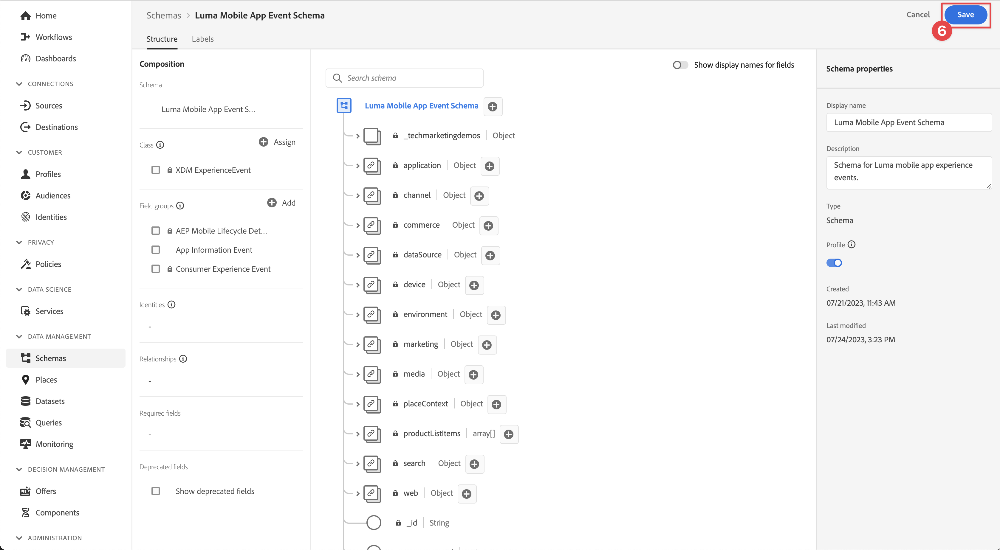
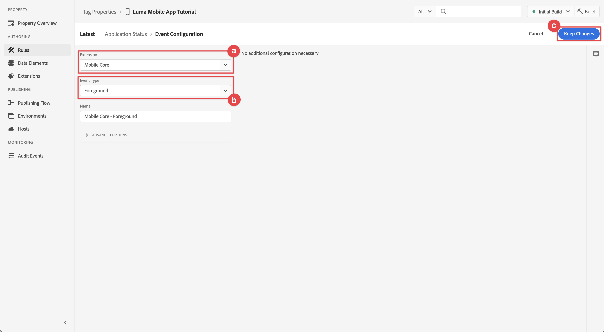

# Levenscyclusgegevens verzamelen

Leer hoe u levenscyclusgegevens kunt verzamelen in een mobiele app.

Met de Levenscyclusextensie van de Adobe Experience Platform Mobile SDK kunt u levenscyclusgegevens van uw mobiele app verzamelen. De uitbreiding van de Edge Network van Adobe Experience Platform verzendt deze levenscyclusgegevens naar de Edge Network van het Platform waar het dan aan andere toepassingen en de diensten volgens uw gegevensstroomconfiguratie door:sturen. Leer meer over de [ uitbreiding van de Levenscyclus ](https://developer.adobe.com/client-sdks/documentation/lifecycle-for-edge-network/) in de productdocumentatie.


## Vereisten

* App met SDK&#39;s geïnstalleerd en geconfigureerd met succes gemaakt en uitgevoerd. Als onderdeel van deze les bent u al begonnen met levenscycluscontrole. Zie [ SDKs installeren - Update AppDelegate ](install-sdks.md#update-appdelegate) aan overzicht.
* Registreerde de uitbreiding van de Verzekering zoals die in de [ vorige les ](install-sdks.md) wordt beschreven.

## Leerdoelstellingen

In deze les zult u:

<!--
* Add lifecycle field group to the schema.
* -->
* Zorg voor nauwkeurige levenscyclusmetrische gegevens door de toepassing correct te starten/pauzeren wanneer deze van de voorgrond naar de achtergrond gaat.
* Gegevens verzenden van de app naar Platform Edge Network.
* Valideren bij Betrouwbaarheid.

<!--
## Add lifecycle field group to schema

The Consumer Experience Event field group you added in the [previous lesson](create-schema.md) already contains the lifecycle fields, so you can skip this step. If you don't use Consumer Experience Event field group in your own app, you can add the lifecycle fields by doing the following:

1. Navigate to the schema interface as described in the [previous lesson](create-schema.md).
1. Open the **Luma Mobile App Event Schema** schema and select **[!UICONTROL Add]** next to Field groups.
    
1. In the search bar, enter "lifecycle".
1. Select the checkbox next to **[!UICONTROL AEP Mobile Lifecycle Details]**.
1. Select **[!UICONTROL Add field groups]**.
    
1. Select **[!UICONTROL Save]**.
    
-->

## Wijzigingen in implementatie

Nu kunt u uw project bijwerken om de levenscyclusgebeurtenissen te registreren.

1. Navigeer naar **[!DNL Luma]** > **[!DNL Luma]** > **[!UICONTROL SceneDelegate]** in de Xcode-projectnavigator.

1. Als uw app wordt gestart en de toepassing wordt hervat vanaf een achtergrondstatus, roept iOS mogelijk uw gedelegeerde methode `sceneWillEnterForeground:` aan en u wilt deze methode activeren voor het starten van een levenscyclusgebeurtenis. Deze code toevoegen aan `func sceneWillEnterForeground(_ scene: UIScene)` :

   ```swift
   // When in foreground start lifecycle data collection
   MobileCore.lifecycleStart(additionalContextData: nil)
   ```

1. Wanneer de app de achtergrond betreedt, wilt u de gegevensverzameling tijdens de levenscyclus van de gedelegeerde methode van uw app voor `sceneDidEnterBackground:` pauzeren. Deze code toevoegen aan `func sceneDidEnterBackground(_ scene: UIScene)` :

   ```swift
   // When in background pause lifecycle data collection
   MobileCore.lifecyclePause()
   ```

## Valideren met betrouwbaarheid

1. Herzie de [ sectie van opstellingsinstructies ](assurance.md#connecting-to-a-session) om uw simulator of apparaat aan Verzekering te verbinden.
1. Verzend de app naar de achtergrond. Controleer of er **[!UICONTROL LifecyclePause]** -gebeurtenissen zijn in de gebruikersinterface van Verzekering.
1. Breng de app naar de voorgrond. Controleer of er **[!UICONTROL LifecycleResume]** -gebeurtenissen zijn in de gebruikersinterface van Verzekering.
   


## Gegevens doorsturen naar Platform Edge Network

De vorige oefening verzendt de voor- en achtergrondgebeurtenissen naar Adobe Experience Platform Mobile SDK. Deze gebeurtenissen doorsturen naar Platform Edge Network:

1. Selecteer **[!UICONTROL Rules]** in de eigenschap Codes.
   
1. Selecteer **[!UICONTROL Initial Build]** als de bibliotheek die u wilt gebruiken.
1. Selecteer **[!UICONTROL Create New Rule]**.
   
1. Typ `Application Status` for **[!UICONTROL Name]** in het scherm **[!UICONTROL Create Rule]** .
1. Selecteer  **[!UICONTROL Add]** hieronder **[!UICONTROL EVENTS]**.
   
1. In de stap **[!UICONTROL Event Configuration]** :
   1. Selecteer **[!UICONTROL Mobile Core]** als de **[!UICONTROL Extension]** .
   1. Selecteer **[!UICONTROL Foreground]** als de **[!UICONTROL Event Type]** .
   1. Selecteer **[!UICONTROL Keep Changes]**.
      
1. Terug in het **[!UICONTROL Create Rule]** scherm, uitgezocht  **[!UICONTROL Add]** naast **[!UICONTROL Mobile Core - Foreground]** toe.
   
1. In de stap **[!UICONTROL Event Configuration]** :
   1. Selecteer **[!UICONTROL Mobile Core]** als de **[!UICONTROL Extension]** .
   1. Selecteer **[!UICONTROL Background]** als de **[!UICONTROL Event Type]** .
   1. Selecteer **[!UICONTROL Keep Changes]**.
      
1. Terug in het **[!UICONTROL Create Rule]** scherm, uitgezocht  toe **[!UICONTROL Add]** onder **[!UICONTROL ACTIONS]**.
    toe
1. In de stap **[!UICONTROL Action Configuration]** :
   1. Selecteer **[!UICONTROL Adobe Experience Edge Network]** als de **[!UICONTROL Extension]** .
   1. Selecteer **[!UICONTROL Forward event to Edge Network]** als de **[!UICONTROL Action Type]** .
   1. Selecteer **[!UICONTROL Keep Changes]**.
      
1. Selecteer **[!UICONTROL Save to Library]**.
   
1. Selecteer **[!UICONTROL Build]** om de bibliotheek opnieuw samen te stellen.
   

Zodra u met succes het bezit hebt gebouwd, worden de gebeurtenissen verzonden naar de Edge Network van het Platform, en de gebeurtenissen door:sturen aan andere toepassingen en de diensten volgens uw gegevensstroomconfiguratie.

Gebeurtenissen **[!UICONTROL Application Close (Background)]** en **[!UICONTROL Application Launch (Foreground)]** die XDM-gegevens bevatten, worden weergegeven in Verzekering.


>[!SUCCESS]
>
>U hebt nu uw app zo ingesteld dat toepassingsstatusgebeurtenissen (voorgrond, achtergrond) naar de Adobe Experience Platform-Edge Network en alle services die u in uw gegevensstroom hebt gedefinieerd, worden verzonden.
>
> Bedankt dat u tijd hebt geïnvesteerd in het leren van Adobe Experience Platform Mobile SDK. Als u vragen hebt, algemene terugkoppelen willen delen, of suggesties over toekomstige inhoud hebben, hen op deze [ Communautaire besprekingspost van de Experience League ](https://experienceleaguecommunities.adobe.com/t5/adobe-experience-platform-data/tutorial-discussion-implement-adobe-experience-cloud-in-mobile/td-p/443796) delen

Volgende: **[de gebeurtenisgegevens van het Spoor](events.md)**
