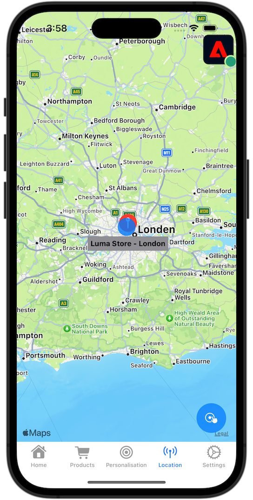

# Plaatsen gebruiken

Leer hoe u de geolocatieservice Plaatsen in uw app gebruikt.

De Adobe Experience Platform Data Collection Places Service is een geolocatieservice waarmee mobiele apps met het bewustzijn van de locatie de context van de locatie kunnen begrijpen. De dienst gebruikt rijke en makkelijk te gebruiken interfaces van SDK vergezeld van een flexibele gegevensbestand van belangenpunten (POIs).

## Vereisten

* Alle pakketgebiedsdelen zijn op zijn plaats in het project van Xcode.
* Geregistreerde extensies in AppDelegate.
* MobileCore is geconfigureerd om uw ontwikkelings-appId te gebruiken.
* Geïmporteerde SDK&#39;s.
* De app is gemaakt en uitgevoerd met de bovenstaande wijzigingen.

## Leerdoelstellingen

In deze les zult u

* Begrijp hoe te om punten van belang in de dienst van Plaatsen te bepalen.
* Werk de eigenschap tag bij met de extensie Plaatsen.
* Werk uw schema bij om geolocatiegebeurtenissen vast te leggen.
* Valideer installatie in Betrouwbaarheid.
* Werk uw app bij om de extensie Plaatsen te registreren.
* Implementeer de functie voor het bijhouden van geolocaties via de service Plaatsen in uw app.


## Instellen

De service Plaatsen werkt alleen binnen uw app en in de SDK voor mobiele apparaten als u een aantal instellingen opgeeft.

### Plaatsen definiëren

U definieert enkele aandachtspunten in de service Plaatsen.

1. Selecteer **[!UICONTROL Places]** in de gebruikersinterface voor gegevensverzameling.
1. Selecteer .
1. Selecteer **[!UICONTROL Manage Libraries]** in het contextmenu.
   
1. Selecteer **[!UICONTROL New]** in het dialoogvenster **[!UICONTROL Manage Libraries]** .
1. Voer in het dialoogvenster **[!UICONTROL Create Library]** bijvoorbeeld een **[!UICONTROL Name]** `Luma` in.
1. Selecteer **[!UICONTROL Confirm]**.
   
1. Selecteer **[!UICONTROL Close]** om het dialoogvenster **[!UICONTROL Manage Libraries]** te sluiten.
1. Ga terug in **[!UICONTROL POI Management]** en selecteer **[!UICONTROL Import POIs]** .
1. Selecteer **[!UICONTROL Start]** in het dialoogvenster **[!UICONTROL Import Places]** .
1. Selecteer **[!DNL Luma]** in de lijst met bibliotheken.
1. Selecteer **[!UICONTROL Next]**.
   
1. Download het [ dossier van het ZIP van POIs van de Luma ](assets/luma_pois.csv.zip) en haal het aan een plaats op uw computer uit.
1. Sleep het uitgenomen `luma_pois.csv` -bestand naar **[!UICONTROL Choose CSV File - Drag and Drop your File]** in het dialoogvenster **[!UICONTROL Import Places]** . Zie **[!UICONTROL Validation Success]** - **[!UICONTROL Successfully validated the CSV file]** .
1. Selecteer **[!UICONTROL Begin Import]**. Zie **[!UICONTROL Success]** - **[!UICONTROL Successfully added 6 new POIs]** .
1. Selecteer **[!UICONTROL Done]**.
1. In **[!UICONTROL POI Management]** ziet u dat er zes nieuwe Luminantiewinkels aan de lijst worden toegevoegd. U kunt tussen  en  in- en uitschakelen kaartweergave.
   .


### De extensie Plaatsen installeren

1. Navigeer naar **[!UICONTROL Tags]** , zoek de eigenschap mobile tag en open deze.
1. Selecteer **[!UICONTROL Extensions]**.
1. Selecteer **[!UICONTROL Catalog]**.
1. Zoek naar de extensie **[!UICONTROL Places]** .
1. De extensie installeren.

   

1. In het dialoogvenster **[!UICONTROL Install Extension]** :
   1. Selecteer **[!DNL Luma]** in de lijst **[!UICONTROL Select a Library]** .
   1. Controleer of u de werkbibliotheek hebt gekozen, bijvoorbeeld **[!UICONTROL Initial Build]** .
   1. Selecteer **[!UICONTROL Save to Library and Build]** in **[!UICONTROL Save to Library]** .
      .

1. Uw bibliotheek wordt opnieuw samengesteld.


### Uw schema verifiëren

Verifieer of uw schema, zoals die in [ wordt bepaald leidt tot schema ](create-schema.md), de noodzakelijke gebiedsgroepen en de klassen opneemt om POI en geolocatiegegevens te verzamelen.

1. Navigeer naar de interface voor gegevensverzameling en selecteer **[!UICONTROL Schemas]** in de linkertrack.
1. Selecteer **[!UICONTROL Browse]** in de bovenste balk.
1. Selecteer het schema om het te openen.
1. Selecteer **[!UICONTROL Consumer Experience Event]** in de schema-editor.
1. U ziet een **[!UICONTROL placeContext]** -object met object en velden voor het vastleggen van POI-interactie en geolocatiegegevens.
   .


### De eigenschap tag bijwerken

De extensie Plaatsen voor tags biedt functionaliteit om gebeurtenissen met betrekking tot geolocatie te controleren en biedt u de mogelijkheid om handelingen te activeren op basis van deze gebeurtenissen. U kunt deze functionaliteit gebruiken om de API-codering die u in de app moet implementeren, tot een minimum te beperken.

**Elementen van Gegevens**

Eerst maakt u verschillende gegevenselementen.

1. Ga naar uw markeringsbezit in de UI van de Inzameling van Gegevens.
1. Selecteer **[!UICONTROL Data Elements]** in het linkerspoor.
1. Selecteer **[!UICONTROL Add Data Element]**.
1. Voer in het scherm **[!UICONTROL Create Data Element]** een naam in, bijvoorbeeld `Name - Entered` .
1. Selecteer **[!UICONTROL Places]** in de lijst **[!UICONTROL Extension]** .
1. Selecteer **[!UICONTROL Name]** in de lijst **[!UICONTROL Data Element Type]** .
1. Selecteer **[!UICONTROL Current POI]** onder **[!UICONTROL TARGET]** .
1. Selecteer **[!UICONTROL Save to Library]**.
   

1. Herhaal stap 4 - 8 met behulp van de informatie uit de onderstaande tabel om aanvullende gegevenselementen te maken.

   | Naam | Extensie | Type gegevenselement | DOEL |
   |---|---|---|---|
   | `Name - Exited` | Plaatsen | Naam | Laatst afgesloten POI |
   | `Category - Current` | Plaatsen | Categorie | Huidige POI |
   | `Category - Exited` | Plaatsen | Categorie | Laatst afgesloten POI |
   | `City - Current` | Plaatsen | Plaats | Huidige POI |
   | `City - Exited` | Plaatsen | Plaats | Laatst afgesloten POI |

   U moet de volgende lijst met gegevenselementen hebben.

   

**Regels**

Vervolgens gaat u regels definiëren om met deze gegevenselementen te werken.

1. Selecteer **[!UICONTROL Rules]** in de eigenschap Tag aan de linkerkant.
1. Selecteer **[!UICONTROL Add Rule]**.
1. Voer in het scherm **[!UICONTROL Create Rule]** een naam voor de regel in, bijvoorbeeld `POI - Entry` .
1. Selecteer  onderaan **[!UICONTROL EVENTS]**.
   1. Selecteer **[!UICONTROL Places]** in de **[!UICONTROL Extension]** lijst en selecteer **[!UICONTROL Enter POI]** in de **[!UICONTROL Event Type]** lijst.
   1. Selecteer **[!UICONTROL Keep Changes]**.
      .
1. Selecteer  onderaan **[!UICONTROL ACTIONS]**.
   1. Selecteer **[!UICONTROL Mobile Core]** in de lijst **[!UICONTROL Extension]** en selecteer **[!UICONTROL Attach Data]** in de lijst **[!UICONTROL Action Type]** . Met deze handeling worden gegevens over de lading gekoppeld.
   1. Plak in de **[!UICONTROL JSON Payload]** de volgende payload:

      ```json
      {
          "xdm": {
              "eventType": "location.entry",
              "placeContext": {
                  "geo": {
                      "city": "{%%City - Current%%}"
                  },
                  "POIinteraction": {
                      "poiDetail": {
                          "name": "{%%Name - Current%%}",
                          "category": "{%%Category - Current%%}"
                      },
                      "poiEntries": {
                          "value": 1
                      }
                  }
              }
          }
      }
      ```

      U kunt `{%% ... %%}` placeholder van het gegevenselement ook opnemen waarden in JSON door de  te selecteren. In een pop-updialoogvenster kunt u elk gegevenselement kiezen dat u hebt gemaakt.

   1. Selecteer **[!UICONTROL Keep Changes]**.
      

1. Selecteer  naast de **[!UICONTROL Mobile Core - Attach Data]** actie.
   1. Selecteer **[!UICONTROL Adobe Experience Platform Edge Network]** in de lijst **[!UICONTROL Extension]** en selecteer **[!UICONTROL Forward event to Edge Network]** . Deze actie zorgt ervoor dat de gebeurtenis en de extra ladingsgegevens aan de Edge Network van het Platform door:sturen.
   1. Selecteer **[!UICONTROL Keep Changes]**.

1. Selecteer **[!UICONTROL Save to Library]** om de regel op te slaan.

   

Laten we een andere regel maken

1. Voer in het scherm **[!UICONTROL Create Rule]** een naam voor de regel in, bijvoorbeeld `POI - Exit` .
1. Selecteer  onderaan **[!UICONTROL EVENTS]**.
   1. Selecteer **[!UICONTROL Places]** in de **[!UICONTROL Extension]** lijst en selecteer **[!UICONTROL Exit POI]** in de **[!UICONTROL Event Type]** lijst.
   1. Selecteer **[!UICONTROL Keep Changes]**.
1. Selecteer  onderaan **[!UICONTROL ACTIONS]**.
   1. Selecteer **[!UICONTROL Mobile Core]** in de lijst **[!UICONTROL Extension]** en selecteer **[!UICONTROL Attach Data]** in de lijst **[!UICONTROL Action Type]** .
   1. Plak in de **[!UICONTROL JSON Payload]** de volgende payload:

      ```json
      {
          "xdm": {
              "eventType": "location.exit",
              "placeContext": {
                  "geo": {
                      "city": "{%%City - Exited%%}"
                  },
                  "POIinteraction": {
                      "poiExits": {
                          "value": 1
                      },
                      "poiDetail": {
                          "name": "{%%Name - Exited%%}",
                          "category": "{%%Category - Exited%%}"
                      }
                  }
              }
          }
      }
      ```

   1. Selecteer **[!UICONTROL Keep Changes]**.

1. Selecteer  naast de **[!UICONTROL Mobile Core - Attach Data]** actie.
   1. Selecteer **[!UICONTROL Adobe Experience Platform Edge Network]** in de lijst **[!UICONTROL Extension]** en selecteer **[!UICONTROL Forward event to Edge Network]** .
   1. Selecteer **[!UICONTROL Keep Changes]**.

1. Selecteer **[!UICONTROL Save to Library]** om de regel op te slaan.

   


Alle wijzigingen in de tag worden gepubliceerd

1. Selecteer **[!UICONTROL Initial Build]** als de bibliotheek die u wilt maken.
1. Selecteer **[!UICONTROL Build]**.
   


## Setup valideren bij Betrouwbaarheid

Uw instellingen valideren in Betrouwbaarheid:

1. Ga naar de betrouwbaarheidsinterface.
1. Als niet reeds beschikbaar in het linkerspoor, selecteer **[!UICONTROL Configure]** in linkerspoor en selecteer  naast **[!UICONTROL Events]** en **[!UICONTROL Map & Simulate]** onder **[!UICONTROL PLACES SERVICE]**.
1. Selecteer **[!UICONTROL Save]**.
1. Selecteer **[!UICONTROL Map & Simulate]** in het linkerspoor.
1. Verplaats de kaart naar een locatie van een van uw POI&#39;s.
1. Selecteer  lading POIs simuleren. Uw POI wordt geïdentificeerd gebruikend een cirkel en een speld.
1. Selecteer uw POI.
1. Van popup, uitgezochte  **[!UICONTROL Simulate Entry Event]**.
   
1. Selecteer **[!UICONTROL Events]** in de linkertrack en bekijk de gebeurtenissen die u hebt gesimuleerd.
   


## Plaatsen in uw app implementeren

Zoals in vorige lessen is besproken, biedt het installeren van een extensie voor mobiele tags alleen de configuratie. Vervolgens moet u de SDK van Plaatsen installeren en registreren. Als deze stappen niet duidelijk zijn, herzie [ installeer SDKs ](install-sdks.md) sectie.

>[!NOTE]
>
>Als u [ voltooide installeerde SDKs ](install-sdks.md) sectie, dan is SDK van Plaatsen reeds geïnstalleerd en u kunt deze stap overslaan.
>

1. In Xcode, zorg ervoor dat [ Plaatsen AEP ](https://github.com/adobe/aepsdk-places-ios) aan de lijst van pakketten in de Afhankelijkheden van het Pakket wordt toegevoegd. Zie {de Manager van het Pakket van 0} Swift ](install-sdks.md#swift-package-manager).[
1. Navigeer naar **[!DNL Luma]** > **[!DNL Luma]** > **[!DNL AppDelegate]** in de Xcode-projectnavigator.
1. Controleer of `AEPPlaces` deel uitmaakt van uw lijst met importbewerkingen.

   ```swift
   import AEPPlaces
   ```

1. Controleer of `Places.self` deel uitmaakt van de array met extensies die u registreert.

   ```swift
   let extensions = [
       AEPIdentity.Identity.self,
       Lifecycle.self,
       Signal.self,
       Edge.self,
       AEPEdgeIdentity.Identity.self,
       Consent.self,
       UserProfile.self,
       Places.self,
       Messaging.self,
       Optimize.self,
       Assurance.self
   ]
   ```

1. Navigeer naar **[!DNL Luma]** > **[!DNL Luma]** > **[!DNL Utils]** > **[!UICONTROL MobileSDK]** in de Xcode Project navigator en zoek de `func processRegionEvent(regionEvent: PlacesRegionEvent, forRegion region: CLRegion) async` functie. Voeg de volgende code toe:

   ```swift
   // Process geolocation event
   Places.processRegionEvent(regionEvent, forRegion: region)
   ```

   Deze [`Places.processRegionEvent` ](https://developer.adobe.com/client-sdks/documentation/places/api-reference/#processregionevent) API deelt de geolocatieinformatie aan de dienst van Plaatsen mee.

1. Navigeer naar **[!DNL Luma]** > **[!DNL Luma]** > **[!DNL Views]** > **[!DNL Location]** > **[!DNL GeofenceSheet]** in de projectnavigator van Xcode.

   1. Voer voor de knop Item de volgende code in

   ```swift
   // Simulate geofence entry event
   Task {
       await MobileSDK.shared.processRegionEvent(regionEvent: .entry, forRegion: region)
   }
   ```

   1. Voer voor de knop Afsluiten de volgende code in

   ```swift
   // Simulate geofence exit event
   Task {
       await MobileSDK.shared.processRegionEvent(regionEvent: .exit, forRegion: region)
   }
   ```

## Valideren met uw app

1. Open uw app op een apparaat of in de simulator.

1. Ga naar de tab **[!UICONTROL Location]** .

1. Verplaats (sleep) de kaart om ervoor te zorgen dat de blauwe middelste cirkel zich boven een van uw POI&#39;s bevindt, bijvoorbeeld Londen.

1. Tikken  totdat u de categorie en naam ziet in het label op de rode locatie met de pin.

1. Tik op het label van de POI die het **[!UICONTROL Nearby POI]** -blad opent.

   

1. Druk op de knoppen **[!UICONTROL Entry]** of **[!UICONTROL Exit]** om geofence-item en geofence exit-gebeurtenissen uit de app te simuleren.

   

1. U zou de gebeurtenissen in de Verzekering UI moeten zien.


## Volgende stappen

U moet nu over alle gereedschappen beschikken om meer functionaliteit toe te voegen aan de functie voor geolocatie in de app. Aangezien u de gebeurtenissen aan de Edge Network door:sturen, zodra u opstelling app voor [ Experience Platform ](platform.md) hebt, zou u de ervaringsgebeurtenissen moeten zien die voor het profiel verschijnen in app wordt gebruikt.

In de sectie van Journey Optimizer van dit leerprogramma, zult u zien dat de ervaringsgebeurtenissen kunnen worden gebruikt om reizen (zie [ duw bericht ](journey-optimizer-inapp.md) en [ in-app overseinen ](journey-optimizer-push.md) met Journey Optimizer) teweeg te brengen. Bijvoorbeeld, het gebruikelijke voorbeeld om uw toepassingsgebruiker een dupbericht met één of andere productbevordering te verzenden wanneer die gebruiker de geofence van een fysieke opslag ingaat.

U hebt een implementatie van de functionaliteit voor uw app gezien, voornamelijk door de service Plaatsen en gegevenselementen en -regels die u in de eigenschap Tag hebt gedefinieerd. Hierdoor wordt de code in uw app geminimaliseerd. Alternatief, kunt u de zelfde functionaliteit direct in uw app uitvoeren gebruikend [`Edge.sendEvent` ](https://developer.adobe.com/client-sdks/documentation/edge-network/api-reference/#sendevent) API (zie [ Gebeurtenissen ](events.md) voor meer informatie) met een nuttige XDM die een bevolkt `placeContext` voorwerp bevat.

>[!SUCCESS]
>
>U hebt de app voor geolocatieservices nu ingeschakeld met de extensie Plaatsen in de Experience Platform Mobile SDK.
>
>Bedankt dat u tijd hebt geïnvesteerd in het leren van Adobe Experience Platform Mobile SDK. Als u vragen hebt, algemene terugkoppelen willen delen, of suggesties over toekomstige inhoud hebben, hen op deze [ Communautaire besprekingspost van de Experience League ](https://experienceleaguecommunities.adobe.com/t5/adobe-experience-platform-data/tutorial-discussion-implement-adobe-experience-cloud-in-mobile/td-p/443796) delen.

Volgende: **[gegevens van de Kaart aan Adobe Analytics](analytics.md)**
