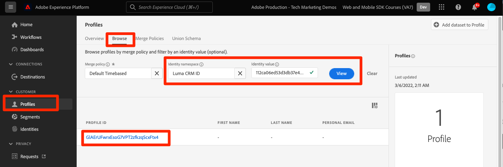
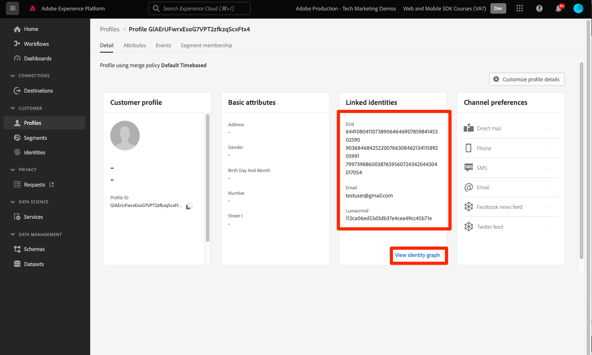

# Gegevens verzenden naar Adobe Experience Platform

Leer hoe u gegevens naar Adobe Experience Platform verzendt.

Deze optionele les is relevant voor alle klanten van Real-time Customer Data Platform (Real-time CDP), Journey Optimizer en Customer Journey Analytics. Experience Platform, de basis van producten van de Experience Cloud, is een open systeem dat al uw gegevens - Adobe en niet-Adobe - in robuuste klantenprofielen omzet die in echt - tijd bijwerken en AI-gedreven inzichten gebruiken om u te helpen om de juiste ervaringen over elk kanaal te leveren.

De [event](events.md), [levenscyclus](lifecycle-data.md), en [identiteit](identity.md) de gegevens die u verzamelde en naar het Netwerk van de Rand van het Platform in vroegere lessen verzendt worden door:sturen aan de diensten die in uw gegevensstroom, met inbegrip van Adobe Experience Platform worden gevormd.

## Vereisten

Uw organisatie moet zijn voorzien en toestemmingen voor Adobe Experience Platform worden verleend.

Als u geen toegang hebt, kunt u [deze les overslaan](install-sdks.md).

## Leerdoelstellingen

In deze les zult u:

* Maak een gegevensset voor Experience Platforms.
* Valideer gegevens in de dataset.
* Laat uw schema en dataset voor het Profiel van de Klant in real time toe.
* Gegevens valideren in realtime-klantprofiel.
* Gegevens in de identiteitsgrafiek valideren.

## Een gegevensset maken

Alle gegevens die met succes in Adobe Experience Platform worden opgenomen, blijven binnen het datumpeer als datasets voortbestaan. Een dataset is een opslag en beheersconstructie voor een inzameling van gegevens, typisch een lijst, die een schema (kolommen) en gebieden (rijen) bevat. Datasets bevatten ook metagegevens die verschillende aspecten van de gegevens beschrijven die ze opslaan. Zie de [documentatie](https://experienceleague.adobe.com/docs/experience-platform/catalog/datasets/overview.html) ter informatie.

1. Navigeer naar de interface Experience Platform door deze te selecteren in het 3x3-menu rechtsboven.
   

1. Selecteren **[!UICONTROL Gegevenssets]** in het navigatiemenu aan de linkerkant.

1. **[!UICONTROL Gegevensset maken]**.
   

1. Selecteren **[!UICONTROL Gegevensset maken van schema]**.
   

1. Zoek naar uw schema en selecteer.

1. Selecteren **[!UICONTROL Volgende]**.
   

1. Een **[!UICONTROL Naam]**, **[!UICONTROL Beschrijving]** en selecteert u **[!UICONTROL Voltooien]**.
   

## De gegevensstroom bijwerken

Zodra u uw dataset hebt gecreeerd, ben zeker om [uw gegevensstroom bijwerken](create-datastream.md) om Adobe Experience Platform toe te voegen. Deze update zorgt voor gegevensstromen naar Platform.

## Gegevens in de gegevensset valideren

Nu u een dataset hebt gecreeerd en uw gegevensstroom bijgewerkt om gegevens naar Experience Platform te verzenden, worden alle gegevens XDM die naar het Netwerk van de Rand van het Platform verzenden door:sturen naar Platform en landen in de dataset.

Open de app en navigeer naar schermen waar u gebeurtenissen bijhoudt. U kunt levenscyclusmetriek ook teweegbrengen.

Open uw dataset in de interface van het Platform. U zou de gegevens moeten zien aankomend in partijen aan de dataset

U moet ook voorbeeldrecords en velden kunnen zien met de opdracht **[!UICONTROL Gegevensset voorvertoning]** functie:

Platform is een robuuster hulpmiddel voor het valideren van gegevens [queryservice](https://experienceleague.adobe.com/docs/platform-learn/tutorials/queries/explore-data.html).

## Klantprofiel in realtime inschakelen

Met het Real-Time Klantprofiel van Experience Platform kunt u een holistische weergave van elke individuele klant maken waarin gegevens van meerdere kanalen worden gecombineerd, waaronder online-, offline-, CRM- en gegevens van derden. Het profiel staat u toe om uw ongelijke klantengegevens in een verenigde mening te consolideren die een actionable, timestamped rekening van elke klanteninteractie aanbiedt.

### Het schema inschakelen

1. Uw schema openen
1. Inschakelen **[!UICONTROL Profiel]**
1. Selecteren **[!UICONTROL De gegevens voor dit schema zullen een primaire identiteit op het identityMap gebied bevatten.]** in het modaal
1. **[!UICONTROL Opslaan]** het schema

   

### De gegevensset inschakelen

1. Uw gegevensset openen
1. Inschakelen **[!UICONTROL Profiel]**

   

### Gegevens in profiel valideren

Open de app en navigeer naar schermen waar u gebeurtenissen bijhoudt. Meld u aan bij de app Luma en schaf een aankoop.

Kies Verzekering om een van de identiteiten te zoeken die in de identityMap zijn doorgegeven (e-mail, lumaCrmId of ECID):

>[!TIP]
>
>   De waarde van de `lumaCrmId` is `112ca06ed53d3db37e4cea49cc45b71e`

Navigeer in de interface Platform naar **[!UICONTROL Profielen]** > **[!UICONTROL Bladeren]**, zoekt u de identiteitswaarde die u net hebt opgehaald en opent u het profiel:

Op de **[!UICONTROL Detail]** het scherm u basisinformatie over de gebruiker kunt zien, met inbegrip van **[!UICONTROL ** gekoppelde identiteiten **]**:

Op de **[!UICONTROL Gebeurtenissen]** kunt u de gebeurtenissen zien die bij uw mobiele app-implementatie voor deze gebruiker zijn verzameld:

Klik in het scherm met profieldetails op de koppeling om de identiteitsgrafiek weer te geven of navigeer naar **[!UICONTROL Identiteiten]** > **[!UICONTROL Identiteitsgrafiek]** en zoekt u de identiteitswaarde op. Deze visualisatie toont u alle identiteiten die samen in een profiel en hun oorsprong verbonden zijn. Hier ziet u een voorbeeld van een identiteitsgrafiek die is samengesteld uit gegevens die zijn verzameld tijdens het voltooien van deze zelfstudie voor Mobile SDK (gegevensbron 2) en de [Zelfstudie over Web SDK](https://experienceleague.adobe.com/docs/platform-learn/implement-web-sdk/overview.html) (Gegevensbron 1):

Marketers en analytici kunnen nog veel meer doen met gegevens die in Experience Platform zijn vastgelegd, waaronder het analyseren ervan in Customer Journey Analytics en bouwsegmenten in Real-time Customer Data Platform. Je bent klaar om te beginnen!

Volgende: **[Push messaging (Push messaging) met Journey Optimizer](journey-optimizer-push.md)**

>[!NOTE]
>
>Bedankt dat u tijd hebt geïnvesteerd in het leren van Adobe Experience Platform Mobile SDK. Als u vragen hebt, algemene feedback wilt delen of suggesties voor toekomstige inhoud hebt, kunt u deze delen over deze [Experience League Communautaire discussiestuk](https://experienceleaguecommunities.adobe.com/t5/adobe-experience-platform-launch/tutorial-discussion-implement-adobe-experience-cloud-in-mobile/td-p/443796)
