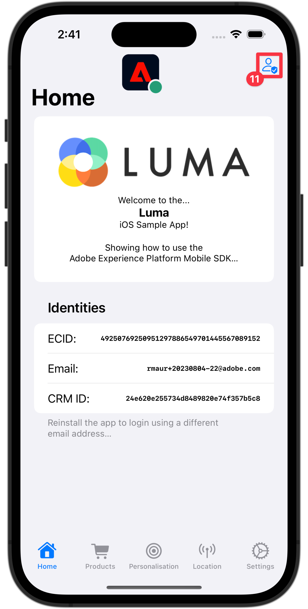

# Profielgegevens verzamelen

Leer hoe u profielgegevens kunt verzamelen in een mobiele app.

U kunt de extensie Profiel gebruiken om kenmerken van de gebruiker op de client op te slaan. Deze informatie kan later worden gebruikt om berichten tijdens online of off-line scenario&#39;s te richten en te personaliseren, zonder het moeten met een server voor optimale prestaties verbinden.

De extensie Profiel beheert het Client-Side Operation Profile (CSOP), biedt een manier om op API&#39;s te reageren, werkt gebruikersprofielkenmerken bij en deelt de gebruikersprofielkenmerken met de rest van het systeem als een gegenereerde gebeurtenis.

De profielgegevens worden door andere extensies gebruikt om acties met betrekking tot profielen uit te voeren. Een voorbeeld is de uitbreiding van de Motor van Regels die de profielgegevens verbruikt en regels in werking stelt die op de profielgegevens worden gebaseerd. Leer meer over de [&#x200B; uitbreiding van het Profiel &#x200B;](https://developer.adobe.com/client-sdks/documentation/profile/) in de documentatie

>[!IMPORTANT]
>
>De functionaliteit Profiel die in deze les wordt beschreven is los van de Real-Time functionaliteit van het Profiel van de Klant in Adobe Experience Platform en Platform-based toepassingen.


## Vereisten

* App met SDK&#39;s geïnstalleerd en geconfigureerd met succes gemaakt en uitgevoerd.

## Leerdoelstellingen

In deze les zult u:

* Gebruikerskenmerken instellen of bijwerken.
* Gebruikerskenmerken ophalen.


## Gebruikerskenmerken instellen en bijwerken

Het is handig om gebruikers te laten kiezen voor een bepaald doel en om de app aan te passen en snel te laten weten of een gebruiker in het verleden of onlangs een aankoop heeft gedaan. Laten we dat instellen in de Luma-app.

>[!BEGINTABS]

>[!TAB  iOS ]

1. Navigeer naar **[!DNL Luma]** > **[!DNL Luma]** > **[!DNL Utils]** > **[!DNL MobileSDK]** in de Xcode Project navigator en zoek de `func updateUserAttribute(attributeName: String, attributeValue: String)` functie. Voeg de volgende code toe:

   ```swift
   // Create a profile map, add attributes to the map and update profile using the map
   var profileMap = [String: Any]()
   profileMap[attributeName] = attributeValue
   UserProfile.updateUserAttributes(attributeDict: profileMap)
   ```

   Deze code:

   1. Hiermee wordt een leeg woordenboek met de naam `profileMap` ingesteld.

   1. Hiermee voegt u een element aan het woordenboek toe met `attributeName` (bijvoorbeeld `isPaidUser` ) en `attributeValue` (bijvoorbeeld `yes` ).

   1. Gebruikt het `profileMap` woordenboek als waarde aan de `attributeDict` parameter van de [`UserProfile.updateUserAttributes` &#x200B;](https://developer.adobe.com/client-sdks/documentation/profile/api-reference/#updateuserattributes) API vraag.

1. Navigeer aan **[!DNL Luma]** > **[!DNL Luma]** > **[!DNL Views]** > **[!DNL Products]** > **[!DNL ProductView]** in de navigator van het Project van Xcode en vind de vraag aan `updateUserAttributes` (binnen de code voor de Aankopen  knoop). Voeg de volgende code toe:

   ```swift
   // Update attributes
   MobileSDK.shared.updateUserAttribute(attributeName: "isPaidUser", attributeValue: "yes")
   ```

>[!TAB  Android ]

1. Navigeer aan **[!UICONTROL Android]**  > **[!DNL app]** > **[!DNL kotlin+java]** > **[!DNL com.adobe.luma.tutorial.android]** > **[!UICONTROL models]** > **[!UICONTROL MobileSDK]** in de navigator van Android Studio en vind de `func updateUserAttribute(attributeName: String, attributeValue: String)` functie. Voeg de volgende code toe:

   ```kotlin
   // Create a profile map, add attributes to the map and update profile using the map
   val profileMap = mapOf(attributeName to attributeValue)
   UserProfile.updateUserAttributes(profileMap)
   ```

   Deze code:

   1. Stelt een lege kaart met de naam `profileMap` in.

   1. Voegt een element aan de kaart toe gebruikend `attributeName` (bijvoorbeeld `isPaidUser`), en `attributeValue` (bijvoorbeeld `yes`).

   1. Gebruikt de `profileMap` kaart als waarde aan de `attributeDict` parameter van de [`UserProfile.updateUserAttributes` &#x200B;](https://developer.adobe.com/client-sdks/documentation/profile/api-reference/#updateuserattributes) API vraag.

1. Navigeer aan **[!UICONTROL Android]**  > **[!DNL app]** > **[!DNL kotlin+java]** > **[!DNL com.adobe.luma.tutorial.android]** > **[!UICONTROL views]** > **[!UICONTROL ProductView.kt]** en vind de vraag aan `updateUserAttributes` (binnen de code voor de Aankopen  knoop). Voeg de volgende code toe:

   ```kotlin
   // Update attributes
   MobileSDK.shared.updateUserAttribute("isPaidUser", "yes")
   ```

>[!ENDTABS]

## Gebruikerskenmerken ophalen

Nadat u het kenmerk van een gebruiker hebt bijgewerkt, is het beschikbaar voor andere Adobe-SDK&#39;s, maar u kunt kenmerken ook expliciet ophalen, zodat de toepassing zich naar wens gedraagt.

>[!BEGINTABS]

>[!TAB  iOS ]

1. Navigeer naar **[!DNL Luma]** > **[!DNL Luma]** > **[!DNL Views]** > **[!DNL General]** > **[!DNL HomeView]** in de Xcode-projectnavigator en zoek de optie `.onAppear` . Voeg de volgende code toe:

   ```swift
   // Get attributes
   UserProfile.getUserAttributes(attributeNames: ["isPaidUser"]) { attributes, error in
       if attributes?.count ?? 0 > 0 {
           if attributes?["isPaidUser"] as? String == "yes" {
               showBadgeForUser = true
           }
           else {
               showBadgeForUser = false
           }
       }
   }
   ```

   Deze code:

   1. Roept de [`UserProfile.getUserAttributes` &#x200B;](https://developer.adobe.com/client-sdks/documentation/profile/api-reference/#getuserattributes) API met de `isPaidUser` attribuutnaam als enig element in de `attributeNames` serie.
   1. Dan controles op de waarde van het `isPaidUser` attribuut en wanneer `yes`, een badge op het  pictogram in de toolbar bij het hoogste recht plaatst.

>[!TAB  Android ]

1. Navigeer aan **[!UICONTROL Android]**  > **[!DNL app]** > **[!DNL kotlin+java]** > **[!DNL com.adobe.luma.tutorial.androi]** > **[!DNL views]** > **[!DNL HomeView.kt]** in de het projectnavigator van Android Studio en vind de `.onAppear` bepaling. Voeg de volgende code toe:

   ```kotlin
   // Get attributes
   UserProfile.getUserAttributes(listOf("isPaidUser")) { attributes ->
       showBadgeForUser = attributes?.get("isPaidUser") == "yes"
   }
   ```

   Deze code:

   1. Roept de [`UserProfile.getUserAttributes` &#x200B;](https://developer.adobe.com/client-sdks/documentation/profile/api-reference/#getuserattributes) API met de `isPaidUser` attribuutnaam als enig element in de `attributeNames` serie.
   1. Vervolgens wordt gecontroleerd op de waarde van het kenmerk `isPaidUser` . In `yes` vervangt de code het persoonlijke pictogram door een pictogram met een badge in de werkbalk rechtsboven.

>[!ENDTABS]

Zie de [&#x200B; API verwijzing &#x200B;](https://developer.adobe.com/client-sdks/documentation/profile/api-reference/#getuserattributes) voor meer informatie.

## Valideren met Assurance

1. Herzie de [&#x200B; sectie van opstellingsinstructies &#x200B;](assurance.md#connecting-to-a-session) om uw simulator of apparaat met Assurance te verbinden.
1. Voer de app uit om u aan te melden en te communiceren met een product.

>[!BEGINTABS]

>[!TAB  iOS ]

1. Selecteer **[!UICONTROL Home]** in de tabbalk.
1. Het Assurance-pictogram naar links verplaatsen.
1. Om het Login blad te openen, selecteer de .

   

1. Als u een willekeurige e-mail en een klant-id wilt invoegen, selecteert u de knop **[!UICONTROL A |]** .
1. Selecteer **[!UICONTROL Login]**.

   

1. Selecteer **[!DNL Products]** in de tabbalk.
1. Selecteer één product.
1. Selecteer .
1. Selecteer .
1. Selecteer .

   

1. Ga terug naar **[!UICONTROL Home]** screen. U zou moeten zien dat een badge  is toegevoegd.

   


>[!TAB  Android ]

1. Selecteer **[!UICONTROL Home]** in de tabbalk.
1. Het Assurance-pictogram naar links verplaatsen.
1. Om het Login blad te openen, selecteer de .

   

1. Selecteer **[!UICONTROL Generate Random Email]** als u een willekeurige e-mail en een klant-id wilt invoegen.
1. Selecteer **[!UICONTROL Login]**.

   

1. Selecteer **[!DNL Products]** in de tabbalk.
1. Selecteer één product.
1. Selecteer 
1. Selecteer .
1. Selecteer .

   

1. Ga terug naar **[!UICONTROL Home]** screen. U zou moeten zien dat het persoonspictogram wordt bijgewerkt.

   

>[!ENDTABS]


In de gebruikersinterface van Assurance worden **[!UICONTROL UserProfileUpdate]** - en **[!UICONTROL getUserAttributes]** -gebeurtenissen met de bijgewerkte `profileMap` -waarde weergegeven.

{zoomable="yes"}

>[!SUCCESS]
>
>U hebt nu uw app ingesteld om de kenmerken van profielen in de Edge Network en (wanneer deze is ingesteld) in Adobe Experience Platform bij te werken.
>
>Bedankt dat je tijd hebt geïnvesteerd in het leren van Adobe Experience Platform Mobile SDK. Als u vragen hebt, algemene terugkoppelen willen delen, of suggesties over toekomstige inhoud hebben, hen op deze [&#x200B; Communautaire besprekingspost van Experience League &#x200B;](https://experienceleaguecommunities.adobe.com/t5/adobe-experience-platform-data/tutorial-discussion-implement-adobe-experience-cloud-in-mobile/td-p/443796) delen.

Volgende: **[Plaatsen van het Gebruik](places.md)**
