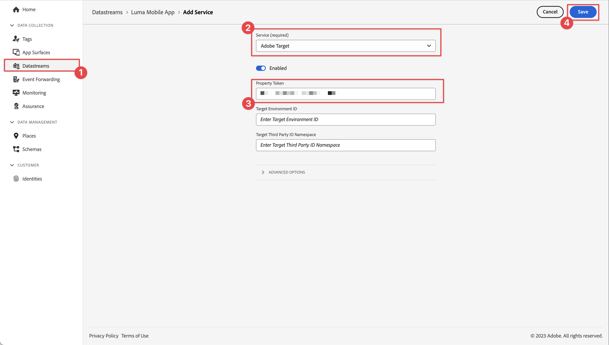

# Optimaliseren en aanpassen met Adobe Target

Leer hoe u de ervaringen in uw mobiele apps kunt optimaliseren en aanpassen met Platform Mobile SDK en Adobe Target.

Het doel biedt alles wat u moet aanpassen en aanpassen aan de ervaringen van uw klanten. Met Doel kunt u uw omzet maximaliseren op uw website en mobiele sites, apps, sociale media en andere digitale kanalen. Het doel kan tests A/B, multivariate tests uitvoeren, producten en inhoud, doelinhoud adviseren, inhoud auto-personalize met AI, en veel meer. De nadruk in deze les is op de A/B testfunctionaliteit van Doel. Zie het [ overzicht van de Test A/B ](https://experienceleague.adobe.com/docs/target/using/activities/abtest/test-ab.html?lang=nl-NL) voor meer informatie.


Voordat u A/B-tests kunt uitvoeren met Target, moet u ervoor zorgen dat de juiste configuraties en integratie zijn geïnstalleerd.

>[!NOTE]
>
>Deze les is optioneel en is alleen van toepassing op Adobe Target-gebruikers die A/B-tests willen uitvoeren.


## Vereisten

* App met SDK&#39;s geïnstalleerd en geconfigureerd met succes gemaakt en uitgevoerd.
* Toegang tot Adobe Target met toestemmingen, behoorlijk gevormde rollen, werkruimten, en eigenschappen zoals die [ hier ](https://experienceleague.adobe.com/docs/target/using/administer/manage-users/enterprise/property-channel.html?lang=nl-NL) worden beschreven.


## Leerdoelstellingen

In deze les zult u:

* Werk uw gegevensstroom bij voor integratie van het Doel.
* Werk de eigenschap tag bij met de extensie Journey Optimizer - Decisioning.
* Werk uw schema bij om aanvraaggebeurtenissen vast te leggen.
* Valideer installatie in Betrouwbaarheid.
* Maak een eenvoudige A/B-test in Doel.
* Werk uw app bij om de extensie Optimizer te registreren.
* Implementeer de A/B-test in uw app.
* Implementatie valideren in Betrouwbaarheid.


## Instellen

>[!TIP]
>
>Als u opstelling uw app reeds als deel van [ Journey Optimizer aanbiedingen ](journey-optimizer-offers.md) les hebt, zou u sommige stappen in deze opstellingssectie reeds kunnen reeds uitgevoerd.

### Gegevensstroomconfiguratie bijwerken

#### Adobe Target

Om ervoor te zorgen dat gegevens die vanuit uw mobiele app naar de Edge Network van het Experience Platform worden verzonden, naar Adobe Target worden doorgestuurd, moet u de configuratie van de gegevensstroom bijwerken.

1. Selecteer **[!UICONTROL Datastreams]** in de gebruikersinterface voor gegevensverzameling en selecteer de gegevensstroom, bijvoorbeeld **[!DNL Luma Mobile App]** .
1. Selecteer **[!UICONTROL Add Service]** en selecteer **[!UICONTROL Adobe Target]** in de lijst **[!UICONTROL Service]** .
1. Als u een klant van de Premium van het Doel bent en bezitstokens wilt gebruiken, ga de waarde van het Doel **[!UICONTROL Property Token]** in die u voor deze integratie wilt gebruiken. Target Standard-gebruikers kunnen deze stap overslaan.

   U kunt de eigenschappen vinden in de doelinterface, in **[!UICONTROL Administration]** > **[!UICONTROL Properties]** . Selecteer  om het bezitstoken voor het bezit te openbaren u wilt gebruiken. De eigenschapstoken heeft een indeling zoals `"at_property": "xxxxxxxx-xxxx-xxxxx-xxxx-xxxxxxxxxxxx"` ; u moet alleen de waarde `xxxxxxxx-xxxx-xxxxx-xxxx-xxxxxxxxxxxx` invoeren.

   U kunt ook een doel-omgeving-id opgeven. Het doel gebruikt omgevingen om uw sites en pre-productieomgevingen te organiseren voor eenvoudig beheer en afzonderlijke rapportering. De vooraf ingestelde omgevingen zijn onder andere Productie, Staging en Ontwikkeling. Zie [ Milieu ](https://experienceleague.adobe.com/docs/target/using/administer/environments.html?lang=nl-NL) en [ identiteitskaart van het Milieu van het Doel ](https://experienceleague.adobe.com/docs/platform-learn/implement-web-sdk/applications-setup/setup-target.html?lang=nl-NL#target-environment-id) voor meer informatie.

   U kunt desgewenst een naamruimte van een externe doelid opgeven ter ondersteuning van profielsynchronisatie op een naamruimte van een identiteit (bijvoorbeeld CRM-id). Zie [ identiteitskaart van de Derde van het Doel namespace ](https://experienceleague.adobe.com/docs/platform-learn/implement-web-sdk/applications-setup/setup-target.html?lang=nl-NL#target-third-party-id-namespace) voor meer informatie.

1. Selecteer **[!UICONTROL Save]**.

    toe


#### Adobe Journey Optimizer

Om ervoor te zorgen dat gegevens die vanuit uw mobiele app naar de Edge Network worden verzonden, naar Journey Optimizer - Beslissingsbeheer worden doorgestuurd, werkt u de configuratie van uw gegevensstroom bij.

1. Selecteer **[!UICONTROL Datastreams]** in de gebruikersinterface voor gegevensverzameling en selecteer de gegevensstroom, bijvoorbeeld **[!DNL Luma Mobile App]** .
1. Selecteer  voor **[!UICONTROL Experience Platform]** en selecteer  **[!UICONTROL Edit]** van het contextmenu.
1. In **[!UICONTROL Datastreams]** >  > **[!UICONTROL Adobe Experience Platform]** scherm, zorg ervoor dat **[!UICONTROL Offer Decisioning]**, **[!UICONTROL Edge Segmentation]**, en **[!UICONTROL Personalization Destinations]** worden geselecteerd. Als u ook de Journey Optimizer-lessen volgt, selecteert u **[!UICONTROL Adobe Journey Optimizer]** . Zie {de montages van 0} Adobe Experience Platform [&#128279;](https://experienceleague.adobe.com/docs/experience-platform/datastreams/configure.html?lang=nl-NL#aep) voor meer informatie.
1. Selecteer **[!UICONTROL Save]** om de configuratie van de gegevensstroom op te slaan.

   


### Adobe Journey Optimizer installeren - extensie voor beslissingstags

1. Navigeer naar **[!UICONTROL Tags]** , zoek de eigenschap mobile tag en open de eigenschap.
1. Selecteer **[!UICONTROL Extensions]**.
1. Selecteer **[!UICONTROL Catalog]**.
1. Zoek naar de extensie **[!UICONTROL Adobe Journey Optimizer - Decisioning]** .
1. De extensie installeren. Voor de extensie is geen aanvullende configuratie vereist.

   


### Uw schema bijwerken

1. Navigeer naar de interface voor gegevensverzameling en selecteer **[!UICONTROL Schemas]** in de linkertrack.
1. Selecteer **[!UICONTROL Browse]** in de bovenste balk.
1. Selecteer het schema om het te openen.
1. In de schemaredacteur, voegt de uitgezochte  toe **[!UICONTROL Add]** naast **[!UICONTROL Field groups]**.
1. Zoek in het dialoogvenster **[!UICONTROL Add field groups]** naar `proposition` , selecteer **[!UICONTROL Experience Event - Proposition Interactions]** en selecteer **[!UICONTROL Add field groups]** .
   
1. Selecteer **[!UICONTROL Save]** om de wijzigingen in het schema op te slaan.


### Setup valideren bij Betrouwbaarheid

Uw instellingen valideren in Betrouwbaarheid:

1. Ga naar de betrouwbaarheidsinterface.
1. Selecteer **[!UICONTROL Configure]** in linkerspoor en selecteer  naast **[!UICONTROL Validate Setup]** onder **[!UICONTROL ADOBE JOURNEY OPTIMIZER DECISIONING]**.
1. Selecteer **[!UICONTROL Save]**.
1. Selecteer **[!UICONTROL Validate Setup]** in het linkerspoor. Zowel de gegevensstroomopstelling wordt bevestigd als de opstelling van SDK in uw toepassing.
   

## Een A/B-test maken

Er zijn vele soorten activiteiten die u kunt maken in Adobe Target en implementeren in een mobiele app, zoals vermeld in de inleiding. Voor deze les, zult u een test A/B uitvoeren.

1. Selecteer in de interface Doel de optie **[!UICONTROL Activities]** in de bovenste balk.
1. Selecteer **[!UICONTROL Create Activity]** en **[!UICONTROL A/B Test]** in het contextmenu.
1. Selecteer in het dialoogvenster **[!UICONTROL Create A/B Test Activity]** **[!UICONTROL Mobile]** als **[!UICONTROL Type]** , selecteer een werkruimte in de lijst **[!UICONTROL Choose Workspace]** en selecteer uw eigenschap in de lijst **[!UICONTROL Choose property]** als u een Target Premium-klant bent en een eigenschapstoken hebt opgegeven in de gegevensstroom.
1. Selecteer **[!UICONTROL Create]**.
   

1. In het **[!UICONTROL Untitled Activity]** -scherm voert u bij de **[!UICONTROL Experiences]** -stap het volgende uit:

   1. Voer `luma-mobileapp-abtest` in **[!UICONTROL Select Location]** onder **[!UICONTROL LOCATION 1]** in. Deze locatienaam (vaak mbox genoemd) wordt later gebruikt in de app-implementatie.
   1. Selecteer  naast **[!UICONTROL Default Content]** en selecteer **[!UICONTROL Create JSON Offer]** van het contextmenu.
   1. Kopieer de volgende JSON naar **[!UICONTROL Enter a valid JSON object]** .

      ```json
      { 
          "title": "Luma Anaolog Watch",
          "text": "Designed to stand up to your active lifestyle, this women's Luma Analog Watch features a tasteful brushed chrome finish and a stainless steel, water-resistant construction for lasting durability.", 
          "image": "https://luma.enablementadobe.com/content/dam/luma/en/products/gear/watches/Luma_Analog_Watch.jpg" 
      }
      ```

   1. Selecteer **[!UICONTROL + Add Experience]**.

      

   1. Herhaal stap b en c voor Ervaring B, maar gebruik in plaats daarvan het volgende JSON:

      ```json
      { 
          "title": "Aim Analog Watch",
          "text": "The flexible, rubberized strap is contoured to conform to the shape of your wrist for a comfortable all-day fit. The face features three illuminated hands, a digital read-out of the current time, and stopwatch functions.", 
          "image": "https://luma.enablementadobe.com/content/dam/luma/en/products/gear/watches/Aim_Watch.jpg" 
      }
      ```

   1. Selecteer **[!UICONTROL Next]**.

      

1. Controleer in de stap **[!DNL Targeting]** de instelling van uw A/B-test. Beide aanbiedingen worden standaard gelijkelijk over alle bezoekers verdeeld. Selecteer **[!UICONTROL Next]** om door te gaan.

   

1. In de stap **[!UICONTROL Goals & Settings]** :

   1. Wijzig de naam van de activiteit zonder naam, bijvoorbeeld in `Luma Mobile SDK Tutorial - A/B Test Example` .
   1. Voer bijvoorbeeld **[!UICONTROL Objective]** in voor de A/B-test `A/B Test for Luma mobile app tutorial` .
   1. Selecteer **[!UICONTROL Conversion]** , **[!UICONTROL Viewed an mbox]** in de tegel **[!UICONTROL Goal Metric]** > **[!UICONTROL MY PRIMARY GOAL]** en voer de naam van uw locatie (mbox) in, bijvoorbeeld `luma-mobileapp-abtest` .
   1. Selecteer **[!UICONTROL Save & Close]**.

      

1. Terug in het **[!UICONTROL All Activities]** scherm:

   1. Selecteer  bij uw activiteit.
   1. Selecteer  **[!UICONTROL Activate]** om uw test te activeren A/B.

   


## Doel implementeren in uw app

Zoals in vorige lessen is besproken, biedt het installeren van een extensie voor mobiele tags alleen de configuratie. Vervolgens moet u de Optimize SDK installeren en registreren. Als deze stappen niet duidelijk zijn, herzie [ installeer SDKs ](install-sdks.md) sectie.

>[!NOTE]
>
>Als u [ voltooide installeerde SDKs ](install-sdks.md) sectie, dan is SDK reeds geïnstalleerd en u kunt deze stap overslaan.
>

1. In Xcode, zorg ervoor dat [ AEP ](https://github.com/adobe/aepsdk-messaging-ios) optimaliseert aan de lijst van pakketten in de Afhankelijkheden van het Pakket wordt toegevoegd. Zie {de Manager van het Pakket van 0} Swift [&#128279;](install-sdks.md#swift-package-manager).
1. Navigeer naar **[!DNL Luma]** > **[!DNL Luma]** > **[!DNL AppDelegate]** in de Xcode-projectnavigator.
1. Controleer of `AEPOptimize` deel uitmaakt van uw lijst met importbewerkingen.

   `import AEPOptimize`

1. Controleer of `Optimize.self` deel uitmaakt van de array met extensies die u registreert.

   ```swift
   let extensions = [
       AEPIdentity.Identity.self,
       Lifecycle.self,
       Signal.self,
       Edge.self,
       AEPEdgeIdentity.Identity.self,
       Consent.self,
       UserProfile.self,
       Places.self,
       Messaging.self,
       Optimize.self,
       Assurance.self
   ]
   ```

1. Navigeer naar **[!DNL Luma]** > **[!DNL Luma]** > **[!DNL Utils]** > **[!DNL MobileSDK]** in de Xcode-projectnavigator. Zoek de functie ` func updatePropositionAT(ecid: String, location: String) async` . Voeg de volgende code toe:

   ```swift
   // set up the XDM dictionary, define decision scope and call update proposition API
   Task {
       let ecid = ["ECID" : ["id" : ecid, "primary" : true] as [String : Any]]
       let identityMap = ["identityMap" : ecid]
       let xdmData = ["xdm" : identityMap]
       let decisionScope = DecisionScope(name: location)
       Optimize.clearCachedPropositions()
       Optimize.updatePropositions(for: [decisionScope], withXdm: xdmData)
   }
   ```

   Deze functie:

   * stelt een XDM-woordenboek `xdmData` in met de ECID om het profiel te identificeren waarvoor u de A/B-test moet presenteren, en
   * definieert een `decisionScope` , een array met locaties waarop de A/B-test moet worden gepresenteerd.

   Dan roept de functie twee API&#39;s: [`Optimize.clearCachedPropositions` ](https://developer.adobe.com/client-sdks/documentation/adobe-journey-optimizer-decisioning/api-reference/#clearpropositions) en [`Optimize.updatePropositions` ](https://developer.adobe.com/client-sdks/documentation/adobe-journey-optimizer-decisioning/api-reference/#updatepropositions). Met deze functies worden alle in de cache opgeslagen voorstellingen gewist en worden de voorstellingen voor dit profiel bijgewerkt. Een voorstel in deze context is de ervaring (aanbieding) die van de activiteit van het Doel (uw test A/B) wordt geselecteerd en die u in [ creeerde een test A/B ](#create-an-ab-test).

1. Navigeer naar **[!DNL Luma]** > **[!DNL Luma]** > **[!DNL Views]** > **[!DNL Personalization]** > **[!DNL TargetOffersView]** in de Xcode-projectnavigator. Zoek de functie `func onPropositionsUpdateAT(location: String) async {` en inspecteer de code van deze functie. Het belangrijkste deel van deze functie is de [`Optimize.onPropositionsUpdate` ](https://developer.adobe.com/client-sdks/documentation/adobe-journey-optimizer-decisioning/api-reference/#onpropositionsupdate) API vraag, die:
   * wint de voorstellen voor het huidige profiel terug dat op het beslissingswerkingsgebied wordt gebaseerd (die de plaats is u in de A/B Test hebt bepaald);
   * het aanbod uit het voorstel ophaalt;
   * de inhoud van de aanbieding opheft, zodat deze correct in de app kan worden weergegeven, en
   * activeert de `displayed()` -actie op de aanbieding die een gebeurtenis terugstuurt naar de Edge Network van Platform die aangeeft dat de aanbieding wordt weergegeven.

1. Nog steeds in **[!DNL TargetOffersView]** , voeg de volgende code aan de `.onFirstAppear` bepaling toe. Deze code zorgt ervoor dat de callback voor het bijwerken van de aanbiedingen slechts eenmaal wordt geregistreerd.

   ```swift
   // Invoke callback for offer updates
   Task {
       await self.onPropositionsUpdateAT(location: location)
   }
   ```

1. Nog steeds in **[!DNL TargetOffersView]** , voeg de volgende code aan de `.task` bepaling toe. Met deze code worden de aanbiedingen bijgewerkt wanneer de weergave wordt vernieuwd.

   ```swift
   // Clear and update offers
   await self.updatePropositionsAT(ecid: currentEcid, location: location)
   ```

U kunt extra parameters van het Doel (zoals mbox, profiel, product, of ordeparameters) in een verzoek van de verpersoonlijkingsvraag naar het netwerk van de Ervaring Edge verzenden, door hen in een gegevenswoordenboek toe te voegen wanneer het roepen van [`Optimize.updatePropositions` ](https://developer.adobe.com/client-sdks/documentation/adobe-journey-optimizer-decisioning/api-reference/#updatepropositions) API. Zie voor meer informatie [ Parameters van het Doel ](https://developer.adobe.com/client-sdks/documentation/adobe-journey-optimizer-decisioning/#target-parameters).


## Valideren met de app

1. Rebuild en stel app in werking in de simulator of op een fysiek apparaat van Xcode, gebruikend .

1. Ga naar de tab **[!UICONTROL Personalisation]** .

1. Schuif omlaag naar de onderkant en u ziet een van de twee aanbiedingen die u hebt gedefinieerd in de A/B-test die wordt weergegeven in de **[!UICONTROL TARGET]** -tegel.

   


## Implementatie valideren bij Betrouwbaarheid

Om de A/B-test in betrouwbaarheid te valideren:

1. Herzie de [ sectie van opstellingsinstructies ](assurance.md#connecting-to-a-session) om uw simulator of apparaat aan Verzekering te verbinden.
1. Selecteer **[!UICONTROL Configure]** in linkerspoor en selecteer  naast **[!UICONTROL Review & Simulate]** onder **[!UICONTROL ADOBE JOURNEY OPTIMIZER DECISIONING]**.
1. Selecteer **[!UICONTROL Save]**.
1. Selecteer **[!UICONTROL Review & Simulate]** in het linkerspoor. Zowel de gegevensstroomopstelling wordt bevestigd als de opstelling van SDK in uw toepassing.
1. Selecteer **[!UICONTROL Requests]** op de bovenste balk. Uw **[!DNL Target]** -aanvragen worden weergegeven.
   

1. U kunt de tabbladen **[!UICONTROL Simulate]** en **[!UICONTROL Event List]** raadplegen voor meer functionaliteit om de instellingen voor Target-aanbiedingen te controleren.

## Volgende stappen

U moet nu over alle gereedschappen beschikken om waar nodig en van toepassing meer A/B-tests of andere doelactiviteiten (zoals Experience Targeting, Multivariate Test) aan uw app toe te voegen. Er is meer diepgaande informatie beschikbaar in de [ reactie GitHub voor de Optimize uitbreiding ](https://github.com/adobe/aepsdk-optimize-ios) waar u een verbinding aan een specifieke [ leerprogramma ](https://opensource.adobe.com/aepsdk-optimize-ios/#/tutorials/README) op kunt ook vinden hoe te om aanbiedingen van Adobe Target te volgen.

>[!SUCCESS]
>
>U hebt de app voor A/B-tests ingeschakeld en de resultaten van een A/B-test met Adobe Target en de Adobe Journey Optimizer - Decisioning-extensie voor de Adobe Experience Platform Mobile SDK weergegeven.
>
>Bedankt dat u tijd hebt geïnvesteerd in het leren van Adobe Experience Platform Mobile SDK. Als u vragen hebt, algemene terugkoppelen willen delen, of suggesties over toekomstige inhoud hebben, hen op deze [ Communautaire besprekingspost van de Experience League ](https://experienceleaguecommunities.adobe.com/t5/adobe-experience-platform-data/tutorial-discussion-implement-adobe-experience-cloud-in-mobile/td-p/443796) delen.

Volgende: **[Conclusie en volgende stappen](conclusion.md)**
