# 1.1.4 Adobe Marketing Agent voor Google Gemini Enterprise

[!BADGE Bèta]

+++Beta-gegevens
Door de Adobe Marketing Agent samen met Google Gemini Enterprise Beta te gebruiken, bevestigt u hierbij dat de Beta &quot;as is&quot; wordt geleverd zonder enige garantie. Adobe is niet verplicht de Beta te onderhouden, te corrigeren, bij te werken, te wijzigen, te wijzigen of anderszins te ondersteunen. U wordt aangeraden voorzichtig te zijn en op geen enkele wijze te vertrouwen op de juiste werking of prestaties van dergelijke Beta en/of begeleidende materialen. De Beta wordt beschouwd als vertrouwelijke informatie van Adobe.  Alle &quot;Feedback&quot; (informatie over de Beta, inclusief maar niet beperkt tot problemen of defecten die u tegenkomt bij het gebruik van de Beta, suggesties, verbeteringen en aanbevelingen) die u aan Adobe verstrekt, worden hierbij aan Adobe toegewezen, inclusief alle rechten, titel en interesse in en voor dergelijke feedback.

+++

## Vereisten

Om de stappen in dit laboratorium te volgen zoals hieronder gedocumenteerd, wordt de volgende toegang vereist:

- Toegang tot Real-Time CDP, Journey Optimizer en Customer Journey Analytics
- Toegang tot AI Assistant in Adobe Experience Cloud
- Toegang tot AEP Agent Orchestrator
- Toegang tot Google Gemini Enterprise

## Video

In deze video krijgt u een uitleg en demonstratie van alle stappen die bij deze oefening betrokken zijn.

>[!VIDEO](https://video.tv.adobe.com/v/3481322?quality=12&learn=on)

Dit lab is in ontwikkeling.

## 1.1.4.1 Toegang tot Google Gemini Enterprise

Ga naar [&#x200B; https://cloud.google.com/gemini-enterprise &#x200B;](https://cloud.google.com/gemini-enterprise). Klik **Begin 30 dag vrije proef**.


Ga het e-mailadres van uw Google rekening in en klik **verdergaan met e-mail**.


Verstrek uw eerste en achternaam en klik dan **akkoord &amp; begonnen worden**.


Klik **ik zal dit later** doen.


Dan moet je dit zien.


Ga naar [&#x200B; https://cloud.google.com/gemini-enterprise &#x200B;](https://cloud.google.com/gemini-enterprise).

Dan moet je iets dergelijks zien. Mogelijk moet u ook eerst uw factureringsaccount maken en deze daarna hier selecteren.


Klik **Begin 30 dag kostenvrije proef**.


Klik **verdergaan en activeren API**.

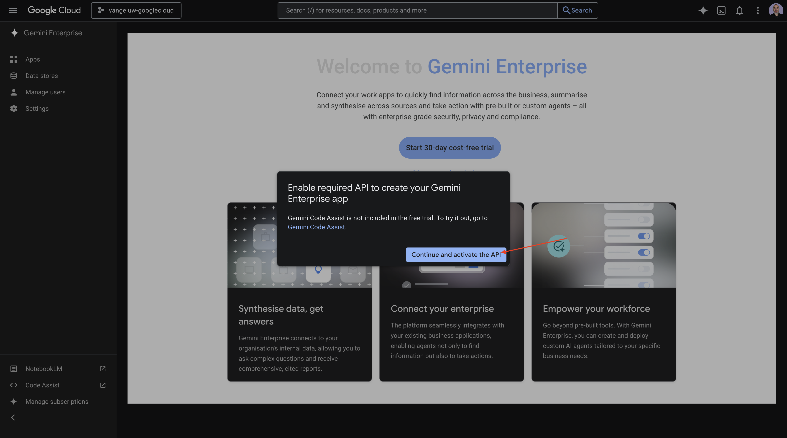

Klik **creëren**.


Dan moet je dit zien.


## 1.1.4.2 Een aangepaste agent maken met A2A

Ga naar [&#x200B; https://console.cloud.google.com/gemini-enterprise &#x200B;](https://console.cloud.google.com/gemini-enterprise). Klik **Agenten**.


Klik **+ voeg agent** toe.

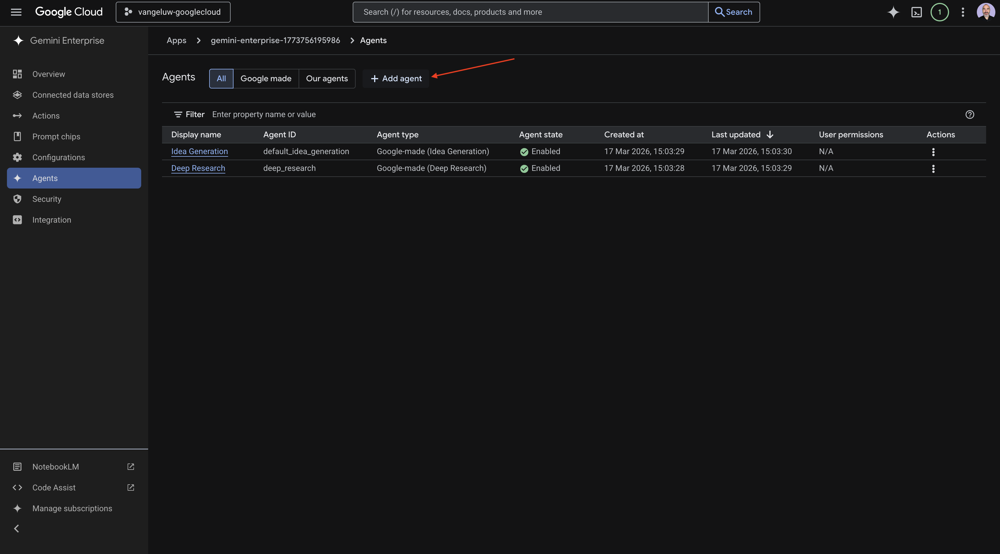

Selecteer **de agent van de Douane via A2A**.


Plak de **Kaart JSON van de Agent**.

>[!NOTE]
>
>Controle met uw vertegenwoordiger van Adobe om de **Kaart JSON van de Agent** informatie te krijgen.

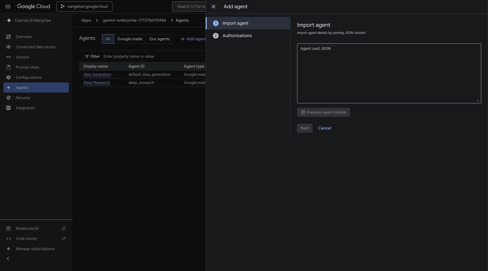

Na het kleven van de **Kaart JSON van de Agent**, klik **de agentendetails van de Voorproef**.


Dan moet je iets dergelijks zien. De rol neer en klikt **daarna**.

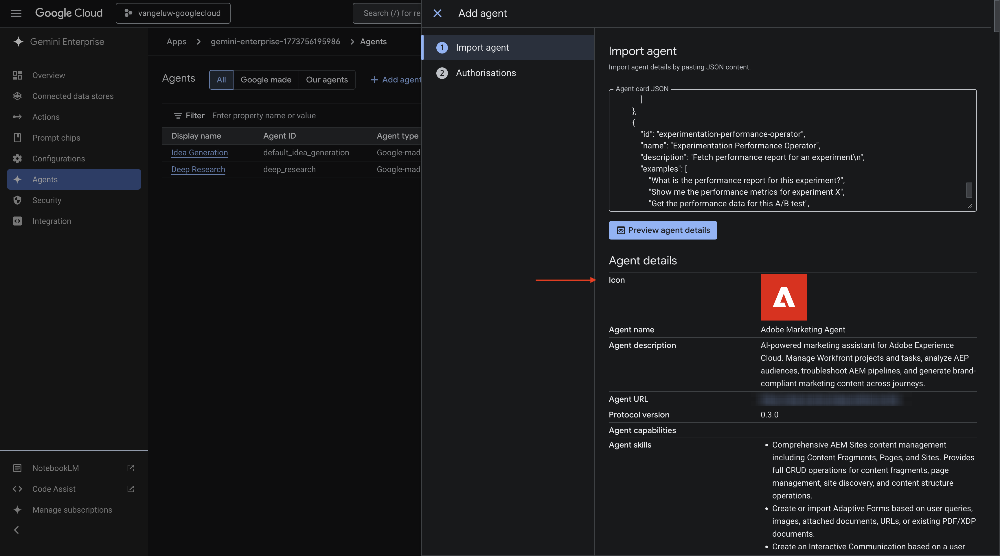

Dan moet je iets dergelijks zien.

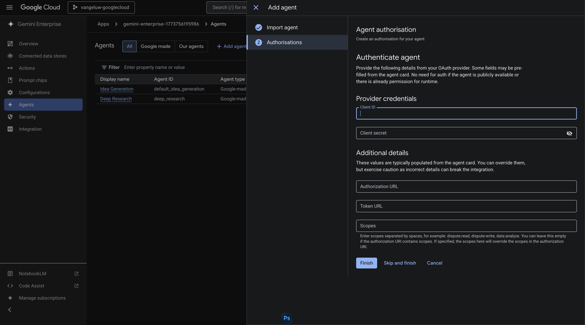

Vul de velden voor uw instantie in.

- **identiteitskaart van de Cliënt**:

```
--aepImsOrgId--
```

- **Geheim van de Cliënt**:

```
AdobeMarketingAgent
```

- **Vergunning URL**:

```
https://XXX.adobe.io/authorize
```

- **Symbolische URL**:

```
https://XXX.adobe.io/token
```

- **Scopes**:

```
openid email profile
```

Klik **Afwerking**.


Dan moet je dit zien.

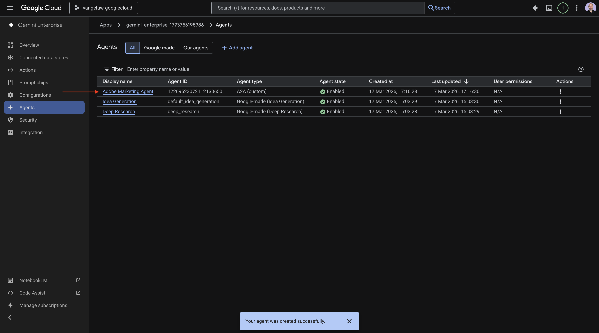

## 1.1.4.3 Aanmelden bij Adobe Marketing Agent

Ga naar **Overzicht** en klik dan **Voorproef**.

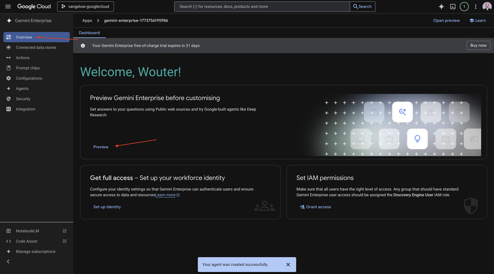

Klik **begonnen krijgen**

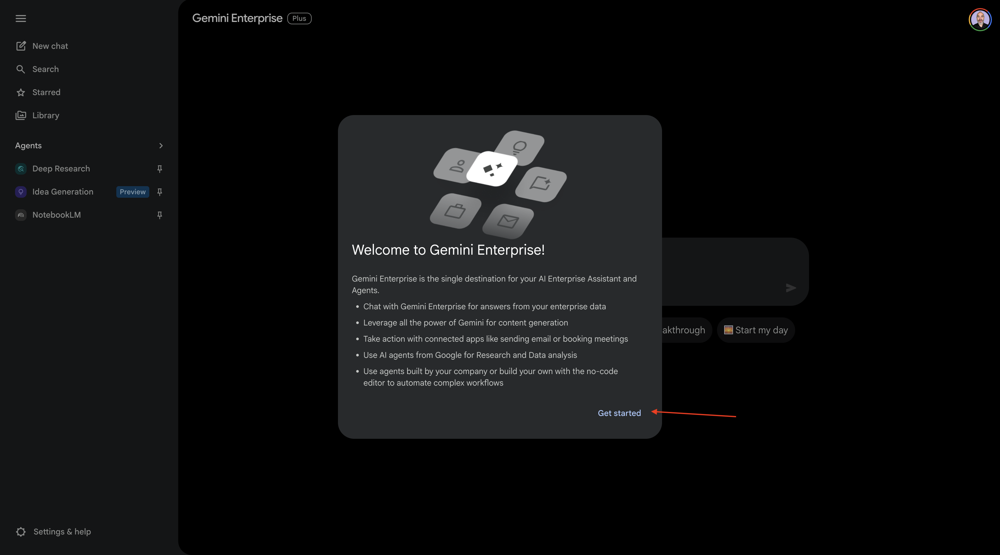

Ga naar **Agenten**. U zou **Adobe Marketing Agent** daar moeten zien.


Klik de 3 punten **..** en selecteer dan **Vastzetten**.


Ga naar **Nieuwe praatje** en ga het symbool **@** in het praatje in. Klik **Adobe Marketing Agent**.


Ga het bevel `login` in en klik dan **verzenden**.


Dan moet je dit zien. Klik **autoriseren**.


Klik **Toestaan Toegang** en voltooi login gebruikend uw Adobe ID, en selecteer de instantie `--aepImsOrgName--` wanneer ertoe aangezet.


Dan moet je dit zien.


## 1.1.4.4 Context instellen in Adobe Marketing Agent

Voordat we verder kunnen gaan met Adobe Marketing Agent via Copilot, moet de context worden vastgesteld.

Voor deze exercitie moet de context worden ingesteld op:

- **Sandbox**: **Prod - versnelt (VA7)**

  Met de instelling van de sandbox kunt u bepalen naar welke sandbox AI-assistent moet worden gekeken wanneer vragen worden gesteld.

- **Dataview**: **versnelt 2026 B2C**

Met de instelling voor gegevensweergave kunt u bepalen naar welke AI-assistent voor gegevensweergave moet worden gekeken wanneer u vragen stelt.

Om de zandbak te veranderen, ga het volgende bevel in en klik **verzend** knoop.

```javascript
list sandboxes
```


Dan zou je iets gelijkaardigs moeten zien. Ga het bevel `switch to sandbox accelerate` in en klik **verzenden** knoop.


Dan moet je dit zien. Om de gegevensmening te veranderen, ga het volgende bevel in en klik **verzend** knoop.

```javascript
list dataviews
```


Dan zou je iets gelijkaardigs moeten zien. Ga het bevel `switch dataview to Accelerate 2026 B2C` in en klik **verzenden** knoop.

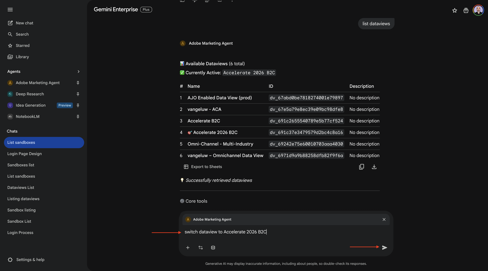

Dan moet je dit zien. De context is nu op de juiste wijze ingesteld, zodat u nu specifieke aanwijzingen kunt verzenden.

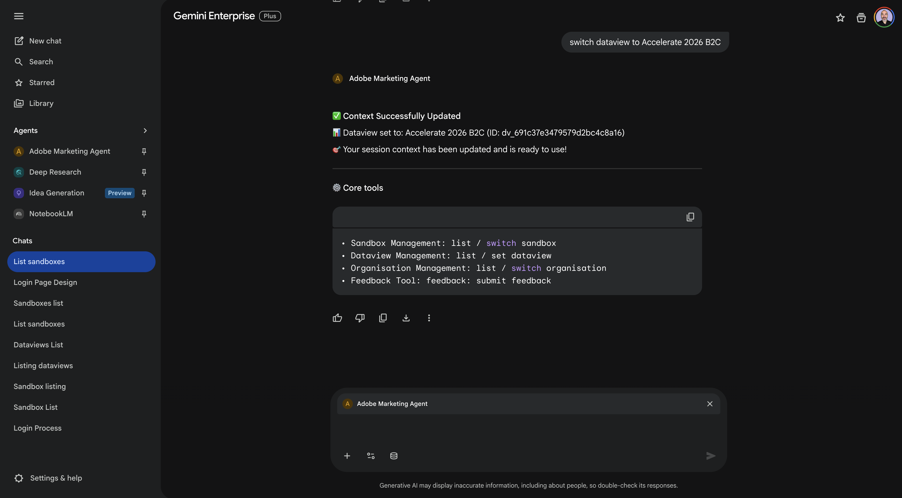

## 1.1.4.5 Begin met algemene aankooptrends om context te verankeren en in vezel te zoomen

**Intentie**

Krijg een impuls op topniveau op vraag-mobiel, Landline, Internet, TV, vezel-specifiek voor de recentste 60 dagen. Dit bepaalt basislijnen voor seizoensgebondenheid, bevorderingeffecten, en regionale variantie na de uitrol van New York.

Ga de volgende **Herinnering** in en klik **verzenden** knoop.

```javascript
Show me purchases by mainCategory over the last 7 months.
```


U zou dan dit moeten zien:


Ga de volgende **Herinnering** in en klik **verzenden** knoop.

```javascript
Show me purchases by mainCategory = Fiber over the last 7 months broken down by week
```


Je zou dan dit moeten zien, die naar vezelspecifieke tendensen daalt.


## 1.1.4.6 Orders correleren met voorkeuren voor inhoud

**Intentie**

Test de hypothese dat een voorkeur voor een specifieke genre (bijvoorbeeld, SciFi, Sport, Drama) breedbandverbeteringsgedrag-vooral voor hoge bandbreedtebehoeften voorspelt.

Eerst moet u erachter komen welk veld wordt gebruikt om de voorkeur voor genre op te slaan.

Ga de volgende **Herinnering** in en klik **verzenden** knoop.

```javascript
Which field is used to store the preferred genre
```

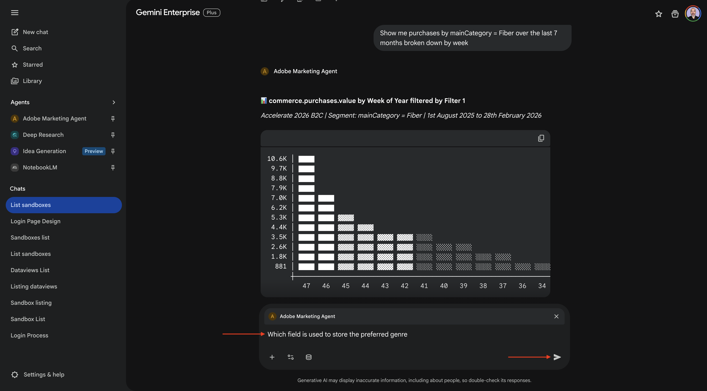

Vervolgens ziet u dit. Het veld dat voor genre wordt gebruikt, is **_experiencePlatform.individualCharacteristics.preferences.preferredGenre** .


Met deze informatie kunt u beginnen met het uitboren in de aankoopgegevens.

Ga de volgende **Herinnering** in en klik **verzenden** knoop.

```javascript
Show me ordersYTD by preferredGenre for the last 7 months
```


Dan moet je dit zien.

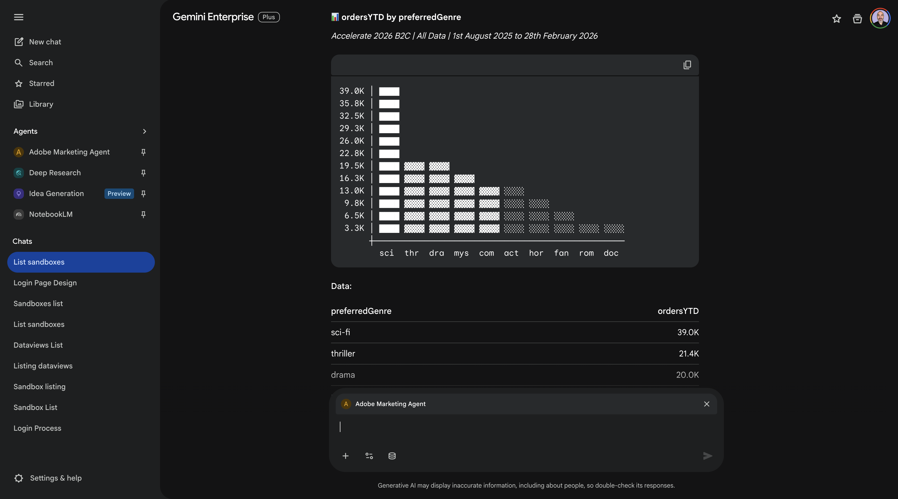

## 1.1.4.7 Bestaande vezelreizen identificeren

**Intentie**

Ontdek welke actieve of onlangs voltooide reizen &quot;Vezel&quot;in de titel omvatten - bv., &quot;vezel verbetering NYC - Sept&quot;, &quot;de Proefversie van de Vezel - de Bundel van de Streaming&quot;.

Ga de volgende **Herinnering** in en klik **verzenden** knoop.

```javascript
What journeys exist? 
```


Daarna moet u een lijst met reizen zien.

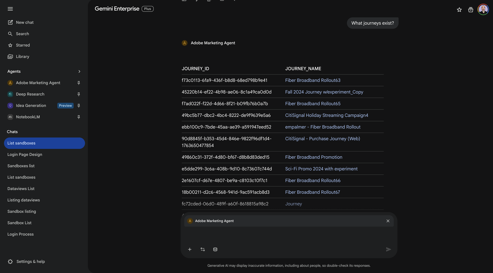

Ga de volgende **Herinnering** in en klik **verzenden** knoop.

```javascript
Which of these journeys has 'Fiber' in its name?
```

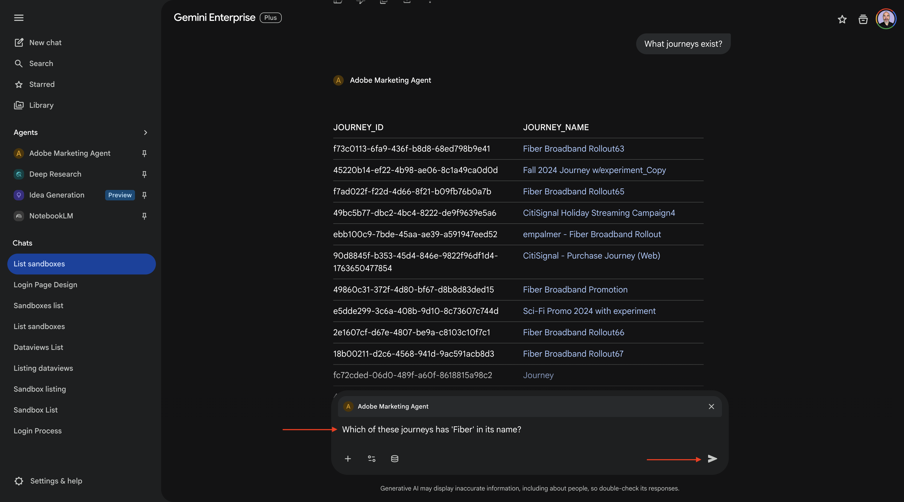

Dan moet je dit zien.


Ga de volgende **Herinnering** in en klik **verzenden** knoop.

```javascript
Show me the details of the journey 'CitiSignal - Fiber Max Launch Promotion'
```

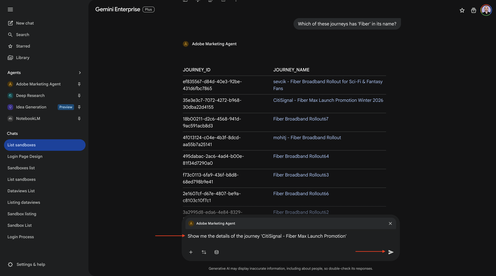

Dan moet je dit zien.


## 1.1.4.8 De reisprestaties valideren via een falloutanalyse

**Intentie**

U wilt de gevolgen van de reisprestaties begrijpen om te weten of zijn er om het even welke knopen of omstandigheden binnen de reis die een groot percentage van profielen ervaren die worden gelaten vallen. Dit is nuttig om te begrijpen of er extra aanpassingen nodig zijn in de reis.

Ga de volgende **Herinnering** in en klik **verzenden** knoop.

```javascript
Create a fall-out report on the "CitiSignal - Fiber Max Launch Promotion" journey
```

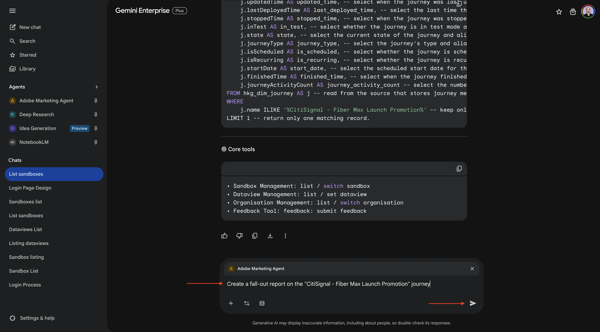

Dan moet je dit zien.


Je hebt dit lab voltooid.

Ga terug naar [&#x200B; Agent Orchestrator &#x200B;](./agentorchestrator.md){target="_blank"}

[&#x200B; ga terug naar Alle Modules &#x200B;](./../../../overview.md){target="_blank"}
