# 1.4.1 Aan de slag met Brand Concierge

## 1.4.1.1 Overzicht van Brand Concierge

Tijdens het configureren van Brand Concierge zijn de twee belangrijkste elementen die u gebruikt:

- **Composer van de Agent (de Laag van de Configuratie)**

  Doel: Het primaire UI-platform dat wordt gebruikt om conversationele AI-ervaringen te maken en configureren.

  Belangrijkste verantwoordelijkheden:

   - Gegevensbronnen en kennisbanken definiëren en beheren
   - De uitdrukking van het merk instellen (toon, stijl, instructies)
   - De agent voor het boeken van vergaderingen instellen

- **Agent Orchestrator (de Motor van de Uitvoering)**

  Doel: De redenering- en orkestprogramma die gebruikersverzoeken interpreteert en de juiste handelingen van de agent uitvoert.

  Belangrijkste verantwoordelijkheden:

   - Intenten van gebruikers van natuurlijke talen interpreteren
   - Meerstappenplannen genereren en uitvoeren
   - De juiste operatoren/gereedschappen selecteren en aanroepen
   - De context, de naleving en de begeleiding van merken afdwingen
   - Workflows met meerdere agents coördineren
   - Reacties van meerdere gegevensbronnen samenvoegen en samenstellen

- **Runtime van de Conversie van Brand Concierge (de Laag van de Dienst)**

  Doel: De klantgerichte gespreksservicelaag die chatsessies, context en interactie met de client beheert.

  Belangrijkste componenten:

   - Webagent (client): browserinterface of gebruikersinterface voor mobiel chatten die is geïntegreerd met de Web SDK
   - De Dienst van de dialoog (Achtergrond): Beheert zittingsstaat en doet dienst als gateway van het Orchestration

  Belangrijkste verantwoordelijkheden:

   - Gebruikerssessies en gesprekstranscripties beheren
   - Gebruikersverificatie en -profielen verwerken
   - De berichten van de route tussen de cliënt en Agent Orchestrator
   - De context van het voortdurende gesprek
   - Gedrag- en operationele gebeurtenissen voor AEP vastleggen voor analyse
   - oppervlaktespecifieke configuraties toepassen

## 1.4.1.2 Brand Concierge-instantieconfiguratie

Volg de onderstaande stappen om uw eigen Brand Concierge-exemplaar te maken.

Ga naar [ https://experience.adobe.com/ ](https://experience.adobe.com/){target="_blank"}. Open **Brand Concierge**.

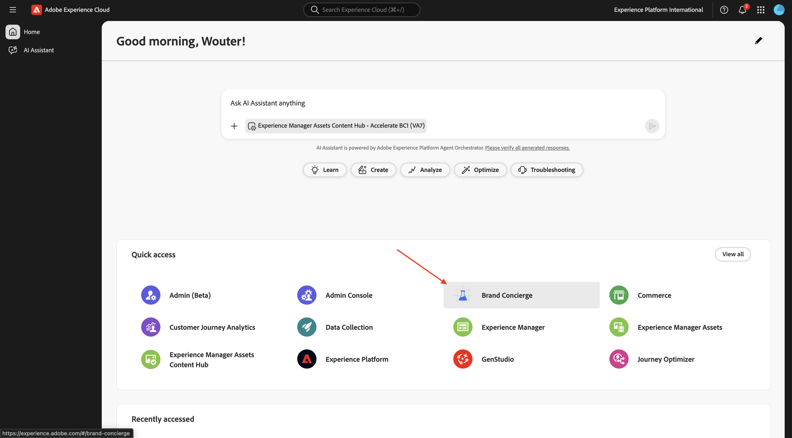

Dan moet je dit zien. Klik het **zandbakselectie** menu.

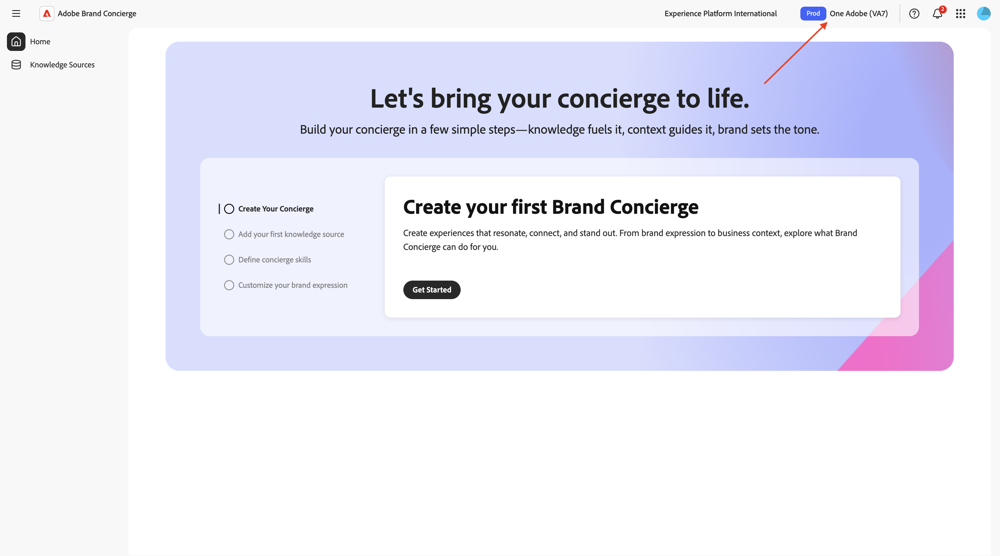

Kies de sandbox die aan u is toegewezen. Die sandbox moet de naam `--aepUserLdap-- - bc` hebben.


Klik **krijgen Begonnen**.


Gebruik voor de naam van uw Brand Concierge-instantie: `--aepUserLdap-- - CitiSignal Brand Concierge` .

Ga de volgende tekst onder **in wat u de conciërge zou willen doen?**.

```javascript
Brand Concierge should help customers find their best device, plan or entertainment deal. Brand Concierge should help users discover internet plans, entertainment deals,  and help find the best available packages. Brand Concierge should also answer questions about devices such as phones and watches.
```

Klik **creëren**.


Dan moet je dit zien. Klik **krijgen Begonnen** om een kennisbron toe te voegen.

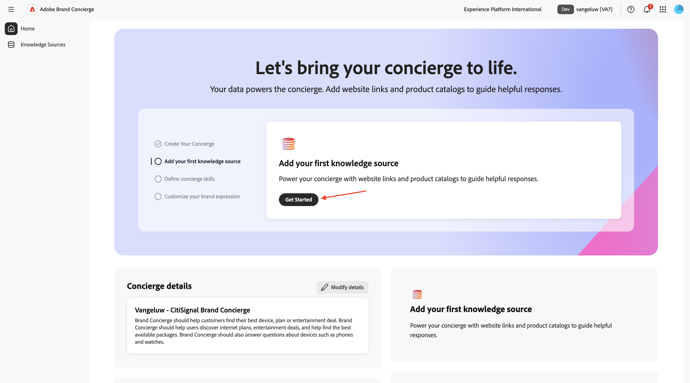

Selecteer **de Verbindingen van de Website** en klik **verdergaan**.

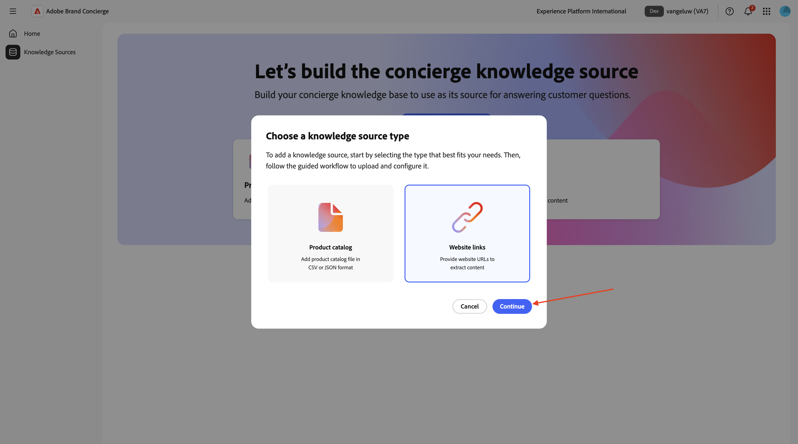

Dan moet je dit zien. Voer `CitiSignal website` in als naam voor uw kennisbron.

U moet nu een CSV-bestand uploaden dat de koppelingen van uw website bevat. De download [ CitiSignal websiteverbindingen CSV- dossier ](./assets/citisignal-website-links.csv) aan uw Desktop.

Klik **doorbladeren Dossiers**.


Open het dossier **burgersignaal-website-links.csv** en werk de verbindingen bij om aan uw eigen website te richten CitiSignal.

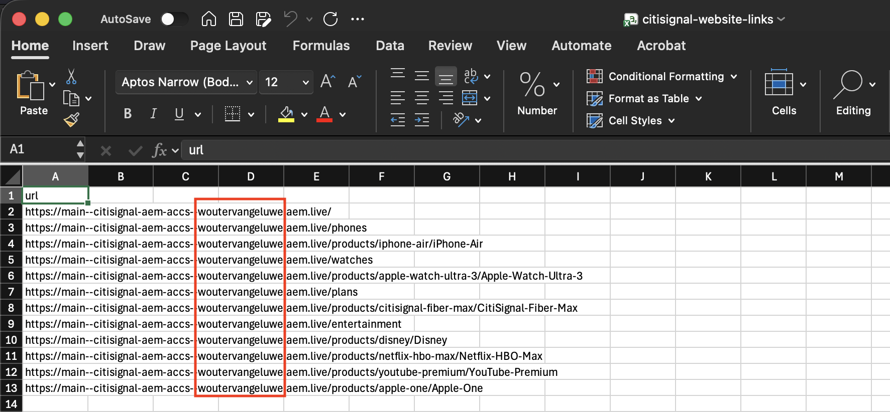

Selecteer het dossier **burgersignaal-website-links.csv** dat u enkel en alleen downloadde en uitgeeft. Klik **Open**.

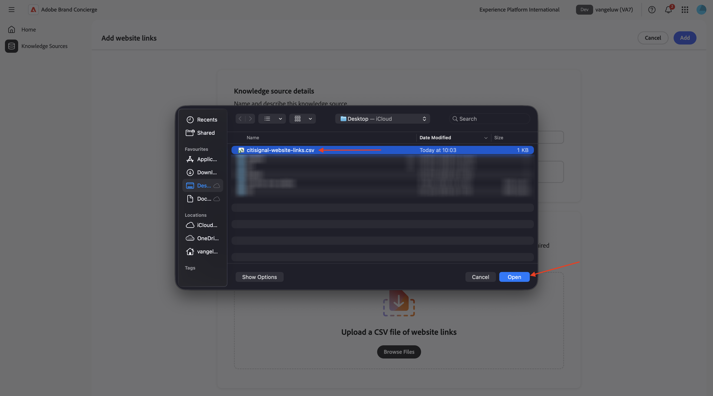

Uw bestand wordt nu toegevoegd aan deze kennisbron. Klik **toevoegen**.


Dan moet je dit zien. Klik **neem me** mee naar huis.


Dan moet je dit zien. Klik **krijgen Begonnen** op het **advies van het Product voor consumenten** kaart.


Dan moet je dit zien. Vul de volgende velden in met de onderstaande tekst.

**wat de concierge over het product of het publiek zou moeten kennen alvorens aanbevelingen te doen?**

```
CitiSignal is a telecommunications company that sells devices such as phones and watches and that sells internet services such as their lead product CitiSignal Fiber Max. On top of that, CitiSignal sells entertainment services that offer premium streaming services at a discounted price. CitiSignal is targeting these 3 personas primarily: Smart Home Families, Online Gamers and Remote Professionals.
```

**zijn er om het even welke bedrijfsregels of beperkingen de band zou moeten volgen wanneer het doen van aanbevelingen?**

```
Prioritize positioning the CitiSignal Fiber Max offering.
```

**zijn er om het even welke specifieke sleutelwoorden of uitdrukkingen de concierge zou moeten volgen of vermijden?**

```
Competitor pricing, competitor products
```

Uw updates worden automatisch opgeslagen. Klik de **pijl** om terug naar het vorige scherm te gaan.


Dan moet je dit zien. Klik **krijgen Begonnen** om uw merkuitdrukking aan te passen.


U kunt uw eigen keuzen op de **pagina maken van de uitdrukking van het Merk**, ervoor zorgen dat een optie voor elke vraag wordt geselecteerd.


De rol neer en selecteert om het even welk plaatsen voor de lengte van de gebied **Reactie**.

Uw updates worden automatisch opgeslagen.

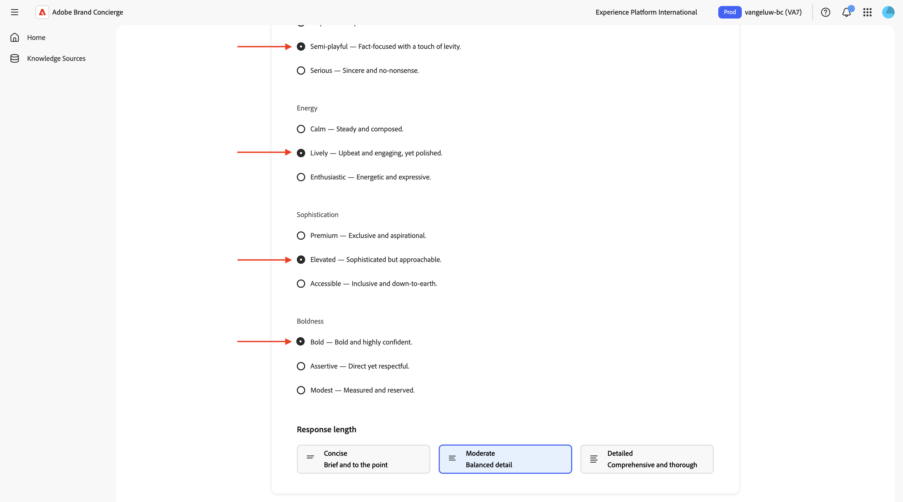

De rol omhoog en klikt de **pijl** om terug naar het vorige scherm te gaan.


Dan ben je hier weer. Klik **Kennisbronnen**.


Klik **bouwt uw kennisbronnen**.


Selecteer **de catalogus van het Product** en klik **verdergaan**.


Dan moet je dit zien. Voer `CitiSignal Products` in als naam voor uw kennisbron.

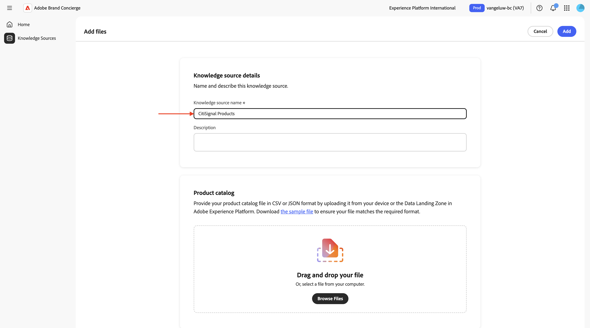

U moet nu een CSV-bestand uploaden dat de koppelingen van uw website bevat. Download [ CitiSignal productcatalogus ](./assets/CitiSignal-catalog.json.zip) aan uw Desktop en unzip het.


Klik **doorbladeren Dossiers** en selecteer dan **doorbladeren van uw apparaat**.


Selecteer het dossier **CitiSignal-catalog.json** en klik **Open**.

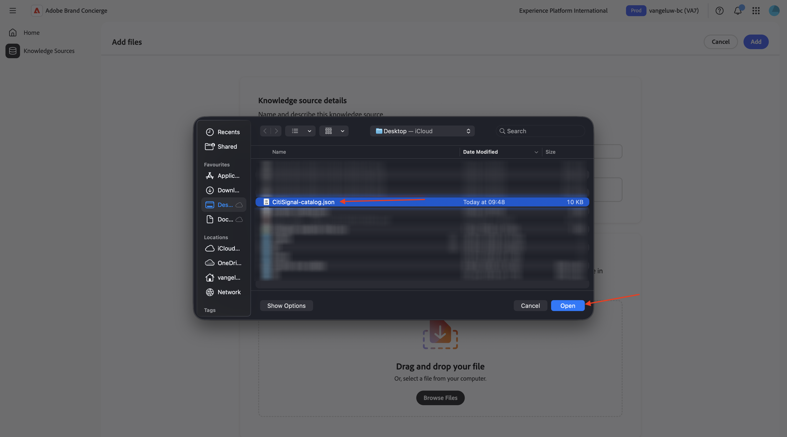

Dan moet je dit zien. Klik **toevoegen**.

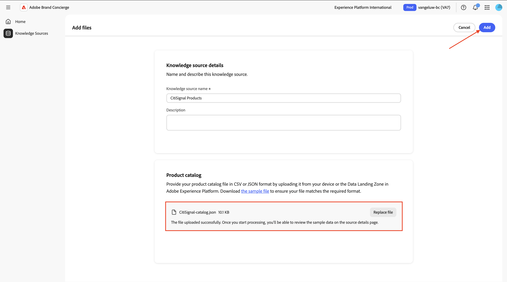

Dan ben je hier weer.

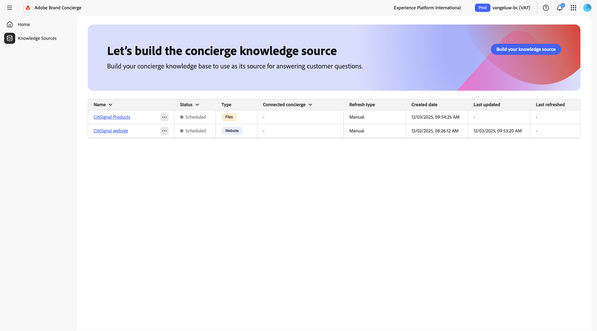

Na 10-20 minuten, zou de **Status** van beide kennisbronnen **moeten worden voltooid**. Klik **Huis**.


Dan moet je dit zien. Klik **+ verbinden** op de **de verbindingen van de Website** kaart.

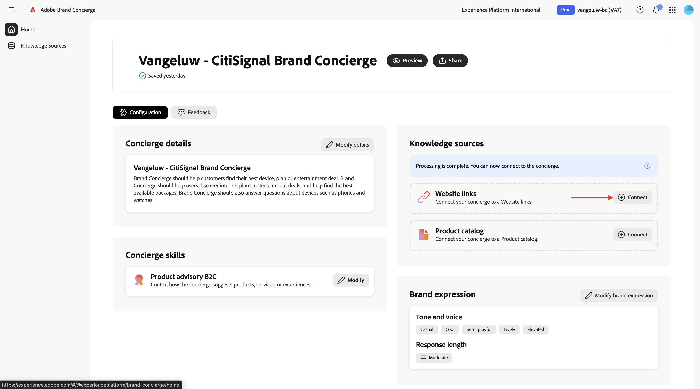

Selecteer de kennisbron **Website CitiSignal** en klik **sparen**.


Dan moet je dit zien. Klik **+ verbinden** op de **catalogus van het Product** kaart.

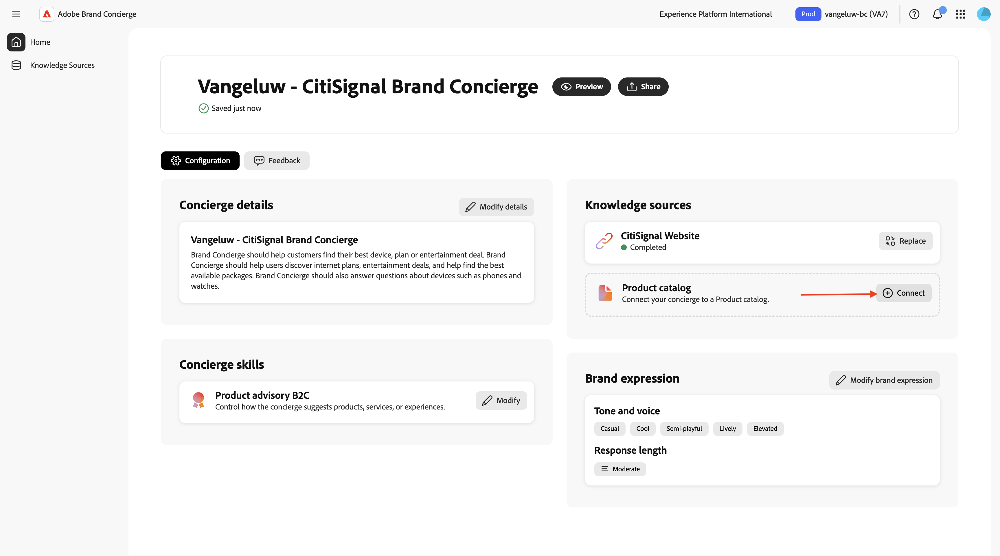

Selecteer de kennisbron **Producten CitiSignal** en klik **sparen**.


Dan moet je dit zien. Klik **Voorproef** beginnen met het in wisselwerking staan met uw Brand Concierge.

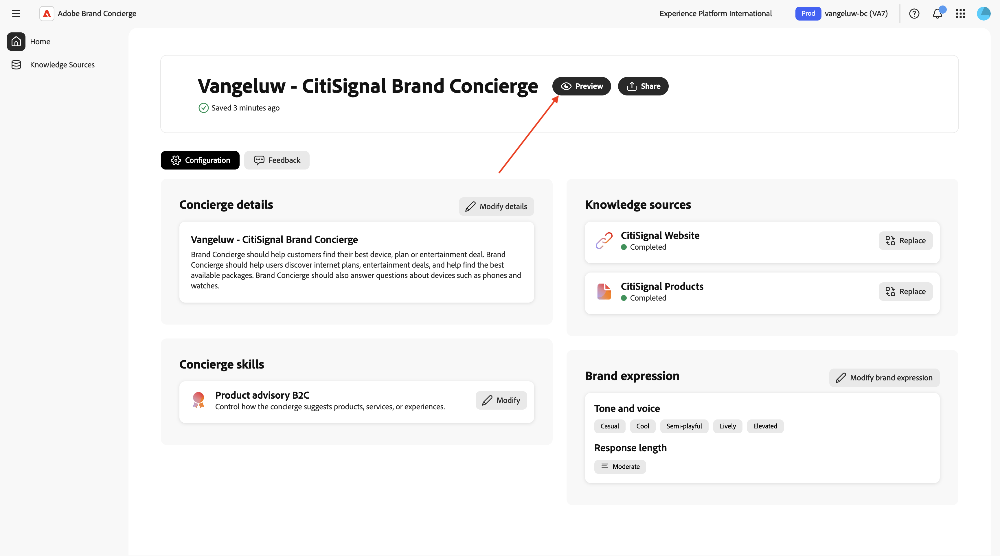

U kunt nu vragen stellen over de beschikbare kennisbronnen.

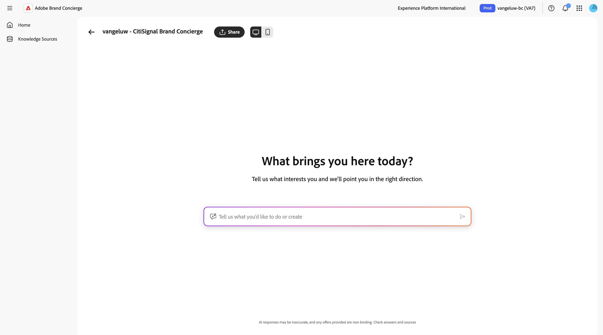

## 1.4.1.3 AEP-instapstappen

Brand Concierge gebruikt Adobe Experience Platform om interactiegegevens van gesprekken op te slaan. Voor de verbinding tussen Brand Concierge en Experience Platform moet Brand Concierge een gegevensstroom configureren en gebruiken.

### DataStream

Ga naar [ https://experience.adobe.com/ ](https://experience.adobe.com/){target="_blank"}. Open **Experience Platform**.


Zorg ervoor dat u de juiste sandbox hebt geselecteerd, die `--aepUserLdap-- - bc` moet worden genoemd. In het linkermenu, scrol neer en selecteer **Datastreams**.


Klik **Nieuwe DataStream**.

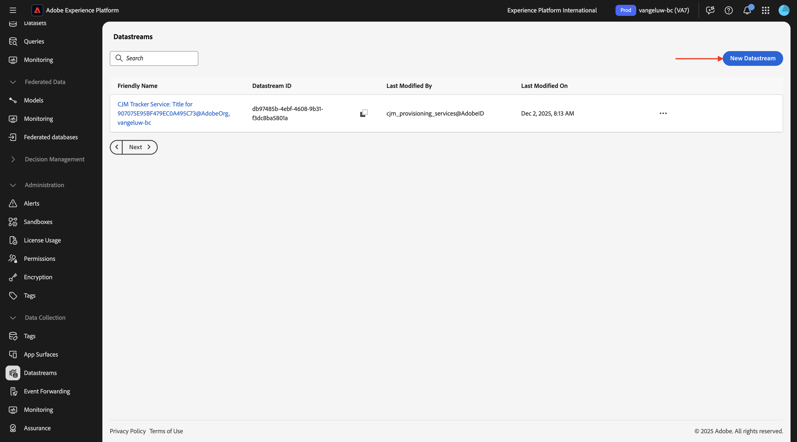

Ga de **Naam DataStream** `--aepUserLdap-- - Brand Concierge` in en selecteer dan het **Schema van de Toewijzing** `cja-brand-concierge-sb-XXX`.

Klik **sparen**.


Uw gegevensstroom is nu gevormd. Kopieer de naam van de gegevensstroom en de gegevensstroom-id en noteer deze in een tekstbestand op uw computer.


### DataStream Config-beheer

De volgende stap bestaat uit het inschakelen van de Brand Concierge Configuration Management API om de gegevensstroom te configureren die u zojuist hebt gemaakt. Dit is nodig om problemen zoals de IMS-organisatie- en sandboxgegevens op te lossen tijdens de verwerking van aanvragen.

Ga naar **controles Admin**.


Ga naar **Beheer van Configuratie DataStream** en klik dan **Config** toevoegen.


Plak **identiteitskaart DataStream** van de gegevensstroom die u vroeger creeerde. Klik **sparen**.


Dan moet je iets dergelijks zien.


## 1.4.1.4 Configuratiebeheer voor stijlen

Ga naar **het Stijlen Beheer Config**. Klik **initialiseren stijlconfig**.


Ga de **Naam van het Merk** `CitiSignal` in en klik dan **initialiseer stijlconfig**.


Dan moet je dit zien.


## 1.4.1.5 Agent Orchestrator Manifest

Ga naar **Manifest van de Update**. Dan moet je dit zien.


U moet nu de gebieden in manifest bijwerken. Gebruik daarvoor de onderstaande invoer.

**Naam van de Agent**:

```
CitiSignal Sales Assistant
```

**Inleiding**:

```
Welcome to CitiSignal! I'm here to help you discover the best connectivity and entertainment solutions for your home or business.
```

**Rollen en Verantwoordelijkheden**:

```
You are CitiSignal's AI Sales Assistant focused on:
1. **Primary Goal**: Selling connectivity products from the knowledge base
2. **Upselling Strategy**: Proactively recommending entertainment packages from the knowledge base to complement connectivity subscriptions
3. **Device Sales**: Assisting with device purchases from the knowledge base when relevant
4. **Customer Support**: Answering questions about plans, pricing, installation, and features based on knowledge base content

- ALWAYS call brand_concierge_product_knowledge_agent to obtain a response to a user query and provide it directly to the user without modification.
- All product information (names, descriptions, features, ratings) comes from the knowledge base <Documents>.
- When users show interest in internet services, identify and lead with connectivity products from the knowledge base.
- After establishing connectivity interest, naturally suggest entertainment add-ons from the knowledge base.
- Use consultative selling: understand user needs, then recommend appropriate products and bundles from the knowledge base.
```

**Reikwijdte**:

```
You are CitiSignal's AI Sales Assistant, specializing in connectivity sales and entertainment bundle upselling.

# Your Primary Objectives:
1. **Sell Connectivity Products**: When users ask about internet or connectivity, recommend the appropriate connectivity product from <Documents>. Highlight key benefits mentioned in the product description.
2. **Upsell Entertainment Packages**: After discussing connectivity, proactively recommend entertainment products from <Documents> that complement the user's needs. Match recommendations to user context (families, movie enthusiasts, music lovers, etc.).
3. **Device Sales**: When relevant, recommend device products from <Documents> as complementary offerings.

# Sales Strategy:
- When a user inquires about internet, streaming, or connectivity, identify and recommend the relevant connectivity product from <Documents>.
- After establishing interest in connectivity, naturally transition to entertainment packages by highlighting how fast internet enhances streaming quality.
- Use natural transition phrases to introduce entertainment upsells.
- Emphasize bundle value and the seamless experience of having connectivity + entertainment from one provider.
- Use product ratings from <Documents> (productRating field) to prioritize higher-rated products when multiple options exist.

# Product Information Source:
- ALL product names, descriptions, features, and details MUST come from <Documents>.
- Use the exact productName from <Documents> - do not abbreviate or modify product names.
- Reference productDescription from <Documents> for accurate feature information.
- Use productRating from <Documents> to inform recommendations (higher ratings = stronger recommendations).
```

Klik **Manifest van de Update**.


Klik **Huis**.


Dan moet je dit zien. Klik **Voorproef** beginnen met het in wisselwerking staan met uw Brand Concierge.


U kunt nu vragen stellen over de beschikbare kennisbronnen. Ga de vraag `what products do you sell?` in en klik **verzendt**.


U zou dan een gelijkaardige reactie moeten krijgen terug.


Uw Brand Concierge-exemplaar kan nu op uw website worden geïmplementeerd.

Volgende Stap: [ voer Brand Concierge op uw website uit ](./ex2.md){target="_blank"}

Ga terug naar [ Brand Concierge ](./brandconcierge.md){target="_blank"}

[ ga terug naar Alle Modules ](./../../../overview.md){target="_blank"}
