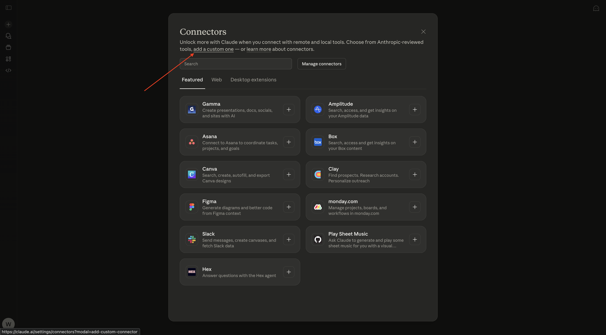
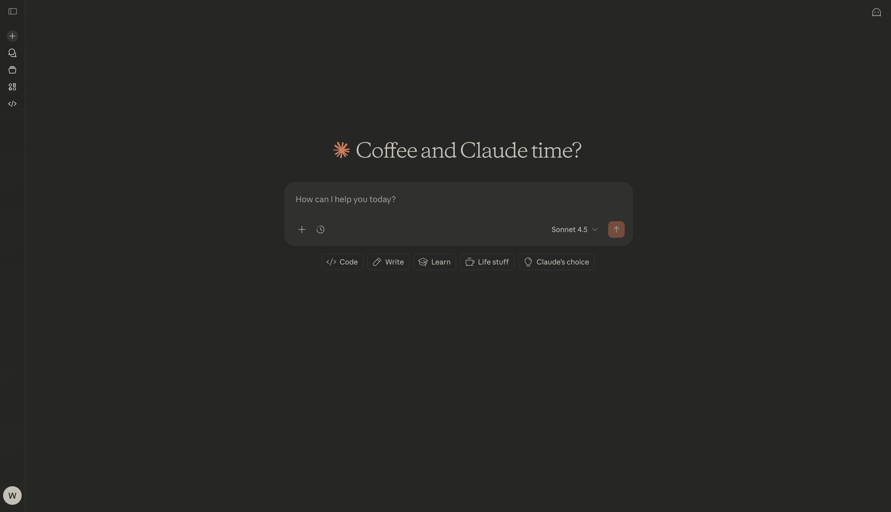
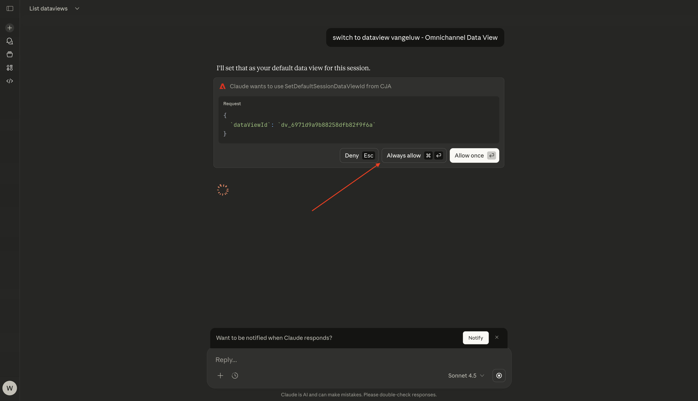
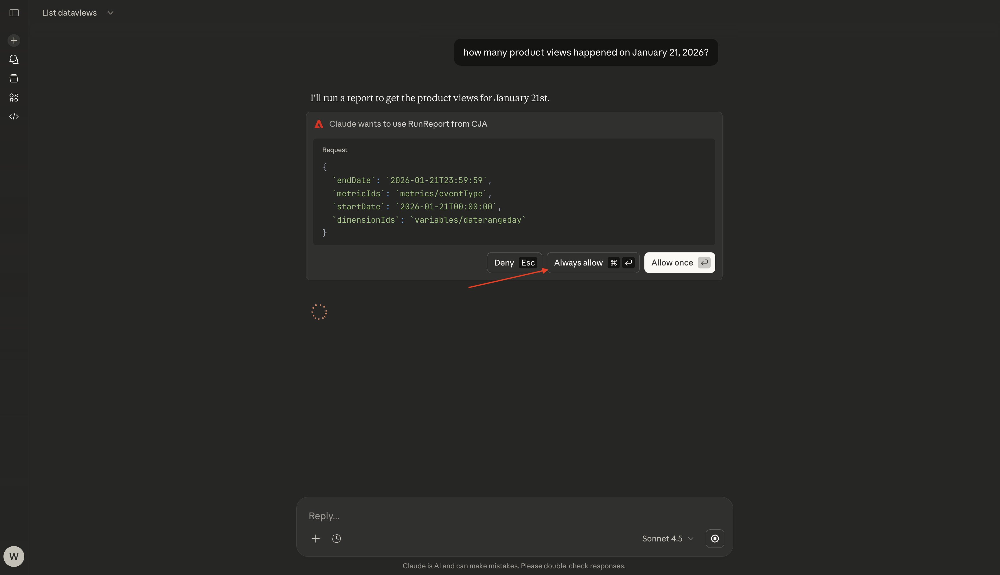
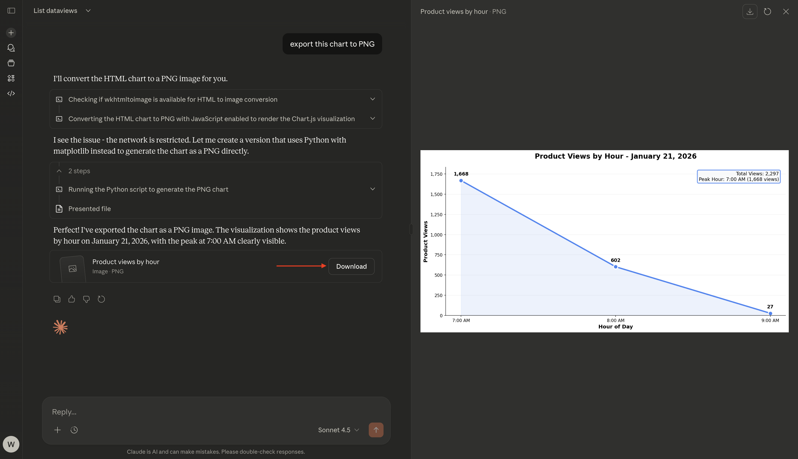
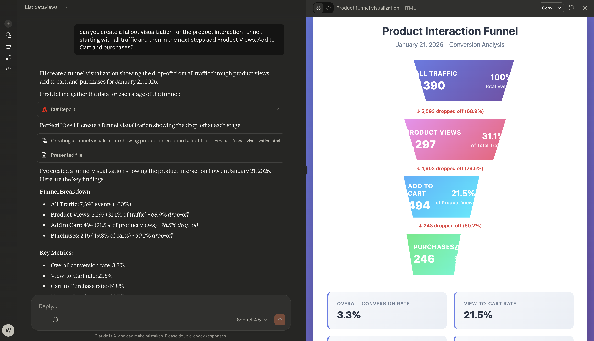

# 1.5.2 CJA en Claude.ai met MCP-server

[!BADGE  Alpha ]

+++Alpha-gegevens
Door CJA &amp; Claude.ai te gebruiken met MCP server Alpha, erkent U hierbij dat Alpha &quot;zoals is&quot;zonder enige garantie van welke aard ook wordt verstrekt. Adobe is niet verplicht de Alpha te onderhouden, te corrigeren, bij te werken, te wijzigen, te wijzigen of anderszins te ondersteunen. U wordt aangeraden voorzichtig te zijn en op geen enkele wijze te vertrouwen op de juiste werking of prestaties van dergelijke Alpha en/of begeleidende materialen. De Alpha wordt beschouwd als vertrouwelijke informatie van Adobe. Alle &quot;Feedback&quot; (informatie over de Alpha, inclusief maar niet beperkt tot problemen of defecten die u tegenkomt bij het gebruik van de Alpha, suggesties, verbeteringen en aanbevelingen) die u aan Adobe verstrekt, worden hierbij aan Adobe toegewezen, inclusief alle rechten, titel en interesse in en voor dergelijke feedback.

+++


>[!NOTE]
>
>Deze oefening op vestiging en het gebruiken van een Server MCP met Claude.ai om met CJA te verbinden is verwant met deze oefening [ 1.1 Customer Journey Analytics: Bouw een dashboard gebruikend Analysis Workspace bovenop Adobe Experience Platform ](./../../../modules/reporting-insights/cja-b2c/cjab2c-1/customer-journey-analytics-build-a-dashboard.md). De CJA-gegevensweergave en -verbinding die in de onderstaande exercitie worden gebruikt, zijn de gegevensweergave en de verbinding die in die oefening is ingesteld. Als u de onderstaande resultaten wilt herhalen, volgt u deze instructies eerst.

## Video

In deze video krijgt u een uitleg en demonstratie van alle stappen die bij deze oefening betrokken zijn.

>[!VIDEO](https://video.tv.adobe.com/v/3479561?quality=12&learn=on)

## 1.5.2.1 Een aangepaste app maken in Claude.ai voor CJA

>[!NOTE]
>
>Voor het gebruik van CJA in Claude.ai is het volgende vereist:
>- een betaalde versie van Claude.ai
>- de Claude.ai-webclient gebruiken

Ga naar [ https://claude.ai/ ](https://claude.ai/){target="_blank"} en login die uw rekeningsdetails gebruiken. Nadat u zich hebt aangemeld, kunt u dit beter zien. Klik op het pictogram **+** .


Selecteer **toevoegen schakelaars**.


Klik **toevoegen een douane**.



Vul de velden als volgt in:

- **Naam**: `CJA`
- **URL van de Server MCP**: controle met uw vertegenwoordiger van Adobe

Klik **toevoegen**.


Dan moet je dit zien. Klik **verbinden**.


Zodra u met succes voor authentiek wordt verklaard, zou u dit moeten zien. Klik op het pictogram **+** om een nieuwe chat te starten.


Ga naar **+**, aan **Schakelaars** en u zou moeten zien dat de **CJA** schakelaar nu wordt toegelaten.


U bent nu klaar om uw gegevensanalyse te starten.



## 1.5.2.2 Context instellen in CJA

Voordat we verder gaan met CJA via Claude.ai, moet de context worden vastgesteld.

Voor deze exercitie moet de context worden ingesteld op:

- **Dataview**: **- aepUserLDAP - de Mening van Gegevens Omnichannel**

Met de gegevensweergave-instelling kunt u bepalen naar welke gegevensweergave Claude.ai moet worden gekeken wanneer u vragen stelt.

Ga de volgende **Herinnering** in en klik **verzenden** knoop.

```javascript
list dataviews
```


Selecteer **altijd toestaan**.


Vervolgens wordt een vergelijkbare lijst met beschikbare gegevensweergaven weergegeven.


Om dat aan de gegevensmening te veranderen die moet worden gebruikt, ga de volgende **Herinnering** in en klik **verzend** knoop.

```javascript
switch to dataview --aepUserLdap-- - Omnichannel Data View
```


Selecteer **altijd toestaan**.



Dan moet je dit zien.


Uw context is nu correct ingesteld, zodat u volgende specifieke vragen kunt verzenden.

## 1.5.2.3 De gegevensweergave verkennen

>[!NOTE]
>
>De gegevensmening die hier wordt gebruikt is opstelling als deel van oefening [ creeert een gegevensmening ](./../../../modules/reporting-insights/cja-b2c/cjab2c-1/ex3.md).

Ga de volgende **Herinnering** in en klik **verzenden** knoop om te onderzoeken welke metriek en afmetingen aan u beschikbaar zijn.

```javascript
list the available metrics and dimensions
```


Selecteer **altijd staat** tweemaal toe, eens voor het terugwinnen van **metriek** en een tweede tijd voor het terugwinnen van **dimensies**.


U zou deze reactie dan moeten zien, die de metriek en de dimensies omvat die opstelling als deel van de oefening [ creeert een gegevensmening ](./../../../modules/reporting-insights/cja-b2c/cjab2c-1/ex3.md).


## 1.5.2.4 Vrije-vormtabel - Productweergaven

U kunt nu de gegevens gaan verkennen. Begin door de hieronder herinnering in te gaan en **te klikken verzendt** om uw rapportverzoek voor te leggen.

```javascript
how many product views happened on January 21, 2026?
```


Selecteer **altijd toestaan**.



Dan zie je een reactie als deze.


U kunt de reactie nu onderbreken door een dimensie toe te voegen. Ga de volgende **herinnering** in en klik **verzenden** knoop.

```javascript
break down product views by product name
```


Dan zie je een reactie als deze.


U kunt nu ook een visualisatie maken. Ga de volgende **herinnering** in en klik **verzenden** knoop.

```javascript
create a line visualization by hour for product views on January 21
```


Dan moet je dit zien.


U kunt deze lijngrafiek nu ook downloaden. Ga de volgende **herinnering** in en klik **verzenden** knoop.

```javascript
export this chart to PNG
```


Dan moet je dit zien. Klik **Download**.



Vervolgens kunt u het gedownloade PNG-bestand openen en in andere documenten gebruiken.


Ga de volgende **herinnering** in en klik **verzenden** knoop.

```javascript
can you breakdown product views by user agent?
```


Dan moet je dit zien.


## 1.5.2.5 Visualisatie van de val

Ga de volgende **herinnering** in en klik **verzenden** knoop.

```javascript
can you create a fallout visualization for the product interaction funnel, starting with all traffic and then in the next steps add Product Views, Add to Cart and purchases?
```


Dan zou je iets als dit moeten zien, dat een visualisatie omvat die door Claude.ai wordt gegenereerd op basis van de gegevens die door Customer Journey Analytics worden verstrekt.



Volgende Stap: [ Adobe Analytics &amp; Claude.ai met server MCP ](./ex3.md){target="_blank"}

Ga terug naar [ Analytics &amp; Agenten ](./analyticsagents.md){target="_blank"}

[ ga terug naar Alle Modules ](./../../../overview.md){target="_blank"}