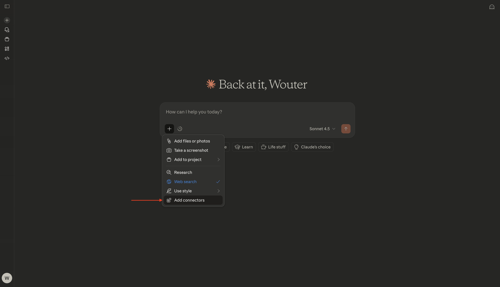
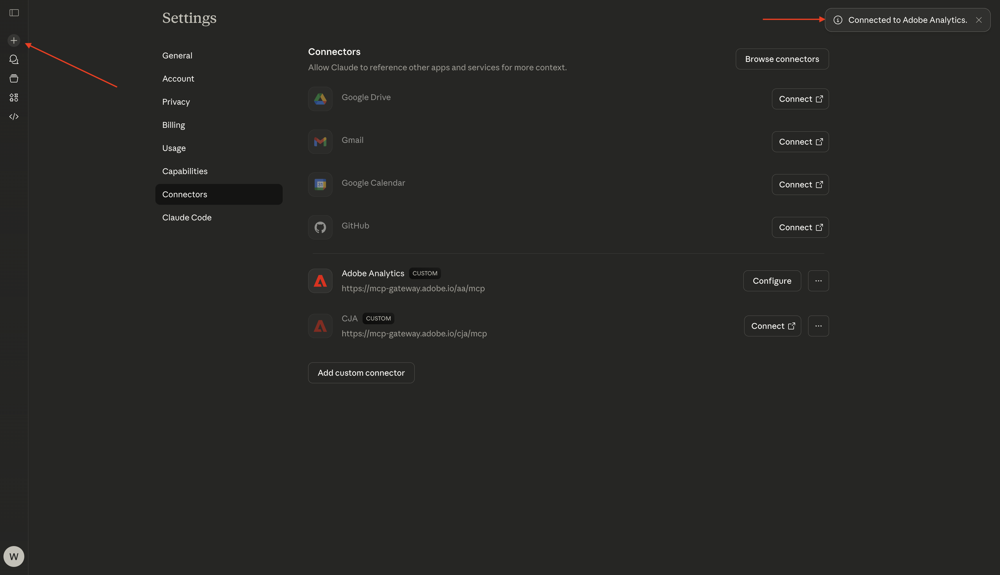
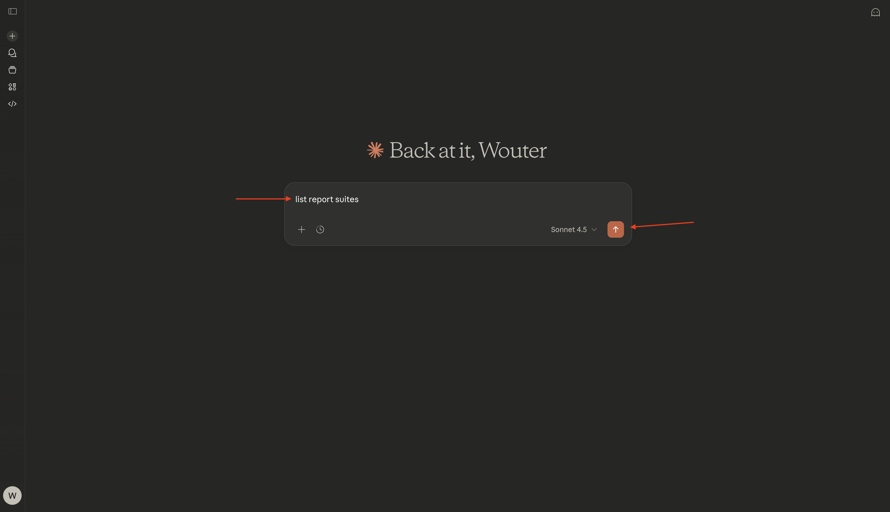
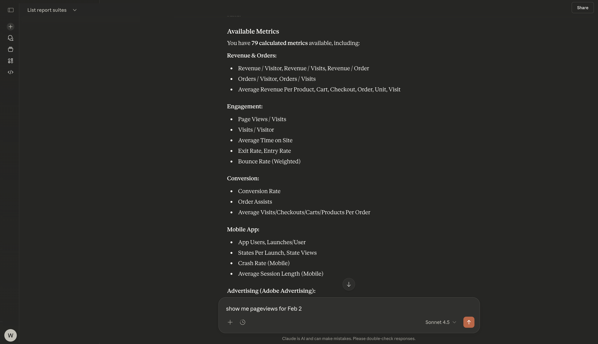

# 1.5.3 Adobe Analytics &amp; Claude.ai met MCP-server

[!BADGE  Alpha ]

+++Alpha-gegevens
Door CJA &amp; Claude.ai te gebruiken met MCP server Alpha, erkent U hierbij dat Alpha &quot;zoals is&quot;zonder enige garantie van welke aard ook wordt verstrekt. Adobe is niet verplicht de Alpha te onderhouden, te corrigeren, bij te werken, te wijzigen, te wijzigen of anderszins te ondersteunen. U wordt aangeraden voorzichtig te zijn en op geen enkele wijze te vertrouwen op de juiste werking of prestaties van dergelijke Alpha en/of begeleidende materialen. De Alpha wordt beschouwd als vertrouwelijke informatie van Adobe. Alle &quot;Feedback&quot; (informatie over de Alpha, inclusief maar niet beperkt tot problemen of defecten die u tegenkomt bij het gebruik van de Alpha, suggesties, verbeteringen en aanbevelingen) die u aan Adobe verstrekt, worden hierbij aan Adobe toegewezen, inclusief alle rechten, titel en interesse in en voor dergelijke feedback.

+++

## Video

In deze video krijgt u een uitleg en demonstratie van alle stappen die bij deze oefening betrokken zijn.

>[!VIDEO](https://video.tv.adobe.com/v/3479562?quality=12&learn=on)

## 1.5.3.1 Een aangepaste app maken in Claude.ai voor Adobe Analytics

>[!NOTE]
>
>Voor het gebruik van Adobe Analytics in Claude.ai is het volgende vereist:
>- een betaalde versie van Claude.ai
>- de Claude.ai-webclient gebruiken

Ga naar [ https://claude.ai/ ](https://claude.ai/){target="_blank"} en login die uw rekeningsdetails gebruiken. Nadat u zich hebt aangemeld, kunt u dit beter zien. Klik op het pictogram **+** .


Selecteer **toevoegen schakelaars**.



Klik **toevoegen een douane**.


Vul de velden als volgt in:

- **Naam**: `CJA`
- **URL van de Server MCP**: controle met uw vertegenwoordiger van Adobe

Klik **toevoegen**.


Dan moet je dit zien. Klik **verbinden**.


Zodra u met succes voor authentiek wordt verklaard, zou u dit moeten zien. Klik op het pictogram **+** om een nieuwe chat te starten.



Ga naar **+**, aan **Schakelaars** en u zou moeten zien dat de **Adobe Analytics** schakelaar nu wordt toegelaten.


U bent nu klaar om uw gegevensanalyse te starten.


## 1.5.3.2 Context instellen in Adobe Analytics

Voordat we verder gaan met CJA via Claude.ai, moet de context worden vastgesteld.

Voor deze exercitie moet de context worden ingesteld op:

- **Reeks van het Rapport**: **CID - de Gegevens van de Demo**

Met de instelling Report Suite kunt u bepalen naar welke gegevens Claude.ai moet worden gekeken wanneer u vragen stelt.

Ga de volgende **Herinnering** in en klik **verzenden** knoop.

```javascript
list report suites
```



Selecteer **altijd toestaan**.


Selecteer **altijd toestaan**.


Dan moet je iets dergelijks zien.


Ga de volgende **Herinnering** in en klik **verzenden** knoop.

```javascript
use report suite CID Demo Data
```


Selecteer **altijd toestaan**.


Uw rapportsuite is nu geselecteerd.


## 1.5.2.3 Ontdek de rapportsuite

Ga de volgende **Herinnering** in en klik **verzenden** knoop om te onderzoeken welke metriek en afmetingen aan u beschikbaar zijn.

```javascript
list the available metrics and dimensions
```


Selecteer **altijd toestaan**.


Selecteer **altijd** opnieuw toestaan.


Deze reactie, die de metriek en de dimensies omvat die in dit rapportpakket werden opgesteld, zou u dan moeten zien.


## 1.5.2.4 Rapporten

U kunt nu de gegevens gaan verkennen. Begin door de hieronder herinnering in te gaan en **te klikken verzendt** om uw rapportverzoek voor te leggen.

```javascript
show me pageviews for Feb 2?
```



Dan moet je iets dergelijks zien.


Ga de volgende **Herinnering** in en klik **verzenden** knoop.

```javascript
break down pageviews by page name
```


Dan moet je dit zien.


Ga de volgende **Herinnering** in en klik **verzenden** knoop.

```javascript
give me an overview of page names, page views by marketing channel
```


Dan moet je iets dergelijks zien.


Schuif een beetje omlaag om de analyse te zien.


Ga de volgende **Herinnering** in en klik **verzenden** knoop.

```javascript
Analyze different metrics by marketing channel
```


Dan moet je iets dergelijks zien.


Je hebt deze oefening nu afgerond.

Ga terug naar [ Analytics &amp; Agenten ](./analyticsagents.md){target="_blank"}

[ ga terug naar Alle Modules ](./../../../overview.md){target="_blank"}