# 1.6.1 Aan de slag met AEM Agents

>[!IMPORTANT]
>
>Om deze oefening te voltooien, moet u toegang tot een werkende AEM Sites en Assets CS met milieu EDS en de diverse agenten van AEM worden toegelaten voor IMS Org u gebruikt.
>
>Als u zulk een milieu nog niet hebt, ga [ Adobe Experience Manager Cloud Service &amp; Edge Delivery Services ](./../../../modules/asset-mgmt/module2.1/aemcs.md){target="_blank"} uitoefenen. Volg de instructies daar, en u zult toegang tot zulk een milieu hebben.

>[!IMPORTANT]
>
>Als u eerder een AEM CS-programma hebt geconfigureerd met een AEM Sites- en Assets CS-omgeving, kan het zijn dat uw AEM CS-sandbox is geminimaliseerd. Gezien het feit dat het vernietigen van zo&#39;n zandbak 10 tot 15 minuten duurt, zou het een goed idee zijn om het ontruimingsproces nu te beginnen zodat u niet op een later tijdstip hoeft te wachten.

## 1.6.1.1 Discovery Agent

De Adobe Experience Manager (AEM) Discovery Agent is een door AI aangedreven tool in AEM as a Cloud Service waarmee gebruikers inhoud (waaronder Assets, Content Fragments en Adaptive Forms) kunnen zoeken, ophalen en gebruiken met behulp van natuurlijke taalaanwijzingen. Het elimineert de behoefte aan manueel, klik-zwaar, of complex filtreren door intent te begrijpen en over de bewaarplaats te zoeken.

Om **Agent van de Ontdekking te gebruiken**, zult u eerst sommige Markeringen in Adobe Experience Manager creëren, en u zult dan sommige activa etiketteren gebruikend die markeringen. Zodra dat wordt gedaan, zult u AI Medewerker kunnen gebruiken om activa op een gemakkelijke en bedrijfsvriendelijke manier te ontdekken.

Ga naar [ https://my.cloudmanager.adobe.com ](https://my.cloudmanager.adobe.com){target="_blank"}. De org die u moet selecteren is `--aepImsOrgName--`.

### Tags maken en gebruiken met Assets

Klik hierop om het Cloud Manager-programma te openen. Dit wordt `--aepUserLdap-- - CitiSignal AEM+ACCS` genoemd.


Klik op de URL van de omgeving om deze te openen.


Klik het **hammer** pictogram.

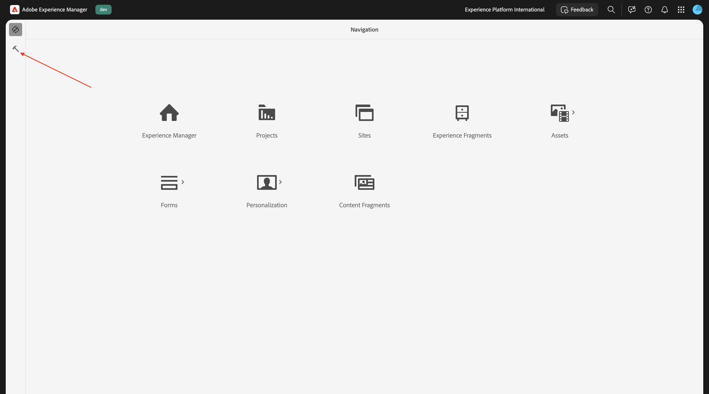

Onder **Algemeen**, klik **Tags**.

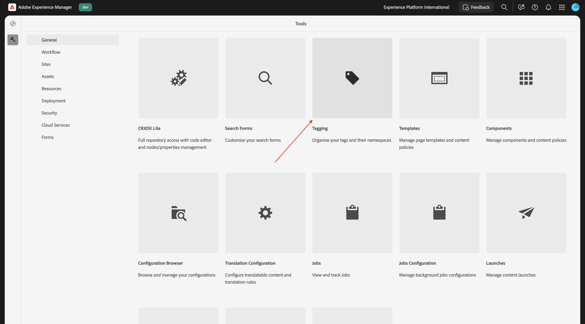

Dan moet je dit zien. Klik **creëren** en selecteer dan **Namespace** creëren.


Op het gebied **Titel**, ga binnen: `CitiSignal`. Klik **creëren**.

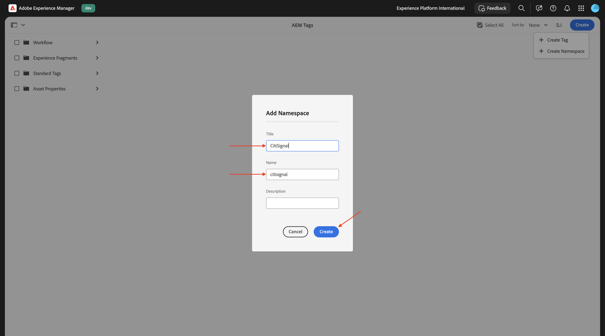

Boor neer in namespace **CitiSignal** door het te klikken. Klik **creeer** en selecteer dan **creeer Markering**.


Op het gebied **Titel**, ga binnen: `Campaign`. Klik **voorleggen**.


Selecteer de markering **Campagne** door het te klikken. Klik **creeer** en selecteer dan **creeer Markering**.

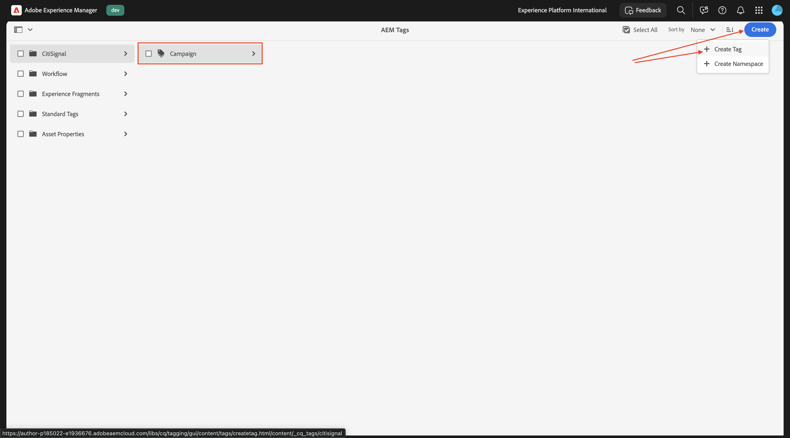

Op het gebied **Titel**, ga binnen: `Winter 2026`. Klik **voorleggen**.


Selecteer de markering **Campagne** door het te klikken. Klik **creeer** en selecteer dan **creeer Markering**.


Op het gebied **Titel**, ga binnen: `Spring 2026`. Klik **voorleggen**.


Dat zou u nu moeten doen.


Klik **Adobe Experience Manager** en klik dan **Assets**.


Klik **Dossiers**.

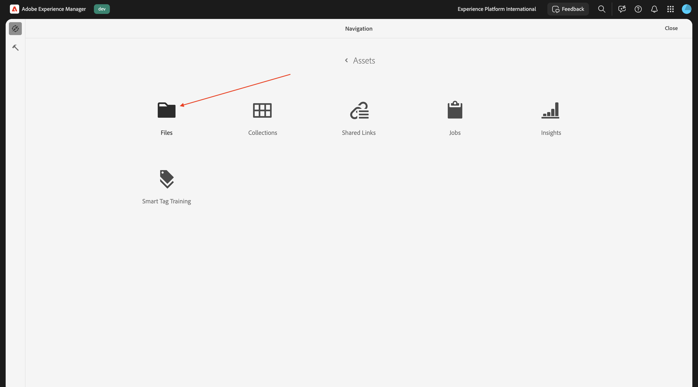

Dubbelklik de omslag **CitiSignal** om het te openen.


Klik **creëren** en selecteer dan **Dossiers**.


Download het dossier [ burgersignaal-beelden-campagne.zip ](./assets/citisignal-images-campaign.zip) en unzip het op uw Desktop.


Selecteren. de 3 dossiers die u enkel downloadde en **open** klikt.


Klik **uploaden**.


Dan moet je dit zien.

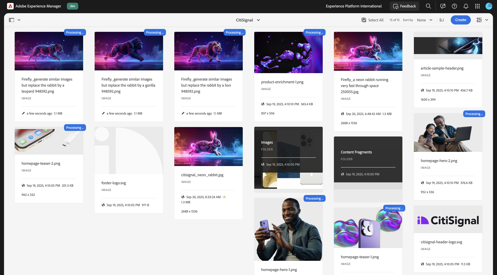

Selecteer het eerste beeld en klik dan **Eigenschappen**.

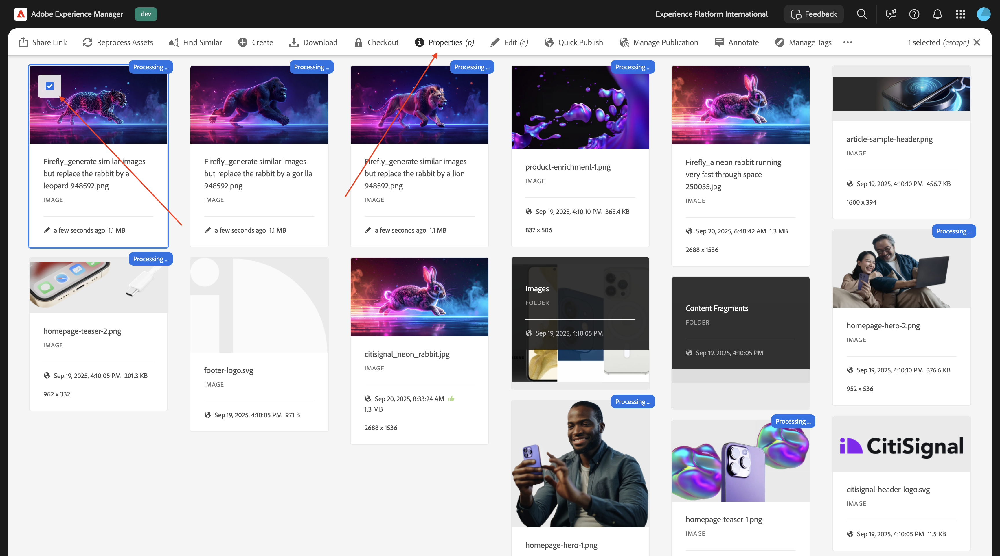

Klik het **omslag** - pictogram onder Markeringen.


Selecteer de markering **Lente 2026** en klik **Uitgezocht**. Herhaal dat proces voor deze afbeeldingen:

- burgerschap_lion.png
- burgersignaal_leopard.png
- burgersignaal_gorilla.png
- burgersignaal_konijn.png


Zodra u die markering voor alle beelden hebt geselecteerd, ga naar **Experience Manager Assets**.


Selecteer de reactie die u gebruikt.

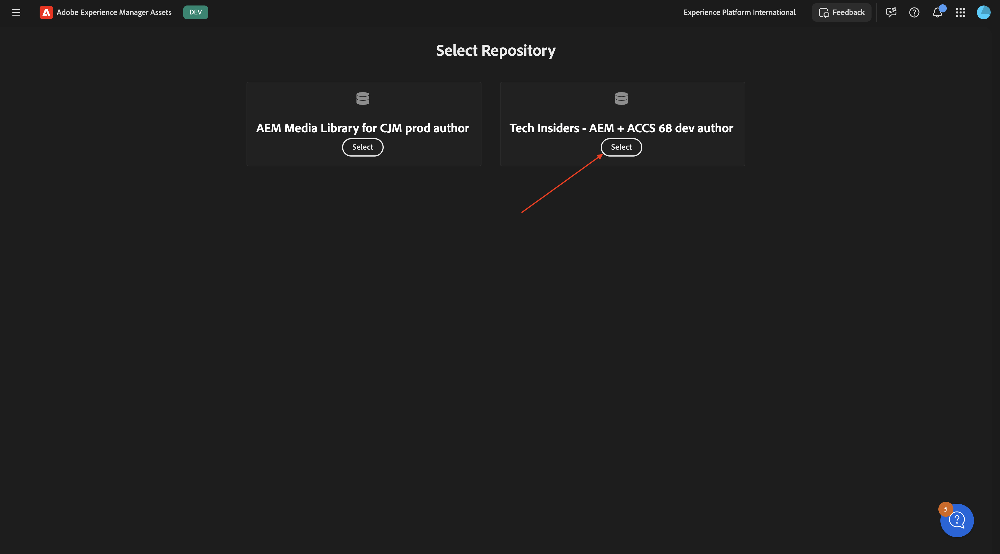

Ga naar **Assets** en open de omslag **CitiSignal**.


Open de eerste afbeelding.


Selecteer **Goedgekeurd** en klik dan **sparen**.

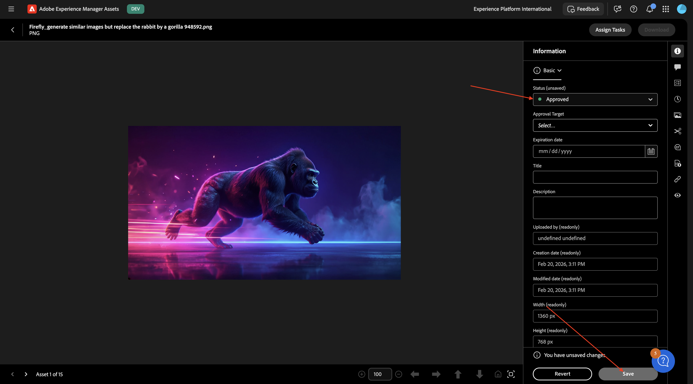

Onder **Markeringen**, kunt u de markering zien die u eerder selecteerde.

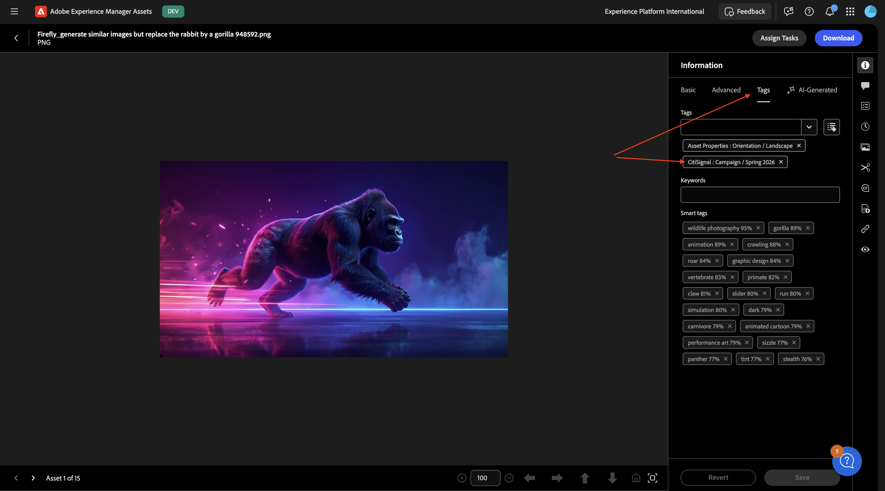

Herhaal dat proces zodat alle vier de beelden worden goedgekeurd.


Daarna, ga naar **Mijn werkruimte** en klik om **Medewerker AI** te openen.

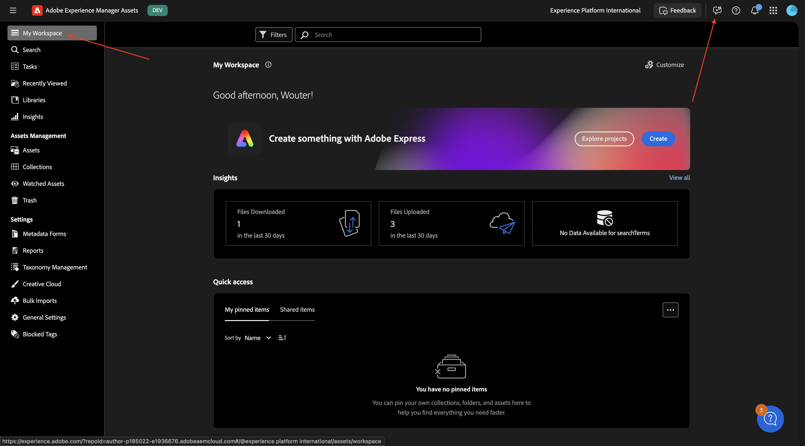

Ga de volgende herinnering in en klik **verzenden**.

```javascript
find all assets tagged with 'Spring 2026'
```


Als u toegang hebt tot meerdere AEM Assets CS-omgevingen, ziet u zoiets. Klik het voorgestelde antwoord voor het milieu u wenst te gebruiken en dan **te klikken verzend**.


Dan zou je een vergelijkbaar antwoord moeten zien. Klik op het pictogram om de AI-assistent uit te breiden naar het volledige scherm.

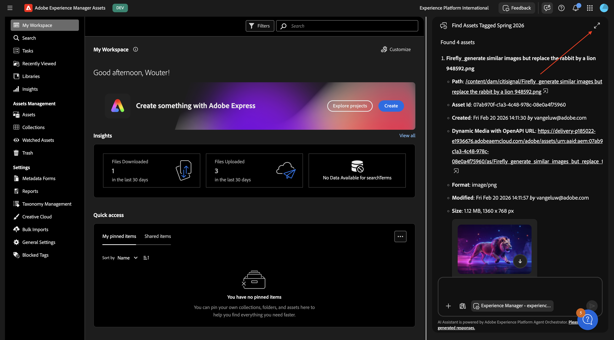

Bekijk de antwoorden.


Vanuit het venster AI Assistant kunt u op deze elementen klikken om ze weer te geven.


Vervolgens wordt u rechtstreeks naar AEM Assets CS geleid, naar die specifieke afbeelding.


U kunt dan ook alle andere beschikbare metagegevens controleren.


## 1.6.1.2 Experience Production Agent

### Update van inhoud - Assets

De vaardigheden van de Update van de Inhoud werken bestaande inhoud — met inbegrip van inhoudsfragmenten, pagina&#39;s, vormen en activa bij - met gemak bij. De agent kan acties uitvoeren zoals het bijwerken, verwijderen, vervangen of toevoegen van inhoudselementen om ervaringen nauwkeurig en actueel te houden. Invoer kan een natuurlijke taalbeschrijving zijn en bij Jira PDF&#39;s en screenshots kan ook invoer worden geleverd.

Ga terug naar het scherm AI Assistant.

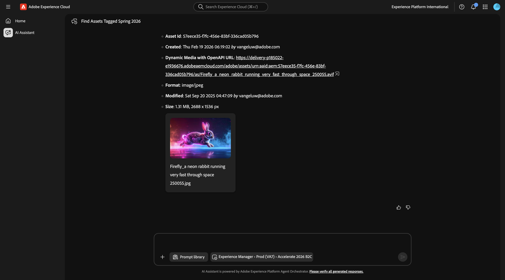

Ga de volgende herinnering in en klik **verzenden**.

`Generate multiple social media formats (Instagram 1080x1920, Facebook 1200x630, Twitter 1200x675) for the third image`


Na een paar minuten moet u een vergelijkbare reactie zien.


Bekijk de gegenereerde afbeeldingen.

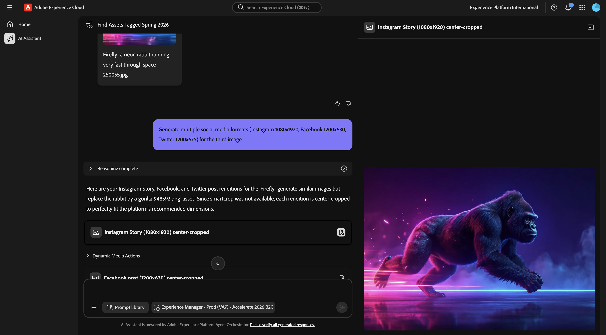

### Inhoud bijwerken - Pagina&#39;s

Ga terug naar uw milieu van de Auteur van Adobe Experience Manager en ga dan naar **Plaatsen**.


Ga naar **CitiSignal**. Klik **creëren** en selecteren **Pagina**.


Selecteer **Pagina** en klik **daarna**.


Voer de volgende waarden in:

- Titel: **Max van Vezel**
- Naam: **vezel-maximum**
- De Titel van de pagina: **Max van Vezel**

Klik **creëren**.


Selecteer **Open**.


Dan moet je dit zien.


Klik op het lege gebied om de **sectie** component te selecteren. Dan, klik plus **+** pictogram in het juiste menu en selecteer **Hero**.


Dan moet je dit zien. Klik op **+ Toevoegen** om een afbeelding toe te voegen.


Selecteer de opslagplaats voor uw middelen. Dan, open de omslag **CitiSignal**.


Kies de afbeelding van de leeuw die u eerder uploadde. Klik **Uitgezocht**.


Dan moet je dit zien. Klik het **tekst** gebied om de tekst te veranderen.


Plak deze tekst in de are:

```
This winter, be as fast as a lion.
```

Selecteer **Kop 1** en klik dan **Gedaan**.


Dan moet je dit zien. Ga naar **de boom van de Inhoud** en selecteer het gebied **Sectie**.


Klik **+** pictogram en selecteer dan **Kaarten**.


Dan moet je dit zien. Zorg ervoor dat in de **boom van de Inhoud**, **Kaarten** wordt geselecteerd.

Klik vervolgens viermaal op de knop **+** .


U zou dit nu moeten zien, waar er 4 **Kaart** voorwerpen in het **Kaarten** voorwerp zijn.


Selecteer de eerste **Kaart**. Klik het **tekst** gebied om de tekst te veranderen.


Plak de volgende tekst. Zorg ervoor de eerste lijn van tekst **Kop 1** gebruikt. Klik **Gedaan**.

```
99.9% network reliability

Game, video chat and stream on multiple devices with ultra low lag.
```


Selecteer de tweede **Kaart**. Klik het **tekst** gebied om de tekst te veranderen.


Plak de volgende tekst. Zorg ervoor de eerste lijn van tekst **Kop 1** gebruikt. Klik **Gedaan**.

```
3-year

price lock guarantee

For new and existing Fiber Max customers on all internet plans.

No hidden fees.
```

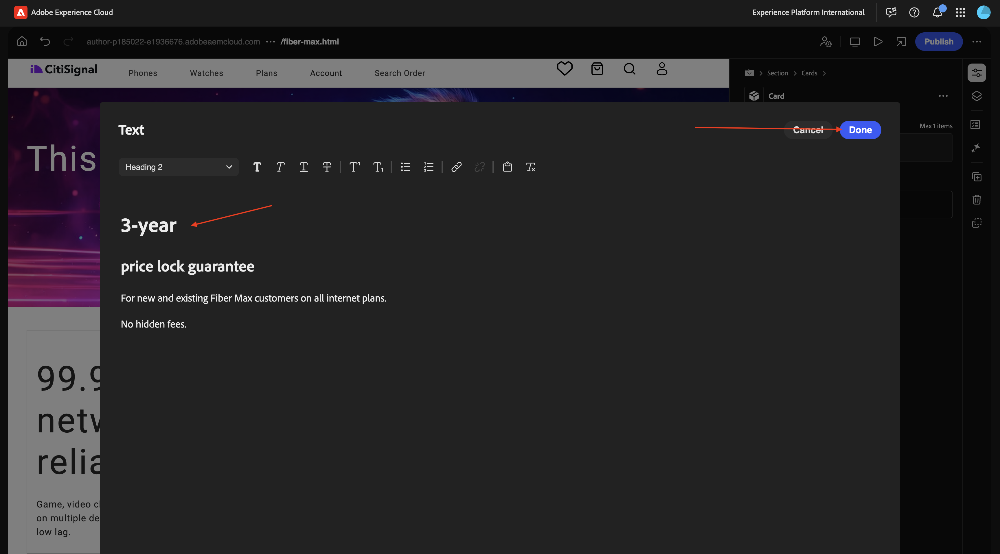

Selecteer de derde **Kaart**. Klik het **tekst** gebied om de tekst te veranderen.


Plak de volgende tekst. Zorg ervoor de eerste lijn van tekst **Kop 1** gebruikt. Klik **Gedaan**.

```
More ways to save

Save over 45% on the best entertainment with CitiSignal
```


Selecteer de vierde **Kaart**. Klik het **tekst** gebied om de tekst te veranderen.


Plak de volgende tekst. Zorg ervoor de eerste lijn van tekst **Kop 1** gebruikt. Klik **Gedaan**.

```
Get Fiber Max now!

Fill out the form here to get started.
```


Dat zou u nu moeten doen. Klik **publiceren**.


Klik **publiceren** opnieuw.


Klik **Open Pagina**.

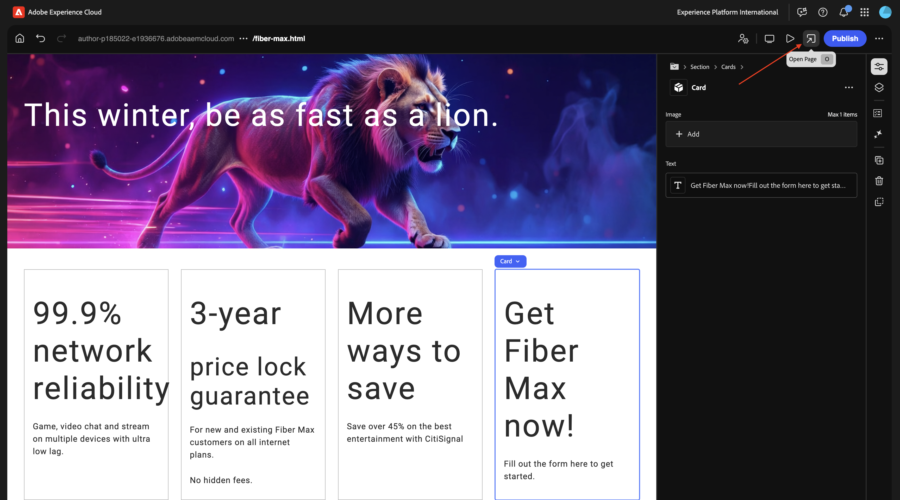

Kopieer de URL van de pagina naar wens.

De URL moet er ongeveer als volgt uitzien: `https://author-pXXXXXX-eXXXXXXX.adobeaemcloud.com/content/CitiSignal/fiber-max.html` .


Ga naar [ https://experience.adobe.com/#/experiencemanager/ ](https://experience.adobe.com/#/experiencemanager/). Klik om **Medewerker AI** te openen.


Plak de volgende herinnering en klik **verzenden**. Vervang XXX in deze vraag door URL die u in de vorige stap kopieerde.

```
On the page XXX, please make the following changes:

- change the word 'winter' to 'spring'
- change the word 'lion' to 'leopard'
- change the image in the hero block to use the image 'citisignal_leopard.png'
- change the text '99.9% network reliability' to '99.999% network reliability'
```

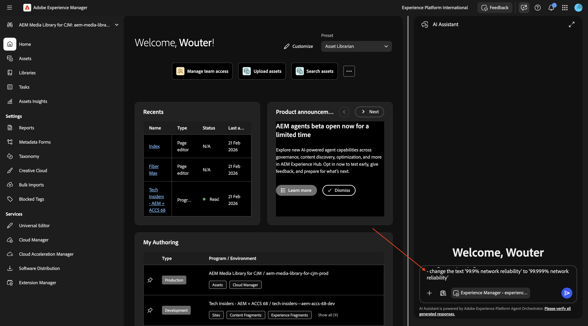

Na 1-2 minuten moet u dit zien. Ga de herinnering `generate` in en klik **verzenden**.

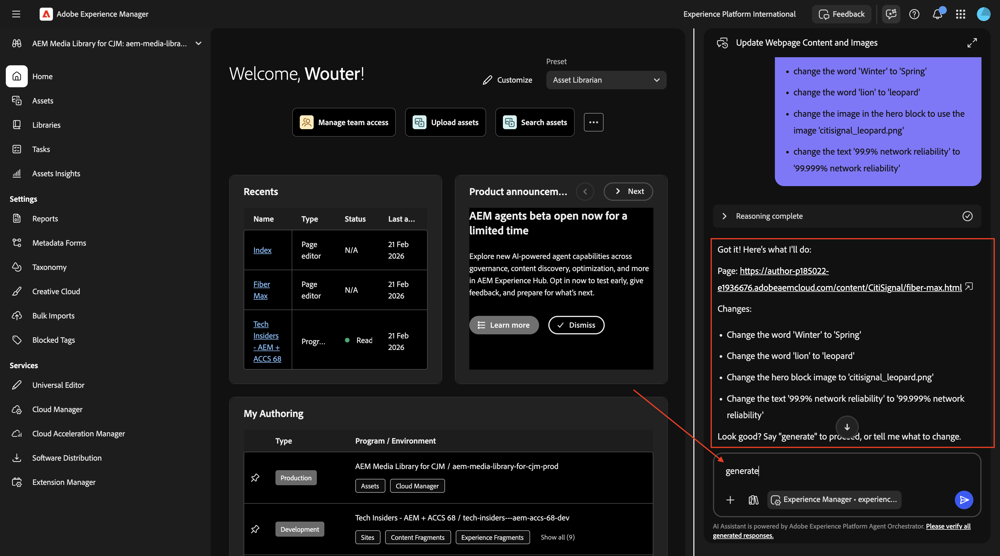

Een paar minuten later ziet u een bevestiging als deze dat de wijzigingen zijn uitgevoerd. Klik **Voorproef de bijgewerkte pagina**.


U krijgt nu een visuele bevestiging van de veranderingen die zijn gedaan. Deze voorvertoningspagina is louter ter informatie. U kunt geen actie ondernemen vanaf deze pagina.


Om actie te voeren, klik **uitgeven in AEM**.


In de Universele Redacteur, ziet u nu alle veranderingen in detail, met de capaciteit om het even wat veranderen. Zodra u de pagina hebt herzien, klik **publiceren**.


Klik **publiceren** opnieuw. De wijziging die u hebt aangebracht, wordt nog niet gepubliceerd in uw productieomgeving. In plaats daarvan, is het gepubliceerd onder **Lanceringen** in AEM.

Met behulp van opstartprogramma&#39;s kunt u op efficiënte wijze inhoud ontwikkelen voor een toekomstige release. Er wordt een Starten gemaakt waarmee u wijzigingen kunt aanbrengen in de voorbereidingen voor toekomstige publicatie, terwijl uw huidige pagina&#39;s behouden blijven. Dit betekent dat u in feite twee versies tegelijk bewerkt: pagina&#39;s die momenteel worden gepubliceerd en een versie van deze pagina&#39;s die in de toekomst tegelijk worden gepubliceerd. Zodra dat tijdstip is bereikt, kunt u de originele pagina&#39;s vervangen en de nieuwe versie publiceren.


Om **te bevorderen** uw hangende veranderingen voor een toekomstige versie, ga terug naar AEM. Klik **Adobe Experience Manager** bij de bovenkant van de pagina, klik het **hammer** pictogram en selecteer dan **Lanceringen**.


U zou een hangende **Lancering** nu moeten zien. Controleer checkbox vóór hangende **Lancering**.


Klik **bevorderen**.


Selecteer **bevorderen volledige lancering** en klik **daarna**.


Klik **bevorderen**.


U moet dit nu zien. Uw wijzigingen zijn nu in productie.


Vernieuw de pagina. Alle wijzigingen op de gepubliceerde pagina worden nu weergegeven.

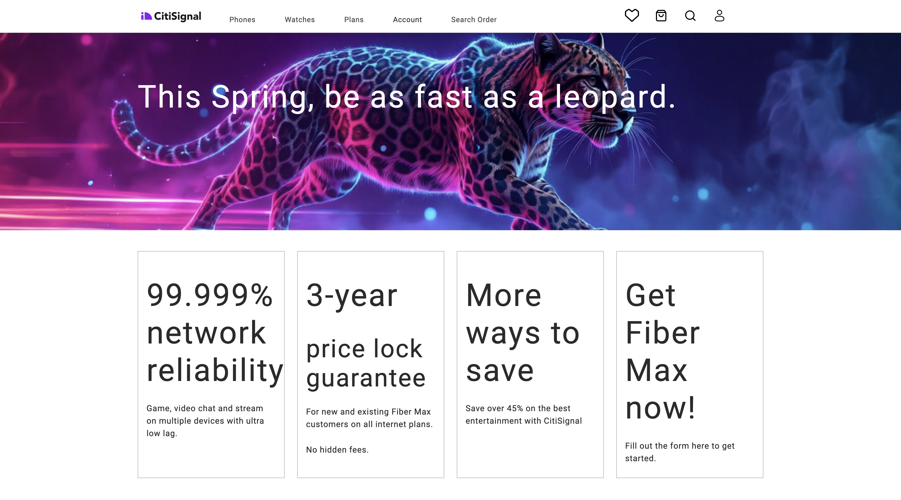

U kunt ook de vraag `accept` in AI Assistant invoeren in plaats van het handmatige promotieproces te doorlopen.


U zou dan een bevestiging moeten krijgen dat de veranderingen worden gepubliceerd.


### Inhoud bijwerken - Formulier maken

In module [ Adobe Experience Manager Forms met Edge Delivery Services ](./../../asset-mgmt/module1.3/aemforms.md){target="_blank"} kunt u de stappen vinden betrokken bij verwezenlijking een vorm op een handmatige manier.

Met de vaardigheden voor het maken van formulieren kunnen gebruikers nu adaptieve formulieren maken via natuurlijke taalaanwijzingen zonder afhankelijk te zijn van ontwikkelings- of IT-teams. Deze mogelijkheid versnelt de ontwikkeling van formulieren met behoud van de consistentie van merken en stelt zakelijke gebruikers in staat formulieren te maken zonder diepgaande technische productkennis.

Ga naar [ https://experience.adobe.com/#/ai-assistant/chat ](https://experience.adobe.com/#/ai-assistant/chat).


Ga de volgende herinnering in en klik **verzenden**.

```
Create a new adaptive form using Edge Delivery Services and the existing CitiSignal site, with the following details:
- Form name: "citisignal-fiber-max-interest-2"
- Form fields: 4 text input fields are needed, for "first-name", "last-name", "email" and "city"
- When the form is submitted, send the submission to a spreadsheet, with this URL: https://docs.google.com/spreadsheets/d/1WwKrcM8mZ2d_W3sMheUAw3nFhP_OFk05TsqxhHkudfQ/edit?usp=sharing.
```

## Volgende stappen

Ga naar [ 1.6.2 de Servers &amp; Cursor van AEM MCP ](./ex2.md){target="_blank"}

Ga terug naar [ AEM &amp; Agenten ](./aemagents.md){target="_blank"}

[ ga terug naar Alle Modules ](./../../../overview.md){target="_blank"}
