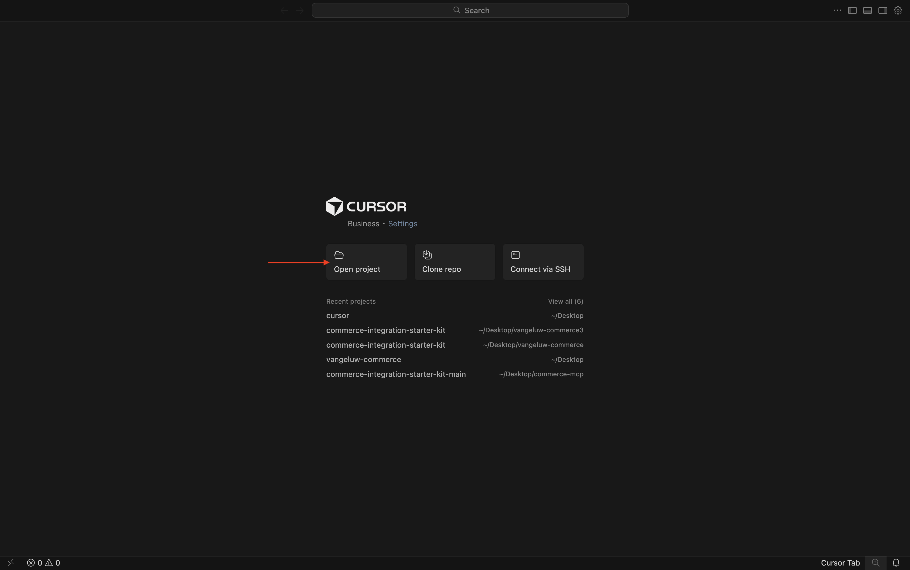
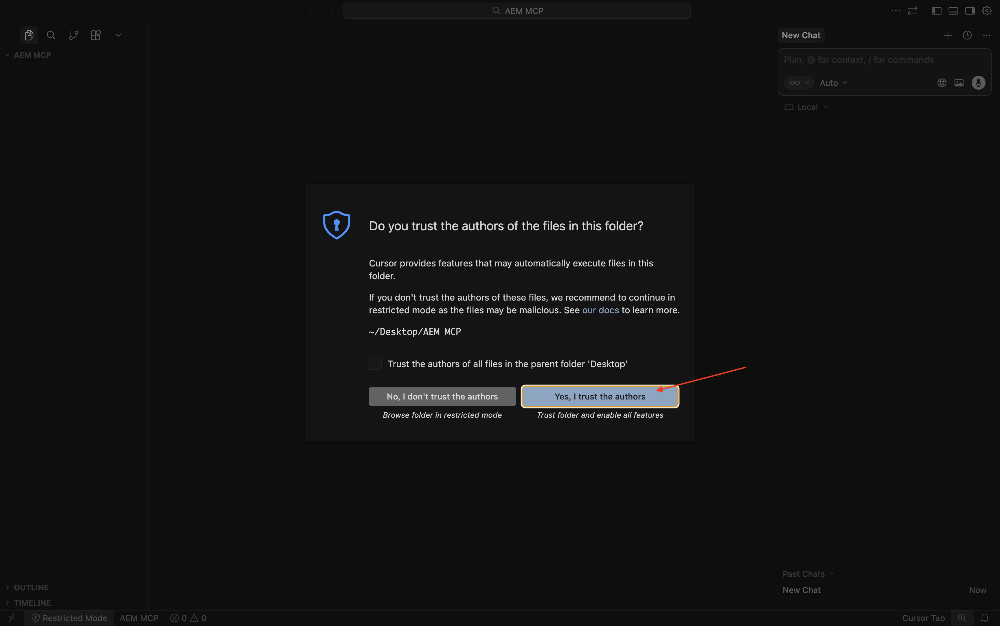
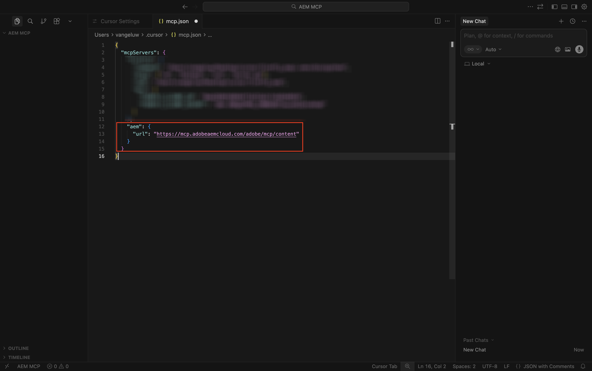
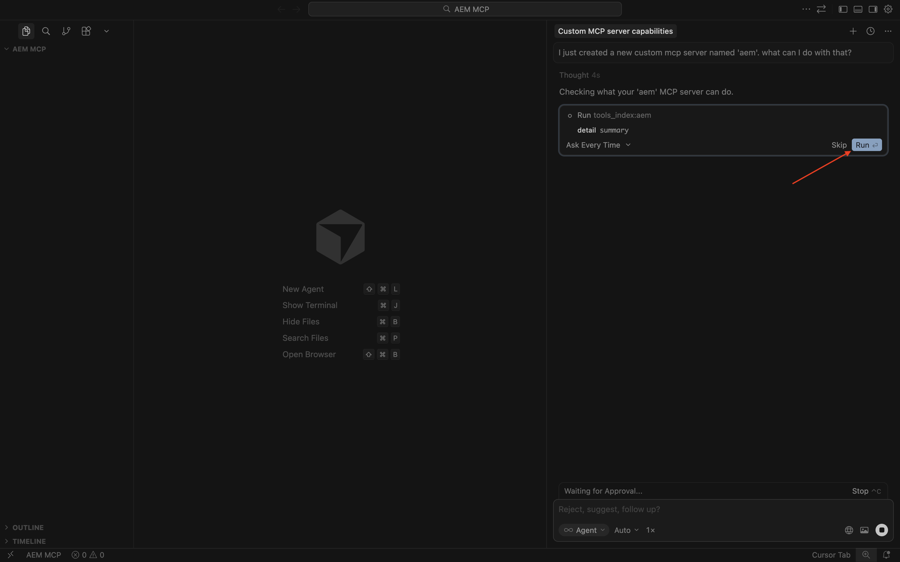
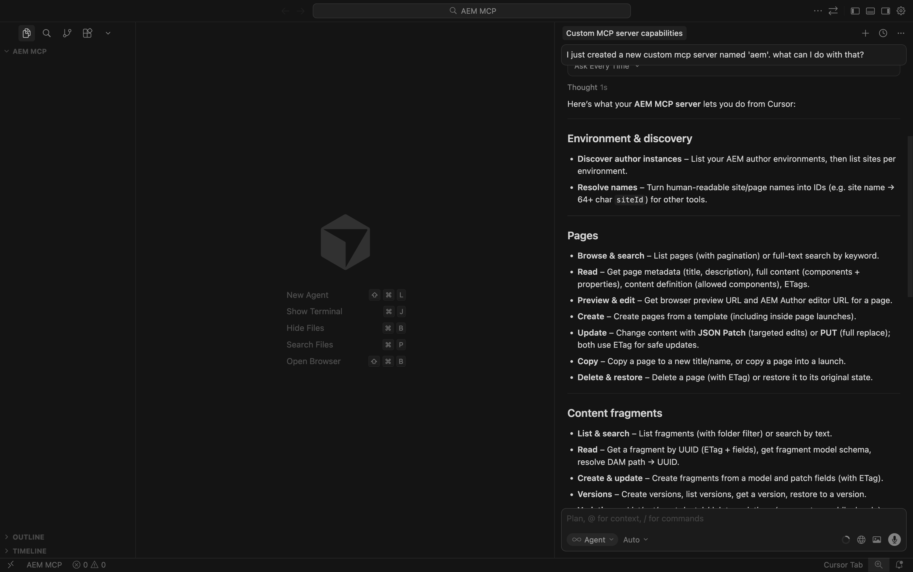
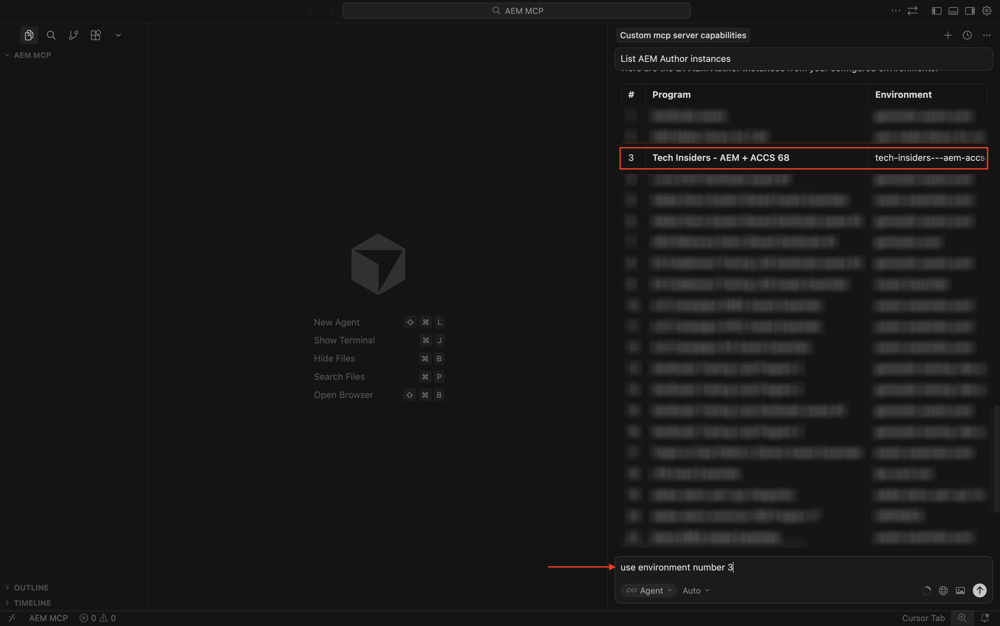
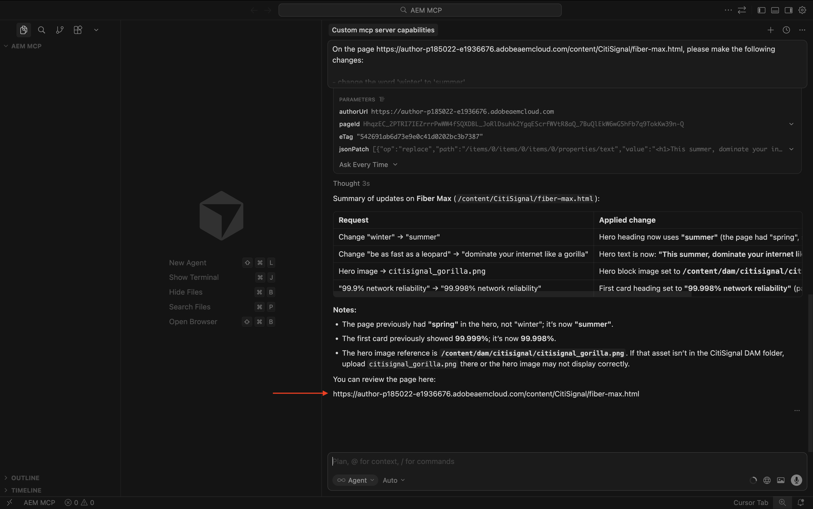
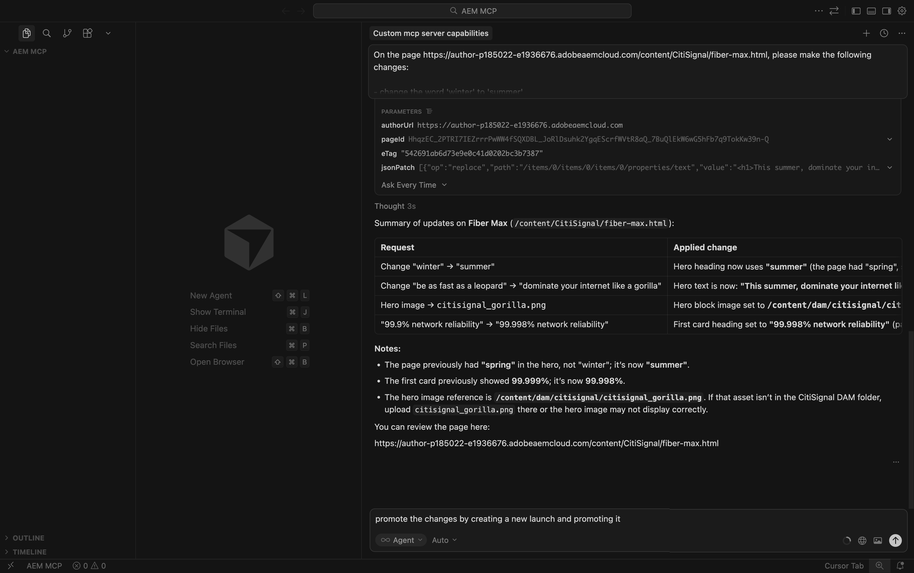
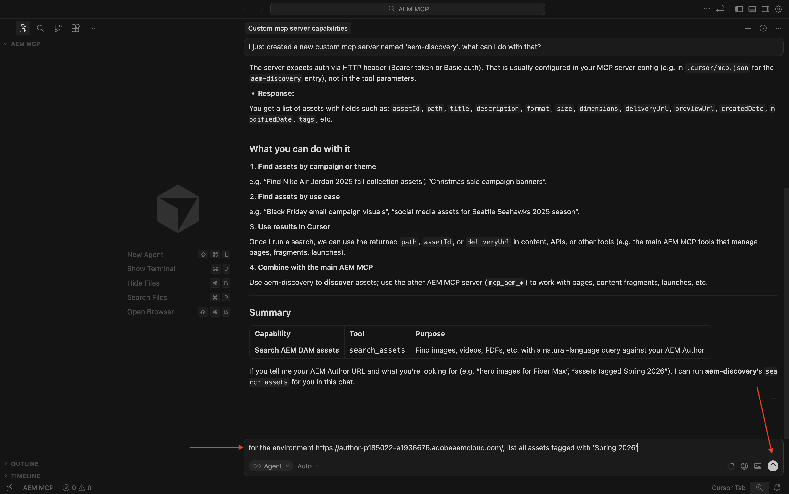

# 1.6.2 AEM MCP-servers en -cursor

>[!IMPORTANT]
>
>Om deze oefening te voltooien, moet u toegang tot een werkende AEM Sites en Assets CS met milieu EDS en de diverse agenten van AEM worden toegelaten voor IMS Org u gebruikt.
>
>Als u zulk een milieu nog niet hebt, ga [ Adobe Experience Manager Cloud Service &amp; Edge Delivery Services ](./../../../modules/asset-mgmt/module2.1/aemcs.md){target="_blank"} uitoefenen. Volg de instructies daar, en u zult toegang tot zulk een milieu hebben.

>[!IMPORTANT]
>
>Als u eerder een AEM CS-programma hebt geconfigureerd met een AEM Sites- en Assets CS-omgeving, kan het zijn dat uw AEM CS-sandbox is geminimaliseerd. Gezien het feit dat het vernietigen van zo&#39;n zandbak 10 tot 15 minuten duurt, zou het een goed idee zijn om het ontruimingsproces nu te beginnen zodat u niet op een later tijdstip hoeft te wachten.


Hier zijn alle beschikbare AEM MCP-servers:

- https://mcp.adobeaemcloud.com/adobe/mcp/content
- https://mcp.adobeaemcloud.com/adobe/mcp/content-readonly (alleen-lezen inhoudsbewerkingen)
- https://mcp.adobeaemcloud.com/adobe/mcp/content-updater (stelt de overeenkomstige vaardigheid van de Agent van de Productie van de Ervaring bloot)
- https://mcp.adobeaemcloud.com/adobe/mcp/experience-governance (Stelt vaardigheden bloot om merkbeleid voor een pagina te krijgen en te controleren)
- https://mcp.adobeaemcloud.com/adobe/mcp/discovery (stelt vaardigheden bloot om inhoud in een milieu van AEM te ontdekken)

In deze oefening, zult u instructies op hoe te om deze specifieke servers te gebruiken MCP vinden:

- https://mcp.adobeaemcloud.com/adobe/mcp/content
- https://mcp.adobeaemcloud.com/adobe/mcp/discovery

U kunt de onderstaande instructies gebruiken om vergelijkbare MCP-servers in te stellen voor de andere beschikbare AEM MCP-servers, omdat het proces erg vergelijkbaar is.

## 1.6.2.1 Experience Production Agent Cursor MCP Server instellen

Maak een nieuwe lege map op uw bureaublad.


Open de cursor. Klik **Open project**.



Selecteer de omslag u vóór creeerde en klik **Open**.


Klik **ja, vertrouw ik de auteurs**.



Dan moet je dit zien. Gebruik de sneltoets `Cmd + Shift + J` om de cursorinstellingen te openen. Dan moet je dit zien. Ga naar **Hulpmiddelen &amp; MCP**.


Klik **+ Nieuwe Server MCP**.


Voeg de volgende server MCP aan het dossier **mcp.json** toe. Er zijn mogelijk andere MCP-servers die al in dit bestand zijn opgegeven. Verwijder deze servers niet en voeg alleen de onderstaande nieuwe regels toe. Sla uw wijzigingen op.

```json
"aem": {
    "url": "https://mcp.adobeaemcloud.com/adobe/mcp/content"
    }
```



De schakelaar terug naar de lusje **Montages van de Curseur**. U zou een hulpmiddel moeten nu zien genoemd **genoemd** toegevoegd in de lijst van servers MCP. Klik **verbinden** om het gebruiken van uw rekening van Adobe voor authentiek te verklaren.


Klik **Open** voor het geval u dit bericht ziet. Vervolgens moet u de verificatie uitvoeren in uw browser.


Na succesvolle authentificatie, zou u iets als dit moeten zien.


Sluit de **Montages van de Curseur** en **mcp.json** lusjes. Plak de volgende herinnering in het praatje en klik **verzenden**.

```
I just created a new custom mcp server named 'aem'. what can I do with that?
```


Klik **Looppas**.



Daarna moet u een vergelijkbare reactie zien.




Zoals u kunt zien, worden de gelijkaardige mogelijkheden blootgesteld door de server MCP in Cursor in vergelijking met wat mogelijk gebruikend AI Medewerker in de vorige oefening was.

Ga de volgende herinnering in en klik **verzenden**.

```javascript
List AEM Author instances
```


Dan moet je iets dergelijks zien. Onderzoek naar het milieu u wilt gebruiken en dan de volgende herinnering ingaan en **klikken verzendt**.

```javascript
use environment number X
```



Dan moet je dit zien.


Plak de volgende herinnering en klik **verzenden**. Vervang XXX in deze herinnering door URL die u in de vorige oefening kopieerde.

```
On the page https://author-p185022-e1936676.adobeaemcloud.com/content/CitiSignal/fiber-max.html, please make the following changes:

- change the word 'winter' to 'summer'
- change the text 'be as fast as a leopard' to 'dominate your internet like a gorilla'
- change the image in the hero block to use the image 'citisignal_gorilla.png'
- change the text '99.9% network reliability' to '99.998% network reliability'
```


Na 1-2 minuten dient u een vergelijkbare reactie te krijgen. Kopieer de URL en open de pagina in uw browser.



Dan moet je dit zien.


Ga de volgende herinnering in en klik **verzenden**.

```javascript
promote the changes by creating a new launch and promoting it
```



Na 1-2 minuten zijn de wijzigingen bevorderd.


De wijzigingen worden nu live op uw website weergegeven.


Voel vrij om de andere mogelijkheden van de Server van AEM te onderzoeken MCP.

## 1.6.2.2 Setup Agent Cursor MCP Server instellen

Gebruik de sneltoets `Cmd + Shift + J` om de cursorinstellingen te openen. Dan moet je dit zien. Ga naar **Hulpmiddelen &amp; MCP**. Klik **+ Nieuwe Server MCP**.


Voeg de volgende server MCP aan het dossier **mcp.json** toe. Er zijn mogelijk andere MCP-servers die al in dit bestand zijn opgegeven. Verwijder deze servers niet en voeg alleen de onderstaande nieuwe regels toe. Sla uw wijzigingen op.

```
,
"aem-discovery": {
    "url": "https://mcp.adobeaemcloud.com/adobe/mcp/discovery"
}
```


De schakelaar terug naar de lusje **Montages van de Curseur**. U zou een hulpmiddel moeten nu zien genoemd **genoemd** toegevoegd in de lijst van servers MCP. Klik **verbinden** om het gebruiken van uw rekening van Adobe voor authentiek te verklaren.


Na het voor authentiek verklaren, zou u dit moeten zien.


Sluit de **Montages van de Curseur** en **mcp.json** lusjes. Plak de volgende herinnering in het praatje en klik **verzenden**.

```
I just created a new custom mcp server named 'aem-discovery'. what can I do with that?
```


```
for the environment https://author-pXXXXXX-eXXXXXXX.adobeaemcloud.com/, list all assets tagged with 'Spring 2026'
```



Dan moet je iets dergelijks zien.


## Volgende stappen

Ga naar [ 1.6.3 de Fragmenten van de Inhoud van de Schaal met ChatGPT &amp; Server MCP ](./ex3.md){target="_blank"}

Ga terug naar [ AEM &amp; Agenten ](./aemagents.md){target="_blank"}

[ ga terug naar Alle Modules ](./../../../overview.md){target="_blank"}
