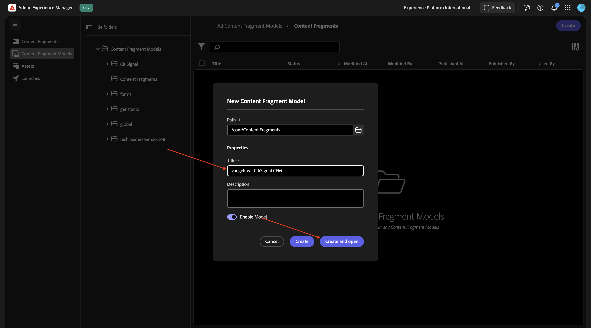
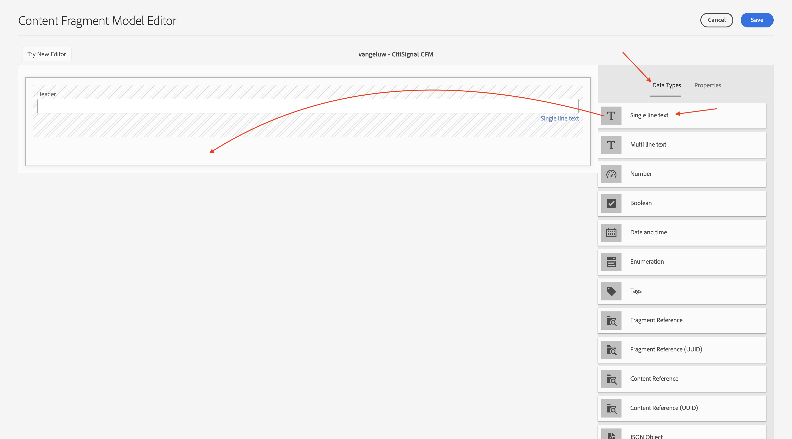
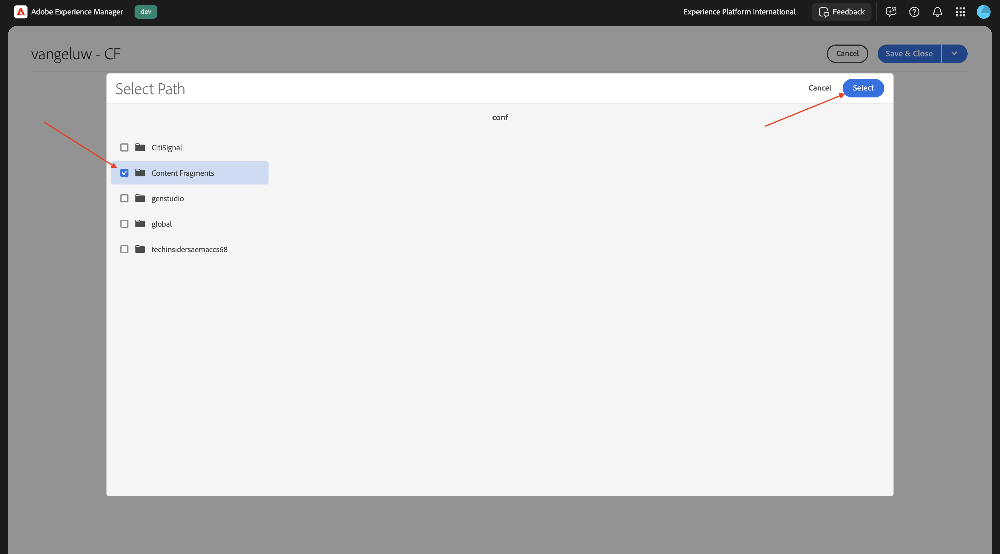
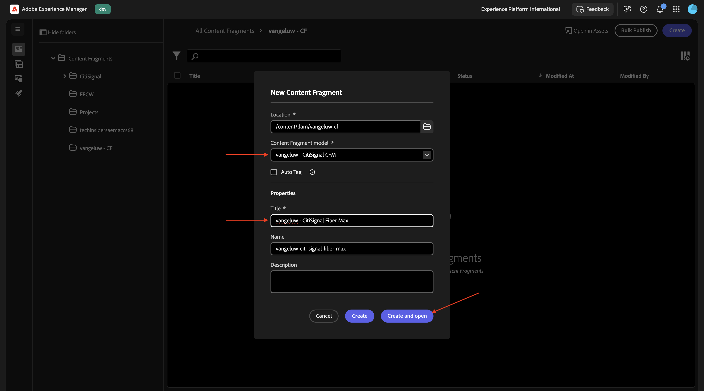
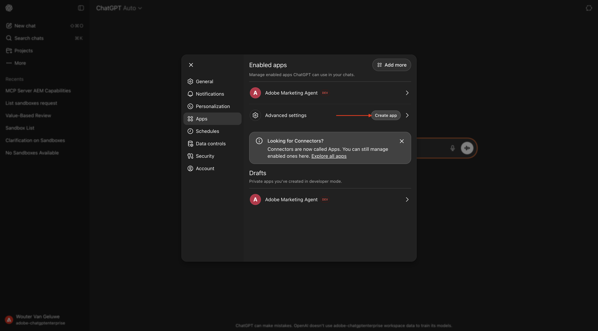
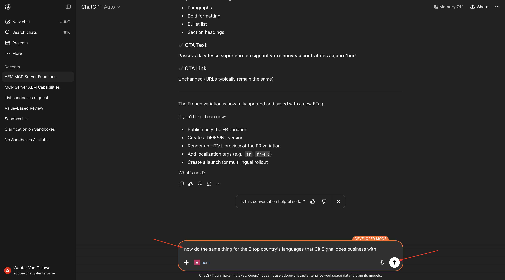
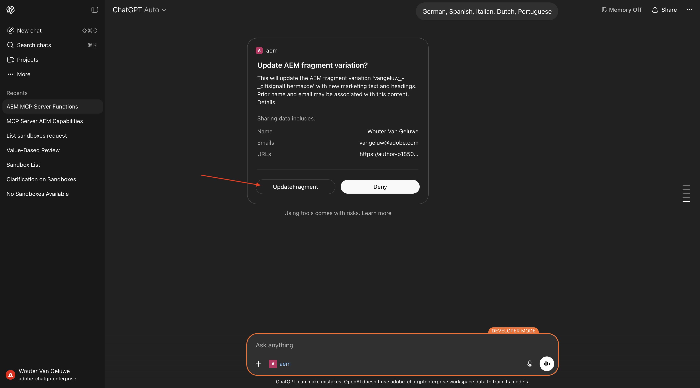

# 1.6.3 Inhoudsfragmenten schalen met ChatGPT en MCP Server

>[!IMPORTANT]
>
>Om deze oefening te voltooien, moet u toegang tot een werkende AEM Sites en Assets CS met milieu EDS en de diverse agenten van AEM worden toegelaten voor IMS Org u gebruikt.
>
>Als u zulk een milieu nog niet hebt, ga [&#x200B; Adobe Experience Manager Cloud Service &amp; Edge Delivery Services &#x200B;](./../../../modules/asset-mgmt/module2.1/aemcs.md){target="_blank"} uitoefenen. Volg de instructies daar, en u zult toegang tot zulk een milieu hebben.

>[!IMPORTANT]
>
>Als u eerder een AEM CS-programma hebt geconfigureerd met een AEM Sites- en Assets CS-omgeving, kan het zijn dat uw AEM CS-sandbox is geminimaliseerd. Gezien het feit dat het vernietigen van zo&#39;n zandbak 10 tot 15 minuten duurt, zou het een goed idee zijn om het ontruimingsproces nu te beginnen zodat u niet op een later tijdstip hoeft te wachten.

## 1.6.3.1 Inhoudsfragmentmodel maken

Ga terug naar uw milieu van de Auteur van Adobe Experience Manager, aan **Hulpmiddelen** en ga dan naar **Browser van de Configuratie**.


Klik **creëren**.


Gebruik `Content Fragments` voor de gebieden **Titel** en **Naam**.

Zorg ervoor de opties **Modellen van het Fragment van de Inhoud** en **GraphQL de Verlengde Vragen** allebei worden toegelaten.

Klik **creëren**.


Ga terug naar uw milieu van de Auteur van Adobe Experience Manager en ga dan naar **Fragments van de Inhoud**.


Ga naar **Modellen van het Fragment van de Inhoud**, selecteer uw configuratie **Fragmenten van de Inhoud** en klik dan **creeer**.


Gebruik de naam `--aepUserLdap-- - CitiSignal CFM` . Klik **creëren en openen**.



Dan moet je dit zien. De belemmering en laat vallen a **Enige lijntekst** gebied op het canvas.


Verander het gebied **etiket van het Gebied** in `Header`.


Ga terug naar **Types van Gegevens**. De belemmering en laat vallen a **Enige lijntekst** gebied op het canvas.



Verander het gebied **etiket van het Gebied** in `Subheader`.


Ga terug naar **Types van Gegevens**. De belemmering en laat vallen a **Meerdere lijntekst** gebied op het canvas.


Verander het gebied **etiket van het Gebied** in `Detail Description`.


Ga terug naar **Types van Gegevens**. De belemmering en laat vallen a **Enige lijntekst** gebied op het canvas.


Verander het gebied **etiket van het Gebied** in `CTA Text`.


Ga terug naar **Types van Gegevens**. De belemmering en laat vallen a **Enige lijntekst** gebied op het canvas.


Verander het gebied **etiket van het Gebied** in `CTA Link`. Klik **sparen**.


Dan moet je dit zien.


Selecteer uw model van het inhoudsfragment en klik **publiceren**.


Klik **publiceren**.


## 1.6.3.2 Inhoudsfragment maken

Ga terug naar uw milieu van de Auteur van Adobe Experience Manager en ga dan naar **Fragments van de Inhoud**.


Dan moet je dit zien. Klik **creëren** en selecteer dan **Omslag**.


Voer de titel in: `--aepUserLdap-- - CF`. Klik **creëren**.


Ga terug naar uw milieu van de Auteur van Adobe Experience Manager en ga dan naar **Assets**.


Ga naar **Dossiers**.


Selecteer de omslag u enkel creeerde, die `--aepUserLdap-- - CF` zou moeten worden genoemd en **Eigenschappen** klikken.


Ga naar **de Diensten van de Wolk** en klik dan het **omslag** pictogram.


Selecteer de wolkenconfiguratie u eerder creeerde, die **de Fragmenten van de Inhoud** zou moeten worden genoemd. Klik **Uitgezocht**.



Dan moet je dit zien. Klik **sparen &amp; Sluiten**.


Ga terug naar uw milieu van de Auteur van Adobe Experience Manager en ga dan naar **Fragments van de Inhoud**.


Dan moet je dit zien. Klik **creëren** en selecteer dan **het Fragment van de Inhoud**.


Selecteer het **Model van het Fragment van de Inhoud** u eerder creeerde, dat zou moeten worden genoemd `--aepUserLdap-- - CitiSignal CFM`. Gebruik de naam `--aepUserLdap-- CitiSignal Fiber Max` .

Klik **creëren en openen**.



Dan moet je dit zien.


Vul de velden als volgt in:

- **Kopbal**: `CitiSignal Fiber Max`
- **Subheader**: `Experience high speed internet now`
- **Beschrijving van het Detail**:

```
Experience the future of connectivity with CitiSignal Fiber Max, the ultimate solution for high-speed internet. Designed for homes and businesses that demand performance, Fiber Max delivers blazing-fast fiber speeds, ensuring seamless streaming, ultra-responsive gaming, and crystal-clear video calls.

Key Features:

Unmatched Speed: Enjoy lightning-fast downloads and uploads powered by cutting-edge fiber technology.
Reliable Performance: Consistent connectivity for work, entertainment, and everything in between.
Future-Ready: Built to handle the growing demands of smart homes and digital lifestyles.
Unlimited Potential: No data caps, no throttling—just pure speed.
Why Choose CitiSignal Fiber Max? Stay ahead with internet that works as hard as you do. Whether you’re powering a remote office or streaming in 4K, Fiber Max ensures you never miss a beat.
```

**Tekst van CTA**: `Upgrade now by signing your new contract!`
**Verbinding van CTA**: `https://techinsiders68.adobedemosystem.com/`

Klik **publiceren** en selecteer dan **nu**.


Klik **publiceren**.


## 1.6.3.3 MCP-server configureren in ChatGPT

>[!NOTE]
>
>Voor het gebruik van Adobe Marketing Agent in ChatGPT is het volgende vereist:
>- Een betaalde versie van ChatGPT Enterprise van OpenAI
>- de ChatGPT Enterprise-webclient gebruiken

Ga naar [&#x200B; https://chatgpt.com/ &#x200B;](https://chatgpt.com/){target="_blank"} en login die uw rekeningsdetails gebruiken. Nadat u zich hebt aangemeld, kunt u dit beter zien. Klik uw gebruikersbenaming en selecteer dan **Montages**.


Ga naar **Apps** en selecteer dan **Geavanceerde montages**.


Zet **wijze van de Ontwikkelaar** aan en klik dan **terug**.


Klik **Create app**.



Vul de velden als volgt in:

- **Naam**: `aem`
- **URL van de Server MCP**: `https://mcp.adobeaemcloud.com/adobe/mcp/content`
- **Authentificatie**: `OAuth`

Controleer checkbox voor **ik begrijp en wil** verdergaan.

Klik **creëren**.


ChatGPT probeert nu verbinding te maken met uw Adobe-account. Selecteer **Toestaan Toegang** en dan zult u login met uw rekening van Adobe moeten.

Zodra u zich met succes hebt aangemeld, zou u moeten zien dat uw Adobe Marketing Agent nu met succes wordt verbonden.


## 1.6.3.4 AEM MCP-server gebruiken in ChatGPT

Sluit dit venster.


Dan moet je dit zien. Klik **+** pictogram, ga **Meer** en selecteer dan **a**.


Ga de volgende herinnering in en klik **verzenden**.

```
I just created a new custom mcp server named 'aem'. what can I do with that?
```


Dan moet je iets dergelijks zien. Ga de volgende herinnering in en klik **verzenden**.

```
use the author url https://author-pXXXXXX-eXXXXXXX.adobeaemcloud.com/ from now on
```


Dan moet je iets dergelijks zien. Ga de volgende herinnering in en klik **verzenden**.

```
find the content fragment --aepUserLdap-- - CitiSignal Fiber Max and make a variation called --aepUserLdap-- - CitiSignal Fiber Max (FR), then translate all fields into french
```


Klik **CreateFragmentVariation**.


Klik **UpdateFragment**.


Dan moet je dit zien. Uw fragmentvariatie is gemaakt.


Je kunt nu ook je nieuwe variatie zien in de gebruikersinterface van AEM.


Gebruik vervolgens ChatGPT om het inhoudsfragment in meer variaties te vertalen. Ga de volgende herinnering in en klik **verzenden**.

```
now do the same thing for the 5 top country's languages that CitiSignal does business with
```



Bevestig uw taalkeuze.


Klik **CreateFragmentVariation**.


Klik **UpdateFragment**.



Herhaal dit proces voor elk van de talen die u hebt geselecteerd. Als je klaar bent, moet je iets als dit zien.


Ga terug naar de gebruikersinterface van AEM en vernieuw het scherm. U kunt nu de nieuwe variaties in het inhoudsfragment zien.


## Volgende stappen

Ga terug naar [&#x200B; AEM &amp; Agenten &#x200B;](./aemagents.md){target="_blank"}

[&#x200B; ga terug naar Alle Modules &#x200B;](./../../../overview.md){target="_blank"}
