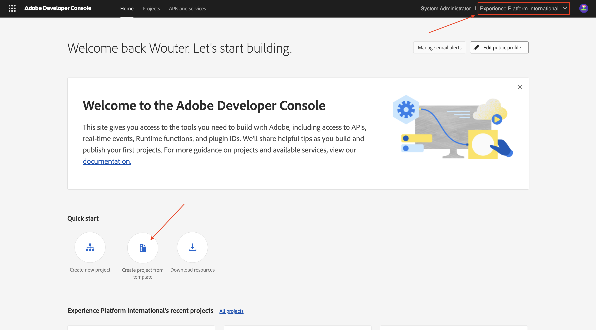
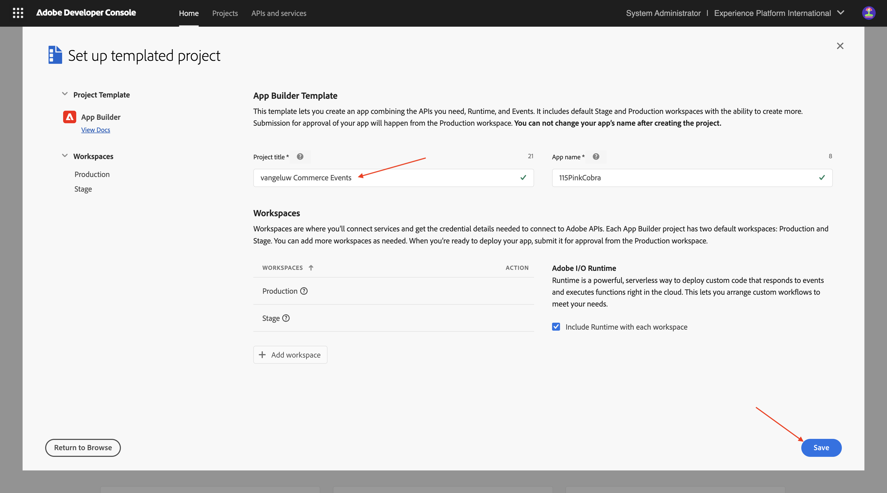
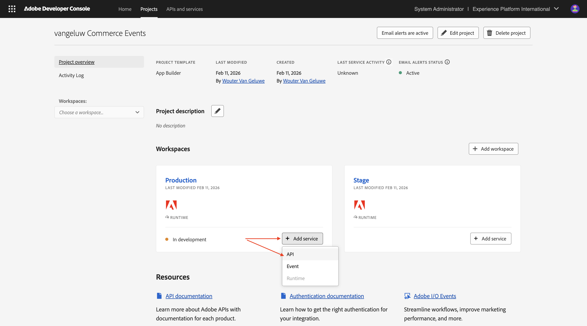
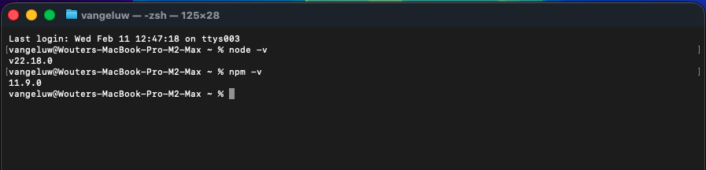
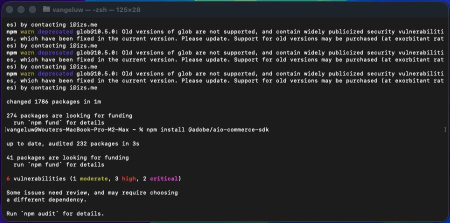

# 1.7.1 De ontwikkelomgeving instellen

## 1.7.1.1 Uw Adobe I/O-project maken

Ga naar [&#x200B; https://developer.adobe.com/console/home &#x200B;](https://developer.adobe.com/console/home){target="_blank"}.

Selecteer de juiste instantie in de rechterbovenhoek van het scherm. Uw instantie is `--aepImsOrgName--` .

>[!NOTE]
>
> In de onderstaande schermafbeelding ziet u een specifieke org die wordt geselecteerd. Wanneer u door dit leerprogramma gaat, is het zeer waarschijnlijk dat uw org een verschillende naam heeft. Wanneer u zich hebt aangemeld voor deze zelfstudie, hebt u de te gebruiken omgevingsdetails ontvangen. Volg deze instructies.

Daarna, uitgezochte **creeer project van malplaatje**.

Selecteer **App Builder**.

Voer de naam `--aepUserLdap-- vangeluw Commerce Events` in. Klik **sparen**.

Dan moet je iets dergelijks zien.

Klik **+ voeg de dienst** toe en selecteer dan **API**.

Onderzoek en selecteer de API **I/O Gebeurtenissen**. Klik **daarna**.

Wijzig de naam van de referentie in `vangeluw Commerce Events - Production` . Klik **sparen gevormde API**.

Dan moet je dit zien. Klik **+ voeg de dienst** toe en selecteer dan **API**.

Onderzoek en selecteer API van het Beheer API van API **I/O**. Klik **daarna**.

Klik **sparen gevormde API**.

Dan moet je dit zien. Klik **+ voeg de dienst** toe en selecteer dan **API**.

Onderzoek en selecteer API **Adobe Commerce as a Cloud Service**. Klik **daarna**.

Selecteer **Server-aan-Server Authentificatie**. Klik **daarna**.

Klik **daarna**.

Selecteer **Gebrek - Cloud Manager**. Klik **sparen gevormde API**.

Dan moet je dit zien. Klik **+ voeg de dienst** toe en selecteer dan **API**.

Onderzoek en selecteer API **Adobe I/O Events voor Adobe Commerce**. Klik **daarna**.

Klik **sparen gevormde API**.

Uw project is nu ingesteld en kan worden gebruikt.

## 1.7.1.2 De ontwikkelomgeving configureren

Als u een uitbreidbare app wilt maken, verzenden en implementeren, moet in uw lokale ontwikkelomgeving de volgende toepassingen en pakketten zijn geïnstalleerd:

- Node.js (versie 20.x of hoger)
- npm (verpakt met Node.js)
- Adobe Developer command-line interface (CLI)

Voer de volgende stappen uit als deze toepassingen of pakketten nog niet op uw computer zijn geïnstalleerd.

### Node.js &amp; npm

Ga naar [&#x200B; https://nodejs.org/en/download &#x200B;](https://nodejs.org/en/download). U zou dit, met een aantal eindbevelen dan moeten zien die moeten worden uitgevoerd om Node.js en npm geïnstalleerd te hebben. De hier getoonde opdrachten zijn van toepassing op MacBook.

Open eerst een nieuw terminalvenster. Plak en voer de opdracht op regel 2 in de schermafbeelding uit:

`curl -o- https://raw.githubusercontent.com/nvm-sh/nvm/v0.40.3/install.sh | bash`

Voer vervolgens de opdracht op regel 5 uit in de schermafbeelding:

`\. "$HOME/.nvm/nvm.sh"`

Nadat beide opdrachten zijn uitgevoerd, voert u deze opdracht uit:

`node -v`

Er wordt een versienummer weergegeven.

Voer vervolgens deze opdracht uit:

`npm -v`

Als NPM nog niet is geïnstalleerd, kunt u het installeren gebruikend dit bevel: `npm install -g npm@11.9.0`.

Er wordt een versienummer weergegeven.

Als de laatste 2 bevelen met succes een versieaantal terugkeerde, dan is uw configuratie van deze 2 mogelijkheden succesvol.

### Adobe Developer command-line interface (CLI)

Om Adobe Developer bevel-lijn interface (CLI) te installeren, stel het volgende bevel in een eindvenster in werking:

`npm install -g @adobe/aio-cli`

Het uitvoeren van deze opdracht kan een paar minuten duren. Het eindresultaat moet er ongeveer als volgt uitzien:

De opdrachtregelinterface (CLI) van Adobe Developer is nu ook geïnstalleerd.

### Adobe Developer Command-line Interface (CLI) SDK extension for Commerce

Als u de extensie Adobe I/O SDK voor Commerce wilt installeren, voert u de volgende opdracht uit in een terminalvenster:

`npm install @adobe/aio-commerce-sdk`

### Adobe Commerce-insteekmodules voor Adobe I/O CLI

Als u de Adobe Commerce-insteekmodules voor Adobe I/O CLI wilt installeren, voert u de volgende opdracht uit in een terminalvenster:

`aio plugins:install https://github.com/adobe-commerce/aio-cli-plugin-commerce @adobe/aio-cli-plugin-app-dev @adobe/aio-cli-plugin-runtime`

U hebt nu de basiselementen ingesteld om een App Builder-project te kunnen uitvoeren, in combinatie met Adobe Commerce, Adobe I/O Events en Adobe I/O Runtime.

## Volgende stappen

Ga naar [&#x200B; Cursor.ai van het Gebruik om uw project &#x200B;](./ex2.md){target="_blank"} te ontwikkelen

Ga terug naar [&#x200B; Intelligente Hulpmiddelen van de Ontwikkelaar voor Adobe Commerce &#x200B;](./aiassisteddev.md){target="_blank"}

[&#x200B; ga terug naar Alle Modules &#x200B;](./../../../overview.md){target="_blank"}
