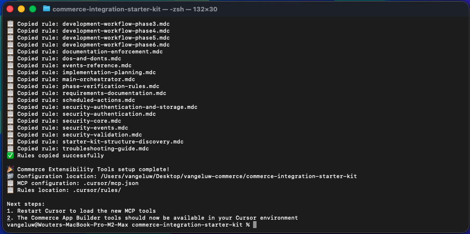
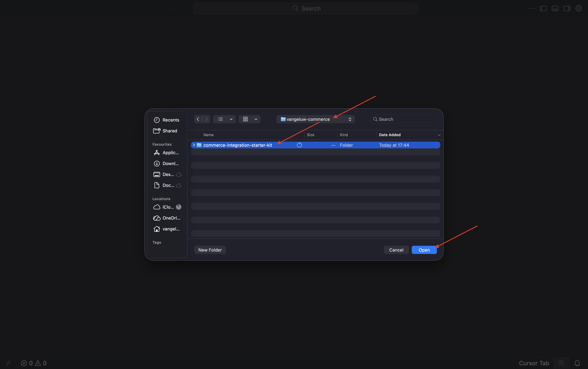

# 1.7.2 Gebruik Cursor.ai om uw project te ontwikkelen

## 1.7.2.1 Stel uw map en gereedschappen in

Maak op uw bureaublad een nieuwe map met de naam `--aepUserLdap---commerce`

Klik met de rechtermuisknop op uw map en selecteer **Nieuwe terminal bij Map** .

Dan moet je dit zien.

U moet nu een bestaande bewaarplaats van Github klonen, die u [&#x200B; https://github.com/adobe/commerce-integration-starter-kit &#x200B;](https://github.com/adobe/commerce-integration-starter-kit) kunt bekijken.

Deze opslagplaats is Adobe-integratiestartkit die Adobe Developer App Builder gebruikt om de betrouwbaarheid van real-time verbindingen te verbeteren en de tijd-aan-markt voor integratie tussen Adobe Commerce en andere back-office systemen, zoals ERPs, CRMs, en PIMs te verminderen.

Er zijn verscheidene manieren om deze bewaarplaats te klonen, in dit voorbeeld wordt de Terminal gebruikt.

Ga het volgende bevel in uw Eind venster in en voer het uit.

`git clone https://github.com/adobe/commerce-integration-starter-kit`

Na een paar seconden ziet u dit resultaat.

Navigeer vervolgens naar de map die zojuist is gemaakt. Voer de volgende opdracht in en voer deze uit.

`cd commerce-integration-starter-kit`

Dan moet je dit zien.

Vervolgens moet u de uitbreidbaarheidsgereedschappen van Commerce instellen voor Cursor.ai. Voer de volgende opdracht in en voer deze uit.

`aio commerce extensibility tools-setup`

Selecteer **Huidige folder**.

Selecteer **Cursor**.

Selecteer **npm**.

Na een paar minuten moet je dit zien.

Door de uitbreidingshulpmiddelen van Commerce voor Cursor.ai te installeren, is er nu een server MCP beschikbaar als deel van uw milieu Cursor.ai. In de volgende oefeningen, zult u die server gebruiken MCP om u te helpen het app builder project ontwikkelen en opstellen.

## 1.7.2.2 Webhaak instellen

Voor deze oefening, zult u een webhaak nodig hebben die moet worden gevormd zodat wanneer een orde wordt gecreeerd, de ordegebeurtenis aan die webhaak kan worden gestroomd. In deze oefening, zult u een steekproefeindpunt gebruiken gebruikend [&#x200B; https://pipedream.com/requestbin &#x200B;](https://pipedream.com/requestbin).

Ga naar [&#x200B; https://pipedream.com/requestbin &#x200B;](https://pipedream.com/requestbin), creeer een rekening en creeer dan een werkruimte. Als de werkruimte eenmaal is gemaakt, ziet u iets gelijkaardigs.

Klik **exemplaar** om url te kopiëren. U zult deze url in de volgende oefening moeten specificeren. De URL in dit voorbeeld is `https://eodts05snjmjz67.m.pipedream.net` .

## 1.7.2.3 Cursor.ai

Open Cursor.ai. Klik **Open project**.

Navigeer naar de map die u hebt gemaakt en die de naam `--aepUserLdap---commerce` moet krijgen. Selecteer in die map de map met de naam `commerce-integration-starter-kit` . Klik **Open**.

Dan moet je dit zien. Voordat u verdergaat, moet u ervoor zorgen dat de map op hoofdniveau die wordt geopend in Cursor.ai, `commerce-integration-starter-kit` is.

`I would like to build an app that subscribes to order created events and sends them to a configurable URL with basic authentication`

## Volgende stappen

Ga terug naar [&#x200B; Intelligente Hulpmiddelen van de Ontwikkelaar voor Adobe Commerce &#x200B;](./aiassisteddev.md){target="_blank"}

[&#x200B; ga terug naar Alle Modules &#x200B;](./../../../overview.md){target="_blank"}