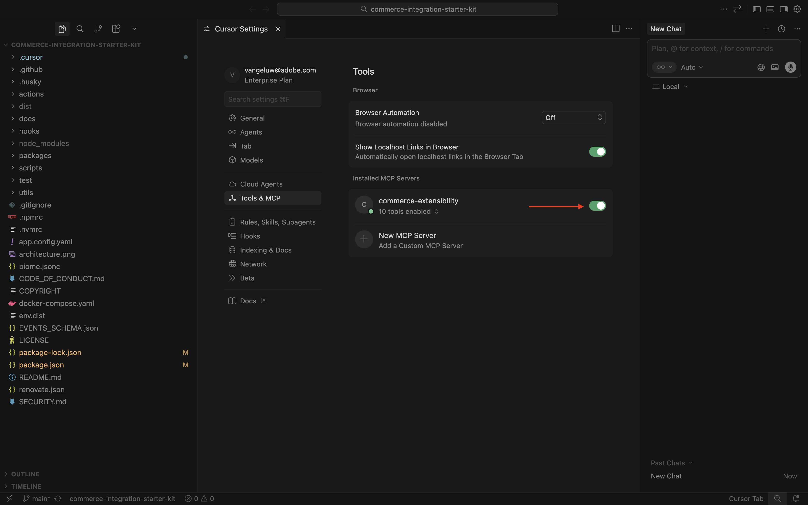
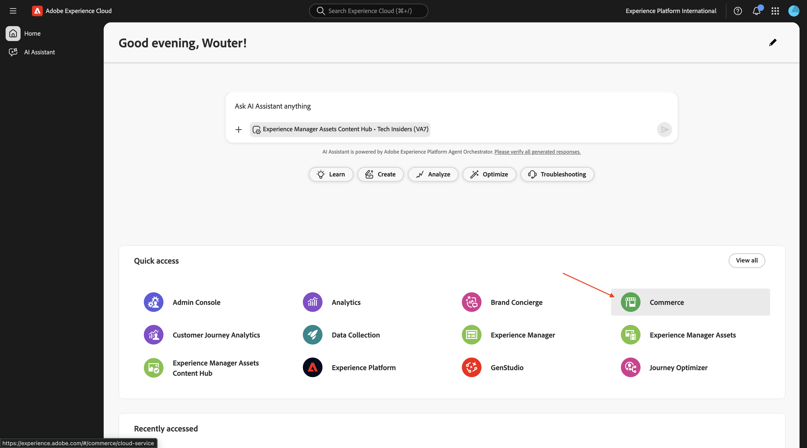
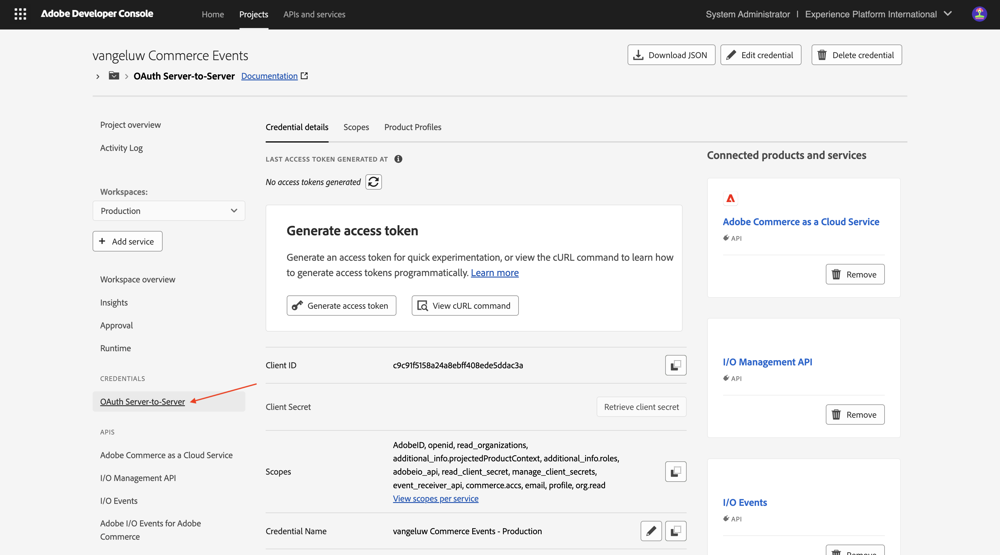
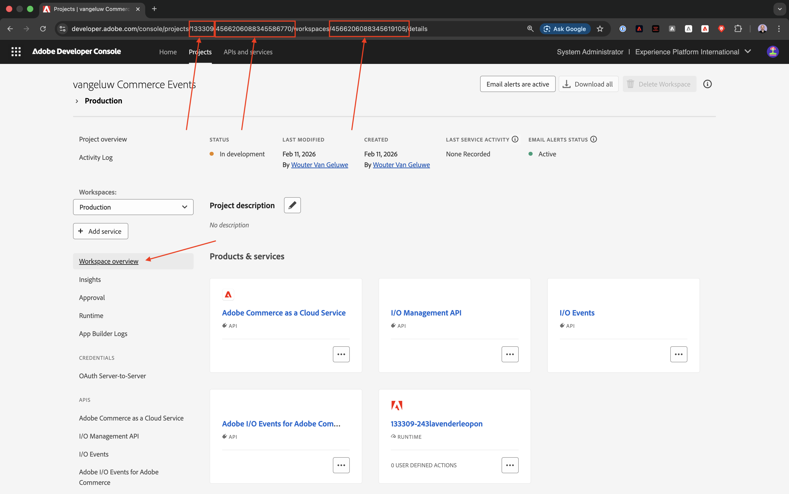
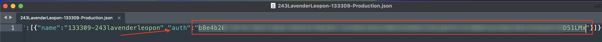
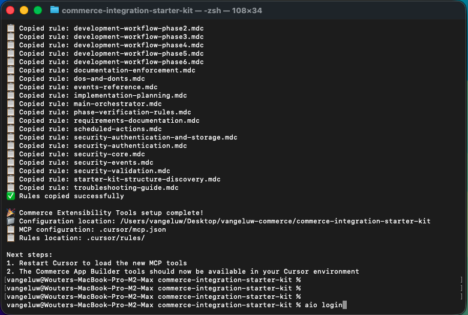
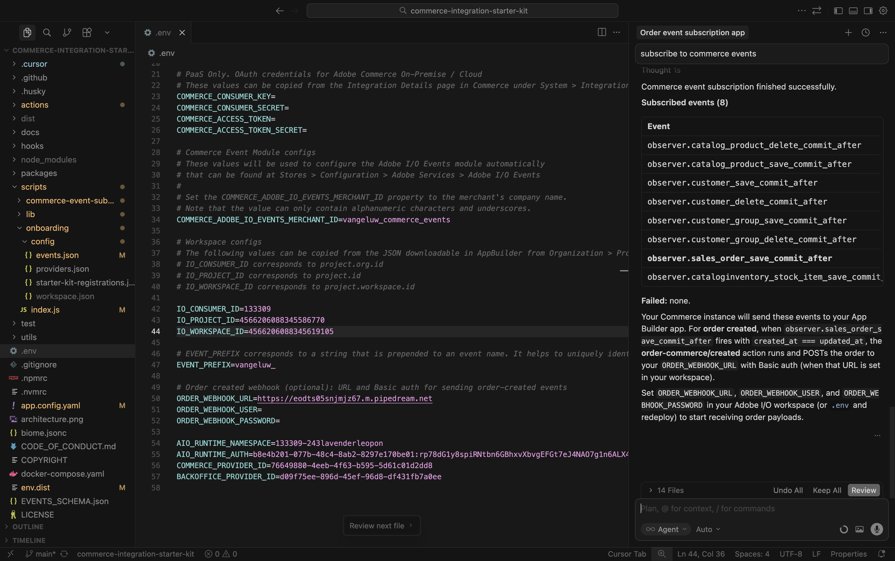
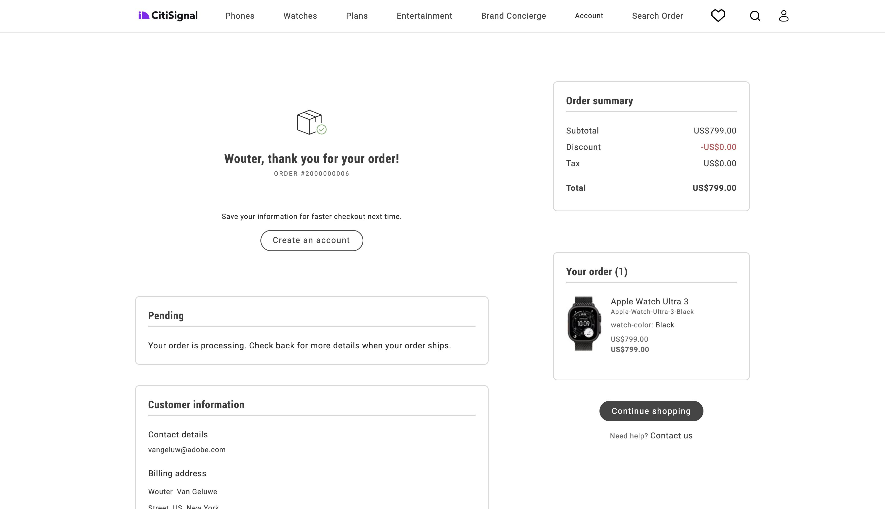

# 1.7.2 De Cursor van het gebruik om uw project te ontwikkelen

## 1.7.2.1 Stel uw map en gereedschappen in

Maak op uw bureaublad een nieuwe map met de naam `--aepUserLdap---commerce`

Klik met de rechtermuisknop op uw map en selecteer **Nieuwe terminal bij Map** .

Dan moet je dit zien.

U moet nu een bestaande bewaarplaats van Github klonen, die u [ https://github.com/adobe/commerce-integration-starter-kit ](https://github.com/adobe/commerce-integration-starter-kit) kunt bekijken.

Deze opslagplaats is Adobe-integratiestartkit die Adobe Developer App Builder gebruikt om de betrouwbaarheid van real-time verbindingen te verbeteren en de tijd-aan-markt voor integratie tussen Adobe Commerce en andere back-office systemen, zoals ERPs, CRMs, en PIMs te verminderen.

Er zijn verscheidene manieren om deze bewaarplaats te klonen, in dit voorbeeld wordt de Terminal gebruikt.

Ga het volgende bevel in uw Eind venster in en voer het uit.

`git clone https://github.com/adobe/commerce-integration-starter-kit`

Na een paar seconden ziet u dit resultaat.

Navigeer vervolgens naar de map die zojuist is gemaakt. Voer de volgende opdracht in en voer deze uit.

`cd commerce-integration-starter-kit`

Dan moet je dit zien.

Vervolgens moet u de Commerce-gereedschappen voor uitbreidbaarheid instellen voor Cursor. Voer de volgende opdracht in en voer deze uit.

`aio commerce extensibility tools-setup`

Selecteer **Huidige folder**.

Selecteer **Cursor**.

Selecteer **npm**.

Na een paar minuten moet je dit zien.

Door Commerce-uitbreidingsgereedschappen voor Cursor te installeren, is er nu een MCP-server beschikbaar als onderdeel van de cursoromgeving. In de volgende oefeningen, zult u die server gebruiken MCP om u te helpen het app builder project ontwikkelen en opstellen.

## 1.7.2.2 Webhaak instellen

Voor deze oefening, zult u een webhaak nodig hebben die moet worden gevormd zodat wanneer een orde wordt gecreeerd, de ordegebeurtenis aan die webhaak kan worden gestroomd. In deze oefening, zult u een steekproefeindpunt gebruiken gebruikend [ https://pipedream.com/requestbin ](https://pipedream.com/requestbin).

Ga naar [ https://pipedream.com/requestbin ](https://pipedream.com/requestbin), creeer een rekening en creeer dan een werkruimte. Als de werkruimte eenmaal is gemaakt, ziet u iets gelijkaardigs.

Klik **exemplaar** om url te kopiëren. U zult deze url in de volgende oefening moeten specificeren. De URL in dit voorbeeld is `https://eodts05snjmjz67.m.pipedream.net` .

## 1.7.2.3 App maken met cursor

Open de cursor. Klik **Open project**.

Navigeer naar de map die u hebt gemaakt en die de naam `--aepUserLdap---commerce` moet krijgen. Selecteer in die map de map met de naam `commerce-integration-starter-kit` . Klik **Open**.

Dan moet je dit zien. Voordat u verdergaat, moet u controleren of de map op hoofdniveau die in de cursor wordt geopend, `commerce-integration-starter-kit` is.

Gebruik de sneltoets `Cmd + Shift + J` om de cursorinstellingen te openen. Dan moet je dit zien. Ga naar **Hulpmiddelen &amp; MCP**.

Laat de server MCP **handel-rekbaarheid** toe. Zodra dat wordt gedaan, klik **X** om het venster te sluiten.

Kopieer de volgende prompt en plak deze in Cursor. Dan, klik **verzenden** knoop.

`I would like to build an app that subscribes to order created events and sends them to a configurable URL with basic authentication`

De cursor begint met redeneren en uitvoeren. Cursor vraagt u een paar keer om bevestiging. Wanneer dat gebeurt, klik **Looppas**. Dit kan 5 tot 10 keer gebeuren, afhankelijk van het redeneren en uw montages.

Na een paar minuten zou je zoiets moeten zien.

De volgende stap, zoals aangegeven door de cursor, is het maken van een bestand met de naam `.env` en het verschaffen van de vereiste variabelen.

## 1.7.2.4 Het bestand your.env maken

Selecteer het dossier **env.dist**. Voer de opdracht `Cmd + C` in en voer vervolgens de opdracht `Cmd + V` in.

Wijzig de naam van het nieuwe bestand in `.env` .

Vervolgens moet u de waarden opgeven voor alle variabelen in het bestand **.env** .

Hier vind je alle vereiste informatie.

### Commerce-eindpunten

U kunt deze variabelen vinden door naar [ https://experience.adobe.com ](https://experience.adobe.com) te gaan. Klik **Commerce**.

Dan moet je dit zien. Klik het **informatie** pictogram naast uw milieu ACCS, dat zou moeten worden genoemd `--aepUserLdap-- - ACCS`. Kopieer de waarden van het REST eindpunt en het GraphQL eindpunt.

In dit voorbeeld zijn dit de waarden die u wilt kopiëren. Plak ze naast de onderstaande variabelen in het bestand **.env** op regel 6 &amp; 7.

- **COMMERCE_BASE_URL** = https://na1-sandbox.api.commerce.adobe.com/Lkp3U7tvTBNAmpFvwnZJ4B/
- **COMMERCE_GRAPHQL_ENDPOINT** = https://na1-sandbox.api.commerce.adobe.com/Lkp3U7tvTBNAmpFvwnZJ4B/graphql

Dit moet u vervolgens opnemen in het bestand **.env** .

### Adobe I/O-projectvariabelen

U kunt deze variabelen vinden door naar [ https://developer.adobe.com/console ](https://developer.adobe.com/console) te gaan. Ga naar **Projecten** en klik om het project van Adobe I/O te openen u in de vorige oefening creeerde, die zou moeten worden genoemd `--aepUserLdap-- Commerce Events`.

Ga naar **Productie**.

Ga naar **Server-aan-Server**. Dan moet je dit zien.

Kopieer de waarden van identiteitskaart van de Server van gebieden ****, **Geheime cliënt**, **identiteitskaart van de Technische Rekening**, **E-mail van de Rekening** en **identiteitskaart van de Organisatie** en kleef hen naast de hieronder variabelen in het dossier **.env** op lijnen 13-17.

- **OAUTH_CLIENT_ID**= **identiteitskaart van de Cliënt**
- **OAUTH_CLIENT_SECRET**= **Geheime cliënt**
- **OAUTH_TECHNICAL_ACCOUNT_ID**= **identiteitskaart van de Technische Rekening**
- **OAUTH_TECHNICAL_ACCOUNT_EMAIL**= **E-mail van de Technische Rekening**
- **OAUTH_ORG_ID**= **identiteitskaart van de Organisatie**

Dit moet u vervolgens opnemen in het bestand **.env** .

### COMMERCE_ADOBE_IO_EVENTS_MERCHANT_ID

Voor het gebied **COMMERCE_ADOBE_IO_EVENTS_MERCHANT_ID=**, ga de waarde `--aepUserLdap--_commerce_events` op lijn 34 in het dossier **.env** in.

Dit moet u vervolgens opnemen in het bestand **.env** .

### Workspace-configuraties

Om deze variabelen terug te winnen, ga terug naar uw project van Adobe I/O en klik **overzicht van Workspace**.

Na het gaan naar **overzicht van Workspace**, hebben een blik bij URL, die als dit zou moeten kijken: **https://developer.adobe.com/console/projects/133309/4566206088345586770/workspaces/4566206088345619105/details**.

Het eerste aantal in dit voorbeeld, 133309, is de waarde voor het gebied **IO_CONSUMER_ID** te gebruiken.
Het tweede aantal in dit voorbeeld, 4566206088345586770, is de waarde voor het gebied **IO_PROJECT_ID** te gebruiken.
Het derde aantal in dit voorbeeld, 4566206088345619105, is de waarde voor het gebied **IO_WORKSPACE_ID** te gebruiken.

- **IO_CONSUMER_ID**= 13309
- **IO_PROJECT_ID**= 456620608834586770
- **IO_WORKSPACE_ID**= 4566206088345619105

Kopieer deze waarden en plak ze naast de onderstaande variabelen in het bestand **.env** op de regels 42-44.

### EVENT_PREFIX

Voor het gebied **EVENT_PREFIX =**, ga de waarde `--aepUserLdap--_` op lijn 47 in het dossier **.env** in.

Dit moet u vervolgens opnemen in het bestand **.env** .

### Webhaak

Voor het gebied **ORDER_WEBHOOK_URL**, zou u URL van de webhaak moeten kleven u vroeger in deze oefening creeerde, die als dit zou moeten kijken: `https://eodts05snjmjz67.m.pipedream.net`.

Dit moet u vervolgens opnemen in het bestand **.env** .

### App Builder-referenties

Werk de volgende variabelen in het bestand **.env** bij op de regels 54-55:

- **AIO_RUNTIME_NAMESPACE**=
- **AIO_RUNTIME_AUTH**=

U kunt de waarden voor deze variabelen terugwinnen door naar uw project van Adobe I/O terug te gaan. Ga naar **overzicht van Workspace** en klik **Download allen**.

Een bestand als dit wordt vervolgens gedownload. Open dat bestand in een teksteditor.

De rol aan het recht tot u **runtime** ziet. U zou dan het gebied **naam** moeten zien, die de waarde voor **AIO_RUNTIME_NAMESPACE** bevat.

De rol verder aan het recht tot u **auth** ziet, die de waarde voor **AIO_RUNTIME_AUTH** bevat.

Plak beide waarden in het bestand **.env** op de regels 54-55 en zorg dat dit het geval is.

Uw **.env** dossier wordt nu volledig gevormd.

## 1.7.2.5 workspace.json

In de vorige stap hebt u een dergelijk bestand gedownload van uw Adobe I/O-project.

Wijzig de naam van dat bestand en gebruik de naam `workspace.json` .

Kopieer het dossier in de folder **manuscripten**> **op het instappen**> **config**.

## 1.7.2.6 Aanmelden bij Adobe I/O

Ga terug naar het eindvenster dat u eerder had gebruikt. Voer de opdracht `aio login` in.

Dit wordt dan weergegeven nadat u zich hebt aangemeld via uw browser.

## 1.7.2.7 Klaar voor implementatie

Kopieer de volgende prompt en plak deze in Cursor. Dan, klik **verzenden** knoop.

`Please deploy this code to Adobe I/O`

Klik **Looppas** om de actie toe te staan, kan de Curseur u verscheidene tijden vragen om een actie te bevestigen.

De implementatie wordt na een paar minuten voltooid.

Kopieer de volgende prompt en plak deze in Cursor. Dan, klik **verzenden** knoop.

`run the onboarding to commerce`

Na een paar minuten moet je dit zien.

Kopieer de volgende prompt en plak deze in Cursor. Dan, klik **verzenden** knoop.

`subscribe to commerce events`

Na een paar minuten moet je dit zien.

## 1.7.2.8 Configuratie controleren in Adobe Commerce as a Cloud Service

Ga naar [ https://experience.adobe.com ](https://experience.adobe.com). Klik **Commerce**.

Klik op de Adobe Commerce as a Cloud Service-omgeving om deze te openen en meld u vervolgens aan.

Ga naar **Systeem** en dan naar **Abonnementen van de Gebeurtenis**.

Deze lijst met abonnementen voor gebeurtenissen wordt dan weergegeven.

Ga naar **Opslag** en dan naar **Configuratie**.

Ga naar **de Diensten van Adobe** en selecteer **Adobe I/O Events**. U zou dan moeten zien dat het gebied **de Configuratie van Adobe I/O Workspace** een waarde van een paar asterixen heeft en gebied **Merchant identiteitskaart** zou ook een waarde als `--aepUserLdap--_commerce_events` moeten hebben.

Met deze configuratie op zijn plaats, kunt u uw configuratie nu testen.

## 1.7.2.9 Uw scenario testen

Open uw website.

Ga naar **horloges** en klik om het even welk product.

Vorm het product en klik **toevoegen aan wortel**.

Klik het **pictogram van het Kart** en selecteer **Controle**.

Vul uw details in en klik **orde van de Plaats**.

Vervolgens wordt de bestelling bevestigd.

Schakel over naar de webhaaktoepassing. Er wordt nu een inkomende gebeurtenis weergegeven voor de volgorde die zojuist is bevestigd.

## 1.7.2.10 Foutopsporing in Adobe I/O

Ga terug naar je Adobe I/O-project. Ga naar **overzicht van Workspace**. Je zou iets gelijkaardigs moeten zien. Schuif een beetje omlaag.

Klik om **Synchronisatie van de Orde van Commerce** te openen.

Ga naar **zuivert het Vinden**. U kunt daar de recentste inkomende gebeurtenissen, samen met hun lading vinden. Dit is handig als u wilt weten welke gebeurtenissen zijn verwerkt en of deze zijn verwerkt.

## Volgende stappen

Ga terug naar [ Intelligente Hulpmiddelen van de Ontwikkelaar voor Adobe Commerce ](./aiassisteddev.md){target="_blank"}

[ ga terug naar Alle Modules ](./../../../overview.md){target="_blank"}
