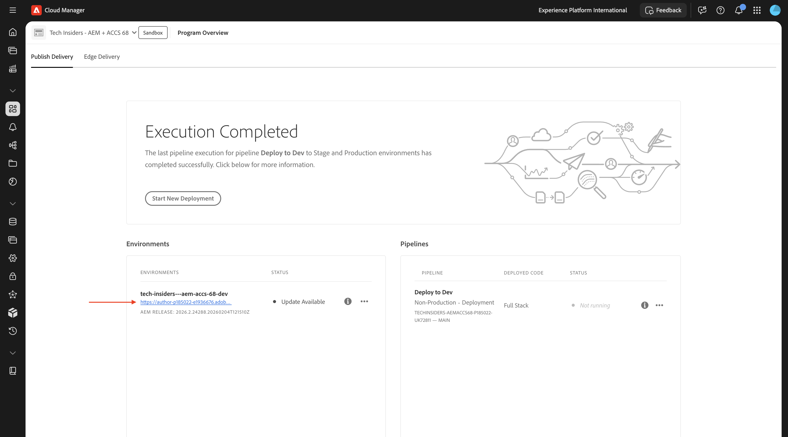
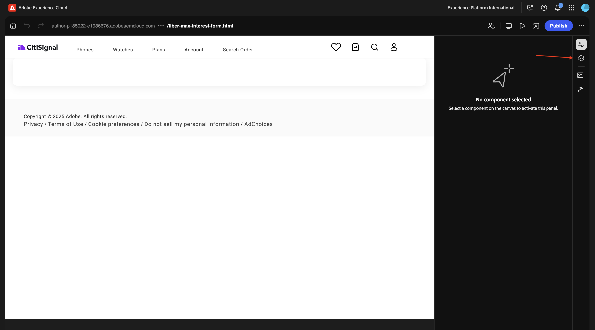
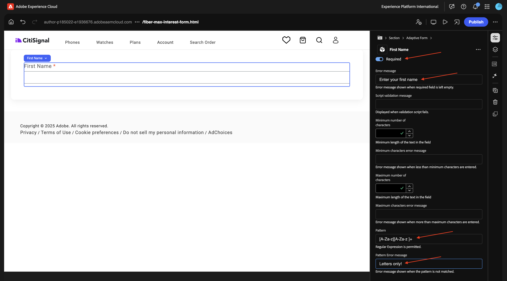
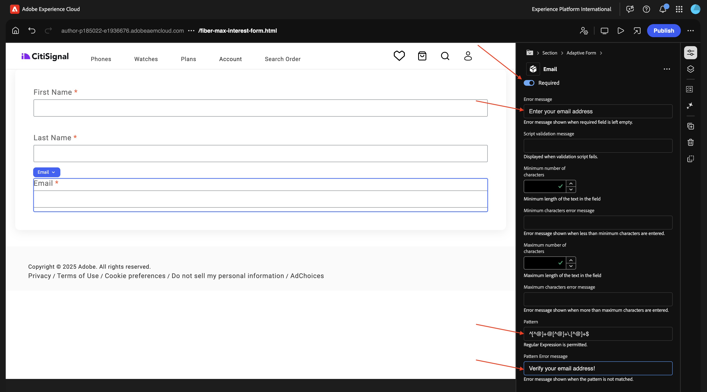
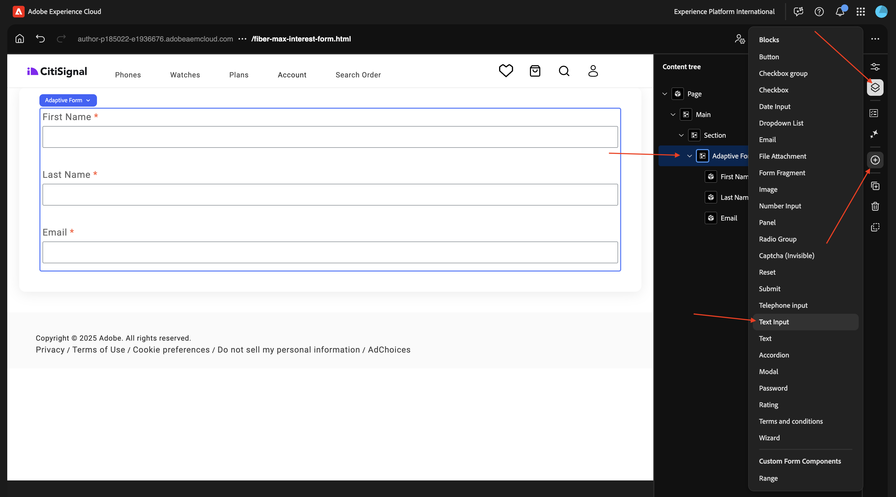
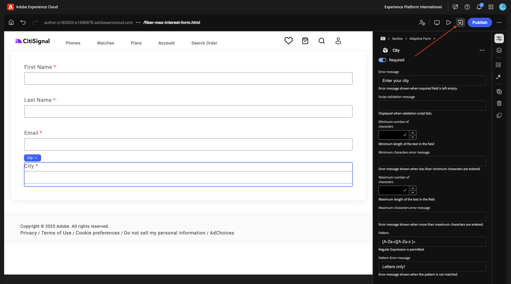

# 1.3.1 Het eerste formulier maken

>[!IMPORTANT]
>
>U hebt toegang nodig tot een werkende AEM Assets CS Author-omgeving met AEM Assets Dynamic Media ingeschakeld om deze oefening te kunnen voltooien.
>
>Als u zulk een milieu niet hebt, ga naar [&#x200B; Adobe Experience Manager Cloud Service &amp; Edge Delivery Services &#x200B;](./../../../modules/asset-mgmt/module2.1/aemcs.md){target="_blank"}. Volg de instructies daar, en u zult toegang tot zulk een milieu hebben.

>[!IMPORTANT]
>
>Als u eerder een AEM CS-programma hebt geconfigureerd met een AEM Assets CS-omgeving, kan het zijn dat de AEM CS-sandbox is geminimaliseerd. Gezien het feit dat het vernietigen van zo&#39;n zandbak 10 tot 15 minuten duurt, zou het een goed idee zijn om het ontruimingsproces nu te beginnen zodat u niet op een later tijdstip hoeft te wachten.

## 1.3.1.1 -

Ga naar [&#x200B; https://my.cloudmanager.adobe.com &#x200B;](https://my.cloudmanager.adobe.com){target="_blank"}. De org die u moet selecteren is `--aepImsOrgName--`. Open uw omgeving.

Ga naar **Forms**.

Ga naar **Forms &amp; Documenten**.

Klik **creëren** en selecteer dan **AanpassingsVorm**.

Selecteer **Edge Delivery Services** en selecteer dan **Lege Pagina**. Klik **creëren**.

Dan moet je dit zien. Vul de volgende velden in:

- **Titel**: `Fiber Max Interest Form`
- **Naam**: zou automatisch moeten worden bevolkt gebaseerd op het gebied **Titel**.
- **Github URL**: verstrek de weg aan de repo van Github die met uw website wordt verbonden

Klik **creëren**.

Na het klikken **creeer**, zou de **Universele Redacteur** automatisch moeten openen en u zou iets als dit moeten zien. Klik het pictogram om de **Boom van de Inhoud** te openen.

In de **Boom van de Inhoud**, selecteer de objecten **Aangepaste Vorm**.

Dan, klik het **+** pictogram om een nieuw element toe te voegen, en **tekstinput** te selecteren.

In de **Boom van de Inhoud**, selecteer de input van de gebied **Tekst**.

Ga naar de **Basis** mening. Je moet dit zien.

Vul de volgende velden in:

- **Naam**: `first-name`
- **Titel**: `First Name`

Dan, ga naar **Bevestiging**.

Draai de schakelaar om van dit een vereist gebied te maken. Vul de volgende velden in:

- **het bericht van de Fout**: `Enter your first name`
- **Patroon**: `[A-Za-z][A-Za-z ]+`
- **de foutenmelding van het Patroon**: `Letters only!`

In de **Boom van de Inhoud**, selecteer het gebied **Aangepaste Vorm**. Klik **+** pictogram en selecteer dan **tekstinput**.

In de **Boom van de Inhoud**, selecteer de pas gecreëerde gebied **Invoer van de Tekst**. Ga naar **Eigenschappen**.

Ga naar de **Basis** mening. Je moet dit zien.

Vul de volgende velden in:

- **Naam**: `last-name`
- **Titel**: `Last Name`

Dan, ga naar **Bevestiging**.

Draai de schakelaar om van dit een vereist gebied te maken. Vul de volgende velden in:

- **het bericht van de Fout**: `Enter your last name`
- **Patroon**: `[A-Za-z][A-Za-z ]+`
- **de foutenmelding van het Patroon**: `Letters only!`

In de **Boom van de Inhoud**, selecteer het gebied **Aangepaste Vorm**. Klik **+** pictogram en selecteer dan **tekstinput**.

In de **Boom van de Inhoud**, selecteer de pas gecreëerde gebied **Invoer van de Tekst**. Ga naar **Eigenschappen**.

Ga naar de **Basis** mening. Je moet dit zien.

Vul de volgende velden in:

- **Naam**: `email`
- **Titel**: `Email`

Dan, ga naar **Bevestiging**.

Draai de schakelaar om van dit een vereist gebied te maken. Vul de volgende velden in:

- **het bericht van de Fout**: `Enter your email address`
- **Patroon**: `^[^@]+@[^@]+\.[^@]+$`
- **de foutenmelding van het Patroon**: `Please verify your email address!`

In de **Boom van de Inhoud**, selecteer het gebied **Aangepaste Vorm**. Klik **+** pictogram en selecteer dan **tekstinput**.

In de **Boom van de Inhoud**, selecteer de pas gecreëerde gebied **Invoer van de Tekst**.

Ga naar de **Basis** mening. Je moet dit zien.

Vul de volgende velden in:

- **Naam**: `city`
- **Titel**: `city`

Dan, ga naar **Bevestiging**.

Draai de schakelaar om van dit een vereist gebied te maken. Vul de volgende velden in:

- **het bericht van de Fout**: `Enter your city`
- **Patroon**: `[A-Za-z][A-Za-z ]+`
- **de foutenmelding van het Patroon**: `Letters only!`

Klik **publiceren**.

Klik **publiceren** opnieuw.

Klik om het formulier te openen.

U kunt het formulier vervolgens invullen, maar u kunt het nog niet verzenden.

## Volgende stappen

Volgende stap: [&#x200B; -](./ex1.md){target="_blank"}

Ga terug naar [&#x200B; Adobe Experience Manager Forms met Edge Delivery Services &#x200B;](./aemforms.md){target="_blank"}

[&#x200B; ga terug naar Alle Modules &#x200B;](./../../../overview.md){target="_blank"}
