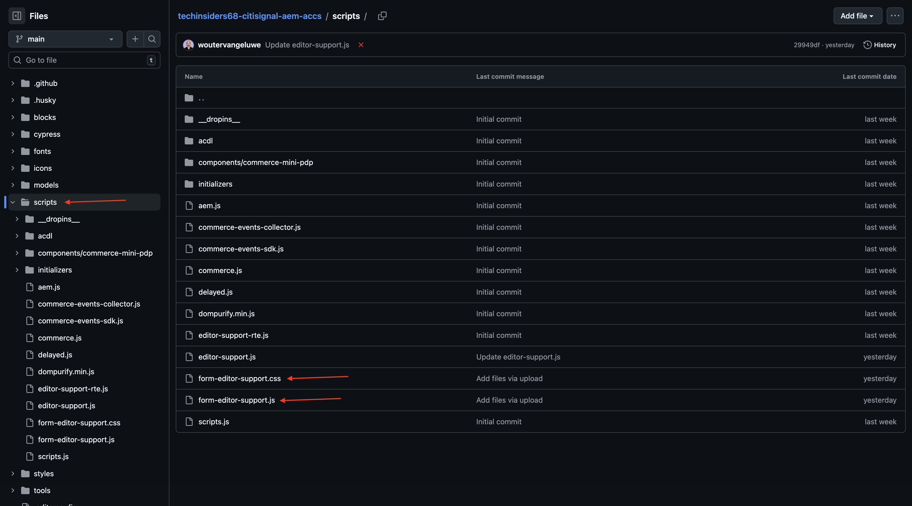
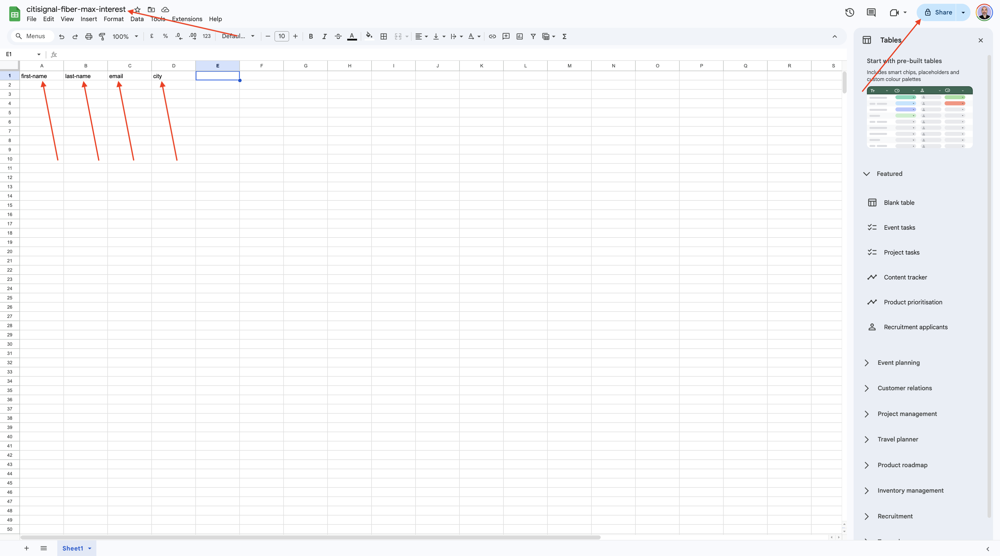
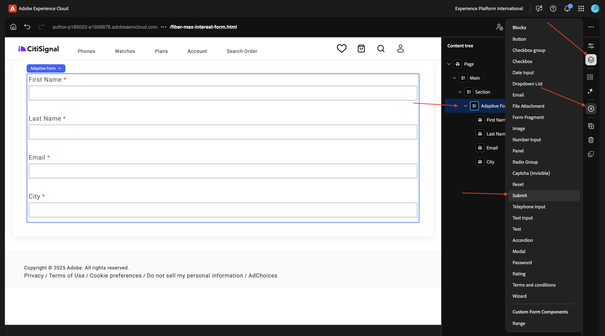

# 1.3.1 Het eerste formulier maken

>[!IMPORTANT]
>
>U hebt toegang nodig tot een werkende AEM Assets CS Author-omgeving met AEM Assets Dynamic Media ingeschakeld om deze oefening te kunnen voltooien.
>
>Als u zulk een milieu niet hebt, ga naar [&#x200B; Adobe Experience Manager Cloud Service &amp; Edge Delivery Services &#x200B;](./../../../modules/asset-mgmt/module2.1/aemcs.md){target="_blank"}. Volg de instructies daar, en u zult toegang tot zulk een milieu hebben.

>[!IMPORTANT]
>
>Als u eerder een AEM CS-programma hebt geconfigureerd met een AEM Assets CS-omgeving, kan het zijn dat de AEM CS-sandbox is geminimaliseerd. Gezien het feit dat het vernietigen van zo&#39;n zandbak 10 tot 15 minuten duurt, zou het een goed idee zijn om het ontruimingsproces nu te beginnen zodat u niet op een later tijdstip hoeft te wachten.

## 1.3.1.1 Milieuvereisten voor het gebruik van AEM Forms met Edge Delivery Services

Voordat u het eerste formulier configureert, moet u aan een aantal vereisten voldoen voordat u de onderstaande stappen kunt volgen.

### Programmainstelling

In de **Oplossingen &amp; toe:voegen-ons** van uw Programma van Cloud Manager, **Forms** moet worden toegelaten.


### blokken

In uw gegevensopslagruimte van Github, moet u de volgende beschikbare blokken hebben:

- **vorm**
- **bed-adaptive-form** in


### scripts

In uw gegevensopslagruimte van Github, moet u de volgende manuscripten beschikbaar hebben:

- **form-editor-support.css**
- **vorm-redacteur-support.js**



Bovendien, in het dossier **editor-support.js**, moeten de volgende veranderingen worden gedaan om het uitgeven van vormen in de Universele Redacteur toe te laten.

- veranderingsfunctiedeclaratie van **function attachEventListners (belangrijkste)** aan **async functie attachEventListners (belangrijkste)**
- de lijnen 152 en 153 worden toegevoegd:

```
const module = await import('./form-editor-support.js');
module.attachEventListners(main);
```


Ook, in het dossier **redacteur-support.js**, verander lijnen 90-92 als dit:

```
if (block.dataset.aueModel === 'form') {
        return true;
      } else if (newBlock) {
```


### paths.json

Gelieve te verifiëren uw configuratie van de Github repo, specifiek in het dossier **paths.json**. Deze regels moeten in het bestand aanwezig zijn:

- Onder toewijzingen: **&quot;/content/forms/af/:/forms/&quot;**
- Onder include: **&quot;/content/forms/af/&quot;**

```json
{
  "mappings": [
    "/content/CitiSignal/:/",
    "/content/CitiSignal/configuration:/.helix/config.json",
    "/content/CitiSignal/headers:/.helix/headers.json",
    "/content/CitiSignal/metadata:/metadata.json",
    "/content/CitiSignal.resource/enrichment/enrichment.json:/enrichment/enrichment.json",
    "/content/forms/af/:/forms/"
  ],
  "includes": [
    "/content/CitiSignal/",
    "/content/forms/af/"
  ]
}
```


Met deze vereisten kunt u het eerste formulier maken.

## 1.3.1.2 Formulier maken

Ga naar [&#x200B; https://my.cloudmanager.adobe.com &#x200B;](https://my.cloudmanager.adobe.com){target="_blank"}. De org die u moet selecteren is `--aepImsOrgName--`. Open uw omgeving.


Ga naar **Forms**.


Ga naar **Forms &amp; Documenten**.


Klik **creëren** en selecteer dan **AanpassingsVorm**.


Selecteer **Edge Delivery Services** en selecteer dan **Lege Pagina**. Klik **creëren**.


Dan moet je dit zien. Vul de volgende velden in:

- **Titel**: `Fiber Max Interest Form`
- **Naam**: zou automatisch moeten worden bevolkt gebaseerd op het gebied **Titel**.
- **Github URL**: verstrek de weg aan de repo van Github die met uw website wordt verbonden

Klik **creëren**.


Na het klikken **creeer**, zou de **Universele Redacteur** automatisch moeten openen en u zou iets als dit moeten zien. Klik het pictogram om de **Boom van de Inhoud** te openen.


In de **Boom van de Inhoud**, selecteer de objecten **Aangepaste Vorm**.


Dan, klik het **+** pictogram om een nieuw element toe te voegen, en **tekstinput** te selecteren.


In de **Boom van de Inhoud**, selecteer de input van de gebied **Tekst**.


Ga naar de **Basis** mening. Je moet dit zien.

Vul de volgende velden in:

- **Naam**: `first-name`
- **Titel**: `First Name`

Dan, ga naar **Bevestiging**.


Draai de schakelaar om van dit een vereist gebied te maken. Vul de volgende velden in:

- **het bericht van de Fout**: `Enter your first name`
- **Patroon**: `[A-Za-z][A-Za-z ]+`
- **de foutenmelding van het Patroon**: `Letters only!`


In de **Boom van de Inhoud**, selecteer het gebied **Aangepaste Vorm**. Klik **+** pictogram en selecteer dan **tekstinput**.


In de **Boom van de Inhoud**, selecteer de pas gecreëerde gebied **Invoer van de Tekst**. Ga naar **Eigenschappen**.


Ga naar de **Basis** mening. Je moet dit zien.

Vul de volgende velden in:

- **Naam**: `last-name`
- **Titel**: `Last Name`

Dan, ga naar **Bevestiging**.


Draai de schakelaar om van dit een vereist gebied te maken. Vul de volgende velden in:

- **het bericht van de Fout**: `Enter your last name`
- **Patroon**: `[A-Za-z][A-Za-z ]+`
- **de foutenmelding van het Patroon**: `Letters only!`


In de **Boom van de Inhoud**, selecteer het gebied **Aangepaste Vorm**. Klik **+** pictogram en selecteer dan **tekstinput**.


In de **Boom van de Inhoud**, selecteer de pas gecreëerde gebied **Invoer van de Tekst**. Ga naar **Eigenschappen**.


Ga naar de **Basis** mening. Je moet dit zien.

Vul de volgende velden in:

- **Naam**: `email`
- **Titel**: `Email`

Dan, ga naar **Bevestiging**.


Draai de schakelaar om van dit een vereist gebied te maken. Vul de volgende velden in:

- **het bericht van de Fout**: `Enter your email address`
- **Patroon**: `^[^@]+@[^@]+\.[^@]+$`
- **de foutenmelding van het Patroon**: `Please verify your email address!`


In de **Boom van de Inhoud**, selecteer het gebied **Aangepaste Vorm**. Klik **+** pictogram en selecteer dan **tekstinput**.


In de **Boom van de Inhoud**, selecteer de pas gecreëerde gebied **Invoer van de Tekst**.


Ga naar de **Basis** mening. Je moet dit zien.

Vul de volgende velden in:

- **Naam**: `city`
- **Titel**: `city`

Dan, ga naar **Bevestiging**.


Draai de schakelaar om van dit een vereist gebied te maken. Vul de volgende velden in:

- **het bericht van de Fout**: `Enter your city`
- **Patroon**: `[A-Za-z][A-Za-z ]+`
- **de foutenmelding van het Patroon**: `Letters only!`


Klik **publiceren**.


Klik **publiceren** opnieuw.


Klik om het formulier te openen.


U kunt het formulier vervolgens invullen, maar u kunt het nog niet verzenden.


Nadat u het formulier hebt gepubliceerd, is het nu ook beschikbaar op uw Edge Delivery Services-domein, dat er als volgt uitziet:

`https://main--techinsidersXX-citisignal-aem-accs--woutervangeluwe.aem.page/forms/fiber-max-interest-form`


## 1.3.1.3 Formulier verzenden

Voor het verzenden van uw formulier zijn twee dingen vereist:

- a **legt** knoop voor
- a **legt** actie voor

In deze exercitie moet u ook een Google-spreadsheet gebruiken om verzendingen van dit formulier te registreren.

### Google-spreadsheet

Ga naar [&#x200B; https://drive.google.com &#x200B;](https://drive.google.com) en creeer een nieuw leeg spreadsheet.


Geef het bestand een naam `citisignal-fiber-max-interest` .

Voer in regel 1 in de cellen A-B-C-D de volgende veldnamen in:

- first-name
- lastName
- email
- stad

Dan, klik **Aandeel**.



Deel het dossier met **forms@adobe.com** met **de toegangsrechten van de Redacteur** op niveau.

Dan, klik **verbinding van het Exemplaar**.

Klik **verzenden**.


In de volgende stap moet u de gekopieerde koppeling gebruiken.

### Verzenden, knop

Om **te vormen leg** knoop voor, ga naar **de boom van de Inhoud**, selecteer **Aangepaste Vorm**, klik **+** pictogram en selecteer dan **voorleggen**.



Dan moet je dit zien.


### Handeling verzenden

Verzendacties maken deel uit van een extensie voor de universele editor.

>[!NOTE]
>
>Als u niet **ziet geef de Eigenschappen van de Vorm** pictogram uit, betekent het dat deze uitbreiding nog niet voor uw milieu wordt toegelaten. Om deze uitbreiding toe te laten, ga [&#x200B; https://experience.adobe.com/#/aem/extension-manager &#x200B;](https://experience.adobe.com/#/aem/extension-manager) en laat **toe geef de uitbreiding van de Eigenschappen van de Vorm** uit.
>
>

Klik het **uitgeven de Eigenschappen van de Vorm** pictogram.


Selecteer **voorleggen aan Spreadsheet**. Plak de URL van het Google-werkblad dat u eerder hebt gemaakt.

Klik **sparen &amp; Sluiten**.


>[!NOTE]
>
>Als u een fout 401 ontvangt - Ongeautoriseerd, kan het zijn. omdat uw omgeving niet is ingeschakeld voor gebruik met Google Sheets. Neem contact op met uw Adobe-vertegenwoordiger om uw omgeving in te schakelen.

Klik **publiceren**.


Klik **publiceren** opnieuw.


U kunt uw plaats dan verfrissen, de vormen invullen en **klikken voorleggen**.


Uw verzending moet dan succesvol zijn.


Als je je Google-pagina dan bekijkt, kun je ook de succesvolle inzending zien.


U hebt deze oefening nu met succes voltooid.

## Volgende stappen

Ga terug naar [&#x200B; Adobe Experience Manager Forms met Edge Delivery Services &#x200B;](./aemforms.md){target="_blank"}

[&#x200B; ga terug naar Alle Modules &#x200B;](./../../../overview.md){target="_blank"}
