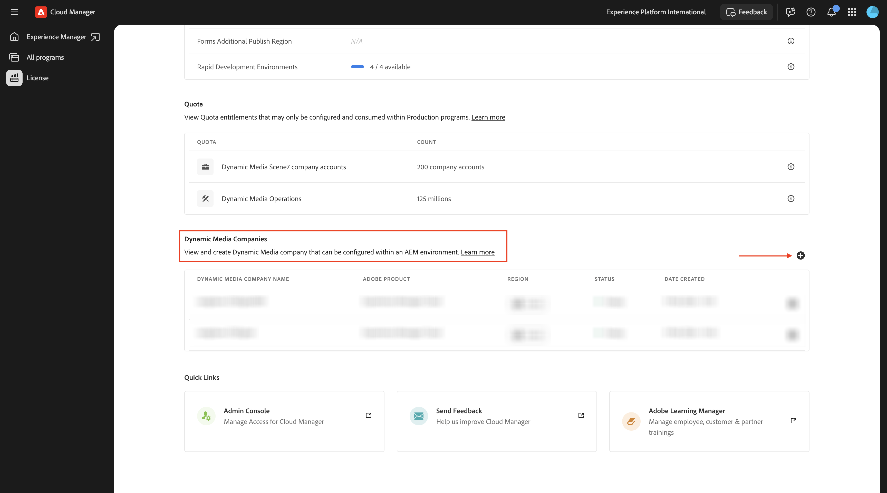
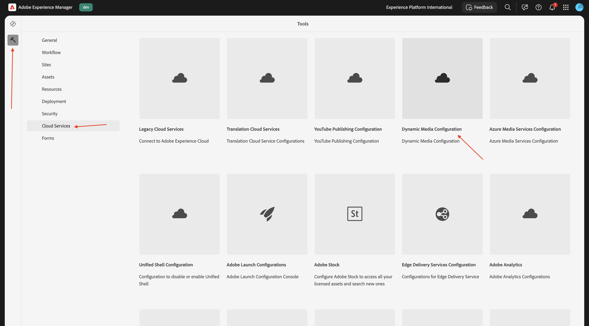
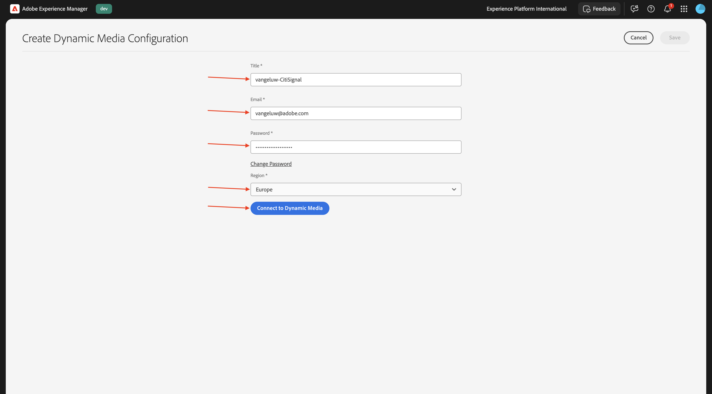
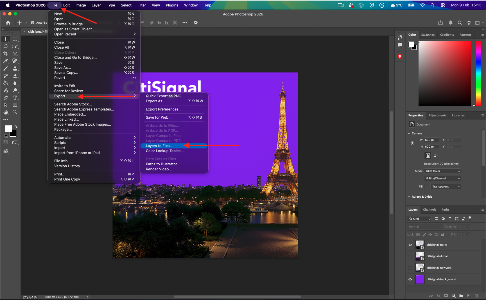
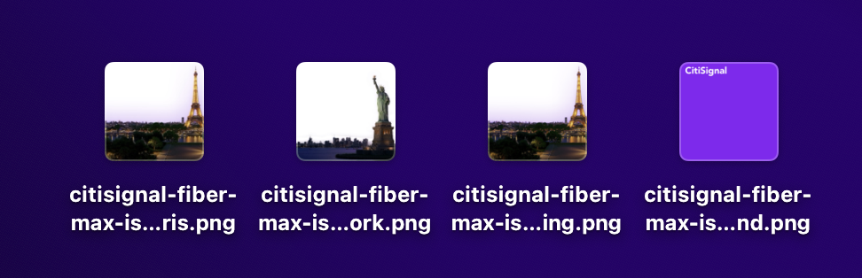
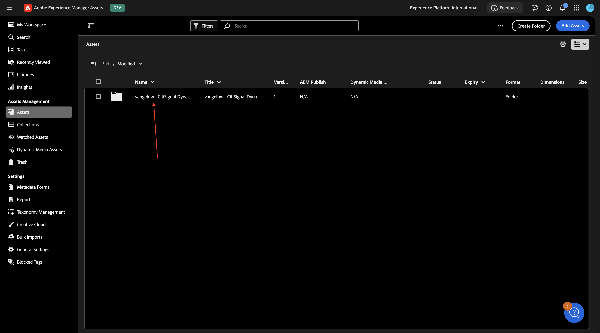
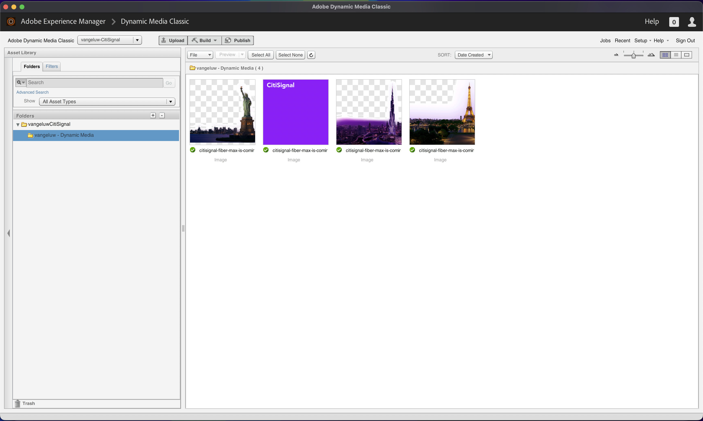
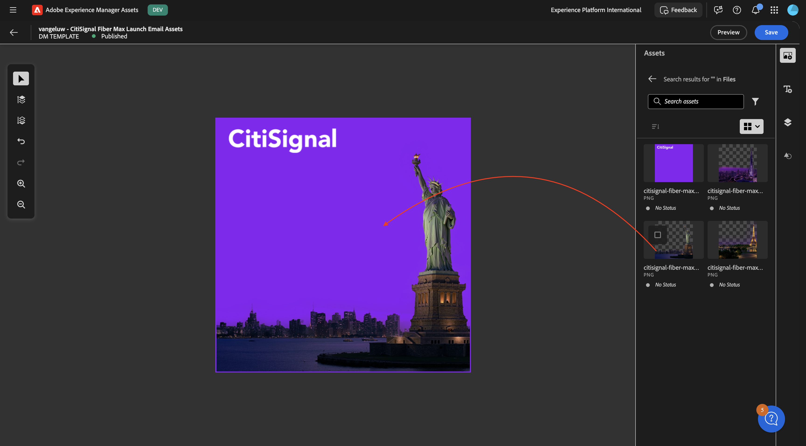
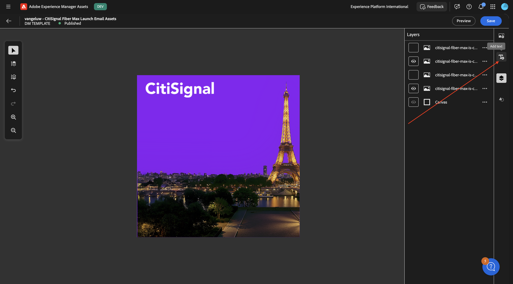

# 1.4.1 Uw elementen en dynamische mediasjablonen maken

>[!IMPORTANT]
>
>U hebt toegang nodig tot een werkende AEM Assets CS Author-omgeving met AEM Assets Dynamic Media ingeschakeld om deze oefening te kunnen voltooien.
>
>Als u zulk een milieu niet hebt, ga naar [ Adobe Experience Manager Cloud Service &amp; Edge Delivery Services ](./../../../modules/asset-mgmt/module2.1/aemcs.md){target="_blank"}. Volg de instructies daar, en u zult toegang tot zulk een milieu hebben.

>[!IMPORTANT]
>
>Als u eerder een AEM CS-programma hebt geconfigureerd met een AEM Assets CS-omgeving, kan het zijn dat de AEM CS-sandbox is geminimaliseerd. Gezien het feit dat het vernietigen van zo&#39;n zandbak 10 tot 15 minuten duurt, zou het een goed idee zijn om het ontruimingsproces nu te beginnen zodat u niet op een later tijdstip hoeft te wachten.

## 1.4.1.1 Uw Dynamic Media-bedrijf maken

Ga naar [ https://my.cloudmanager.adobe.com ](https://my.cloudmanager.adobe.com){target="_blank"}. De org die u moet selecteren is `--aepImsOrgName--`.

De rol neer aan **Dynamische Bedrijven van Media**. Klik op het pictogram **+** om een nieuw Dynamic Media Company te maken.

Voer de volgende gegevens in:

- **Bedrijfsnaam**: `--aepUserLdap---CitiSignal`.
- **gebied van het Bedrijf**: selecteer het gebied dat aan u het dichtst is.
- **Bedrijfs admin e-mails**: ga uw admin e-mail in.

Klik **creëren**.

Dan moet je dit zien.

U ontvangt nu een e-mail zoals hieronder, die uw tijdelijk wachtwoord bevat. Om uw wachtwoord te veranderen, of het terug te winnen voor het geval u geen e-mail ontving, zou u **Adobe Dynamic Media Classic Desktop app** moeten installeren. U kunt installatieinstructies hier vinden: [ https://experienceleague.adobe.com/en/docs/dynamic-media-classic/using/intro/dynamic-media-classic-desktop-app ](https://experienceleague.adobe.com/en/docs/dynamic-media-classic/using/intro/dynamic-media-classic-desktop-app).

Volg de instructies hier en kom hier terug zodra de app op uw systeem is geïnstalleerd.

Open de **Desktopapp van Adobe Dynamic Media Classic**. Als u het wachtwoord kent, voert u dit hier in en volgt u de instructies om het wachtwoord bij de eerste aanmelding te wijzigen.

Als u uw wachtwoord niet kent, klik **vergeten uw wachtwoord** verbinding en volg de instructie om uw wachtwoord terug te stellen, dan hier terug te komen en binnen te registreren.

Na succesvolle login, zou u een scherm gelijkend op dit moeten zien.

## 1.4.1.2 Dynamische media configureren in AEM

Ga naar [ https://my.cloudmanager.adobe.com ](https://my.cloudmanager.adobe.com){target="_blank"}. De org die u moet selecteren is `--aepImsOrgName--`.

Klik hierop om het Cloud Manager-programma te openen. Dit wordt `--aepUserLdap-- - CitiSignal AEM+ACCS` genoemd.

Klik op uw omgeving.

Klik op de URL van de omgeving.

Ga naar **Hulpmiddelen**, naar **de Diensten van de Wolk** en dan naar **Dynamische Configuratie van Media**.

Selecteer **Globaal** (controleer niet checkbox), en klik dan **creeer**.

Voer de volgende gegevens in:

- **Titel**: gebruik deze titel: `--aepUserLdap-- - CitiSignal`.
- **E-mail**: ga uw e-mailadres in.
- **Wachtwoord**: ga uw Dynamisch de rekeningswachtwoord van Media in
- **Gebied**: selecteer het gebied dat u wanneer het creëren van uw Dynamisch bedrijf van Media, in dit voorbeeld, **Europa** koos.

Klik **verbinden met Dynamische Media**.

Dan moet je dit zien. Configureer het volgende:

- Selecteer het **Bedrijf**: `--aepUserLdap-- - CitiSignal`.
- Plaats **publiceer Assets** aan **Onmiddellijk**.
- Controle checkbox aan **synchroniseer alle inhoud**.

Klik **sparen**.

De configuratie van DYnamic Media is nu voltooid. Klik **OK**.

## 1.4.1.3 Uw elementen exporteren

Download dit dossier [ burgerschap-vezel-max-is-coming.psd ](./assets/citisignal-fiber-max-is-coming.psd){target="_blank"} en open het met Adobe Photoshop.

Dan moet je dit zien. CitiSignal plant een uitrol van Fiber Max in drie steden: New York, Parijs en Dubai.

Door specifieke lagen weer te geven of te verbergen, kunt u de afbeelding weergeven die door de ontwerpers is gemaakt.

Hieronder vindt u de instructies voor het exporteren van de afbeeldingsbestanden uit de Photoshop PSD-sjabloon. Als u verkiest, kunt u de gebeëindigde beelden hier ook downloaden [ burgerschap-dm-email-assets.zip ](./assets/citisignal-dm-email-assets.zip){target="_blank"} en het dossier op uw Desktop openen.

Dit is de versie voor New York.

Dit is de versie voor Dubai.

Dit is de versie voor Parijs.

Er zullen mogelijk nog veel andere steden zijn waar CitiSignal in de toekomst de Fiber Max-versie van start zal gaan. Er kunnen nieuwe lagen in dit bestand worden gemaakt. Voorlopig ligt de nadruk op de drie steden die al genoemd zijn.

Als u deze variaties wilt gebruiken in combinatie met AEM Assets Dynamic Media, moeten de lagen voor elke stad worden geëxporteerd als afbeeldingen. Om dat te doen, ga naar **Dossier** > **Uitvoer** > **Lagen aan Dossiers...**.

Dan moet je iets dergelijks zien. Selecteer een plaats om de dossiers naar uit te voeren, het dossiertype **PNG-8** te selecteren en **te klikken in werking stelt**.

Na een paar seconden moet je dit zien. Klik **OK**.

Deze bestanden moeten vervolgens beschikbaar zijn op de exportlocatie die u hebt geselecteerd.

## 1.4.1.4 Uw elementen uploaden naar AEM Assets CS

Ga naar [ https://experience.adobe.com/ ](https://experience.adobe.com/){target="_blank"}. Ga naar **Experience Manager Assets**.

Selecteer de opslagplaats met de naam `--aepUserLdap-- - CitiSignal AEM + ACCS` .

Ga naar **Assets** en klik dan **creeer Omslag**.

Gebruik voor de map de naam: `--aepUserLdap-- - CitiSignal Dynamic Media` . Klik **creëren**.

Dubbelklik om de map te openen die u net hebt gemaakt.

Klik **toevoegen Assets**.

Klik **doorbladeren** en selecteer dan **doorbladeren Dossiers**.

Selecteer de 4 PNG-bestanden die u in de vorige stap hebt geëxporteerd.

Klik **uploaden**.

Uw afbeeldingen zijn nu beschikbaar in AEM Assets CS.

Wacht een paar notulen en open dan de **Desktopapp van Adobe Dynamic Media Classic**, zou u ook de geuploade beelden moeten nu zien beschikbaar binnen Dynamische Media worden.

## 1.4.1.5 Dynamische mediasjabloon configureren

In het linkermenu, ga naar **Dynamische Media Assets**. Klik om de map te openen `--aepUserLdap-- - CitiSignal Dynamic Media` . Dan, klik **creeer Malplaatje**.

Voer de volgende gegevens in:

- **Naam van het Malplaatje**: `--aepUserLdap-- - CitiSignal Fiber Max Launch Email Assets`
- **de Breedte van het Canvas**: `600px`
- **Hoogte van Canvas**: `600px`

Klik **creëren**.

Dan moet je dit zien. Klik **voeg het pictogram van het Beeld** toe.

Sleep het dossier **burgerschap-fiber-max-is-coming_Citisignaal-background.png** op het canvas en maak het het canvas passen.

Daarna, sleep het dossier **burgerschap-vezel-max-is-coming_Citisignaal-newyork.png** op het canvas en maak het het canvas passen.

Daarna, sleep het dossier **burgerschap-vezel-max-is-coming_Citisignaal-dubai.png** op het canvas en maak het het canvas passen.

Daarna, sleep het dossier **burgerschap-vezel-max-is-coming_Citisignaal-paris.png** op het canvas en maak het het canvas passen.

U hebt nu alle drie variaties in de sjabloon als afzonderlijke lagen tegelijk. U kunt specifieke lagen tonen/verbergen door het **lagen** pictogram te klikken, waar u ziet dat alle lagen momenteel zichtbaar zijn.

Door een aantal lagen te verbergen, kunt u bepalen hoe het beeld eruit ziet. In dit voorbeeld, slechts is de laag voor **Parijs** en de achtergrondlaag zichtbaar.

Vervolgens moet u een tekstlaag toevoegen. Klik het **pictogram van de tekstlaag**.

Dan moet je dit zien.

Voel u vrij om het tekstveld aan te passen op de manier die u nodig acht, hier is een voorbeeld. Vergeet niet om de optie **Slimme Tekst toe te laten vergroot** zodat de echte tekst die in een recentere fase wordt opgenomen fijn zal kijken.

Voeg een tweede tekstlaag toe en zorg ervoor dat deze er zo uitziet. Vergeet niet om de optie **Slimme Tekst toe te laten vergroot** zodat de echte tekst die in een recentere fase wordt opgenomen fijn zal kijken.

Selecteer de eerste tekstlaag. Klik de 3 punten **..** en selecteer dan **uitgeven**.

Dan moet je dit zien. Omlaag schuiven.

Klik het **schakelaar** pictogram zodat de gebied **Tekst** wordt toegelaten. Verander de **Naam van de Parameter** in `title`.

Selecteer de tweede tekstlaag. Klik de 3 punten **..** en selecteer dan **uitgeven**.

Dan moet je dit zien. Omlaag schuiven.

Klik het **schakelaar** pictogram zodat de gebied **Tekst** wordt toegelaten. Verander de **Naam van de Parameter** in `body`.

Selecteer de laag voor **Parijs**. Klik de 3 punten **..** en klik **uitgeven**.

Ga naar **Paramaters**. Laat het gebied **toe Verbergen** en ga de **Naam van de Parameter** in: `city_paris`. Klik **sparen**.

Selecteer de laag voor **Dubai**. Klik de 3 punten **..** en klik **uitgeven**.

Ga naar **Paramaters**. Laat het gebied **toe Verbergen** en ga de **Naam van de Parameter** in: `city_dubai`. Klik **sparen**.

Selecteer de laag voor **New York**. Klik de 3 punten **..** en klik **uitgeven**.

Ga naar **Paramaters**. Laat het gebied **toe Verbergen** en ga de **Naam van de Parameter** in: `city_ny`. Klik **sparen**.

Klik **Voorproef**.

Laat de schakelaar voor **toe omvat alle parameters** en verandert sommige inputvariabelen zoals die in het schermschot worden vermeld. De afbeelding wordt dynamisch gewijzigd op basis van de ingevoerde gegevens. Voor de gebieden **city_paris**, **city_dubai** en **city_ny**, betekent een waarde van 0 dat dit beeld NIET zal worden verborgen en een waarde van 1 betekent dit beeld zal worden verborgen.

Door sommige variabelen te wijzigen, wordt nu een andere afbeelding weergegeven.

Als u meer variabelen wijzigt, wordt nu een andere afbeelding weergegeven.

Uw sjabloon Dynamische media is nu geconfigureerd. In de volgende oefening, zult u dat malplaatje in combinatie met een e-mailcampagne in Adobe Journey Optimizer gebruiken.

## Volgende stappen

Volgende Stap: [ gebruik uw dynamisch media malplaatje met Adobe Journey Optimizer ](./ex2.md){target="_blank"}

Ga terug naar [ Adobe Experience Manager Assets &amp; Dynamische Media ](./aemassetsdm.md){target="_blank"}

[ ga terug naar Alle Modules ](./../../../overview.md){target="_blank"}
