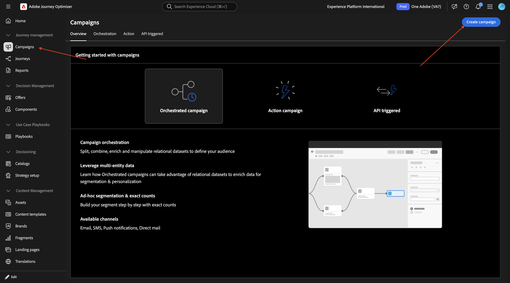
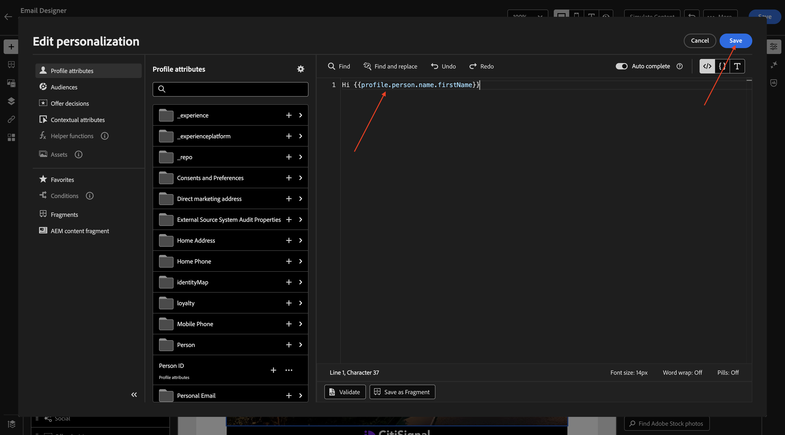
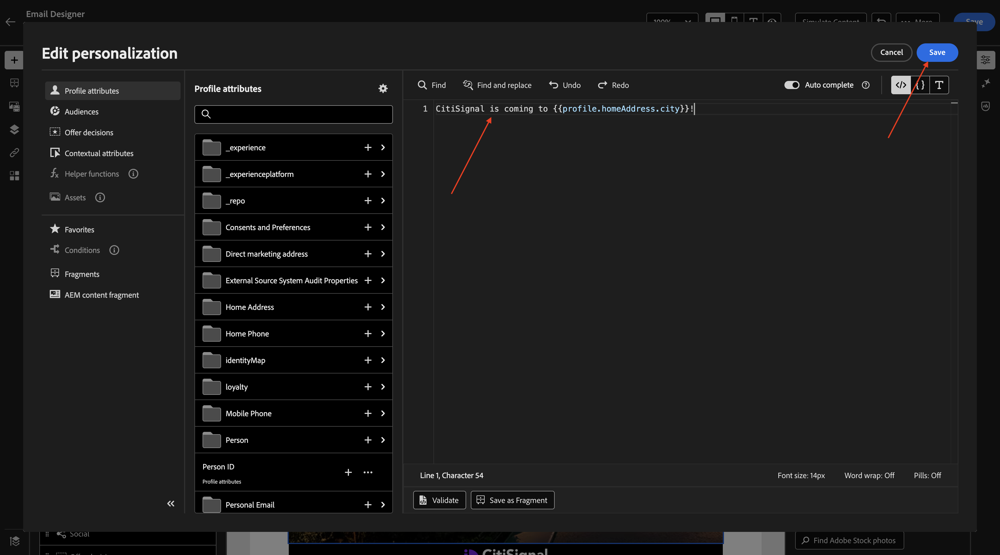
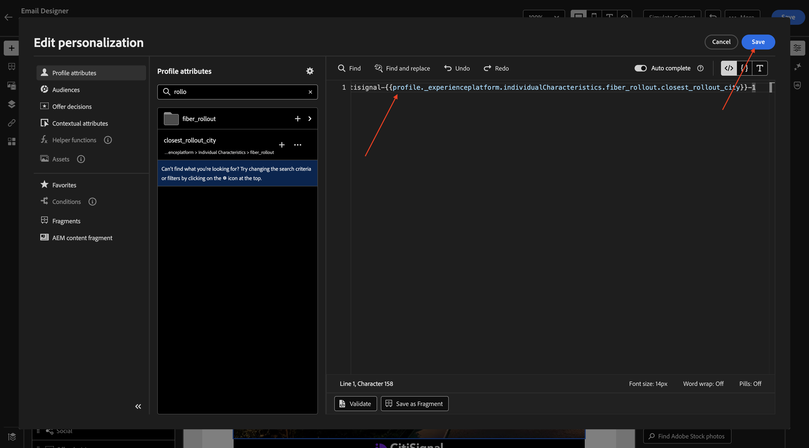
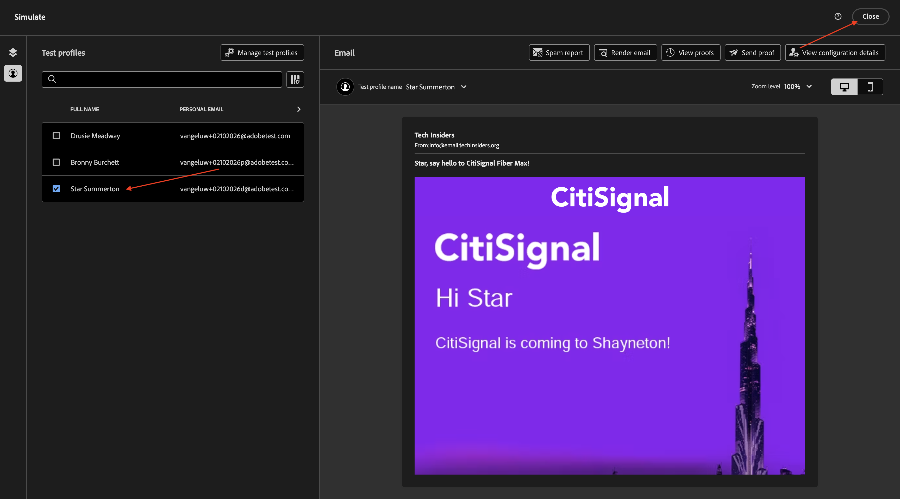

# 1.4.2 Gebruik uw dynamische mediasjabloon met Adobe Journey Optimizer

## 1.4.2.1 Uw campagne maken in Adobe Journey Optimizer

Login aan Adobe Journey Optimizer door naar [ Adobe Experience Cloud ](https://experience.adobe.com) te gaan. Klik **Journey Optimizer**.


U zult aan de **1} mening van het Huis {in Journey Optimizer worden opnieuw gericht.** Eerst, zorg ervoor u de correcte zandbak gebruikt. De sandbox die moet worden gebruikt, wordt `--aepSandboxName--` genoemd. U zult dan in de **1} mening van het Huis {van uw zandbak** zijn.`--aepSandboxName--`


U maakt nu een campagne. In tegenstelling tot de op een gebeurtenis gebaseerde reis van de vorige oefening die op inkomende ervaringsgebeurtenissen of publieksingangen of uitgang baseert om een reis voor één specifieke klant teweeg te brengen, richten de campagnes één keer een heel publiek met unieke inhoud zoals nieuwsbrieven, eenmalige bevorderingen, of generische informatie of periodiek met gelijkaardige inhoud die op een regelmatige basis wordt verzonden zoals bijvoorbeeld verjaardagscampagnes en herinneringen.

In het menu, ga naar **Campagnes** en klik **creeer campagne**.



Selecteer **Gepland - Op de markt brengend** en klik **creeer**.


Voor het scherm van de campagneverwezenlijking, vorm het volgende:

- **Naam**: `--aepUserLdap-- - CitiSignal Fiber Max DM Email Campaign`.

Klik **Acties**.


Klik **+ voeg Actie** toe en selecteer dan **E-mail**.


Dan, selecteer een bestaande **E-mailconfiguratie** en klik dan **uitgeven inhoud**.


Dan zie je dit. Voor de **lijn van het Onderwerp**, gebruik dit:

```
{{profile.person.name.firstName}}, say hello to CitiSignal Fiber Max!
```

Daarna, klik **uitgeven inhoud**.


Selecteer **Ontwerp van kras**.


Dan moet je dit zien.


Voeg 2x **1 :1 kolom** aan het canvas toe.


Ga naar **Fragmenten**, sleep het **kopbal** fragment aan de eerste 1 :1 kolom en sleep dan het **footer** fragment aan de tweede 1 :1 kolom.


Voeg een nieuwe 1 :1 kolom binnen tussen de 2 fragmenten toe, en voeg dan een **Beeld** in die 1 :1 kolom toe. Dan, klik **doorbladeren**.


Navigeer naar de map waarin u de sjabloon Dynamische media hebt opgeslagen. Selecteer uw Dynamische malplaatje van Media en klik dan **Uitgezocht**.


Dan moet je dit zien. Ook jij. merk de **PARAMETERS** op die u toestaan om de parameters van het dynamische media malplaatje te veranderen.


## 1.4.2.2 De sjabloon voor dynamische media aanpassen

Zoals in de vorige oefening is besproken, moet AJO nu dynamisch beslissen welke waarden deel moeten uitmaken van de Dynamic Media-sjabloon.

Enkel als in de **stap van de Voorproef** in de vorige oefening, zouden de gebieden **city_paris**, **city_dubai** en **city_ny**, aan 1 moeten worden geplaatst wat betekent dat deze beelden zullen worden verborgen.

Voor het gebied **titel**, klik het verpersoonlijkingspictogram.


Vervang de standaardtekst door: `Hi {{profile.person.name.firstName}}`. Klik **sparen**.



Voor het gebied **lichaam**, klik het verpersoonlijkingspictogram.


Vervang de standaardtekst door: `CitiSignal is coming to {{profile.homeAddress.city}}!`. Klik **sparen**.



Zorg ervoor dat het veld **`dynamic_city_hide`** is ingesteld op 0. Klik op het verpersoonlijkingspictogram voor het veld **`dynamic_city_image`** .


Vervang de standaardtekst door: `--aepUserLdap--CitiSignalDM/citisignal-fiber-max-is-coming_citisignal-{{profile._experienceplatform.individualCharacteristics.fiber_rollout.closest_rollout_city}}-1`. Klik **sparen**.



Dan moet je dit zien. De afbeelding wordt hier niet meer weergegeven, wat wordt verwacht omdat de dynamische variabelen niet beschikbaar zijn in de context van de e-maileditor.

Klik **sparen**.


Bovenste test uw configuratie, klik **Simuleer Inhoud** en selecteer dan **Inhoud** simuleren.


Dan moet je iets dergelijks zien. Als u geen beschikbare testprofielen hebt, kunt u hen toevoegen door **te gaan testprofielen beheren**.

Als er testprofielen beschikbaar zijn die de gegevens bevatten die nodig zijn om dit gebruik te testen, kunt u van het ene naar het andere profiel overschakelen om te zien hoe de wijzigingen dynamisch plaatsvinden.

Hier is een profiel dat is gekoppeld aan de oprollingsstad New York.


Hier is een profiel dat is gekoppeld aan de rollout city Paris.


Hier is een profiel dat is gekoppeld aan de rollout city Dubai.

Klik **dicht**.



Je hebt deze oefening nu afgerond. U hoeft uw e-mailcampagne niet te publiceren.

## Volgende stappen

Ga terug naar [ Adobe Experience Manager Assets &amp; Dynamische Media ](./aemassetsdm.md){target="_blank"}

[ ga terug naar Alle Modules ](./../../../overview.md){target="_blank"}