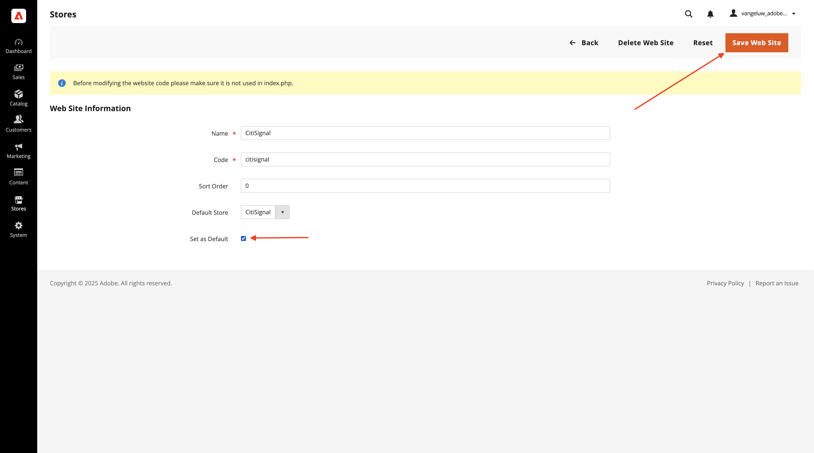
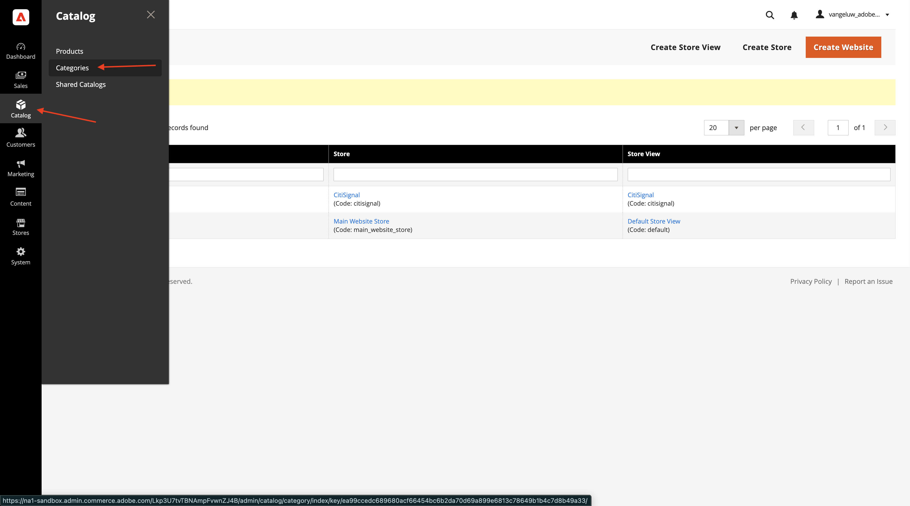
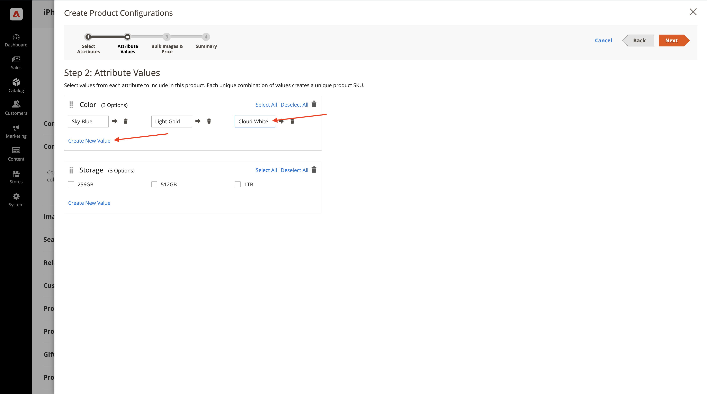

# 1.5.1 Aan de slag met Adobe Commerce as a Cloud Service

Ga naar [ https://experience.adobe.com/ ](https://experience.adobe.com/){target="_blank"}. Zorg ervoor dat u zich in de juiste omgeving bevindt, die u `--aepImsOrgName--` moet noemen. Klik **Commerce**.

## 1.5.1.1 Een ACCS-instantie maken

Dan moet je dit zien. Klik op **+ Exemplaar toevoegen** .

Vul de velden als volgt in:

- **Naam van de Instantie**: `--aepUserLdap-- - ACCS`
- **Milieu**: `Sandbox`
- **Gebied**: `North America`

Klik **toevoegen instantie**.

U wordt nu gemaakt. Dit kan 5-10 minuten duren.

Wanneer de instantie gereed is, klikt u op de instantie om deze te openen.

## 1.5.1.2 Uw CitiSignal-winkel instellen

Dan moet je dit zien. Klik **binnen Teken met Adobe ID** en dan login.

Nadat u zich hebt aangemeld, kunt u deze startpagina beter zien. De eerste stap is het opzetten van uw CitiSignal-winkel in Commerce. Klik **Opslag**.

Klik **Alle opslag**.

Klik **creëren Website**.

Vul de velden als volgt in:

- **Naam**: `CitiSignal`
- **Code**: `citisignal`

Klik **sparen Website**.

Dan moet je hier weer zijn. Klik **creeer Opslag**.

Vul de velden als volgt in:

- **Website**: `CitiSignal`
- **Naam**: `CitiSignal`
- **Code**: `citisignal`
- **Categorie van de Wortel**: `Default Category`

Klik **sparen Opslag**.

Dan moet je hier weer zijn. Klik **creëren de Mening van de Opslag**.

Vul de velden als volgt in:

- **Opslag**: `CitiSignal`
- **Naam**: `CitiSignal`
- **Code**: `citisignal`
- **Status**: `Enabled`

Klik **sparen Mening van de Opslag**.

Dan zie je dit bericht. Klik **OK**.

Dan moet je hier weer zijn. Klik de **CitiSignal** website om het te openen.

Schakel het selectievakje in om deze website in te stellen als de standaardwebsite.

Klik **sparen Website**.

Dan moet je hier weer zijn.

## 1.5.1.3 Categorieën en producten configureren

Ga naar **Catalogus** en selecteer dan **Categorieën**.

Selecteer **StandaardCategorie** en klik dan **Subcategorie** toevoegen.

Ga de naam `Phones` in en klik dan **sparen**.

Selecteer **StandaardCategorie** en klik dan **Subcategorie** opnieuw toevoegen.

Ga de naam `Watches` in en klik dan **sparen**.

Er moeten dan twee rubrieken worden gemaakt.

Daarna, ga naar **Catalogus** en selecteer dan **Producten**.

Dan moet je dit zien. Klik **toevoegen Product**.

Configureer uw product als volgt:

- **Naam van het Product**: `iPhone Air`
- **SKU**: `iPhone-Air`
- **Prijs**: `999`
- **Hoeveelheid**: `10000`
- **Categorieën**: uitgezochte `Phones`

Klik **sparen**.

De rol neer aan **Configuraties** en klikt **leidt Configuraties**.

Dan moet je dit zien. Klik **creëren Nieuw Attribuut**.

Plaats het **StandaardEtiket** aan `Storage` en klik dan **Optie** toevoegen onder **beheert Opties**.

Vorm de eerste optie gebruikend de naam `256GB` in alle 3 kolommen, en klik dan **voeg Optie** opnieuw toe.

Vorm de tweede optie gebruikend de naam `512GB` in alle 3 kolommen, en klik dan **voeg Optie** opnieuw toe.

Configureer de derde optie met de naam `1TB` in alle 3 kolommen.

De rol neer aan **Eigenschappen Storefront**. Plaats de volgende opties aan **ja**:

- **Gebruik in Onderzoek**
- **staat de Markeringen van HTML op Storefront toe**
- **Zichtbaar op de Pagina&#39;s van de Catalogus op Storefront**
- **Gebruik in de Lijst van het Product**

De rol omhoog en klikt **sparen Attribuut**.

Dan moet je dit zien. Selecteer beide attributen voor **kleur** en **opslag** en klik **daarna**.

Dan moet je dit zien. U moet nu de beschikbare kleuropties toevoegen. Om dat te doen, creeer **Nieuwe Waarde**.

Ga de waarde `Sky-Blue` in en klik **creeer Nieuwe Waarde**.

Ga de waarde `Light-Gold` in en klik **creeer Nieuwe Waarde**.

Ga de waarde `Cloud-White` in en klik **creeer Nieuwe Waarde**.

Voer de waarde `Space-Black` in. Klik **Uitgezocht allen**

Selecteer alle 3 opties onder **Opslag** en klik **daarna**.

Verlaat de standaardmontages en klik **daarna**.

Dan moet je dit zien. Klik **produceren Producten**.

Plaats de **Hoeveelheid** van elk product aan `10000`. Klik **sparen**.

De rol neer aan **Product in Websites** en controleert checkbox voor **CitiSignal**.

Klik **sparen**.

Klik **bevestigen**.

Dan moet je dit zien. Klik **terug**.

U ziet nu het product **iPhone Air** en zijn variaties in de Catalogus van het Product.

Volgende Stap: [ verbind ACCS met de Storefront van AEM Sites CS/EDS ](./ex2.md){target="_blank"}

Ga terug naar [ Adobe Commerce as a Cloud Service ](./accs.md){target="_blank"}

[ ga terug naar Alle Modules ](./../../../overview.md){target="_blank"}
