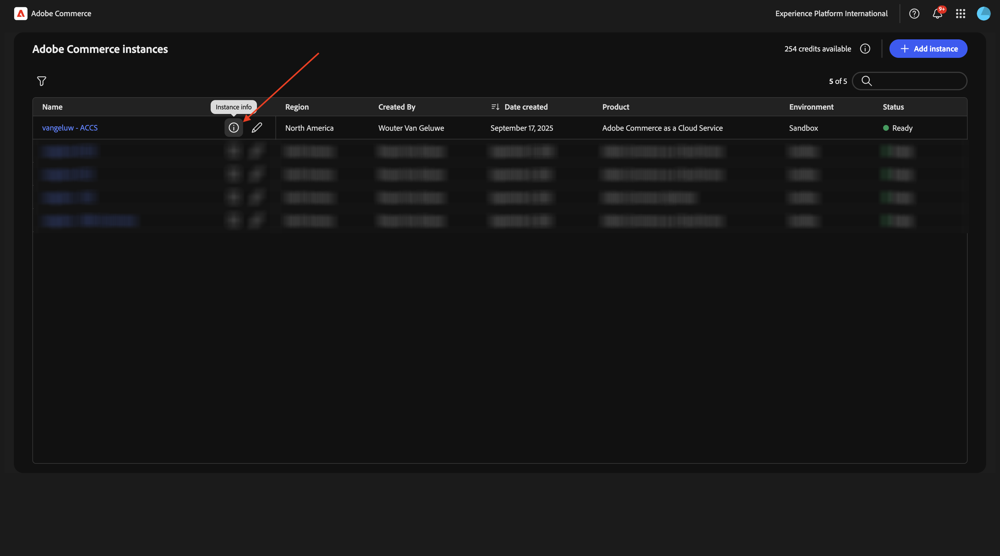

# 1.5.2 ACCS verbinden met AEM Sites CS/EDS-winkel

>[!IMPORTANT]
>
>Om deze oefening te voltooien, moet u toegang tot een werkende AEM Sites en Assets CS met milieu EDS hebben.
>
>Als u zulk een milieu nog niet hebt, ga [&#x200B; Adobe Experience Manager Cloud Service &amp; Edge Delivery Services &#x200B;](./../../../modules/asset-mgmt/module2.1/aemcs.md){target="_blank"} uitoefenen. Volg de instructies daar, en u zult toegang tot zulk een milieu hebben.

>[!IMPORTANT]
>
>Als u eerder een AEM CS-programma hebt geconfigureerd met een AEM Sites- en Assets CS-omgeving, kan het zijn dat uw AEM CS-sandbox is geminimaliseerd. Gezien het feit dat het vernietigen van zo&#39;n zandbak 10 tot 15 minuten duurt, zou het een goed idee zijn om het ontruimingsproces nu te beginnen zodat u niet op een later tijdstip hoeft te wachten.

In deze oefening, zult u AEM Sites CS/EDS Storefront aan het ACCS achterste verbinden. Op dit ogenblik, wanneer u uw Opslag van AEM Sites CS/EDS opent en naar de **pagina van de de productlijst van Telefoons** gaat, ziet u nog geen producten.

Aan het eind van deze oefening, zou u de producten moeten zien die u in de vorige oefening vormde verschijnen op de **pagina van de de productlijst van Telefoons** op uw Storefront van AEM Sites CS/EDS.

Ga naar [&#x200B; https://experience.adobe.com/ &#x200B;](https://experience.adobe.com/){target="_blank"}. Zorg ervoor dat u zich in de juiste omgeving bevindt, die u `--aepImsOrgName--` moet noemen. Klik **Commerce**.

Klik het **info** pictogram naast uw instantie ACCS, die zou moeten worden genoemd `--aepUserLdap-- - ACCS`.

Dan moet je dit zien. Kopieer het **eindpunt van GraphQL**.

Ga naar [&#x200B; https://da.live/app/adobe-commerce/storefront-tools/tools/config-generator/config-generator &#x200B;](https://da.live/app/adobe-commerce/storefront-tools/tools/config-generator/config-generator). U moet nu een bestand config.json genereren dat wordt gebruikt om uw AEM Sites CS Storefront te koppelen aan uw ACCS-backend.

Op de **pagina van de Generator Config**, kleef het **eindpunt van GraphQL** url die u kopieerde.

Klik **produceren**.

Kopieer de volledige gegenereerde JSON-lading.

Ga naar de gegevensopslagplaats GitHub die werd gecreeerd toen vestiging uw milieu van AEM Sites CS/EDS. Die bewaarplaats werd gecreeerd in de oefening [&#x200B; 1.1.2 Opstelling uw milieu van AEM CS &#x200B;](./../../../modules/asset-mgmt/module2.1/ex3.md){target="_blank"} en zou moeten worden genoemd **burgerschap-naam-toegang**.

In de wortelfolder, scrol neer en klik om het dossier **config.json** te openen.

Klik **uitgeven** pictogram.

Verwijder al huidige tekst en vervang het door de nuttige lading te kleven JSON u op de **pagina van de Generator van 1&rbrace; Config kopieerde.**

Klik **Veranderingen vastleggen...**.

Klik **Veranderingen** vastleggen.

Het {**dossier 0} config.json werd nu bijgewerkt.** U moet uw wijzigingen binnen een paar minuten bekijken op de website. De manier om te verifiëren als de veranderingen met succes werden opgenomen is naar de **Telefoons** productpagina te gaan. U zou **iPhone AIR** nu moeten zien verschijnen op de pagina.

Als u toegang wilt tot uw website, gaat u naar `main--citisignal-aem-accs--XXX.aem.page` en/of `main--citisignal-aem-accs--XXX.aem.live` nadat u XXX hebt vervangen door uw GitHub-gebruikersaccount, wat in dit voorbeeld `woutervangeluwe` is.

In dit voorbeeld wordt de volledige URL als volgt:
`https://main--citisignal-aem-accs--woutervangeluwe.aem.page` en/of `https://main--citisignal-aem-accs--woutervangeluwe.aem.live` .

Hoewel het product nu met succes wordt weergegeven, is er nog geen afbeelding beschikbaar voor het product. De volgende exercitie stelt u de koppeling met AEM Assets CS in voor productafbeeldingen.

Volgende Stap: [&#x200B; verbind ACCS met AEM Assets CS &#x200B;](./ex3.md){target="_blank"}

Ga terug naar [&#x200B; Adobe Commerce as a Cloud Service &#x200B;](./accs.md){target="_blank"}

[&#x200B; ga terug naar Alle Modules &#x200B;](./../../../overview.md){target="_blank"}
