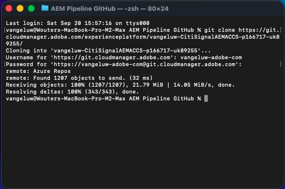
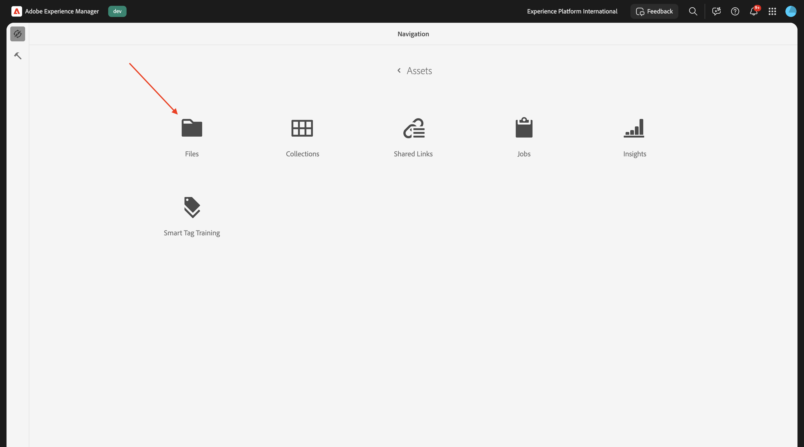
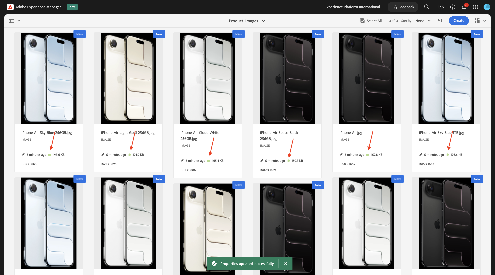

# 1.5.3 ACCS verbinden met AEM Assets CS

>[!IMPORTANT]
>
>Om deze oefening te voltooien, moet u toegang tot een werkende AEM Sites en Assets CS met milieu EDS hebben.
>
>Als u zulk een milieu nog niet hebt, ga [ Adobe Experience Manager Cloud Service &amp; Edge Delivery Services ](./../../../modules/asset-mgmt/module2.1/aemcs.md){target="_blank"} uitoefenen. Volg de instructies daar, en u zult toegang tot zulk een milieu hebben.

>[!IMPORTANT]
>
>Als u eerder een AEM CS-programma hebt geconfigureerd met een AEM Sites- en Assets CS-omgeving, kan het zijn dat uw AEM CS-sandbox is geminimaliseerd. Gezien het feit dat het vernietigen van zo&#39;n zandbak 10 tot 15 minuten duurt, zou het een goed idee zijn om het ontruimingsproces nu te beginnen zodat u niet op een later tijdstip hoeft te wachten.

Na de vorige oefening kon u een product zien dat door ACCS aan uw website wordt teruggegeven maar het had nog geen beeld. Aan het eind van deze oefening, zou u een beeld moeten zien dat ook wordt teruggegeven.


## 1.5.3.1 Configuratie pijplijn bijwerken

Ga naar [ https://my.cloudmanager.adobe.com ](https://my.cloudmanager.adobe.com){target="_blank"}. De org die u moet selecteren is `--aepImsOrgName--`.

Klik hierop om het Cloud Manager-programma te openen. Dit wordt `--aepUserLdap-- - CitiSignal AEM+ACCS` genoemd.


Scoll neer een klein beetje en klik dan **Info van de Reparatie van de Toegang** op de **Pijpleidingen** tabel.


Dan moet je dit zien. Klik **produceer Wachtwoord**.


Klik **produceer opnieuw Wachtwoord**.


U zou dan een wachtwoord beschikbaar moeten hebben. Daarna, klik het **exemplaar** pictogram naast het **bevel van de Git bevel lijn** gebied.


Creeer een nieuwe folder in een plaats van keus op uw computer en noem het **AEM Pipeline GitHub**.


Klik met de rechtermuisknop op uw map en selecteer vervolgens **Nieuwe terminal bij Map** .


Dan moet je dit zien.


Plak het **bevel van de het bevellijn van de Git** dat u alvorens in het Eind venster kopieerde.


U moet een gebruikersnaam invoeren. Kopieer de gebruikersnaam van de Pijpleiding van het Programma van de Cloud Manager **Reparatie van de Toegang Info** en de slag **gaat** binnen.


Vervolgens moet u het wachtwoord invoeren. Kopieer het wachtwoord van de Pijpleiding van het Programma van de Cloud Manager **Reparatie Info van de Toegang** en de slag **gaat** binnen.


Dit kan even duren. Zodra voltooid, zult u een lokale kopie van de Repo van het Git hebben die met de Pijpleiding van uw Programma wordt verbonden.



U zult een nieuwe folder in de **folder GitHub van de Pijpleiding van AEM** zien. Open die map.


Selecteer alle bestanden in die map en verwijder alle bestanden.


Zorg ervoor dat de map leeg is.


Ga naar [ https://github.com/ankumalh/assets-commerce ](https://github.com/ankumalh/assets-commerce).

Daarna, kopieer het dossier **activa-commerce-main.zip** aan uw Desktop en unzip het. Open de omslag **activa-handel-belangrijkste**.


Kopieer alle dossiers van de folder **activa-handel-belangrijkste** aan de lege folder van de folder van de Bewaarplaats van de Pijpleiding van uw Programma.


Daarna, open **Code van Microsoft Visual Studio** en open de omslag die de Bewaarplaats van de Pijpleiding van uw Programma in **Code van Microsoft Visual Studio** bevat.


Ga naar **Onderzoek** in het linkermenu en onderzoek naar `<my-app>`. U moet alle instanties van `<my-app>` vervangen door `--aepUserLdap--citisignalaemaccs` .

Klik **vervangen allen** pictogram.


Klik **vervangen**.


De nieuwe bestanden kunnen nu worden geüpload naar de Git Repo die is gekoppeld aan de Pipeline Repository van uw programma. Om dat te doen, open de omslag **AEM Pipeline GitHub** en klik op de omslag met de rechtermuisknop aan die de nieuwe dossiers bevat. Selecteer **Nieuwe Terminal bij Omslag**.


Dan moet je dit zien. Plak het bevel `git add .` en de slag **gaat** binnen.


Dan moet je dit zien. Plak het bevel `git commit -m "add assets integration"` en de slag **gaat** binnen.


Dan moet je dit zien. Plak het bevel `git push origin main` en de slag **gaat** binnen.


Dan moet je dit zien. Uw veranderingen zijn nu opgesteld aan de Repo van het Git van uw Programma van de Pijpleiding.


Ga terug naar Cloud Manager en klik **dicht**.


Na het aanbrengen van veranderingen in de Reparatie van het Git van de Pijpleiding, moet u **opstellen aan Dev** opnieuw pijpleiding. Klik de 3 punten **..** en selecteer **Looppas**.


Klik **Looppas**. Het runnen van een pijpleidingsplaatsing kan 10-15 minuten vergen. U moet wachten tot de pijpleidingsplaatsing met succes voltooit alvorens verder te gaan.


## 1.5.3.2 AEM Assets-integratie inschakelen in ACCS

Ga terug naar uw ACCS-instantie. In het linkermenu, ga naar **Opslag** en selecteer dan **Configuratie**.


De rol neer in het menu aan **DIENSTEN van ADOBE** en opent dan **de Integratie van AEM Assets**. Dan moet je dit zien.


Vul de volgende variabelen in:

- **identiteitskaart van het Programma van AEM Assets**: U kunt identiteitskaart van het Programma van de Auteur URL van AEM CS nemen. In dit voorbeeld is de programma-id `166717` .


- **identiteitskaart van het Milieu van AEM Assets**: U kunt milieu identiteitskaart van de Auteur URL van AEM CS nemen. In dit voorbeeld is de milieu-id `1786231` .


- **Identiteitskaart van de Cliënt IMS van de Selecteur van Activa IMS**: reeks aan `1`
- **toegelaten Synchronisatie**: reeks aan `Yes`
- **Eigenaar van de Visualisatie**: reeks aan `AEM Assets`
- **de passende regel van Activa**: `Match by product SKU`
- **Gelijke door productSKU kenmerknaam**: `commerce:skus`

Klik **sparen Config**.


Dan moet je dit zien.


## 1.5.3.3 Update config.json

Ga naar de gegevensopslagplaats GitHub die werd gecreeerd toen vestiging uw milieu van AEM Sites CS/EDS. Die bewaarplaats werd gecreeerd in de oefening [ 1.1.2 Opstelling uw milieu van AEM CS ](./../../../modules/asset-mgmt/module2.1/ex3.md){target="_blank"} en zou moeten worden genoemd **burgerschap-naam-toegang**.

In de wortelfolder, scrol neer en klik om het dossier **config.json** te openen. Klik **uitgeven** pictogram om veranderingen in het dossier aan te brengen.


Voeg het onderstaande codefragment toe onder regel 5 `"commerce-endpoint": "https://na1-sandbox.api.commerce.adobe.com/XXX/graphql",` :

```json
 "commerce-assets-enabled": "true",
```

Klik **Veranderingen vastleggen...**.


Klik **Veranderingen** vastleggen.


Uw wijziging wordt nu opgeslagen en wordt binnenkort gepubliceerd. Het kan een paar minuten duren voordat de wijziging zichtbaar is op de winkelvoorgrond.


## 1.5.3.4 Commerce-velden verifiëren in AEM Assets CS

Login aan uw milieu van de Auteur van AEM CS en ga naar **Assets**.


Ga naar **Dossiers**.



Open de **CitiSignal** omslag.


Beweeg over om het even welk activa en klik het **info** pictogram.


U zou a **Commerce** lusje nu moeten zien dat 2 nieuwe meta-gegevensattributen bevat.


Uw AEM Assets CS-omgeving biedt nu ondersteuning voor de integratie met Commerce. U kunt nu productafbeeldingen uploaden.

## 1.5.3.4 Product Assets uploaden en koppelen naar producten

[ Download hier de productbeelden ](./images/Product_Images.zip). Exporteer de bestanden na het downloaden naar uw bureaublad.


Klik **creëren** en selecteer dan **Omslag**.


Ga de waarde **Product_Images** voor de gebieden **Titel** en **Naam** in. Klik **creëren**.


Klik om de map te openen die u net hebt gemaakt.


Klik **creëren** en selecteer dan **Dossiers**.


Navigeer aan de {**omslag 0} Product_Images op uw Desktop, selecteer alle dossiers en klik dan** Open **.**


Klik **uploaden**.


Uw afbeeldingen zijn dan beschikbaar in uw map. Beweeg over het product **iPhone-AIR-Light-Gold.png** en klik het **3&rbrace; pictogram van Eigenschappen &lbrace;.**


De rol neer en plaatst de status van het gebied **Overzicht** aan **Goedgekeurd**. De integratie van AEM Assets CS - ACCS werkt alleen voor goedgekeurde afbeeldingen.


De rol omhoog, gaat naar het **Commerce** lusje en klikt dan **&#x200B;**&#x200B;onder **de skus van het Product** toevoegen.


Voeg de volgende SKU&#39;s voor dit product toe:

| Sleutel | Waarde | Gebruik |
|:-------------:| :---------------:| :---------------:| 
| `iPhone-Air-Light-Gold` | `1` | `thumbnail, image, swatch_image, small_image` |
| `iPhone-Air-Light-Gold-256GB` | `1` | `thumbnail, image, swatch_image, small_image` |
| `iPhone-Air-Light-Gold-512GB` | `1` | `thumbnail, image, swatch_image, small_image` |
| `iPhone-Air-Light-Gold-1TB` | `1` | `thumbnail, image, swatch_image, small_image` |

Dan moet je dit hebben. Klik **sparen &amp; Sluiten**.


Beweeg over het product **iPhone-Air-Space-Black.png** en klik het **3&rbrace; pictogram van Eigenschappen &lbrace;.**


De rol neer en plaatst de status van het gebied **Overzicht** aan **Goedgekeurd**. De integratie van AEM Assets CS - ACCS werkt alleen voor goedgekeurde afbeeldingen.



De rol omhoog, gaat naar het **Commerce** lusje en klikt dan **&#x200B;**&#x200B;onder **de skus van het Product** toevoegen.


Voeg de volgende SKU&#39;s voor dit product toe:

| Sleutel | Waarde | Gebruik |
|:-------------:| :---------------:| :---------------:| 
| `iPhone-Air-Space-Black` | `1` | `thumbnail, image, swatch_image, small_image` |
| `iPhone-Air-Space-Black-256GB` | `1` | `thumbnail, image, swatch_image, small_image` |
| `iPhone-Air-Space-Black-512GB` | `1` | `thumbnail, image, swatch_image, small_image` |
| `iPhone-Air-Space-Black-1TB` | `1` | `thumbnail, image, swatch_image, small_image` |
| `iPhone-Air` | `1` | `thumbnail, image, swatch_image, small_image` |

Dan moet je dit hebben. Klik **sparen &amp; Sluiten**.


Beweeg over het product **iPhone-Air-Sky-Blue.png** en klik het **3&rbrace; pictogram van Eigenschappen &lbrace;.**


De rol neer en plaatst de status van het gebied **Overzicht** aan **Goedgekeurd**. De integratie van AEM Assets CS - ACCS werkt alleen voor goedgekeurde afbeeldingen.


De rol omhoog, gaat naar het **Commerce** lusje en klikt dan **&#x200B;**&#x200B;onder **de skus van het Product** toevoegen.


Voeg de volgende SKU&#39;s voor dit product toe:

| Sleutel | Waarde | Gebruik |
|:-------------:| :---------------:| :---------------:| 
| `iPhone-Air-Sky-Blue` | `1` | `thumbnail, image, swatch_image, small_image` |
| `iPhone-Air-Sky-Blue-256GB` | `1` | `thumbnail, image, swatch_image, small_image` |
| `iPhone-Air-Sky-Blue-512GB` | `1` | `thumbnail, image, swatch_image, small_image` |
| `iPhone-Air-Sky-Blue-1TB` | `1` | `thumbnail, image, swatch_image, small_image` |

Dan moet je dit hebben. Klik **sparen &amp; Sluiten**.


Beweeg over het product **iPhone-Air-Cloud-White.png** en klik het **3&rbrace; pictogram van Eigenschappen &lbrace;.**


De rol neer en plaatst de status van het gebied **Overzicht** aan **Goedgekeurd**. De integratie van AEM Assets CS - ACCS werkt alleen voor goedgekeurde afbeeldingen.


De rol omhoog, gaat naar het **Commerce** lusje en klikt dan **&#x200B;**&#x200B;onder **de skus van het Product** toevoegen.


Voeg de volgende SKU&#39;s voor dit product toe:

| Sleutel | Waarde | Gebruik |
|:-------------:| :---------------:| :---------------:| 
| `iPhone-Air-Cloud-White` | `1` | `thumbnail, image, swatch_image, small_image` |
| `iPhone-Air-Cloud-White-256GB` | `1` | `thumbnail, image, swatch_image, small_image` |
| `iPhone-Air-Cloud-White-512GB` | `1` | `thumbnail, image, swatch_image, small_image` |
| `iPhone-Air-Cloud-White-1TB` | `1` | `thumbnail, image, swatch_image, small_image` |

Dan moet je dit hebben. Klik **sparen &amp; Sluiten**.


Elk **beeld van iPhone AIR** zou a **groene duimen omhoog** nu moeten hebben, erop wijzend dat de activa is goedgekeurd.


## 1.5.3.5 Productafbeeldingen verifiëren op AEM Sites CS/EDS Store

>[!NOTE]
>
>Het kan 15 minuten duren voordat de hierboven aangebrachte wijzigingen zijn geïmplementeerd. Als u nog niet ziet dat uw afbeelding wordt weergegeven, wacht u 15 minuten en probeert u het opnieuw.

Als u wilt controleren of de integratie werkt, moet u uw CitiSignal-website openen.

Ga naar `main--citisignal-aem-accs--XXX.aem.page` en/of `main--citisignal-aem-accs--XXX.aem.live` nadat u XXX hebt vervangen door uw GitHub-gebruikersaccount, wat in dit voorbeeld `woutervangeluwe` is.

In dit voorbeeld wordt de volledige URL als volgt:
`https://main--citisignal-aem-accs--woutervangeluwe.aem.page` en/of `https://main--citisignal-aem-accs--woutervangeluwe.aem.live` .

Dan moet je dit zien. Ga naar **Telefoons**.


U zou dan een productbeeld moeten zien dat voor **AIR van iPhone** wordt getoond. Klik **AIR van iPhone**.


Dan moet je dit zien. Wijzig de kleur- en opslagopties en u ziet de afbeeldingen dynamisch wijzigen op basis van de keuzes die u hebt gemaakt.


Hier is een voorbeeld van het veranderen van de kleur in **licht-Goud** en de opslaggrootte aan **256GB**.


Volgende Stap: [ Samenvatting &amp; Voordelen ](./summary.md){target="_blank"}

Ga terug naar [ Adobe Commerce as a Cloud Service ](./accs.md){target="_blank"}

[ ga terug naar Alle Modules ](./../../../overview.md){target="_blank"}
