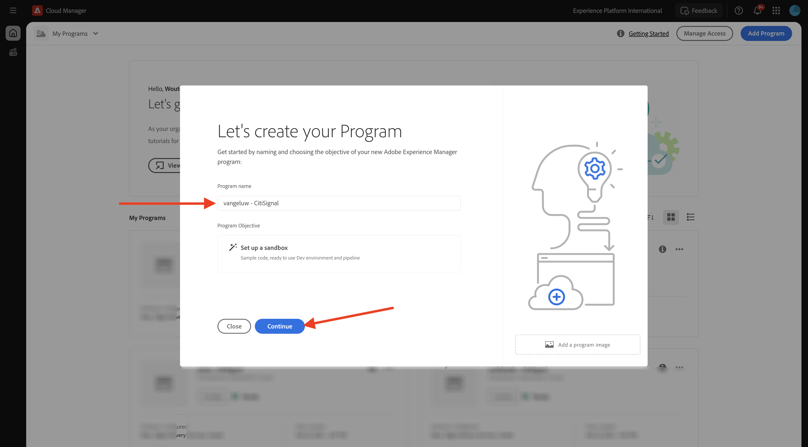

# 1.1.1 Cloud Manager-programma maken

Ga naar [ https://my.cloudmanager.adobe.com ](https://my.cloudmanager.adobe.com){target="_blank"}. De org die u moet selecteren is `--aepImsOrgName--`. Dan zie je zoiets. Klik **toevoegen Programma**.

Voor de **Naam van het Programma**, gebruik `--aepUserLdap-- - CitiSignal`. Selecteer de optie **Opstelling een zandbak**. Klik **verdergaan**.

Zorg ervoor dat de volgende opties zijn geselecteerd:

- Sites
- Forms
- Assets

Klik de pijl voor **Assets** om de lijst van opties te openen.

Zorg ervoor dat de volgende opties zijn geselecteerd:

- Content Hub

Blader omlaag in de lijst.

Zorg ervoor dat de volgende opties zijn geselecteerd:

- Edge Delivery Services
- Dynamische media

Klik **creëren**.

Het maken van uw omgeving duurt 10 tot 20 minuten.

Terwijl u wacht, kunt u reeds met oefening [ 1.1.2 beginnen creeer uw op document-gebaseerde website ](./ex2.md){target="_blank"}.

Zodra de milieu&#39;s worden gecreeerd en klaar om te gebruiken, zult u een e-mailbevestiging ontvangen waarna u hier kunt terugkomen.

Zodra u uw e-mailbevestiging hebt ontvangen, ga terug naar [ https://my.cloudmanager.adobe.com ](https://my.cloudmanager.adobe.com){target="_blank"}. U zult dan zien dat het statuut van uw programma is veranderd in **Klaar**. Klik op uw programma om het te openen.

Heb een blik bij de lusje **Pijpleidingen**. Klik de 3 punten **..** en klik dan **Looppas**.

Klik **Looppas**.

Daarna, klik de 3 punten **..** op het **milieu&#39;s** lusje en klik **Details van de Mening**.

U zult dan uw milieudetails, met inbegrip van URL van uw **milieu van de Auteur** zien, dat u in de volgende oefening zult nodig hebben.

Zodra uw pijpleidingslooppas is gebeëindigd, kunt u met de volgende oefening verdergaan.

Volgende Stap: [ 1.1.2 leidt tot uw op document-gebaseerde website ](./ex2.md){target="_blank"}

Ga terug naar [ Adobe Experience Manager Cloud Service &amp; Edge Delivery Services ](./aemcs.md){target="_blank"}

[ ga terug naar Alle Modules ](./../../../overview.md){target="_blank"}
